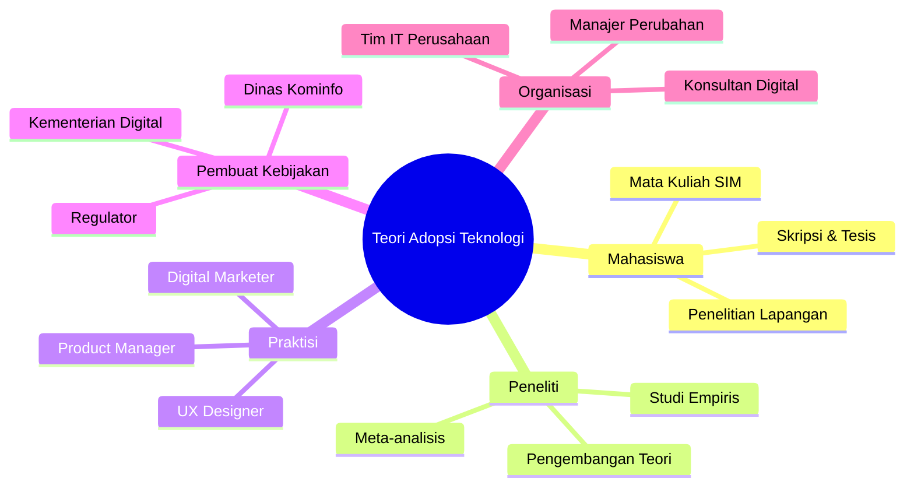
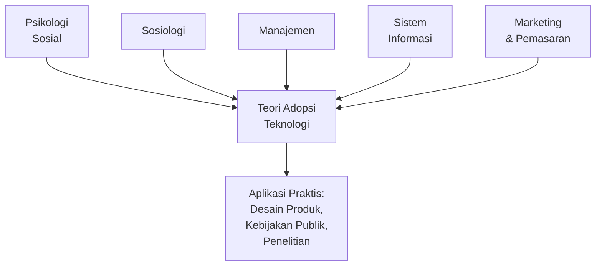
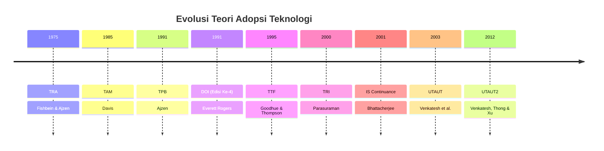

# BAB-01: Pengantar Teori Adopsi Teknologi

> *"Teknologi baru tidak otomatis diterima hanya karena ia lebih baik. Ada proses psikologis, sosial, dan kontekstual yang menentukan apakah seseorang akan menggunakannya atau tidak."*

---

## 🎯 Tujuan Pembelajaran

Setelah membaca bab ini, pembaca diharapkan mampu:
- Menjelaskan definisi adopsi teknologi dan membedakannya dari difusi teknologi
- Mengidentifikasi mengapa memahami adopsi teknologi penting bagi berbagai pihak
- Mengenali siapa saja yang perlu mempelajari teori adopsi teknologi dan untuk tujuan apa
- Memahami gambaran umum struktur materi dalam repositori ini
- Menggambarkan peta konsep keterkaitan antar teori adopsi teknologi

---

## 📖 Pendahuluan

Bayangkan sebuah aplikasi kesehatan yang dibangun dengan teknologi mutakhir, tim developer berbakat, dan anggaran yang memadai. Aplikasi ini dirancang untuk memudahkan masyarakat mengakses layanan dokter dari rumah. Namun setelah diluncurkan, hanya sedikit orang yang menggunakannya. Mengapa?

Pertanyaan inilah yang menjadi inti dari **Teori Adopsi Teknologi**. Sebaik apapun teknologi yang diciptakan, keberhasilannya ditentukan oleh satu hal sederhana: apakah orang mau menggunakannya?

Memahami *mengapa* seseorang mau atau tidak mau menggunakan suatu teknologi bukan sekadar pertanyaan akademis. Ini adalah pertanyaan strategis yang relevan bagi developer aplikasi, manajer bisnis, peneliti, hingga pembuat kebijakan pemerintah.

---

## 1.1 Apa Itu Adopsi Teknologi?

**Adopsi teknologi** (*technology adoption*) adalah proses di mana seseorang atau organisasi **memutuskan untuk mulai menggunakan** suatu teknologi, sistem, atau inovasi baru sebagai bagian dari rutinitas atau operasional mereka.

Perlu dibedakan tiga konsep yang sering tertukar:

| Konsep | Definisi | Contoh |
|---|---|---|
| **Adopsi** | Keputusan individu/organisasi untuk menggunakan teknologi | Seorang petani memutuskan menggunakan aplikasi cuaca digital |
| **Difusi** | Penyebaran suatu inovasi di dalam sistem sosial dari waktu ke waktu | Aplikasi tersebut menyebar dari satu desa ke desa lain |
| **Implementasi** | Proses teknis memasang dan menjalankan teknologi dalam sistem organisasi | Perusahaan memasang software ERP baru |

> **Kata kunci:** Adopsi bersifat **keputusan**, difusi bersifat **penyebaran sosial**, implementasi bersifat **teknis operasional**.

---

## 1.2 Mengapa Adopsi Teknologi Penting Dipelajari?

### 💰 Perspektif Bisnis
- Investasi pengembangan teknologi sering gagal bukan karena teknologinya buruk, melainkan karena pengguna tidak mau menggunakannya
- Memahami faktor adopsi membantu perusahaan merancang produk yang **lebih mudah diterima pasar**
- Strategi pemasaran yang berbasis teori adopsi terbukti lebih efektif dalam menarik dan mempertahankan pengguna

### 🏛️ Perspektif Kebijakan Publik
- Pemerintah perlu memahami hambatan adopsi untuk merancang program digitalisasi layanan publik yang efektif
- Contoh: mengapa e-government di banyak negara berkembang mengalami resistensi dari masyarakat?
- Program subsidi atau pelatihan yang tepat sasaran hanya bisa dirancang jika hambatan adopsi dipahami dengan baik

### 🔬 Perspektif Penelitian
- Teori adopsi menyediakan **kerangka kerja yang valid dan terukur** untuk meneliti perilaku penggunaan teknologi
- Ribuan penelitian skripsi dan tesis menggunakan model TAM, UTAUT, dan DOI sebagai landasan teori
- Temuan penelitian adopsi berkontribusi pada pengembangan teori yang lebih baik

### 👤 Perspektif Pengguna
- Memahami faktor psikologis dan sosial yang mempengaruhi keputusan penggunaan teknologi
- Membantu individu membuat keputusan adopsi yang lebih sadar dan terinformasi

---

## 1.3 Siapa yang Perlu Mempelajari Ini?



---

## 1.4 Perbedaan Teori Adopsi dengan Disiplin Ilmu Lain

Teori adopsi teknologi berada di persimpangan beberapa disiplin ilmu:



Teori adopsi teknologi **meminjam** konsep dari:
- **Psikologi Sosial**: sikap (*attitude*), norma (*subjective norm*), niat (*intention*)
- **Sosiologi**: difusi inovasi, jaringan sosial, norma budaya
- **Manajemen**: change management, organizational behavior
- **Sistem Informasi**: user acceptance, system quality, IS success

---

## 1.5 Gambaran Umum Teori yang Akan Dipelajari

Berikut adalah peta teori utama yang dibahas dalam materi ini beserta tahun pengembangannya:



---

## 1.6 Cara Membaca Materi Ini

### 🎓 Jalur Pemula (Linear)
Baca bab secara berurutan dari BAB-01 hingga BAB-35. Cocok untuk Anda yang baru pertama kali mempelajari topik ini.

### 📝 Jalur Mahasiswa Skripsi/Tesis
```
BAB-01 → BAB-06 atau BAB-07 → BAB-13 → BAB-28 → BAB-29 → BAB-30 → BAB-32
```

### 💼 Jalur Praktisi
```
BAB-01 → BAB-15 → BAB-16 → BAB-25 → BAB-27
```

### 🇮🇩 Jalur Konteks Indonesia
```
BAB-01 → BAB-24 → BAB-25 → BAB-19 → BAB-21 → BAB-22
```

---

## 1.7 Konsep Dasar yang Harus Dipahami Sebelum Lanjut

Sebelum mempelajari teori-teori spesifik, pastikan Anda memahami konsep dasar berikut:

### 🔹 Variabel dalam Penelitian Adopsi
- **Variabel Independen (X)**: Faktor yang mempengaruhi (misal: Perceived Usefulness)
- **Variabel Dependen (Y)**: Hasil yang dipengaruhi (misal: Behavioral Intention)
- **Variabel Mediator**: Penghubung antara X dan Y (misal: Attitude)
- **Variabel Moderator**: Memperkuat atau memperlemah hubungan X-Y (misal: Gender, Usia)

### 🔹 Konstruk vs Indikator
- **Konstruk**: Konsep abstrak yang tidak bisa diukur langsung (misal: "kepercayaan pengguna")
- **Indikator**: Pertanyaan/item konkret yang merepresentasikan konstruk (misal: "Saya percaya sistem ini aman")

### 🔹 Jenis Model dalam Adopsi Teknologi
- **Model Prediktif**: Memprediksi apakah seseorang akan mengadopsi teknologi (TAM, UTAUT)
- **Model Deskriptif**: Menjelaskan proses penyebaran inovasi (DOI)
- **Model Evaluatif**: Mengukur keberhasilan setelah adopsi (IS Success Model)

---

## 💡 Studi Kasus Pembuka: Mengapa GoPay Berhasil?

Pada tahun 2015, Go-Jek meluncurkan GoPay — dompet digital yang saat itu bersaing dengan uang tunai yang sangat dominan di Indonesia. Mengapa GoPay berhasil diadopsi secara masif?

Jika kita analisis menggunakan kerangka teori adopsi:

| Faktor Adopsi | Peran dalam Keberhasilan GoPay |
|---|---|
| **Perceived Usefulness** | Pengguna merasakan manfaat nyata: cashback, promo, kemudahan transaksi |
| **Perceived Ease of Use** | Antarmuka sederhana, integrasi langsung dengan aplikasi Go-Jek |
| **Social Influence** | Driver Go-Jek dan sesama pengguna mendorong adopsi GoPay |
| **Facilitating Conditions** | Infrastruktur: smartphone sudah umum, internet sudah terjangkau |
| **Hedonic Motivation** | Gamifikasi: poin reward, tantangan, notifikasi yang menyenangkan |

Ini adalah contoh nyata bagaimana teori adopsi teknologi dapat menjelaskan fenomena di dunia nyata.

---

## 🔗 Keterkaitan dengan Bab Lain

- ➡️ Bab selanjutnya: [BAB-02 — Sejarah dan Evolusi Teori](../BAB-02_Sejarah_dan_Evolusi/README.md)
- 📖 Untuk definisi istilah: [GLOSARIUM](../GLOSARIUM.md)

---

## ✅ Soal Latihan

1. Jelaskan perbedaan antara **adopsi**, **difusi**, dan **implementasi** teknologi dengan contoh masing-masing dari kehidupan sehari-hari di Indonesia!

2. Seorang product manager di sebuah startup fintech ingin memahami mengapa banyak pengguna mendaftar ke aplikasinya tetapi tidak aktif bertransaksi. Teori adopsi apa yang menurut Anda paling relevan untuk membantu menjawab pertanyaan ini? Jelaskan alasannya!

3. Identifikasi **tiga peran** berbeda yang bisa mendapat manfaat dari memahami teori adopsi teknologi, dan jelaskan bagaimana masing-masing peran tersebut dapat menerapkan pengetahuan ini secara praktis!

4. Dalam studi kasus GoPay di atas, faktor adopsi manakah yang menurut Anda paling dominan mendorong keberhasilan adopsi? Argumentasikan jawaban Anda!

---

## 📚 Referensi Bab Ini

- Davis, F. D. (1989). Perceived usefulness, perceived ease of use, and user acceptance of information technology. *MIS Quarterly*, *13*(3), 319–340. https://doi.org/10.2307/249008
- Rogers, E. M. (2003). *Diffusion of innovations* (5th ed.). Free Press.
- Venkatesh, V., Morris, M. G., Davis, G. B., & Davis, F. D. (2003). User acceptance of information technology: Toward a unified view. *MIS Quarterly*, *27*(3), 425–478. https://doi.org/10.2307/30036540
- Bhattacherjee, A. (2001). Understanding information systems continuance: An expectation-confirmation model. *MIS Quarterly*, *25*(3), 351–370.

---

← Kembali ke [README Utama](../README.md) | ➡️ Lanjut ke [BAB-02: Sejarah dan Evolusi](../BAB-02_Sejarah_dan_Evolusi/README.md)
