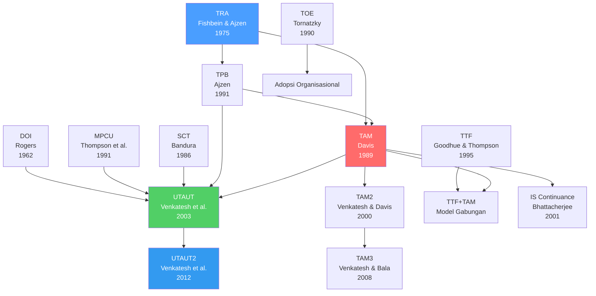
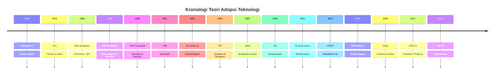

# BAB-02: Sejarah dan Evolusi Teori Adopsi Teknologi

> *"Untuk memahami ke mana suatu bidang ilmu akan pergi, kita harus memahami dari mana ia berasal."*

---

## 🎯 Tujuan Pembelajaran

Setelah membaca bab ini, pembaca diharapkan mampu:
- Menelusuri perkembangan historis teori adopsi teknologi dari tahun 1960-an hingga saat ini
- Menjelaskan konteks sosial-historis yang mendorong lahirnya setiap teori utama
- Menggambarkan hubungan genealogis antar teori (teori mana yang melahirkan teori mana)
- Membandingkan evolusi fokus penelitian adopsi teknologi dari waktu ke waktu
- Mengidentifikasi celah penelitian yang mendorong pengembangan teori baru

---

## 📖 Pendahuluan

Teori adopsi teknologi tidak lahir dalam semalam. Ia berkembang selama lebih dari enam dekade, dibentuk oleh perubahan teknologi, kebutuhan praktis, dan kritik akademis yang terus-menerus. Setiap teori baru lahir karena teori sebelumnya dianggap tidak cukup menjelaskan realitas yang ada.

Memahami sejarah ini penting karena:
1. Membantu kita memahami **asumsi dasar** yang mendasari setiap teori
2. Menjelaskan **mengapa suatu teori dikembangkan** dengan cara tertentu
3. Memberikan perspektif untuk **mengkritisi keterbatasan** setiap teori
4. Menunjukkan **arah perkembangan** di masa depan

---

## 2.1 Era Fondasi: Difusi Inovasi (1960-an)

### Konteks Historis
Pada akhir 1950-an dan awal 1960-an, dunia sedang dalam masa perubahan besar. Pasca Perang Dunia II, banyak negara berupaya memodernisasi pertanian dan industri mereka. Para sosiolog dan komunikolog mulai tertarik pada pertanyaan: **mengapa beberapa inovasi diterima dengan cepat sementara yang lain ditolak?**

### Lahirnya Diffusion of Innovations
Pada tahun **1962**, sosiolog **Everett Rogers** menerbitkan buku *Diffusion of Innovations*. Rogers mengumpulkan ratusan studi difusi dari berbagai bidang — pertanian, kedokteran, pendidikan, dan teknologi — untuk menemukan pola umum.

**Kontribusi Utama Rogers:**
- Mengidentifikasi **5 karakteristik inovasi** yang mempengaruhi kecepatan adopsi
- Mengklasifikasikan adopter ke dalam **5 kategori** berdasarkan kecepatan adopsi
- Menggambarkan kurva difusi berbentuk **S** yang universal
- Menekankan peran **saluran komunikasi** dan **sistem sosial** dalam difusi

> Rogers memperbarui teorinya berkali-kali: edisi ke-2 (1971), ke-3 (1983), ke-4 (1995), dan ke-5 (2003).

---

## 2.2 Era Psikologi Sosial: TRA dan TPB (1970-an – 1990-an)

### Konteks Historis
Sementara Rogers fokus pada penyebaran sosial, psikolog sosial lebih tertarik pada **proses pengambilan keputusan individual**. Pertanyaannya: bagaimana sikap dan norma sosial membentuk perilaku manusia?

### Theory of Reasoned Action — Fishbein & Ajzen (1975)
**Martin Fishbein** dan **Icek Ajzen** mengembangkan TRA berdasarkan gagasan bahwa perilaku manusia dipengaruhi oleh **niat (*intention*)**, yang dibentuk oleh dua faktor:
1. **Attitude** (sikap personal terhadap perilaku)
2. **Subjective Norm** (tekanan sosial dari lingkungan)

TRA menjadi landasan penting karena pertama kalinya **niat perilaku** (*behavioral intention*) ditempatkan sebagai prediktor langsung perilaku aktual.

### Theory of Planned Behavior — Ajzen (1991)
Ajzen menyadari TRA memiliki keterbatasan: ia tidak mempertimbangkan **kontrol yang dirasakan** individu atas perilakunya. Maka ia menambahkan satu konstruk:
3. **Perceived Behavioral Control** (persepsi kemampuan untuk melakukan perilaku)

TPB menjadi salah satu teori perilaku yang paling banyak dikutip dalam sejarah psikologi.

---

## 2.3 Era Teknologi Informasi: TAM (1986 – 1990-an)

### Konteks Historis
Tahun 1980-an adalah era ekspansi komputer personal. Organisasi mulai mengadopsi sistem komputer dalam skala besar, namun banyak yang gagal karena karyawan tidak mau menggunakannya. Pertanyaannya bergeser menjadi: **mengapa pengguna menerima atau menolak sistem komputer?**

### Technology Acceptance Model — Davis (1989)
**Fred Davis** mengembangkan TAM dalam disertasi doktoralnya di MIT (1986), yang kemudian dipublikasikan pada 1989. Davis mengadaptasi TRA secara khusus untuk konteks **penerimaan sistem informasi**, dengan menyederhanakan model menjadi dua konstruk inti:

1. **Perceived Usefulness (PU)**: Seberapa berguna sistem ini?
2. **Perceived Ease of Use (PEOU)**: Seberapa mudah sistem ini digunakan?

**Mengapa TAM Revolusioner?**
- Sangat **parsimoni** (sederhana namun kuat)
- Mudah dioperasionalisasikan ke dalam kuesioner
- Terbukti valid di berbagai konteks dan budaya
- Menjadi fondasi ribuan penelitian selama 30+ tahun

### Pengembangan TAM: TAM2 dan TAM3
- **TAM2** (Venkatesh & Davis, 2000): Menambahkan anteseden sosial dan kognitif dari Perceived Usefulness
- **TAM3** (Venkatesh & Bala, 2008): Model lengkap yang mengintegrasikan anteseden PEOU dan PU

---

## 2.4 Era Spesialisasi: TTF, TRI, TOE (1990-an)

### Task-Technology Fit — Goodhue & Thompson (1995)
Peneliti menyadari TAM tidak mempertimbangkan **kesesuaian teknologi dengan tugas** yang harus dikerjakan. Goodhue & Thompson mengembangkan TTF yang berfokus pada pertanyaan: apakah teknologi ini *cocok* untuk pekerjaan yang harus dilakukan?

### Technology-Organization-Environment Framework — Tornatzky & Fleischer (1990)
Sementara TAM fokus pada individu, TOE Framework dikembangkan untuk menjelaskan adopsi di level **organisasi**. Framework ini mempertimbangkan tiga konteks: teknologi, organisasi, dan lingkungan eksternal.

### Technology Readiness Index — Parasuraman (2000)
Parasuraman mengembangkan TRI untuk mengukur **kesiapan mental** seseorang dalam mengadopsi teknologi baru — sebuah perspektif yang lebih berorientasi pada *predisposisi* daripada *keputusan*.

---

## 2.5 Era Unifikasi: UTAUT (2003)

### Konteks Historis
Pada awal 2000-an, puluhan model adopsi teknologi telah beredar dalam literatur. Para peneliti kesulitan memilih teori mana yang harus digunakan. Venkatesh et al. melakukan meta-analisis besar untuk mencari jawaban.

### UTAUT — Venkatesh et al. (2003)
**Viswanath Venkatesh** bersama tim penelitinya mereviuw **8 teori adopsi** sebelumnya dan mengintegrasikan faktor-faktor terbaik dari semua teori ke dalam satu model terpadu:

| Teori Sumber | Konstruk yang Diadopsi |
|---|---|
| TAM | Usefulness → Performance Expectancy |
| TAM | Ease of Use → Effort Expectancy |
| TRA/TPB | Subjective Norm → Social Influence |
| MPCU | Facilitating Conditions |

UTAUT menambahkan 4 **moderating variable**: Gender, Usia, Pengalaman, dan Kesukarelaan.

### UTAUT2 — Venkatesh, Thong & Xu (2012)
UTAUT awalnya dirancang untuk konteks **organisasi/pekerja**. Untuk konsumen umum, Venkatesh mengembangkan UTAUT2 dengan menambahkan:
- **Hedonic Motivation** (motivasi kesenangan)
- **Price Value** (pertimbangan harga)
- **Habit** (kebiasaan)

---

## 2.6 Era Pasca-Adopsi (2001 – Sekarang)

### Konteks Historis
Seiring teknologi semakin matang, peneliti mulai menyadari bahwa adopsi awal hanyalah separuh cerita. **Mengapa sebagian pengguna berhenti menggunakan teknologi setelah adopsi awal?**

### IS Continuance Theory — Bhattacherjee (2001)
Bhattacherjee mengembangkan model yang menjelaskan **kontinuansi penggunaan** berdasarkan konfirmasi ekspektasi. Jika pengalaman aktual sesuai atau melampaui ekspektasi, pengguna cenderung melanjutkan penggunaan.

---

## 2.7 Diagram Evolusi Teori

Berikut adalah diagram genealogi yang menunjukkan bagaimana setiap teori saling mempengaruhi:

---

## 2.8 Timeline Kronologis

---

## 2.9 Evolusi Fokus Penelitian Adopsi

| Periode | Fokus Utama | Pertanyaan Sentral |
|---|---|---|
| **1960-an** | Difusi sosial | Bagaimana inovasi menyebar di masyarakat? |
| **1970–1980-an** | Perilaku individual | Bagaimana sikap & norma mempengaruhi perilaku? |
| **1989–2000** | Penerimaan sistem TI | Mengapa pengguna menerima/menolak komputer? |
| **2000–2010** | Unifikasi & moderasi | Faktor apa yang memoderasi adopsi? |
| **2010–sekarang** | Kontinuansi, konteks, budaya | Mengapa pengguna melanjutkan/berhenti? Bagaimana budaya & demografi berperan? |
| **Masa depan** | AI, IoT, adopsi lintas budaya | Apakah teori lama masih relevan di era AI? |

---

## 2.10 Konteks Sosial-Historis yang Membentuk Teori

### Mengapa TAM lahir pada 1989?
TAM lahir di era **revolusi komputer personal**. IBM PC muncul pada 1981, dan pada akhir 1980-an, organisasi mulai mengadopsi komputer secara masif. Pertanyaan praktis tentang mengapa banyak sistem mahal tidak digunakan karyawan mendorong kebutuhan akan kerangka teori yang bisa menjawabnya.

### Mengapa UTAUT lahir pada 2003?
UTAUT muncul setelah ledakan penelitian TAM selama 15 tahun. Para akademisi mulai kritis: "Ada terlalu banyak teori yang berbeda-beda; kita perlu konsolidasi." Ini dilakukan dalam konteks **ekspansi internet dan e-commerce** di awal 2000-an.

### Mengapa UTAUT2 lahir pada 2012?
Dengan penetrasi **smartphone** yang masif sejak 2007 (iPhone diluncurkan), konteks adopsi bergeser dari "pegawai yang dipaksa perusahaan menggunakan sistem" menjadi "konsumen yang bebas memilih aplikasi". UTAUT2 menyesuaikan model untuk konteks konsumen ini.

---

## 💡 Refleksi: Apa yang Mendorong Lahirnya Teori Baru?

Setiap teori baru dalam adopsi teknologi lahir karena salah satu atau kombinasi dari kondisi berikut:
1. **Kritik terhadap keterbatasan teori sebelumnya** (TPB mengkritik TRA; UTAUT2 mengkritik UTAUT)
2. **Perubahan konteks teknologi** (TAM untuk PC; UTAUT2 untuk smartphone)
3. **Kebutuhan area aplikasi baru** (HOT-fit untuk e-health; TTF untuk kinerja tugas)
4. **Fragmentasi literatur yang perlu disatukan** (UTAUT mengkonsolidasi 8 teori)

---

## 🔗 Keterkaitan dengan Bab Lain

- ⬅️ Bab sebelumnya: [BAB-01 — Pengantar](../BAB-01_Pengantar/README.md)
- ➡️ Bab selanjutnya: [BAB-03 — TRA](../BAB-03_TRA_Theory_of_Reasoned_Action/README.md)
- 🔗 Perbandingan mendalam antar teori: [BAB-13](../BAB-13_Perbandingan_Antar_Teori/README.md)
- 🔗 Kritik dan keterbatasan: [BAB-14](../BAB-14_Kritik_dan_Limitasi/README.md)

---

## ✅ Soal Latihan

1. Jelaskan mengapa **TAM** berkembang dari **TRA**! Apa keterbatasan TRA yang mendorong Davis mengembangkan TAM secara khusus untuk konteks sistem informasi?

2. **UTAUT** dikembangkan dengan mengintegrasikan 8 teori sebelumnya. Menurut Anda, apa **keuntungan** dan **kerugian** dari pendekatan "unifikasi" ini dibandingkan menggunakan satu teori spesifik?

3. Berdasarkan timeline evolusi teori, identifikasi **pola umum** tentang *mengapa* dan *kapan* teori baru lahir. Berikan dua contoh spesifik dari materi di atas!

4. Jika Anda diminta merancang sebuah teori adopsi teknologi untuk konteks **AI Generatif** (seperti ChatGPT), faktor-faktor apa yang perlu ditambahkan yang belum ada dalam model UTAUT2? Argumentasikan jawaban Anda!

---

## 📚 Referensi Bab Ini

- Ajzen, I. (1991). The theory of planned behavior. *Organizational Behavior and Human Decision Processes*, *50*(2), 179–211. https://doi.org/10.1016/0749-5978(91)90020-T
- Bhattacherjee, A. (2001). Understanding information systems continuance: An expectation-confirmation model. *MIS Quarterly*, *25*(3), 351–370. https://doi.org/10.2307/3250921
- Davis, F. D. (1989). Perceived usefulness, perceived ease of use, and user acceptance of information technology. *MIS Quarterly*, *13*(3), 319–340. https://doi.org/10.2307/249008
- Fishbein, M., & Ajzen, I. (1975). *Belief, attitude, intention, and behavior: An introduction to theory and research*. Addison-Wesley.
- Goodhue, D. L., & Thompson, R. L. (1995). Task-technology fit and individual performance. *MIS Quarterly*, *19*(2), 213–236. https://doi.org/10.2307/249689
- Rogers, E. M. (2003). *Diffusion of innovations* (5th ed.). Free Press.
- Tornatzky, L. G., & Fleischer, M. (1990). *The processes of technological innovation*. Lexington Books.
- Venkatesh, V., Morris, M. G., Davis, G. B., & Davis, F. D. (2003). User acceptance of information technology: Toward a unified view. *MIS Quarterly*, *27*(3), 425–478. https://doi.org/10.2307/30036540
- Venkatesh, V., Thong, J. Y. L., & Xu, X. (2012). Consumer acceptance and use of information technology: Extending the unified theory of acceptance and use of technology. *MIS Quarterly*, *36*(1), 157–178. https://doi.org/10.2307/41410412

---

← [BAB-01: Pengantar](../BAB-01_Pengantar/README.md) | [README Utama](../README.md) | [BAB-03: TRA →](../BAB-03_TRA_Theory_of_Reasoned_Action/README.md)
