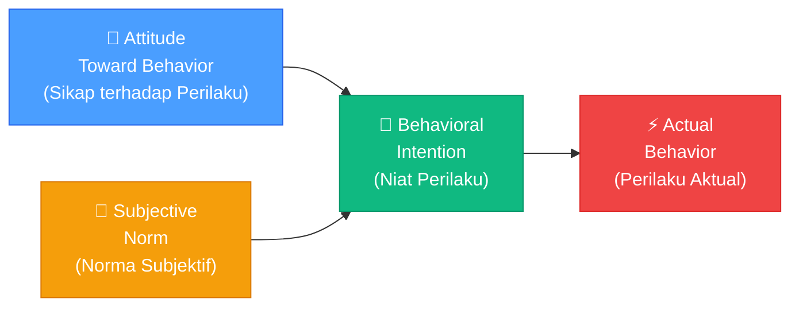
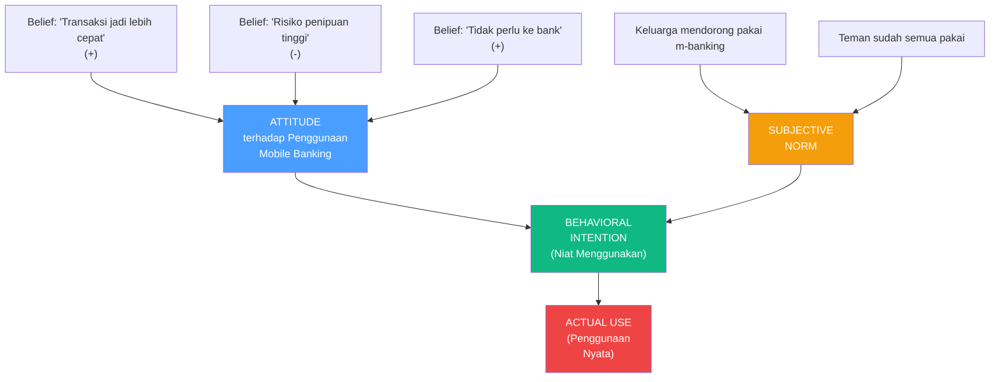
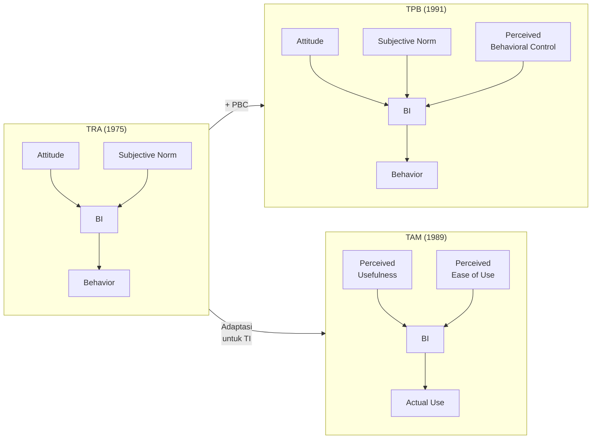

# BAB-03: Theory of Reasoned Action (TRA)

> *"Perilaku manusia bukan sekadar refleks — ia didahului oleh niat, dan niat dibentuk oleh sikap serta tekanan sosial."*  
> — Martin Fishbein & Icek Ajzen (1975)

---

## 🎯 Tujuan Pembelajaran

Setelah membaca bab ini, pembaca diharapkan mampu:
- Menjelaskan konsep dasar Theory of Reasoned Action (TRA) dan latar belakang pengembangannya
- Mengidentifikasi komponen-komponen utama TRA beserta hubungan kausalnya
- Menggambarkan model TRA dalam bentuk diagram
- Mengevaluasi kelebihan dan keterbatasan TRA
- Menerapkan TRA sebagai kerangka analisis dalam konteks adopsi teknologi

---

## 📖 Pendahuluan

Pernahkah Anda bertanya-tanya mengapa seseorang yang tahu bahwa olahraga itu sehat, tetap tidak berolahraga? Atau mengapa orang yang menyadari risiko tidak memakai helm tetap tidak memakainya?

Pertanyaan-pertanyaan ini mendorong dua psikolog sosial, **Martin Fishbein** dan **Icek Ajzen**, untuk mengembangkan sebuah teori yang menjelaskan hubungan antara sikap, norma sosial, dan perilaku manusia.

Hasilnya adalah **Theory of Reasoned Action (TRA)** — yang pertama kali dipublikasikan secara lengkap dalam buku *Belief, Attitude, Intention, and Behavior* (1975). TRA menjadi salah satu teori paling berpengaruh dalam psikologi sosial dan menjadi fondasi langsung dari TAM dan TPB yang kelak mendominasi penelitian adopsi teknologi.

---

## 3.1 Latar Belakang dan Sejarah

### Konteks Pengembangan
Sebelum TRA, penelitian psikologi sosial menghadapi masalah besar: **sikap seseorang seringkali tidak berkorelasi dengan perilakunya**. Banyak penelitian menemukan bahwa orang yang bersikap positif terhadap sesuatu tidak selalu berperilaku sesuai sikapnya.

Fishbein dan Ajzen berargumen bahwa masalahnya bukan pada sikapnya, melainkan pada cara mengukur dan menghubungkannya dengan perilaku. Mereka menekankan pentingnya:
1. Mengukur sikap terhadap **perilaku spesifik** (bukan terhadap objek umum)
2. Mempertimbangkan **niat** sebagai variabel perantara antara sikap dan perilaku
3. Memperhitungkan **pengaruh sosial** dalam pembentukan niat

### Publikasi Utama
- Fishbein, M. (1967). *Readings in Attitude Theory and Measurement*. Wiley
- Fishbein, M., & Ajzen, I. (1975). *Belief, Attitude, Intention, and Behavior*. Addison-Wesley
- Ajzen, I., & Fishbein, M. (1980). *Understanding Attitudes and Predicting Social Behavior*. Prentice-Hall

---

## 3.2 Komponen Utama TRA

TRA terdiri dari tiga komponen inti yang membentuk rantai kausal:

---

### 3.2.1 Attitude Toward Behavior (Sikap terhadap Perilaku)

**Definisi:** Evaluasi keseluruhan individu, baik positif maupun negatif, terhadap suatu perilaku tertentu.

> ⚠️ **Penting:** TRA mengukur sikap terhadap **perilaku** (misalnya: "menggunakan aplikasi ini"), bukan sikap terhadap **objek** (misalnya: "aplikasi ini"). Perbedaan ini krusial.

**Pembentukan Sikap:**
Sikap terbentuk dari dua elemen:
- **Behavioral Beliefs (b)**: Keyakinan bahwa melakukan perilaku tertentu akan menghasilkan konsekuensi tertentu
- **Outcome Evaluations (e)**: Evaluasi terhadap konsekuensi tersebut (positif atau negatif)

**Rumus:**
$$Attitude = \sum (b_i \times e_i)$$

**Contoh dalam konteks adopsi teknologi:**
| Behavioral Belief (b) | Outcome Evaluation (e) | b × e |
|---|---|---|
| "Menggunakan e-banking menghemat waktu" | Sangat positif (+3) | +3 |
| "Data saya bisa diretas" | Sangat negatif (-3) | -3 |
| "Transaksi jadi lebih mudah" | Positif (+2) | +2 |
| **Total Attitude** | | **+2** (positif) |

---

### 3.2.2 Subjective Norm (Norma Subjektif)

**Definisi:** Persepsi individu tentang tekanan sosial — seberapa besar orang-orang penting baginya (referents) mengharapkan ia melakukan atau tidak melakukan perilaku tersebut.

**Pembentukan Norma Subjektif:**
- **Normative Beliefs (nb)**: Keyakinan tentang apa yang diharapkan oleh orang-orang penting
- **Motivation to Comply (mc)**: Motivasi individu untuk memenuhi harapan tersebut

**Rumus:**
$$Subjective\ Norm = \sum (nb_i \times mc_i)$$

**Siapa yang dimaksud "referents"?**
- Keluarga (orang tua, pasangan, saudara)
- Teman dan rekan kerja
- Atasan atau pemimpin
- Ahli atau tokoh yang dikagumi

**Contoh:**
> Seorang mahasiswa mungkin merasa teman-temannya mengharapkan ia menggunakan sistem pembayaran digital. Jika ia ingin diterima secara sosial (motivasi tinggi untuk comply), norma subjektif akan kuat mempengaruhi niatnya.

---

### 3.2.3 Behavioral Intention (Niat Perilaku)

**Definisi:** Ukuran kekuatan niat seseorang untuk melakukan suatu perilaku. Dalam TRA, **niat adalah prediktor langsung perilaku**.

Asumsi kunci TRA: **Semakin kuat niat seseorang, semakin besar kemungkinan ia akan melakukan perilaku tersebut.**

**Rumus:**
$$BI = w_1 \times Attitude + w_2 \times Subjective\ Norm$$

Di mana $w_1$ dan $w_2$ adalah bobot relatif yang ditentukan secara empiris dari konteks penelitian.

---

### 3.2.4 Actual Behavior (Perilaku Aktual)

**Definisi:** Tindakan nyata yang dilakukan individu. Dalam konteks adopsi teknologi: apakah pengguna benar-benar menggunakan sistem tersebut.

TRA mengasumsikan perilaku sebagai **tindakan yang disengaja dan rasional** (*volitional control*) — individu memiliki kendali penuh atas perilakunya.

---

## 3.3 Asumsi Dasar TRA

TRA dibangun di atas beberapa asumsi fundamental:

| Asumsi | Penjelasan |
|---|---|
| **Rasionalitas** | Manusia memproses informasi secara sistematis sebelum bertindak |
| **Kontrol Penuh** | Individu memiliki kontrol penuh atas perilakunya (volitional control) |
| **Niat sebagai Prediktor** | Niat adalah prediktor terbaik perilaku |
| **Spesifisitas** | Sikap harus diukur pada level yang sama spesifiknya dengan perilaku target |

---

## 3.4 TRA dalam Konteks Adopsi Teknologi

Meskipun TRA tidak dirancang khusus untuk teknologi, ia menjadi fondasi penting karena:

1. **Davis (1989)** mengadaptasi TRA untuk mengembangkan TAM, dengan menyederhanakan *attitude* menjadi dua anteseden: PU dan PEOU
2. **Ajzen (1991)** mengembangkan TRA menjadi TPB dengan menambahkan *Perceived Behavioral Control*
3. **Venkatesh et al. (2003)** memasukkan elemen TRA (subjective norm) dalam UTAUT

### Contoh Penerapan TRA pada Adopsi Aplikasi Perbankan

---

## 3.5 Kelebihan TRA

| Kelebihan | Penjelasan |
|---|---|
| ✅ **Parsimoni** | Model sederhana dengan hanya 3 komponen utama namun kuat secara prediktif |
| ✅ **Fondasi Teoretis Kuat** | Berakar dari psikologi sosial yang mapan |
| ✅ **Fleksibel** | Dapat diterapkan pada hampir semua jenis perilaku |
| ✅ **Terukur** | Semua komponen dapat dioperasionalisasikan ke dalam kuesioner |
| ✅ **Generatif** | Menjadi fondasi TAM, TPB, dan UTAUT |

---

## 3.6 Keterbatasan TRA

| Keterbatasan | Penjelasan |
|---|---|
| ❌ **Asumsi Volitional Control** | Tidak mempertimbangkan bahwa perilaku seringkali tidak sepenuhnya di bawah kontrol individu |
| ❌ **Mengabaikan Kebiasaan** | Tidak memperhitungkan perilaku yang sudah menjadi kebiasaan otomatis |
| ❌ **Faktor Emosional** | Kurang memperhatikan peran emosi dan afek dalam pembentukan sikap |
| ❌ **Konteks Budaya** | Bobot relatif attitude vs. subjective norm sangat bervariasi antar budaya |
| ❌ **Gap Niat-Perilaku** | Niat tidak selalu berujung pada perilaku nyata (intention-behavior gap) |

> 💡 **Keterbatasan inilah** yang mendorong Ajzen mengembangkan TPB (menambahkan Perceived Behavioral Control) dan Davis mengembangkan TAM (fokus pada konteks spesifik TI).

---

## 3.7 Perbandingan: TRA vs TPB vs TAM

---

## 💡 Contoh Penerapan dalam Penelitian

**Judul Penelitian Contoh:**  
*"Analisis Faktor Sikap dan Norma Subjektif terhadap Niat Menggunakan Dompet Digital pada Generasi Milenial"*

**Konstruk yang Diukur:**
1. **Attitude** → 4 item: "Menggunakan dompet digital adalah ide yang baik", "Menggunakan dompet digital menguntungkan", dst.
2. **Subjective Norm** → 3 item: "Orang-orang penting bagi saya berpendapat saya harus menggunakan dompet digital", dst.
3. **Behavioral Intention** → 3 item: "Saya berniat menggunakan dompet digital dalam waktu dekat", dst.

**Metode Analisis:** Regresi berganda atau SEM/PLS-SEM

---

## 🔗 Keterkaitan dengan Bab Lain

- ⬅️ Bab sebelumnya: [BAB-02 — Sejarah dan Evolusi](../BAB-02_Sejarah_dan_Evolusi/README.md)
- ➡️ Bab selanjutnya: [BAB-04 — TPB](../BAB-04_TPB_Theory_of_Planned_Behavior/README.md)
- 🔗 Pengembangan TRA untuk TI: [BAB-06 — TAM](../BAB-06_Technology_Acceptance_Model/README.md)
- 🔗 Perbandingan lengkap: [BAB-13 — Perbandingan Antar Teori](../BAB-13_Perbandingan_Antar_Teori/README.md)
- 📖 Istilah terkait: [GLOSARIUM](../GLOSARIUM.md)

---

## ✅ Soal Latihan

1. **Konseptual:** Jelaskan perbedaan antara "sikap terhadap objek" dan "sikap terhadap perilaku" dalam TRA! Mengapa perbedaan ini penting dalam penelitian adopsi teknologi?

2. **Analitis:** Seorang petani di desa tahu bahwa aplikasi cuaca digital sangat berguna (attitude positif), namun ia tidak menggunakannya karena tidak ada teman sekampung yang memakainya. Analisis situasi ini menggunakan komponen TRA! Komponen mana yang paling dominan dalam kasus ini?

3. **Aplikasi:** Rancang **tiga item kuesioner** untuk mengukur masing-masing konstruk TRA (Attitude, Subjective Norm, dan Behavioral Intention) dalam konteks adopsi **aplikasi telemedicine** di Indonesia!

4. **Kritis:** Sebutkan dan jelaskan dua keterbatasan TRA yang paling relevan jika diterapkan untuk meneliti adopsi teknologi di masyarakat pedesaan Indonesia! Bagaimana Anda menyarankan untuk mengatasinya?

---

## 📚 Referensi Bab Ini

- Ajzen, I., & Fishbein, M. (1980). *Understanding attitudes and predicting social behavior*. Prentice-Hall.
- Fishbein, M., & Ajzen, I. (1975). *Belief, attitude, intention, and behavior: An introduction to theory and research*. Addison-Wesley.
- Davis, F. D., Bagozzi, R. P., & Warshaw, P. R. (1989). User acceptance of computer technology: A comparison of two theoretical models. *Management Science*, *35*(8), 982–1003. https://doi.org/10.1287/mnsc.35.8.982
- Sheppard, B. H., Hartwick, J., & Warshaw, P. R. (1988). The theory of reasoned action: A meta-analysis of past research with recommendations for modifications and future research. *Journal of Consumer Research*, *15*(3), 325–343. https://doi.org/10.1086/209170

---

← [BAB-02: Sejarah & Evolusi](../BAB-02_Sejarah_dan_Evolusi/README.md) | [README Utama](../README.md) | [BAB-04: TPB →](../BAB-04_TPB_Theory_of_Planned_Behavior/README.md)
