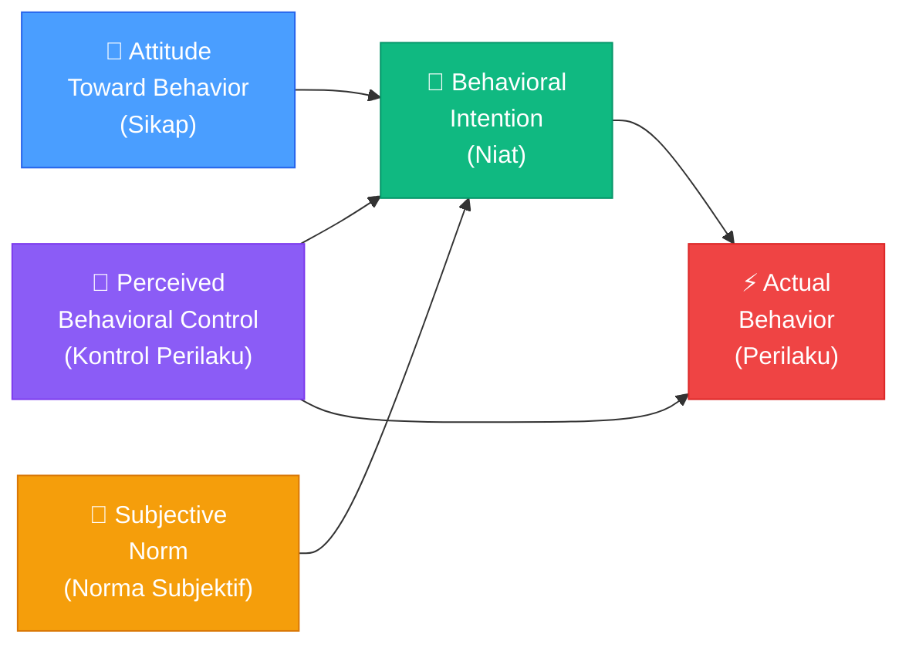
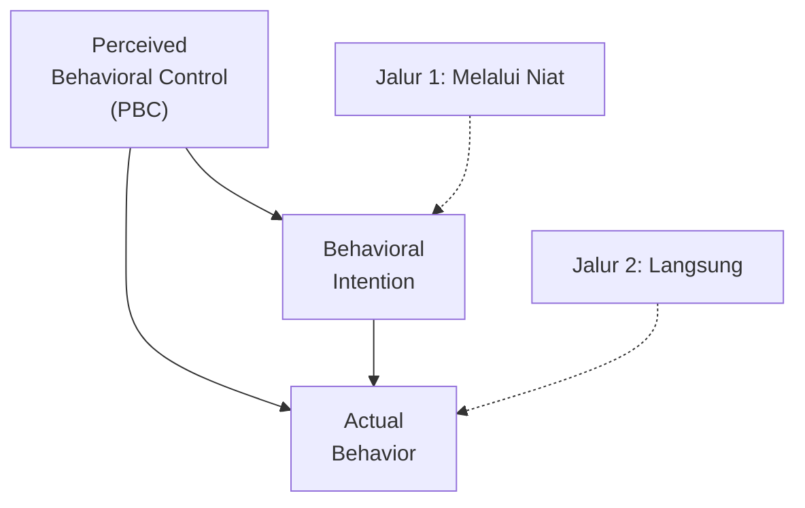
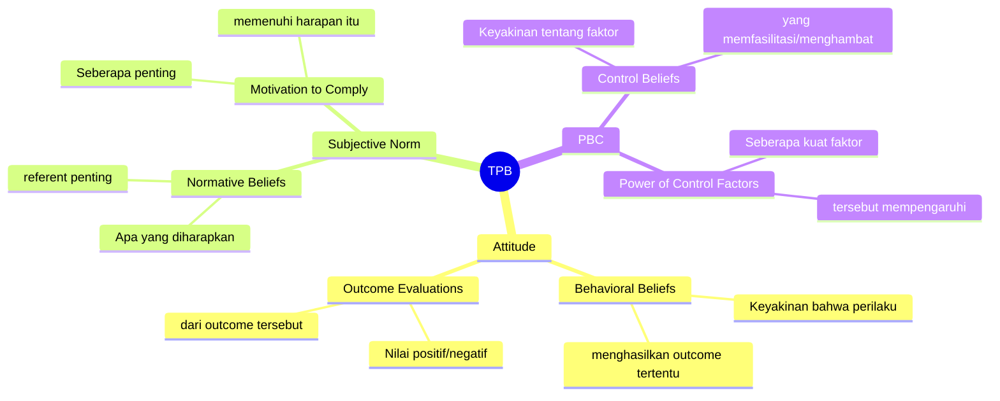
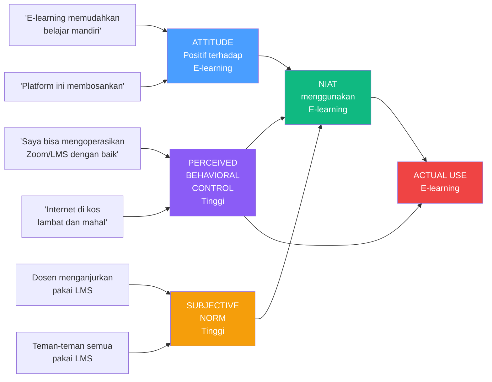
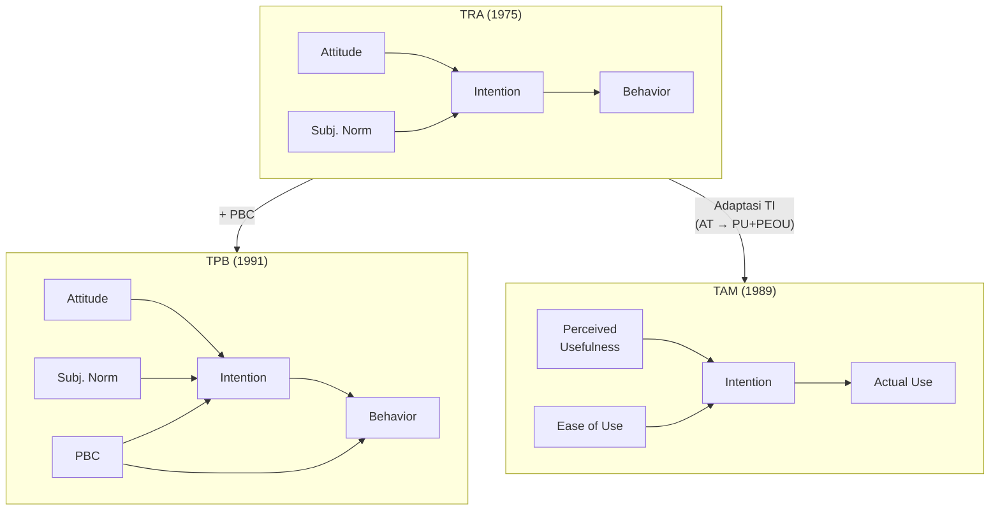

# BAB-04: Theory of Planned Behavior (TPB)

> *"Niat untuk bertindak tidak hanya ditentukan oleh apa yang kita inginkan dan apa yang orang lain harapkan — tetapi juga oleh seberapa besar kita percaya mampu melakukannya."*  
> — Icek Ajzen (1991)

---

## 🎯 Tujuan Pembelajaran

Setelah membaca bab ini, pembaca diharapkan mampu:
- Menjelaskan mengapa TPB dikembangkan sebagai perluasan TRA
- Mengidentifikasi komponen tambahan dalam TPB dibandingkan TRA
- Menjelaskan konsep Perceived Behavioral Control dan relevansinya dalam adopsi teknologi
- Menggambarkan model TPB lengkap dalam diagram
- Membedakan TPB dengan TAM dalam konteks penelitian sistem informasi

---

## 📖 Pendahuluan

Theory of Reasoned Action (TRA) adalah teori yang elegan, namun memiliki satu kelemahan fundamental: ia mengasumsikan bahwa semua perilaku sepenuhnya berada di bawah kendali individu (*volitional control*).

Kenyataannya? Tidak semua perilaku bisa dilakukan begitu saja hanya karena seseorang "mau". Seorang karyawan mungkin sangat ingin menggunakan sistem baru di kantornya, namun tidak bisa karena **tidak tahu caranya**, **tidak memiliki akses**, atau **tidak cukup percaya diri**.

Inilah yang mendorong **Icek Ajzen** — salah satu pengembang TRA — untuk mengembangkan **Theory of Planned Behavior (TPB)** pada tahun 1991. TPB menambahkan satu konstruk krusial: **Perceived Behavioral Control (PBC)** — persepsi seseorang tentang seberapa mudah atau sulit ia dapat melakukan suatu perilaku.

---

## 4.1 Latar Belakang: Dari TRA ke TPB

### Masalah yang Dipecahkan TPB

| Masalah di TRA | Solusi di TPB |
|---|---|
| Mengasumsikan kontrol penuh atas perilaku | Menambahkan Perceived Behavioral Control (PBC) |
| Tidak mempertimbangkan faktor kemampuan | PBC mencerminkan kemampuan dan sumber daya |
| Lemah dalam memprediksi perilaku di luar kendali penuh | PBC berkontribusi langsung pada perilaku aktual |

### Publikasi Kunci
- Ajzen, I. (1985). From intentions to actions: A theory of planned behavior. Dalam J. Kuhl & J. Beckman (Eds.), *Action-control: From Cognition to Behavior* (hal. 11–39). Springer.
- Ajzen, I. (1991). The theory of planned behavior. *Organizational Behavior and Human Decision Processes*, *50*(2), 179–211.

---

## 4.2 Komponen Utama TPB

TPB memiliki **empat konstruk utama** yang membentuk model prediksi perilaku:

---

### 4.2.1 Attitude Toward Behavior (Sikap terhadap Perilaku)
*(Sama dengan TRA — lihat [BAB-03](../BAB-03_TRA_Theory_of_Reasoned_Action/README.md))*

Evaluasi positif atau negatif individu terhadap melakukan suatu perilaku tertentu, dibentuk oleh **behavioral beliefs** dan **outcome evaluations**.

---

### 4.2.2 Subjective Norm (Norma Subjektif)
*(Sama dengan TRA — lihat [BAB-03](../BAB-03_TRA_Theory_of_Reasoned_Action/README.md))*

Persepsi tentang tekanan sosial dari orang-orang penting (referents), dibentuk oleh **normative beliefs** dan **motivation to comply**.

---

### 4.2.3 Perceived Behavioral Control (PBC) — Konstruk Baru TPB

**Definisi:** Persepsi individu tentang kemudahan atau kesulitan dalam melakukan suatu perilaku, berdasarkan pengalaman masa lalu dan hambatan yang diantisipasi.

PBC terdiri dari dua sub-dimensi:

| Dimensi | Konsep | Contoh dalam Adopsi Teknologi |
|---|---|---|
| **Internal Control (Self-Efficacy)** | Keyakinan tentang kemampuan diri | "Saya yakin bisa mengoperasikan aplikasi ini" |
| **External Control (Controllability)** | Keyakinan tentang faktor eksternal yang mendukung | "Saya punya akses internet dan perangkat yang memadai" |

### Hubungan PBC dengan Perilaku

PBC memiliki **dua jalur pengaruh**:
1. **Melalui Intention**: PBC → Behavioral Intention → Behavior
2. **Langsung ke Behavior**: PBC → Behavior (ketika niat sudah terbentuk, PBC menentukan apakah perilaku benar-benar bisa dilakukan)

---

### 4.2.4 Behavioral Intention (Niat Perilaku)

**Rumus TPB:**
$$BI = w_1 \cdot Attitude + w_2 \cdot Subjective\ Norm + w_3 \cdot PBC$$

Di mana $w_1$, $w_2$, $w_3$ adalah bobot relatif yang ditentukan dari data empiris.

---

## 4.3 Beliefs yang Mendasari TPB

Ketiga konstruk utama TPB masing-masing dibentuk oleh **keyakinan (beliefs)** yang spesifik:

---

## 4.4 PBC vs Self-Efficacy (Bandura)

PBC sering dikonfusikan dengan konsep **Self-Efficacy** dari Albert Bandura. Berikut perbandingannya:

| Aspek | PBC (Ajzen) | Self-Efficacy (Bandura) |
|---|---|---|
| **Cakupan** | Internal + Eksternal (lebih luas) | Hanya internal/personal |
| **Fokus** | Persepsi kontrol atas perilaku spesifik | Keyakinan kemampuan umum |
| **Sumber** | Pengalaman, observasi, konteks situasional | Pengalaman, observasi, persuasi sosial |
| **Kontrol Eksternal** | Dipertimbangkan | Tidak dipertimbangkan |

> 💡 Dalam banyak penelitian adopsi teknologi, PBC dan Self-Efficacy diperlakukan sebagai konstruk yang saling melengkapi.

---

## 4.5 TPB dalam Penelitian Adopsi Teknologi

TPB banyak digunakan dalam penelitian adopsi teknologi, terutama ketika:
- Adopsi bersifat **opsional** (bukan diwajibkan perusahaan)
- Kemampuan teknis atau **literasi digital** menjadi faktor penting
- **Akses ke infrastruktur** (internet, perangkat) menjadi pembatas adopsi

### Contoh Aplikasi: Adopsi E-Learning oleh Mahasiswa

---

## 4.6 Meta-Analisis dan Bukti Empiris

Berbagai meta-analisis telah mengonfirmasi kekuatan prediktif TPB:

| Studi Meta-Analisis | Temuan Utama |
|---|---|
| Armitage & Conner (2001) | TPB menjelaskan rata-rata **39% varian niat** dan **27% varian perilaku** |
| Hagger et al. (2002) | PBC adalah prediktor terkuat kedua setelah attitude dalam konteks olahraga |
| Rivis & Sheeran (2003) | Penambahan norma deskriptif meningkatkan prediktivitas TPB |

---

## 4.7 Kelebihan dan Keterbatasan TPB

### ✅ Kelebihan
- Mengatasi kelemahan TRA dengan menambahkan faktor kontrol
- PBC relevan dalam konteks digital di mana kemampuan teknis bervariasi
- Fleksibel untuk berbagai konteks perilaku
- Didukung oleh banyak bukti empiris (ratusan meta-analisis)

### ❌ Keterbatasan
- Masih mengasumsikan perilaku yang relatif **disengaja** (*planned*)
- Tidak mempertimbangkan **kebiasaan** (*habit*) dan perilaku otomatis
- **Gap niat-perilaku** masih menjadi masalah
- Kurang mempertimbangkan **konteks budaya** secara eksplisit
- Pengukuran PBC yang tidak konsisten antar penelitian

---

## 4.8 Perbandingan TRA, TPB, dan TAM

---

## 💡 Contoh Penerapan dalam Penelitian

**Judul Penelitian Contoh:**  
*"Pengaruh Sikap, Norma Subjektif, dan Perceived Behavioral Control terhadap Niat Penggunaan QRIS pada Pedagang UMKM"*

**Konstruk & Item Kuesioner (Contoh):**

| Konstruk | Contoh Item |
|---|---|
| Attitude | "Menggunakan QRIS untuk menerima pembayaran adalah ide yang baik" |
| Subjective Norm | "Orang-orang di sekitar saya mendukung penggunaan QRIS di usaha saya" |
| PBC (Internal) | "Saya merasa mampu mengoperasikan sistem pembayaran QRIS" |
| PBC (Eksternal) | "Saya memiliki smartphone dan koneksi internet yang memadai untuk QRIS" |
| Behavioral Intention | "Saya berencana menggunakan QRIS sebagai metode pembayaran di usaha saya" |

---

## 🔗 Keterkaitan dengan Bab Lain

- ⬅️ Bab sebelumnya: [BAB-03 — TRA](../BAB-03_TRA_Theory_of_Reasoned_Action/README.md)
- ➡️ Bab selanjutnya: [BAB-05 — Diffusion of Innovations](../BAB-05_Diffusion_of_Innovations/README.md)
- 🔗 PBC dalam konteks TAM: [BAB-06 — TAM](../BAB-06_Technology_Acceptance_Model/README.md)
- 🔗 Self-efficacy sebagai konstruk: [BAB-12 — Teori Pendukung Lainnya](../BAB-12_Teori_Pendukung_Lainnya/README.md)
- 🔗 Perbandingan lengkap: [BAB-13](../BAB-13_Perbandingan_Antar_Teori/README.md)

---

## ✅ Soal Latihan

1. **Konseptual:** Jelaskan perbedaan mendasar antara TRA dan TPB! Konstruk baru apa yang ditambahkan TPB, dan mengapa konstruk tersebut penting dalam konteks adopsi teknologi?

2. **Analitis:** Seorang ibu rumah tangga di desa memiliki sikap positif terhadap penggunaan layanan perbankan digital, tetapi tidak menggunakannya. Analisis kemungkinan penyebabnya menggunakan komponen TPB! Faktor mana yang paling mungkin menjadi hambatan?

3. **Aplikasi:** Bayangkan Anda meneliti adopsi **aplikasi kesehatan (e-health)** oleh pasien lansia. Identifikasi **tiga faktor PBC spesifik** yang relevan dan jelaskan bagaimana cara mengukurnya dalam kuesioner!

4. **Kritis:** TPB masih memiliki keterbatasan dalam menjelaskan "intention-behavior gap" — ketika niat tidak berujung pada perilaku. Jelaskan mengapa gap ini bisa terjadi dan faktor apa yang perlu ditambahkan untuk mengatasinya?

---

## 📚 Referensi Bab Ini

- Ajzen, I. (1991). The theory of planned behavior. *Organizational Behavior and Human Decision Processes*, *50*(2), 179–211. https://doi.org/10.1016/0749-5978(91)90020-T
- Ajzen, I. (2002). Perceived behavioral control, self-efficacy, locus of control, and the theory of planned behavior. *Journal of Applied Social Psychology*, *32*(4), 665–683. https://doi.org/10.1111/j.1559-1816.2002.tb00236.x
- Armitage, C. J., & Conner, M. (2001). Efficacy of the theory of planned behaviour: A meta-analytic review. *British Journal of Social Psychology*, *40*(4), 471–499. https://doi.org/10.1348/014466601164939
- Fishbein, M., & Ajzen, I. (1975). *Belief, attitude, intention, and behavior*. Addison-Wesley.
- Taylor, S., & Todd, P. A. (1995). Understanding information technology usage: A test of competing models. *Information Systems Research*, *6*(2), 144–176. https://doi.org/10.1287/isre.6.2.144

---

← [BAB-03: TRA](../BAB-03_TRA_Theory_of_Reasoned_Action/README.md) | [README Utama](../README.md) | [BAB-05: DOI →](../BAB-05_Diffusion_of_Innovations/README.md)
