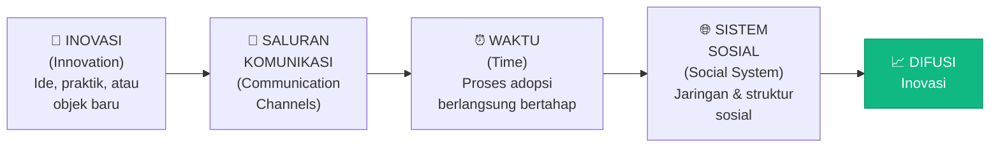
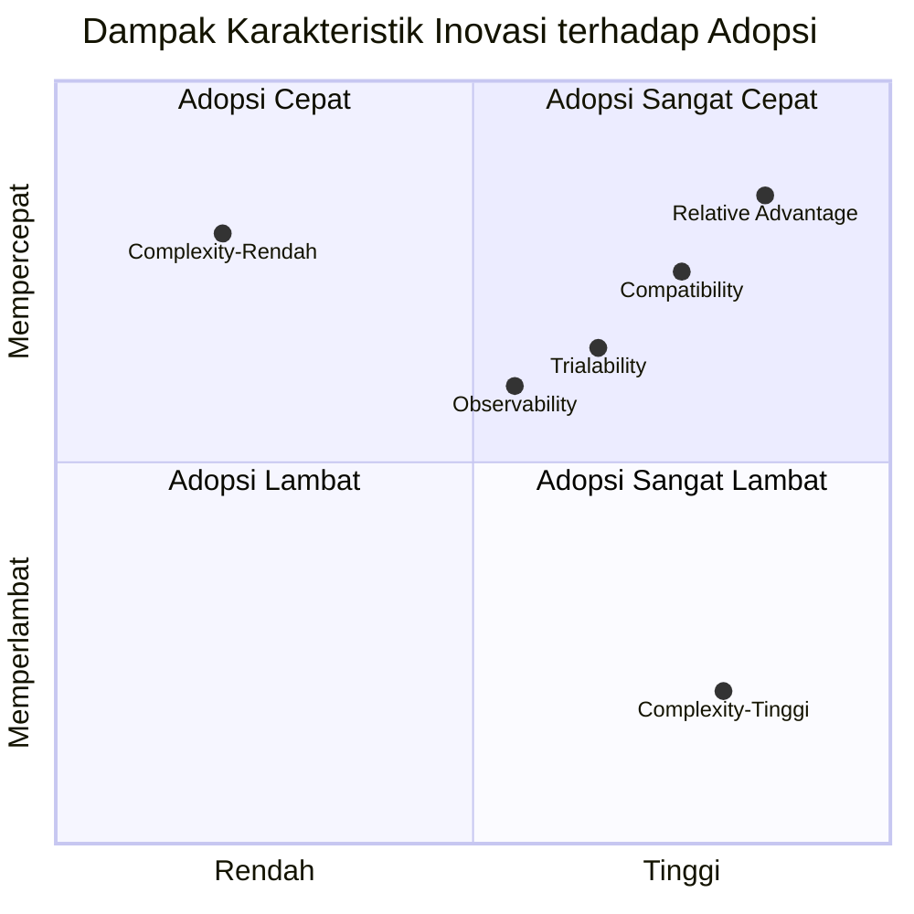
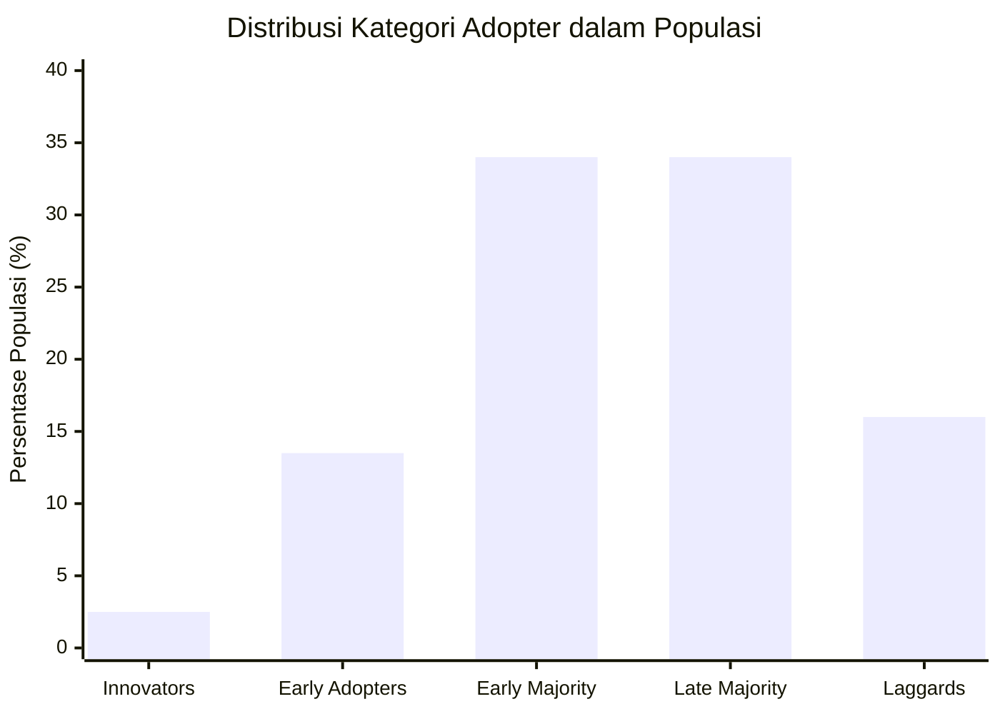
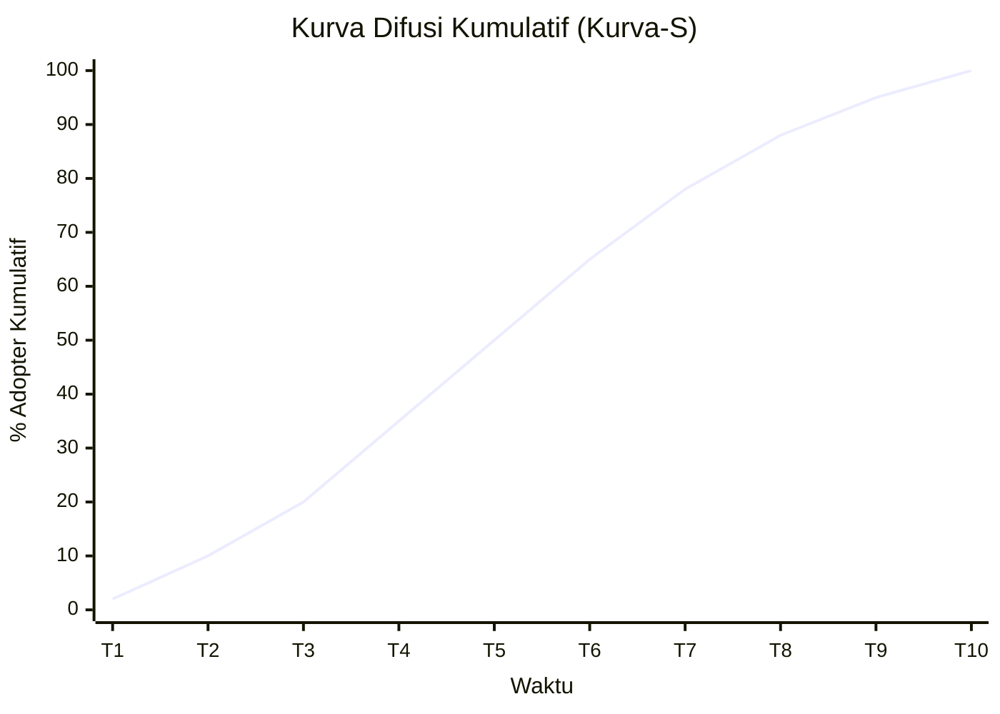
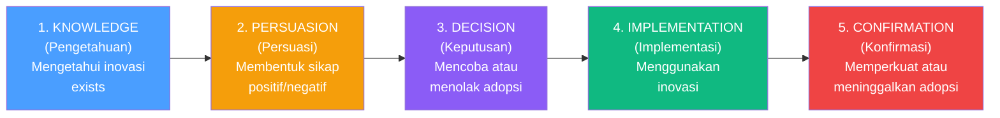

# BAB-05: Diffusion of Innovations (DOI)

> *"Difusi adalah proses di mana suatu inovasi dikomunikasikan melalui saluran tertentu dari waktu ke waktu di antara anggota suatu sistem sosial."*  
> — Everett M. Rogers (1962)

---

## 🎯 Tujuan Pembelajaran

Setelah membaca bab ini, pembaca diharapkan mampu:
- Menjelaskan konsep difusi inovasi dan membedakannya dari adopsi individual
- Mengidentifikasi dan menjelaskan lima karakteristik inovasi yang mempengaruhi kecepatan adopsi
- Mengklasifikasikan lima kategori adopter dan menggambarkan kurva difusi berbentuk S
- Menjelaskan peran saluran komunikasi dan sistem sosial dalam proses difusi
- Menerapkan teori DOI untuk menganalisis fenomena adopsi teknologi nyata

---

## 📖 Pendahuluan

Mengapa WhatsApp menyebar begitu cepat ke seluruh pelosok Indonesia? Mengapa vaksin yang terbukti efektif sekalipun kadang ditolak oleh sebagian masyarakat? Mengapa smartphone menggeser kamera digital dalam waktu kurang dari satu dekade?

Semua fenomena ini dapat dijelaskan melalui **Diffusion of Innovations (DOI)** — teori yang dikembangkan oleh sosiolog komunikasi **Everett M. Rogers** dan pertama kali dipublikasikan pada **1962**.

Berbeda dengan TAM dan TPB yang berfokus pada **keputusan individu**, DOI menganalisis bagaimana suatu inovasi **menyebar secara sosial** — dari siapa ke siapa, melalui jalur apa, dan dalam jangka waktu berapa lama.

---

## 5.1 Latar Belakang dan Sejarah

### Everett M. Rogers
Rogers adalah seorang sosiolog pedesaan yang awalnya meneliti mengapa petani di Iowa lambat mengadopsi benih jagung hibrida yang terbukti lebih produktif. Dari penelitian tersebut dan sintesis **508 studi difusi** dari berbagai bidang (pertanian, kedokteran, pendidikan, teknologi), ia menemukan **pola universal difusi inovasi**.

### Edisi Buku Rogers
| Edisi | Tahun | Jumlah Studi Difusi yang Dikaji |
|---|---|---|
| Edisi 1 | 1962 | 508 studi |
| Edisi 2 | 1971 | ~1.500 studi |
| Edisi 3 | 1983 | ~3.000 studi |
| Edisi 4 | 1995 | ~4.000 studi |
| Edisi 5 | 2003 | ~5.200 studi |

---

## 5.2 Empat Elemen Utama Difusi

Rogers mengidentifikasi empat elemen inti dalam setiap proses difusi:



---

## 5.3 Lima Karakteristik Inovasi

Rogers menemukan bahwa **kecepatan adopsi suatu inovasi** sangat dipengaruhi oleh bagaimana calon adopter *mempersepsikan* karakteristik inovasi tersebut. Ada **lima karakteristik** yang paling menentukan:

### 5.3.1 Relative Advantage (Keuntungan Relatif)
**Definisi:** Sejauh mana inovasi dianggap lebih baik dari ide, praktik, atau produk yang digantikannya.

> 📌 Bukan soal apakah inovasi itu *secara objektif* lebih baik, melainkan apakah *dipersepsikan* lebih baik oleh calon adopter.

**Pengaruh:** Semakin tinggi keuntungan relatif yang dipersepsikan → semakin cepat diadopsi

**Contoh dalam konteks digital:**
- GoPay vs uang tunai: lebih cepat, dapat cashback, tidak perlu kembalian
- Zoom vs rapat fisik (masa pandemi): hemat waktu, bisa dari mana saja

---

### 5.3.2 Compatibility (Kompatibilitas)
**Definisi:** Sejauh mana inovasi dianggap konsisten dengan nilai-nilai yang ada, pengalaman masa lalu, dan kebutuhan calon adopter.

**Pengaruh:** Semakin kompatibel dengan kebiasaan yang ada → semakin mudah diadopsi

**Contoh:**
- QRIS kompatibel dengan kebiasaan transaksi menggunakan HP yang sudah ada
- Aplikasi Bank Jago kompatibel dengan gaya hidup "cashless" generasi milenial
- Aplikasi yang mengharuskan registrasi rumit → incompatible dengan kebiasaan ingin serba cepat

---

### 5.3.3 Complexity (Kompleksitas)
**Definisi:** Sejauh mana inovasi dianggap sulit untuk dipahami dan digunakan.

**Pengaruh:** Semakin kompleks → semakin lambat diadopsi (hubungan negatif)

> 💡 Ini setara dengan kebalikan dari **Perceived Ease of Use** dalam TAM.

**Contoh:**
- Penggunaan dompet crypto (kompleks) vs dompet digital biasa (sederhana)
- Sistem ERP di perusahaan yang membutuhkan training berbulan-bulan

---

### 5.3.4 Trialability (Ketercobaan)
**Definisi:** Sejauh mana inovasi dapat dicoba secara terbatas (trial) sebelum keputusan adopsi penuh diambil.

**Pengaruh:** Inovasi yang bisa dicoba lebih mudah → lebih cepat diadopsi

**Contoh:**
- Aplikasi gratis dengan fitur premium trial 30 hari
- Free tier pada layanan cloud (AWS, Google Cloud)
- Demo produk SaaS untuk perusahaan

---

### 5.3.5 Observability (Keterlihatan)
**Definisi:** Sejauh mana hasil penggunaan inovasi dapat dilihat dan diamati oleh orang lain.

**Pengaruh:** Hasil yang mudah dilihat orang lain → mempercepat difusi melalui pengaruh sosial

**Contoh:**
- Teman yang terlihat pakai iPhone → mendorong orang lain ingin pakai juga
- Petani yang lahannya terlihat lebih subur setelah pakai pupuk baru → tetangga ikut adopsi

---

### Ringkasan Lima Karakteristik



| Karakteristik | Arah Pengaruh | Kekuatan Pengaruh |
|---|---|---|
| Relative Advantage | Positif | ⭐⭐⭐⭐⭐ Sangat kuat |
| Compatibility | Positif | ⭐⭐⭐⭐ Kuat |
| Complexity | **Negatif** | ⭐⭐⭐⭐ Kuat |
| Trialability | Positif | ⭐⭐⭐ Sedang |
| Observability | Positif | ⭐⭐⭐ Sedang |

---

## 5.4 Lima Kategori Adopter

Rogers mengklasifikasikan anggota sistem sosial ke dalam **5 kategori** berdasarkan **kecepatan relatif mereka mengadopsi inovasi** dibandingkan anggota lainnya.



---

### 5.4.1 Innovators (2.5%)
**Karakteristik:**
- Paling berani mengambil risiko
- Antusias terhadap teknologi baru
- Sering mencari informasi dari luar komunitas lokalnya
- Memiliki sumber daya finansial untuk menanggung kegagalan
- Gatekeeper: membawa inovasi dari luar ke dalam komunitas

**Contoh:** Developer yang mencoba framework baru sebelum ada dokumentasi lengkap

---

### 5.4.2 Early Adopters (13.5%)
**Karakteristik:**
- Pemimpin opini (*opinion leaders*) yang dihormati komunitas
- Lebih terintegrasi secara sosial dibanding Innovators
- Berhati-hati dalam memilih inovasi yang diadopsi (selektif)
- Peran kunci: **memberikan legitimasi** pada inovasi bagi kelompok lain

**Contoh:** Tech blogger atau YouTuber yang review produk baru; influencer teknologi

> 💡 Early Adopters adalah kelompok paling strategis untuk ditarget dalam kampanye adopsi!

---

### 5.4.3 Early Majority (34%)
**Karakteristik:**
- Pragmatis dan berhati-hati
- Butuh bukti nyata dari Early Adopters sebelum mengadopsi
- Interaksi yang tinggi dengan sesama (bukan pemimpin, tapi aktif berjejaring)
- "Deliberate" — pengambilan keputusan lebih lama dari Early Adopters

**Contoh:** Karyawan kantor yang mulai pakai Zoom setelah banyak rekan kerja yang sudah terbiasa

---

### 5.4.4 Late Majority (34%)
**Karakteristik:**
- Skeptis terhadap inovasi baru
- Baru mengadopsi setelah tekanan sosial sangat kuat atau terpaksa
- Lebih tua, lebih sedikit sumber daya, lebih berisiko menghindari
- Membutuhkan dukungan dan jaminan risiko minimum

**Contoh:** Orang tua yang baru membuat WhatsApp setelah semua anggota keluarga sudah lama memakai

---

### 5.4.5 Laggards (16%)
**Karakteristik:**
- Sangat tradisional, paling lama mengadopsi (atau tidak sama sekali)
- Sering terisolasi secara sosial dari arus utama komunitas
- Referensi utama adalah nilai-nilai tradisional dan masa lalu
- Cenderung skeptis terhadap inovasi dan agen perubahan

**Contoh:** Pedagang pasar yang menolak menggunakan QRIS karena lebih nyaman dengan uang tunai

---

## 5.5 Kurva Difusi Berbentuk S

Jika kumulatif adopter digambarkan terhadap waktu, akan terbentuk **kurva-S**:



**Interpretasi Kurva-S:**
- **Fase awal (lambat):** Hanya Innovators dan Early Adopters yang mengadopsi — pertumbuhan lambat
- **Fase tengah (cepat):** Early dan Late Majority mulai mengadopsi — pertumbuhan eksponensial
- **Fase akhir (melambat):** Laggards mengadopsi — pertumbuhan melambat hingga saturasi

### "The Chasm" — Geoffrey Moore (1991)
Moore mengidentifikasi **jurang (chasm)** antara Early Adopters dan Early Majority yang sulit dilewati oleh banyak produk teknologi:

```
Innovators → Early Adopters → [CHASM] → Early Majority → Late Majority → Laggards
```

> Banyak startup gagal karena tidak bisa melewati chasm ini — produk diterima baik oleh enthusiast tetapi gagal menembus pasar massa.

---

## 5.6 Proses Adopsi Individual (Innovation-Decision Process)

Rogers juga menggambarkan **proses pengambilan keputusan adopsi** pada level individu dalam 5 tahap:



---

## 5.7 Agen Perubahan (Change Agents)

Rogers menekankan peran **agen perubahan** dalam mempercepat difusi:

**Agen Perubahan** adalah individu yang mempengaruhi keputusan adopsi klien dalam arah yang dianggap diinginkan oleh lembaga perubahan.

**Karakteristik Agen Perubahan yang Efektif:**
1. Dekat secara sosial dengan calon adopter (homophily)
2. Memiliki kredibilitas yang diakui komunitas
3. Mampu berkomunikasi dalam bahasa dan budaya lokal
4. Memahami kebutuhan dan hambatan spesifik komunitas

**Contoh Agen Perubahan dalam Konteks Digital Indonesia:**
- Relawan TIK Kemenkominfo
- Komunitas Google Developer Student Clubs
- Penyuluh digital desa

---

## 5.8 DOI vs TAM: Perbedaan Pendekatan

| Aspek | DOI (Rogers) | TAM (Davis) |
|---|---|---|
| **Unit Analisis** | Sistem sosial (komunitas, organisasi) | Individu |
| **Fokus** | Penyebaran sosial inovasi | Penerimaan individual |
| **Variabel Utama** | 5 karakteristik inovasi + kategori adopter | PU dan PEOU |
| **Output** | Kurva difusi, kategori adopter | Behavioral Intention, Actual Use |
| **Waktu** | Perspektif longitudinal (proses dari waktu ke waktu) | Perspektif cross-sectional |
| **Metode Penelitian** | Survei komunitas, wawancara, observasi | Kuesioner, eksperimen |

---

## 💡 Contoh Penerapan: Adopsi QRIS di Indonesia

### Analisis DOI untuk QRIS (Quick Response Code Indonesian Standard)

| Karakteristik | Persepsi Adopter | Implikasi |
|---|---|---|
| **Relative Advantage** | Lebih cepat dari transfer bank, gratis, cashback | ✅ Tinggi → mendorong adopsi |
| **Compatibility** | Kompatibel dengan kebiasaan pakai HP | ✅ Tinggi → mudah diterima |
| **Complexity** | Cukup mudah (scan QR) tapi butuh HP & internet | ⚠️ Sedang → tantangan di desa |
| **Trialability** | Bisa dicoba langsung di merchant | ✅ Tinggi → mudah dicoba |
| **Observability** | Terlihat jelas di kasir/merchant | ✅ Tinggi → efek peniruan |

**Kategori Adopter QRIS:**
- **Innovators**: Developer fintech, pegiat startup
- **Early Adopters**: Mahasiswa kota, tech-savvy millennials
- **Early Majority**: Karyawan kantoran, warung modern
- **Late Majority**: Pedagang tradisional (setelah ada regulasi/insentif)
- **Laggards**: Pedagang lansia, daerah tanpa akses internet

---

## 🔗 Keterkaitan dengan Bab Lain

- ⬅️ Bab sebelumnya: [BAB-04 — TPB](../BAB-04_TPB_Theory_of_Planned_Behavior/README.md)
- ➡️ Bab selanjutnya: [BAB-06 — TAM](../BAB-06_Technology_Acceptance_Model/README.md)
- 🔗 Hambatan adopsi lebih lanjut: [BAB-16](../BAB-16_Hambatan_Adopsi/README.md)
- 🔗 Konteks Indonesia: [BAB-24](../BAB-24_Konteks_Indonesia/README.md)
- 🔗 Change Management: [BAB-27](../BAB-27_Change_Management_dan_Adopsi/README.md)

---

## ✅ Soal Latihan

1. **Konseptual:** Jelaskan perbedaan antara **difusi** dan **adopsi** menurut Rogers! Mengapa perbedaan ini penting secara metodologis dalam penelitian?

2. **Analitis:** Pilih satu teknologi digital yang baru populer di Indonesia (contoh: BRIVA, GovTech, atau platform e-government). Analisis menggunakan **lima karakteristik inovasi** Rogers — berikan penilaian (rendah/sedang/tinggi) untuk setiap karakteristik dan jelaskan dampaknya!

3. **Aplikasi:** Anda adalah kepala dinas Kominfo di sebuah kabupaten yang ingin mendorong adopsi **layanan pengaduan online** bagi masyarakat. Menggunakan kerangka DOI, identifikasi **strategi berbeda** yang harus diterapkan untuk kelompok Early Adopters dan Late Majority!

4. **Kritis:** Rogers mengembangkan teorinya pada 1962 sebelum era internet. Menurut Anda, faktor difusi apa yang **berubah secara signifikan** di era media sosial dibandingkan era 1960-an? Apakah kurva difusi S masih relevan hari ini?

---

## 📚 Referensi Bab Ini

- Moore, G. A. (1991). *Crossing the chasm: Marketing and selling technology products to mainstream customers*. Harper Business.
- Rogers, E. M. (1962). *Diffusion of innovations* (1st ed.). Free Press.
- Rogers, E. M. (2003). *Diffusion of innovations* (5th ed.). Free Press.
- Tornatzky, L. G., & Klein, K. J. (1982). Innovation characteristics and innovation adoption-implementation: A meta-analysis of findings. *IEEE Transactions on Engineering Management*, *29*(1), 28–45. https://doi.org/10.1109/TEM.1982.6447463
- Venkatesh, V., Morris, M. G., Davis, G. B., & Davis, F. D. (2003). User acceptance of information technology: Toward a unified view. *MIS Quarterly*, *27*(3), 425–478.

---

← [BAB-04: TPB](../BAB-04_TPB_Theory_of_Planned_Behavior/README.md) | [README Utama](../README.md) | [BAB-06: TAM →](../BAB-06_Technology_Acceptance_Model/README.md)
