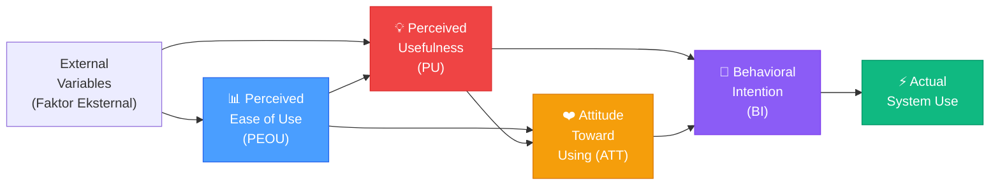
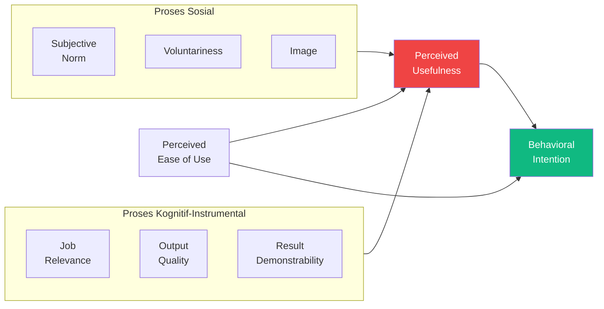
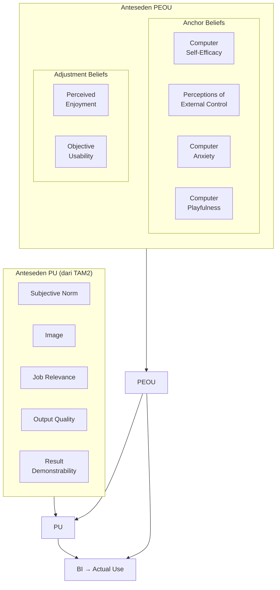
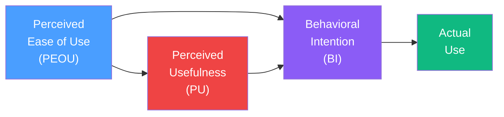

# BAB-06: Technology Acceptance Model (TAM)

> *"Perceived usefulness and perceived ease of use are fundamental determinants of user acceptance."*  
> — Fred D. Davis (1989)

---

## 🎯 Tujuan Pembelajaran

Setelah membaca bab ini, pembaca diharapkan mampu:
- Menjelaskan latar belakang dan motivasi pengembangan TAM oleh Fred Davis
- Mengidentifikasi dan mendefinisikan konstruk-konstruk utama TAM original
- Membedakan TAM, TAM2, dan TAM3 beserta tambahan variabelnya
- Menggambarkan model TAM lengkap dalam diagram
- Merancang penelitian adopsi teknologi berbasis TAM

---

## 📖 Pendahuluan

Bayangkan sebuah perusahaan besar menghabiskan ratusan juta rupiah untuk mengimplementasikan sistem ERP baru — namun setelah diluncurkan, karyawan hampir tidak menggunakannya. Sistem canggih tersebut pada akhirnya hanya menjadi "lemari besi digital" yang mahal.

Fenomena ini begitu umum terjadi di tahun 1980-an, ketika revolusi komputer personal sedang berlangsung. **Fred Davis**, dalam disertasi doktoralnya di MIT (1986), mencoba menjawab satu pertanyaan sederhana namun krusial:

> **"Faktor apa yang menentukan apakah seseorang mau menggunakan suatu sistem komputer?"**

Jawabannya lahir dalam bentuk **Technology Acceptance Model (TAM)** — yang kemudian menjadi model paling banyak dikutip dalam penelitian sistem informasi sepanjang sejarah.

---

## 6.1 Latar Belakang dan Sejarah TAM

### Akar Teoretis TAM
TAM diadaptasi langsung dari **Theory of Reasoned Action (TRA)** Fishbein & Ajzen, namun dengan modifikasi penting:
- TRA bersifat **umum** (berlaku untuk semua perilaku)
- TAM bersifat **spesifik** (dirancang khusus untuk penerimaan sistem TI)
- Davis menyederhanakan TRA dengan mengidentifikasi **dua keyakinan fundamental** yang paling relevan untuk konteks TI

### Kronologi Pengembangan TAM

| Tahun | Milestone |
|---|---|
| 1986 | Disertasi Davis di MIT Sloan School of Management |
| 1989 | Publikasi TAM di *MIS Quarterly* + jurnal *Management Science* |
| 2000 | TAM2 oleh Venkatesh & Davis — menambahkan anteseden Perceived Usefulness |
| 2008 | TAM3 oleh Venkatesh & Bala — model lengkap dengan semua anteseden |

---

## 6.2 TAM Original (1989)

### Konstruk Utama

---

### 6.2.1 Perceived Usefulness (PU)

**Definisi (Davis, 1989):**  
"Sejauh mana seseorang percaya bahwa menggunakan sistem tertentu akan meningkatkan kinerjanya."

**Item Kuesioner Original (Davis, 1989):**
| No | Item (Bahasa Indonesia) |
|---|---|
| 1 | Menggunakan sistem ini memungkinkan saya menyelesaikan tugas lebih cepat |
| 2 | Menggunakan sistem ini meningkatkan kinerja pekerjaan saya |
| 3 | Menggunakan sistem ini meningkatkan produktivitas saya |
| 4 | Menggunakan sistem ini meningkatkan efektivitas pekerjaan saya |
| 5 | Menggunakan sistem ini memudahkan pekerjaan saya |
| 6 | Secara keseluruhan, saya merasa sistem ini berguna |

**Kata Kunci:** Produktivitas, efektivitas, kinerja, manfaat kerja

---

### 6.2.2 Perceived Ease of Use (PEOU)

**Definisi (Davis, 1989):**  
"Sejauh mana seseorang percaya bahwa menggunakan sistem tertentu tidak membutuhkan banyak usaha."

**Item Kuesioner Original (Davis, 1989):**
| No | Item (Bahasa Indonesia) |
|---|---|
| 1 | Belajar mengoperasikan sistem ini mudah bagi saya |
| 2 | Saya merasa mudah untuk mencapai apa yang saya inginkan dengan sistem ini |
| 3 | Interaksi saya dengan sistem ini jelas dan mudah dipahami |
| 4 | Saya merasa sistem ini fleksibel untuk digunakan |
| 5 | Mudah bagi saya untuk menjadi mahir menggunakan sistem ini |
| 6 | Secara keseluruhan, saya merasa sistem ini mudah digunakan |

**Kata Kunci:** Kemudahan, fleksibilitas, tidak membutuhkan banyak usaha

---

### 6.2.3 Hubungan PEOU → PU

Salah satu temuan penting Davis: **PEOU berpengaruh pada PU**.

**Logikanya:** Jika suatu sistem mudah digunakan, maka pengguna dapat lebih fokus pada manfaat pekerjaan, bukan pada cara mengoperasikannya. Sistem yang mudah dipelajari lebih mudah diintegrasikan ke dalam alur kerja.

> Contoh: Aplikasi yang interface-nya intuitif (PEOU tinggi) membuat pengguna lebih yakin bahwa ia bisa menyelesaikan pekerjaan lebih cepat (PU tinggi).

---

### 6.2.4 Attitude Toward Using (ATT)

Evaluasi afektif pengguna terhadap penggunaan sistem — apakah ia merasa positif atau negatif terhadap penggunaan teknologi tersebut.

> ⚠️ **Catatan:** Dalam banyak penelitian TAM, variabel ATT sering **dihilangkan** karena PU dan PEOU terbukti dapat langsung memprediksi BI tanpa mediasi ATT (parsimony).

---

### 6.2.5 Behavioral Intention (BI) → Actual Use

- **BI:** Niat pengguna untuk menggunakan sistem di masa depan
- **Actual Use:** Penggunaan sistem yang sesungguhnya (diukur dengan log sistem, frekuensi, durasi)

---

## 6.3 TAM2 — Venkatesh & Davis (2000)

TAM2 memperluas TAM dengan menambahkan **anteseden dari Perceived Usefulness** yang berasal dari dua kategori:

### Anteseden PU dalam TAM2

| Anteseden | Definisi |
|---|---|
| **Subjective Norm** | Persepsi tentang apa yang orang penting pikirkan tentang penggunaan sistem |
| **Voluntariness** | Sejauh mana penggunaan bersifat sukarela vs. diwajibkan |
| **Image** | Sejauh mana penggunaan sistem meningkatkan status sosial |
| **Job Relevance** | Sejauh mana sistem relevan dengan pekerjaan |
| **Output Quality** | Kualitas output yang dihasilkan sistem |
| **Result Demonstrability** | Kemampuan untuk mengomunikasikan hasil penggunaan sistem |

---

## 6.4 TAM3 — Venkatesh & Bala (2008)

TAM3 adalah model paling lengkap — mengintegrasikan anteseden untuk **kedua konstruk** (PU dan PEOU):

### Anteseden PEOU dalam TAM3

| Kategori | Anteseden | Definisi |
|---|---|---|
| **Anchor** | Computer Self-Efficacy | Keyakinan kemampuan menggunakan komputer |
| **Anchor** | Perceptions of External Control | Tersedianya support dan infrastruktur |
| **Anchor** | Computer Anxiety | Kekhawatiran/ketakutan saat menggunakan komputer |
| **Anchor** | Computer Playfulness | Spontanitas dan kreativitas dalam penggunaan |
| **Adjustment** | Perceived Enjoyment | Kesenangan yang dirasakan saat menggunakan |
| **Adjustment** | Objective Usability | Perbandingan usaha yang dibutuhkan antar sistem |

---

## 6.5 Perbandingan TAM, TAM2, dan TAM3

| Aspek | TAM (1989) | TAM2 (2000) | TAM3 (2008) |
|---|---|---|---|
| **Konstruk Inti** | PU, PEOU, ATT, BI | Semua TAM | Semua TAM |
| **Anteseden PU** | Tidak ada | 6 anteseden | 6 anteseden |
| **Anteseden PEOU** | Tidak ada | Tidak ada | 6 anteseden |
| **Kompleksitas** | Rendah | Sedang | Tinggi |
| **Cocok untuk** | Penelitian umum | Konteks organisasional | Penelitian komprehensif |

---

## 6.6 TAM yang Disederhanakan (untuk Penelitian Skripsi)

Dalam banyak penelitian skripsi/tesis di Indonesia, TAM digunakan dalam **versi yang disederhanakan** — tanpa ATT (karena sering tidak signifikan):

**Hipotesis yang umum diuji:**
- H1: PEOU berpengaruh positif terhadap PU
- H2: PEOU berpengaruh positif terhadap BI
- H3: PU berpengaruh positif terhadap BI
- H4: BI berpengaruh positif terhadap Actual Use

---

## 6.7 Bukti Empiris: Kekuatan Prediktif TAM

Meta-analisis King & He (2006) berdasarkan 88 penelitian TAM:

| Jalur | Koefisien Rata-Rata |
|---|---|
| PEOU → PU | **0.44** (kuat) |
| PU → BI | **0.54** (sangat kuat) |
| PEOU → BI | **0.31** (sedang) |
| BI → Actual Use | **0.40** (kuat) |

TAM rata-rata menjelaskan **40% varian Behavioral Intention** dan **34% varian Actual Use**.

---

## 6.8 Kelebihan dan Keterbatasan TAM

### ✅ Kelebihan
- Model paling **parsimoni** — hanya 2 konstruk inti
- Terbukti **reliabel dan valid** di ribuan penelitian selama 30+ tahun
- Mudah dioperasionalisasikan ke dalam **kuesioner**
- **Fleksibel** — dapat diterapkan pada hampir semua jenis teknologi
- Item kuesioner original sudah tersedia dan tervalidasi

### ❌ Keterbatasan
- Terlalu **deterministik** — mengabaikan faktor emosi, kesenangan, nilai sosial
- Kurang mempertimbangkan **konteks budaya** (dikembangkan di Amerika Barat)
- Mengukur **niat**, bukan **perilaku aktual** (BI ≠ Actual Use)
- Tidak mempertimbangkan **faktor organisasional** (kebijakan, pelatihan)
- Variabel **Attitude** terbukti sering tidak signifikan (mengapa dibuat?)
- Terlalu fokus pada penggunaan awal, kurang pada **kontinuansi** jangka panjang

---

## 💡 Contoh Penerapan dalam Penelitian

**Judul Penelitian:**  
*"Analisis Penerimaan Sistem E-Presensi Digital pada Pegawai Negeri Sipil menggunakan Technology Acceptance Model"*

**Konstruk & Definisi Operasional:**

| Konstruk | Definisi Operasional | Jumlah Item |
|---|---|---|
| PEOU | Kemudahan penggunaan sistem e-presensi | 4 item |
| PU | Manfaat e-presensi terhadap kinerja presensi | 4 item |
| BI | Niat untuk terus menggunakan sistem | 3 item |
| Actual Use | Frekuensi penggunaan sistem e-presensi | 3 item |

**Hipotesis:**
1. H1: PEOU berpengaruh positif dan signifikan terhadap PU
2. H2: PEOU berpengaruh positif dan signifikan terhadap BI
3. H3: PU berpengaruh positif dan signifikan terhadap BI
4. H4: BI berpengaruh positif dan signifikan terhadap Actual Use

---

## 🔗 Keterkaitan dengan Bab Lain

- ⬅️ Bab sebelumnya: [BAB-05 — DOI](../BAB-05_Diffusion_of_Innovations/README.md)
- ➡️ Bab selanjutnya: [BAB-07 — UTAUT & UTAUT2](../BAB-07_UTAUT_dan_UTAUT2/README.md)
- 🔗 Akar TAM: [BAB-03 — TRA](../BAB-03_TRA_Theory_of_Reasoned_Action/README.md)
- 🔗 Model gabungan TAM+TTF: [BAB-08](../BAB-08_Task_Technology_Fit/README.md)
- 🔗 Instrumen kuesioner TAM: [BAB-29](../BAB-29_Instrumen_dan_Skala_Pengukuran/README.md)
- 🔗 Template kuesioner TAM: [BAB-32](../BAB-32_Template_Kuesioner/README.md)

---

## ✅ Soal Latihan

1. **Konseptual:** Jelaskan mengapa Davis memilih **hanya dua konstruk** (PU dan PEOU) sebagai inti TAM, padahal TRA memiliki banyak variabel! Apa prinsip yang mendasari pilihan ini?

2. **Analitis:** Dalam studi Davis (1989) asli, sistem word processor diuji kepada mahasiswa MBA. Jika Anda ingin mereplikasi penelitian ini untuk menguji **aplikasi mobile banking** di Indonesia, apa saja **penyesuaian** yang perlu dilakukan pada item kuesioner?

3. **Aplikasi:** Rancang model penelitian TAM (beserta hipotesis) untuk meneliti penerimaan **sistem informasi akademik (SIAKAD)** oleh mahasiswa di universitas Anda! Sertakan diagram model penelitian.

4. **Kritis:** TAM sering dikritik karena "terlalu sederhana". Identifikasi **dua faktor penting** yang tidak ada dalam TAM tetapi sangat relevan dalam konteks adopsi teknologi di Indonesia! Bagaimana Anda akan menambahkannya ke dalam model?

---

## 📚 Referensi Bab Ini

- Davis, F. D. (1989). Perceived usefulness, perceived ease of use, and user acceptance of information technology. *MIS Quarterly*, *13*(3), 319–340. https://doi.org/10.2307/249008
- Davis, F. D., Bagozzi, R. P., & Warshaw, P. R. (1989). User acceptance of computer technology: A comparison of two theoretical models. *Management Science*, *35*(8), 982–1003. https://doi.org/10.1287/mnsc.35.8.982
- King, W. R., & He, J. (2006). A meta-analysis of the technology acceptance model. *Information & Management*, *43*(6), 740–755. https://doi.org/10.1016/j.im.2006.05.003
- Venkatesh, V., & Bala, H. (2008). Technology acceptance model 3 and a research agenda on interventions. *Decision Sciences*, *39*(2), 273–315. https://doi.org/10.1111/j.1540-5915.2008.00192.x
- Venkatesh, V., & Davis, F. D. (2000). A theoretical extension of the technology acceptance model: Four longitudinal field studies. *Management Science*, *46*(2), 186–204. https://doi.org/10.1287/mnsc.46.2.186.11926

---

← [BAB-05: DOI](../BAB-05_Diffusion_of_Innovations/README.md) | [README Utama](../README.md) | [BAB-07: UTAUT →](../BAB-07_UTAUT_dan_UTAUT2/README.md)
