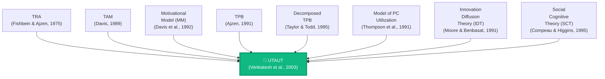
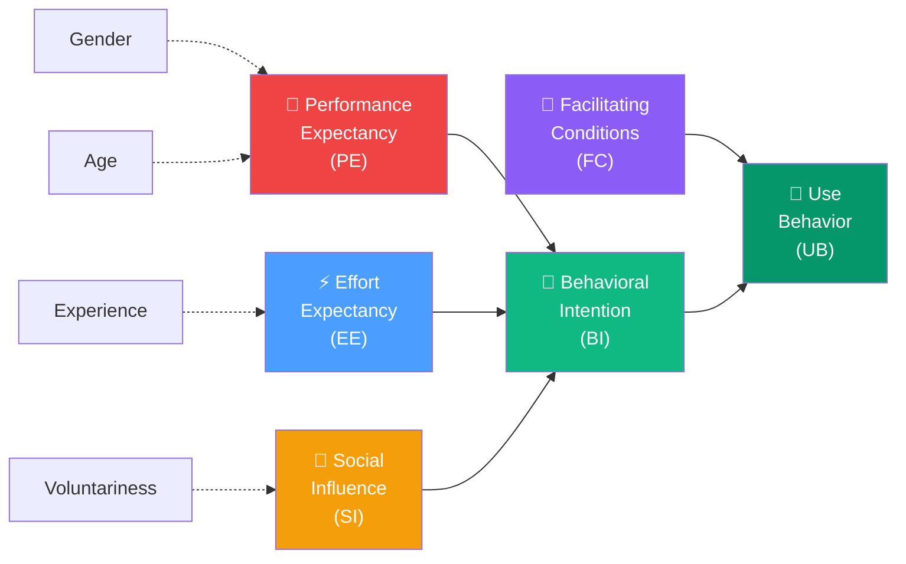
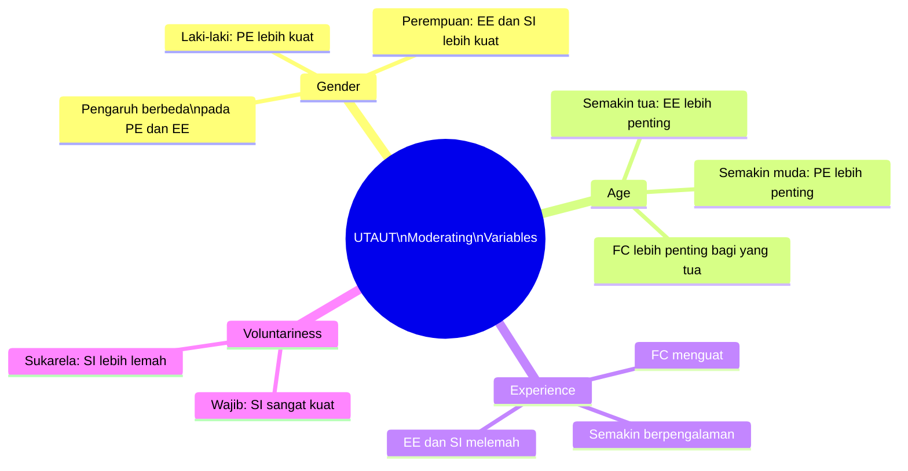
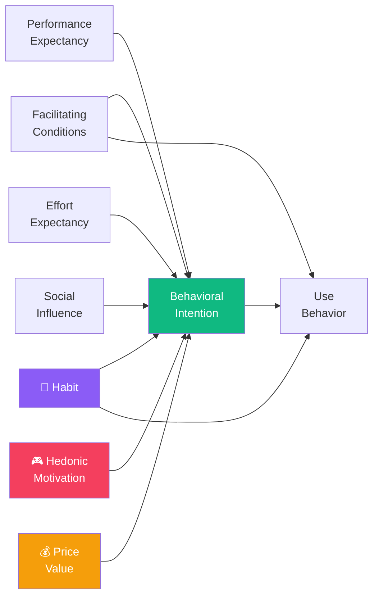

# BAB-07: UTAUT dan UTAUT2

> *"Setelah dua dekade penelitian adopsi teknologi, saatnya menyatukan semua temuan terbaik ke dalam satu teori yang komprehensif."*  
> — Venkatesh, Morris, Davis & Davis (2003)

---

## 🎯 Tujuan Pembelajaran

Setelah membaca bab ini, pembaca diharapkan mampu:
- Menjelaskan latar belakang pengembangan UTAUT dan mengidentifikasi 8 teori yang menjadi sumbernya
- Mendefinisikan empat konstruk utama UTAUT dan empat moderating variable-nya
- Menjelaskan perbedaan UTAUT dan UTAUT2 beserta tiga konstruk tambahan di UTAUT2
- Menggambarkan model UTAUT dan UTAUT2 dalam diagram
- Menentukan kapan UTAUT vs UTAUT2 lebih tepat digunakan

---

## 📖 Pendahuluan

Pada awal 2000-an, penelitian adopsi teknologi menghadapi masalah serius: **terlalu banyak teori yang berbeda-beda**. Ada TAM, TRA, TPB, DOI, SCT, MPCU, dan banyak lagi. Peneliti bingung memilih mana yang paling tepat, dan perbandingan antar penelitian menjadi sulit karena menggunakan kerangka yang berbeda.

**Viswanath Venkatesh** bersama timnya mengambil langkah berani: melakukan meta-analisis terhadap **8 teori utama adopsi teknologi**, mengidentifikasi konstruk-konstruk terbaik dari masing-masing, dan mengintegrasikannya ke dalam satu model terpadu: **Unified Theory of Acceptance and Use of Technology (UTAUT)**.

Hasilnya? UTAUT mampu menjelaskan **70% varian Behavioral Intention** — jauh melampaui TAM yang hanya 40%.

---

## 7.1 Delapan Teori Sumber UTAUT

---

## 7.2 UTAUT — Model Asli (2003)

### Empat Konstruk Utama

---

### 7.2.1 Performance Expectancy (PE)

**Definisi:** Sejauh mana individu percaya bahwa menggunakan sistem akan membantu mereka mencapai peningkatan kinerja pekerjaan.

**Konstruk yang Diserap dari Teori Lain:**
| Teori Sumber | Konstruk Setara |
|---|---|
| TAM | Perceived Usefulness |
| Motivational Model | Extrinsic Motivation |
| TPB/DTPB | Relative Advantage (dari DOI) |
| MPCU | Job Fit |
| SCT | Outcome Expectations |

**Contoh Item Kuesioner:**
- "Saya merasa menggunakan sistem ini berguna dalam pekerjaan saya"
- "Menggunakan sistem ini meningkatkan produktivitas saya"
- "Menggunakan sistem ini memungkinkan saya menyelesaikan pekerjaan lebih cepat"

**Moderating Variables:** Gender, Usia
- PE lebih kuat memprediksi BI pada **laki-laki** dan pengguna yang **lebih muda**

---

### 7.2.2 Effort Expectancy (EE)

**Definisi:** Tingkat kemudahan yang dikaitkan dengan penggunaan sistem.

**Konstruk yang Diserap:**
| Teori Sumber | Konstruk Setara |
|---|---|
| TAM | Perceived Ease of Use |
| DOI | Complexity (kebalikan) |
| MPCU | Complexity (kebalikan) |

**Contoh Item Kuesioner:**
- "Belajar mengoperasikan sistem ini mudah bagi saya"
- "Interaksi saya dengan sistem ini jelas dan mudah dipahami"
- "Mudah bagi saya untuk menjadi mahir menggunakan sistem ini"

**Moderating Variables:** Gender, Usia, Pengalaman
- EE lebih kuat pada **perempuan**, **pengguna lebih tua**, dan **pengguna baru**
- Seiring pengalaman bertambah, pengaruh EE menurun

---

### 7.2.3 Social Influence (SI)

**Definisi:** Sejauh mana individu mempersepsikan bahwa orang-orang penting baginya percaya ia harus menggunakan sistem baru.

**Konstruk yang Diserap:**
| Teori Sumber | Konstruk Setara |
|---|---|
| TRA | Subjective Norm |
| TAM2 | Subjective Norm |
| TPB | Subjective Norm |
| DOI | Image |
| SCT | Social Factor |

**Contoh Item Kuesioner:**
- "Orang-orang yang penting bagi saya berpendapat saya harus menggunakan sistem ini"
- "Orang-orang yang mempengaruhi perilaku saya berpikir saya harus menggunakan sistem ini"
- "Atasan saya mendukung penggunaan sistem ini"

**Moderating Variables:** Gender, Usia, Pengalaman, Voluntariness
- SI lebih kuat pada **perempuan**, **pengguna lebih tua**, di **fase awal penggunaan**
- SI lebih kuat ketika penggunaan bersifat **wajib** (bukan sukarela)

---

### 7.2.4 Facilitating Conditions (FC)

**Definisi:** Sejauh mana individu percaya bahwa infrastruktur teknis dan organisasional ada untuk mendukung penggunaan sistem.

**Konstruk yang Diserap:**
| Teori Sumber | Konstruk Setara |
|---|---|
| TPB | Perceived Behavioral Control |
| DTPB | Compatibility |
| MPCU | Facilitating Conditions |
| SCT | Self-Efficacy + Conditions |

**Contoh Item Kuesioner:**
- "Saya memiliki sumber daya yang diperlukan untuk menggunakan sistem ini"
- "Saya memiliki pengetahuan yang diperlukan untuk menggunakan sistem ini"
- "Sistem ini kompatibel dengan sistem lain yang saya gunakan"

**Moderating Variables:** Usia, Pengalaman
- FC lebih berpengaruh pada **pengguna lebih tua** dan yang sudah **berpengalaman**

---

### 7.2.5 Empat Moderating Variables UTAUT

---

## 7.3 UTAUT2 — Konteks Konsumen (2012)

UTAUT asli dirancang untuk **konteks organisasional** (pegawai yang diwajibkan menggunakan sistem). Venkatesh, Thong & Xu (2012) mengembangkan **UTAUT2** untuk **konteks konsumen** — pengguna yang bebas memilih apakah mau menggunakan teknologi atau tidak.

### Perbedaan Konteks

| Aspek | UTAUT (2003) | UTAUT2 (2012) |
|---|---|---|
| **Konteks** | Organisasional (B2B) | Konsumen (B2C) |
| **Pengguna** | Karyawan, pegawai | Konsumen umum |
| **Sifat Penggunaan** | Seringkali wajib | Sukarela |
| **Motivasi Dominan** | Produktivitas kerja | Kesenangan, nilai uang |
| **Jumlah Konstruk** | 4 konstruk utama | 7 konstruk utama |

---

### Tiga Konstruk Tambahan di UTAUT2

---

### 7.3.1 Hedonic Motivation (HM)

**Definisi:** Kesenangan atau kegembiraan yang diperoleh dari penggunaan teknologi.

**Latar Belakang:** Dalam konteks konsumen, orang sering menggunakan teknologi bukan hanya untuk produktivitas, tetapi untuk **kesenangan semata** (bermain game, scrolling media sosial, menonton streaming).

**Contoh Item:**
- "Menggunakan [teknologi] menyenangkan"
- "Menggunakan [teknologi] memberikan kesenangan"
- "Menggunakan [teknologi] sangat menghibur"

**Moderating Variables:** Gender, Usia, Pengalaman

---

### 7.3.2 Price Value (PV)

**Definisi:** Pertimbangan kognitif konsumen tentang manfaat yang diterima dibandingkan biaya moneter yang harus dikeluarkan.

**Catatan:** Dalam konteks konsumen, **harga** menjadi faktor penting yang tidak relevan di konteks organisasional (karena karyawan tidak membayar sendiri untuk teknologi yang disediakan perusahaan).

**Contoh Item:**
- "Harga [teknologi/layanan] ini sepadan dengan manfaatnya"
- "[Teknologi] ini terjangkau"
- "Harga [teknologi] ini memberikan nilai yang baik bagi saya"

**Moderating Variables:** Gender, Usia

---

### 7.3.3 Habit (H)

**Definisi:** Sejauh mana seseorang cenderung melakukan perilaku secara otomatis karena pembelajaran.

**Perbedaan dengan Experience:**
- **Experience** → seberapa lama/sering menggunakan (kuantitatif)
- **Habit** → sejauh mana penggunaan sudah menjadi otomatis/refleks (kualitatif)

**Contoh Item:**
- "Penggunaan [teknologi] sudah menjadi kebiasaan bagi saya"
- "Saya kecanduan menggunakan [teknologi]"
- "Saya harus menggunakan [teknologi] setiap hari"

**Jalur Pengaruh Habit:** Habit → BI dan Habit → Use Behavior (langsung)

---

## 7.4 Perbandingan Komprehensif UTAUT vs UTAUT2

| Konstruk | UTAUT (2003) | UTAUT2 (2012) |
|---|---|---|
| Performance Expectancy | ✅ | ✅ |
| Effort Expectancy | ✅ | ✅ |
| Social Influence | ✅ | ✅ |
| Facilitating Conditions | ✅ | ✅ |
| **Hedonic Motivation** | ❌ | ✅ |
| **Price Value** | ❌ | ✅ |
| **Habit** | ❌ | ✅ |
| Moderating: Gender | ✅ | ✅ |
| Moderating: Age | ✅ | ✅ |
| Moderating: Experience | ✅ | ✅ |
| Moderating: Voluntariness | ✅ | ❌ (semua sukarela) |
| **Varian BI yang dijelaskan** | **~70%** | **~74%** |

---

## 7.5 Kelebihan dan Keterbatasan

### ✅ Kelebihan UTAUT/UTAUT2
- Daya prediktif **tertinggi** di antara semua model adopsi (70–74% varian BI)
- **Komprehensif** — mengintegrasikan perspektif dari 8 teori
- Mempertimbangkan **moderating variables** yang realistis
- UTAUT2 relevan untuk **era aplikasi mobile dan konsumen digital**

### ❌ Keterbatasan
- **Terlalu kompleks** untuk penelitian dengan sumber daya terbatas
- Sulit diuji secara **penuh** dalam satu penelitian (terlalu banyak variabel)
- Moderating variables membutuhkan **ukuran sampel besar** untuk diuji
- Dikembangkan dalam **budaya Barat** — relevansi di konteks kolektif Asia perlu validasi ulang
- **Voluntariness** dalam UTAUT2 tidak dipertimbangkan, padahal di banyak konteks Indonesia penggunaan bisa semi-wajib

---

## 💡 Contoh Penerapan Penelitian

**Menggunakan UTAUT (konteks organisasi):**  
*"Faktor-faktor yang Mempengaruhi Penerimaan Sistem Informasi Keuangan Daerah (SIKD) oleh Aparatur Sipil Negara"*

Konstruk: PE, EE, SI, FC → BI → Use Behavior  
Moderating: Gender, Usia, Pengalaman

---

**Menggunakan UTAUT2 (konteks konsumen):**  
*"Determinan Niat Penggunaan Aplikasi Pembayaran Digital (GoPay/OVO) pada Generasi Z"*

Konstruk: PE, EE, SI, FC, HM, PV, Habit → BI → Use Behavior  
Moderating: Gender, Usia, Pengalaman

---

## 🔗 Keterkaitan dengan Bab Lain

- ⬅️ Bab sebelumnya: [BAB-06 — TAM](../BAB-06_Technology_Acceptance_Model/README.md)
- ➡️ Bab selanjutnya: [BAB-08 — TTF](../BAB-08_Task_Technology_Fit/README.md)
- 🔗 Teori sumber UTAUT: [BAB-03 TRA](../BAB-03_TRA_Theory_of_Reasoned_Action/README.md), [BAB-04 TPB](../BAB-04_TPB_Theory_of_Planned_Behavior/README.md), [BAB-06 TAM](../BAB-06_Technology_Acceptance_Model/README.md)
- 🔗 Template kuesioner UTAUT: [BAB-32](../BAB-32_Template_Kuesioner/README.md)
- 🔗 Gender & demografi: [BAB-21](../BAB-21_Gender_dan_Demografi/README.md)

---

## ✅ Soal Latihan

1. **Konseptual:** Venkatesh et al. (2003) menggabungkan 8 teori menjadi UTAUT. Identifikasi **dua konstruk dari teori yang berbeda** yang digabung menjadi satu konstruk dalam UTAUT, dan jelaskan logika di balik penggabungan tersebut!

2. **Analitis:** Anda meneliti adopsi **aplikasi JKN Mobile** (BPJS Kesehatan) oleh masyarakat umum. Apakah Anda akan menggunakan UTAUT atau UTAUT2? Jelaskan alasannya dan identifikasi konstruk mana yang paling relevan!

3. **Aplikasi:** Rancang model penelitian UTAUT2 **dengan hanya 4 konstruk** (pilih yang paling relevan) untuk meneliti adopsi **media pembelajaran berbasis AI** oleh mahasiswa. Sertakan justifikasi pemilihan konstruk!

4. **Kritis:** UTAUT dikembangkan dengan sampel dari **perusahaan di Amerika Serikat**. Apa saja aspek yang perlu dipertimbangkan ulang ketika menerapkan UTAUT di Indonesia, khususnya terkait variabel **Social Influence** dan budaya kolektif?

---

## 📚 Referensi Bab Ini

- Venkatesh, V., Morris, M. G., Davis, G. B., & Davis, F. D. (2003). User acceptance of information technology: Toward a unified view. *MIS Quarterly*, *27*(3), 425–478. https://doi.org/10.2307/30036540
- Venkatesh, V., Thong, J. Y. L., & Xu, X. (2012). Consumer acceptance and use of information technology: Extending the unified theory of acceptance and use of technology. *MIS Quarterly*, *36*(1), 157–178. https://doi.org/10.2307/41410412
- Venkatesh, V., Thong, J. Y. L., & Xu, X. (2016). Unified theory of acceptance and use of technology: A synthesis and the road ahead. *Journal of the Association for Information Systems*, *17*(5), 328–376. https://doi.org/10.17705/1jais.00428
- Williams, M. D., Rana, N. P., & Dwivedi, Y. K. (2015). The unified theory of acceptance and use of technology (UTAUT): A literature review. *Journal of Enterprise Information Management*, *28*(3), 443–488. https://doi.org/10.1108/JEIM-09-2014-0088

---

← [BAB-06: TAM](../BAB-06_Technology_Acceptance_Model/README.md) | [README Utama](../README.md) | [BAB-08: TTF →](../BAB-08_Task_Technology_Fit/README.md)
