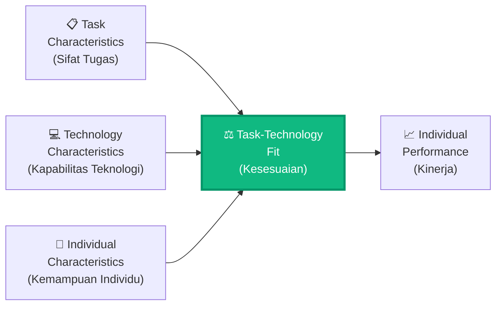
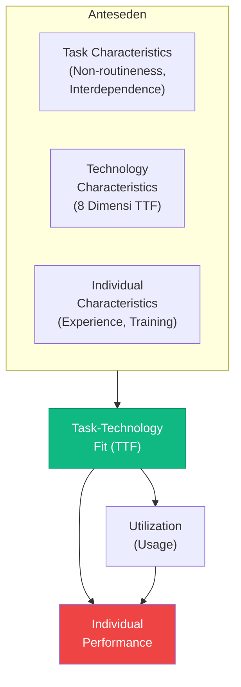
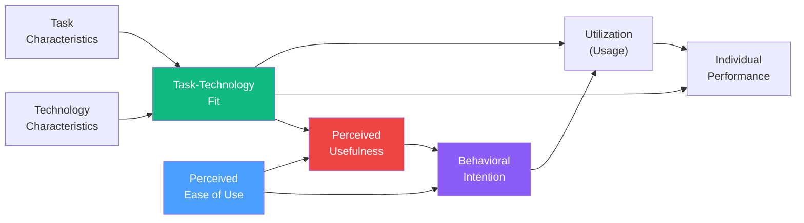
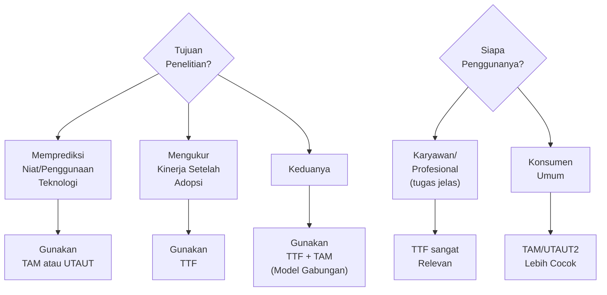

# BAB-08: Task-Technology Fit (TTF)

> *"Teknologi hanya bermanfaat jika ia cocok dengan tugas yang harus dikerjakan penggunanya."*  
> — Goodhue & Thompson (1995)

---

## 🎯 Tujuan Pembelajaran

Setelah membaca bab ini, pembaca diharapkan mampu:
- Menjelaskan konsep kesesuaian tugas-teknologi (Task-Technology Fit) dan motivasi pengembangannya
- Mengidentifikasi dimensi-dimensi TTF yang digunakan untuk mengukur kesesuaian
- Menggambarkan model TTF dan variannya dalam diagram
- Menjelaskan model gabungan TTF dan TAM (TTF-TAM)
- Menerapkan TTF dalam konteks evaluasi dan pemilihan sistem informasi

---

## 📖 Pendahuluan

TAM dan UTAUT menjawab pertanyaan: **"Apakah pengguna mau menggunakan teknologi ini?"**

Tetapi ada pertanyaan lain yang sama pentingnya: **"Apakah teknologi ini benar-benar cocok untuk tugas yang harus dikerjakan?"**

Dua orang dengan tingkat kegunaan yang dirasakan sama (*Perceived Usefulness*) bisa mengalami hasil yang sangat berbeda jika salah satu menggunakan teknologi yang sesuai tugasnya dan yang lain tidak. Inilah celah yang diisi oleh **Task-Technology Fit (TTF)**.

**Dale Goodhue** dan **Ronald Thompson** mengembangkan TTF pada tahun 1995 dengan asumsi: **kinerja individu akan meningkat ketika ada kesesuaian antara tugas yang harus dikerjakan dengan kapabilitas teknologi yang digunakan**.

---

## 8.1 Latar Belakang dan Motivasi

### Keterbatasan Model Berbasis Attitude

Model-model seperti TAM berfokus pada **persepsi pengguna** (attitude, niat), namun kurang mempertimbangkan apakah teknologi itu memang **cocok secara fungsional** dengan kebutuhan tugas.

**Contoh Masalah:**
- Seorang akuntan *mungkin* menilai spreadsheet positif (TAM: PU tinggi)
- Namun jika ia harus mengerjakan analisis statistik kompleks, spreadsheet tidak fit untuk tugas tersebut
- Hasil: kinerja tetap buruk meskipun attitude positif

### Asumsi Dasar TTF

---

## 8.2 Komponen Utama TTF

### 8.2.1 Task Characteristics (Karakteristik Tugas)

Goodhue & Thompson mengidentifikasi dua dimensi tugas yang relevan:

| Dimensi | Definisi | Contoh |
|---|---|---|
| **Task Non-Routineness** | Sejauh mana tugas bersifat tidak rutin, membutuhkan penilaian, tidak terstruktur | Analisis strategis vs. input data rutin |
| **Task Interdependence** | Sejauh mana penyelesaian tugas bergantung pada hasil pekerjaan orang lain | Koordinasi tim vs. pekerjaan individual |

---

### 8.2.2 Technology Characteristics (Karakteristik Teknologi)

Goodhue & Thompson mendefinisikan delapan dimensi TTF yang mengukur kesesuaian teknologi dengan tugas:

| No | Dimensi TTF | Definisi |
|---|---|---|
| 1 | **Quality** | Kualitas data dan informasi yang dihasilkan |
| 2 | **Locatability** | Kemudahan menemukan informasi yang dibutuhkan |
| 3 | **Authorization** | Kemudahan mendapatkan akses ke informasi yang dibutuhkan |
| 4 | **Compatibility** | Kompatibilitas dengan sistem dan format lain |
| 5 | **Ease of Use/Training** | Kemudahan mempelajari dan menggunakan sistem |
| 6 | **Production Timeliness** | Ketepatan waktu informasi tersedia |
| 7 | **Systems Reliability** | Keandalan sistem (bebas error) |
| 8 | **Relationship with Users** | Kualitas hubungan dan dukungan tim IT |

---

### 8.2.3 Task-Technology Fit (TTF) — Konstruk Inti

**Definisi:** Sejauh mana suatu teknologi **membantu individu** dalam menyelesaikan tugas-tugas yang menjadi tanggung jawabnya (kumpulan tugas), yaitu kombinasi dari karakteristik tugas, teknologi, dan individu.

---

### 8.2.4 Individual Performance (Kinerja Individual)

TTF tidak hanya memprediksi **penggunaan teknologi** (seperti TAM), tetapi langsung memprediksi **kinerja individual** — apakah penggunaan teknologi benar-benar meningkatkan hasil kerja.

Ini adalah perbedaan krusial: TTF lebih berorientasi pada **output/dampak**, bukan sekadar niat atau penggunaan.

---

## 8.3 Pengukuran TTF

### Item Kuesioner TTF (Goodhue & Thompson, 1995)

Pengukuran TTF biasanya menggunakan skala yang menanyakan sejauh mana sistem memenuhi kebutuhan tugas:

| Contoh Item | Dimensi |
|---|---|
| "Data yang disediakan sistem ini memiliki tingkat detail yang sesuai dengan kebutuhan tugas saya" | Quality |
| "Saya dapat dengan mudah menemukan informasi yang saya butuhkan dalam sistem ini" | Locatability |
| "Saya tidak mengalami kesulitan mengakses informasi yang diperlukan" | Authorization |
| "Sistem ini kompatibel dengan cara saya bekerja" | Compatibility |
| "Sistem ini cukup mudah digunakan untuk kebutuhan pekerjaan saya" | Ease of Use |

---

## 8.4 Model TTF-TAM (Diaw & Lee, 2003)

Peneliti menyadari bahwa TTF dan TAM saling melengkapi:
- **TAM**: menjelaskan **niat** menggunakan teknologi (dari perspektif persepsi pengguna)
- **TTF**: menjelaskan **kinerja** setelah menggunakan teknologi (dari perspektif kesesuaian fungsional)

**Diaw & Lee (2003)** mengintegrasikan keduanya:

### Logika Integrasi TTF-TAM

| Jalur | Penjelasan |
|---|---|
| TTF → PU | Ketika teknologi fit dengan tugas, pengguna merasakannya sebagai "berguna" |
| TTF → Utilization | Teknologi yang fit lebih sering digunakan |
| BI → Utilization | Niat yang kuat mendorong penggunaan aktual |
| TTF + Utilization → IP | Kesesuaian DAN penggunaan keduanya diperlukan untuk meningkatkan kinerja |

---

## 8.5 TTF untuk Berbagai Konteks

### TTF di Konteks Pendidikan
Dalam e-learning, TTF mengukur sejauh mana platform pembelajaran digital **sesuai dengan karakteristik tugas belajar** (membaca, praktik, diskusi, ujian).

| Jenis Tugas Belajar | Teknologi yang Fit |
|---|---|
| Membaca materi | PDF reader, e-book platform |
| Latihan soal | Quiz platform (Google Form, Quizizz) |
| Diskusi | Forum LMS, WhatsApp Group |
| Presentasi | Zoom, Google Meet |
| Praktik coding | IDE online (Replit, CodePen) |

### TTF di Konteks Kesehatan
Apakah aplikasi telemedicine fit dengan tugas konsultasi medis yang dilakukan dokter dan pasien?

**Tugas dokter:** Diagnosa, resep, monitoring → perlu fitur: riwayat pasien, e-prescribing, reminder
**Fit atau tidak:** Aplikasi yang hanya menyediakan chat teks tidak fit untuk diagnosa visual

### TTF di Konteks Pertanian
Apakah aplikasi cuaca dan IoT sensor **fit** dengan cara kerja petani yang perlu:
- Data real-time dari lahan
- Rekomendasi pupuk
- Notifikasi hama

---

## 8.6 Kelebihan dan Keterbatasan TTF

### ✅ Kelebihan
- Mempertimbangkan **konteks tugas** yang sering diabaikan model lain
- Langsung mengukur **kinerja**, bukan sekadar niat
- Sangat berguna untuk **evaluasi sistem** dan pemilihan teknologi
- Relevan untuk konteks **enterprise/organisasi** di mana tugas terdefinisi jelas
- Dapat dikombinasikan dengan TAM untuk penelitian yang lebih komprehensif

### ❌ Keterbatasan
- Kurang relevan untuk teknologi **konsumen** (penggunaan hedonik/rekreasional)
- Definisi "tugas" tidak selalu jelas dalam konteks penggunaan personal
- **Pengukuran** TTF yang konsisten antar penelitian masih menantang
- Kurang mempertimbangkan **faktor sosial** dalam adopsi

---

## 8.7 TTF vs TAM vs UTAUT: Kapan Digunakan?

---

## 💡 Contoh Penerapan dalam Penelitian

**Judul Penelitian:**  
*"Pengaruh Task-Technology Fit dan Perceived Usefulness terhadap Kinerja Karyawan dalam Penggunaan Sistem ERP"*

**Model Penelitian:**
- Task Characteristics → TTF
- Technology Characteristics → TTF
- TTF → PU → BI → Utilization
- TTF + Utilization → Individual Performance

**Hipotesis Utama:**
1. H1: Task Characteristics berpengaruh terhadap TTF
2. H2: Technology Characteristics berpengaruh terhadap TTF
3. H3: TTF berpengaruh positif terhadap Perceived Usefulness
4. H4: TTF berpengaruh positif terhadap Utilization
5. H5: TTF berpengaruh positif terhadap Individual Performance
6. H6: Utilization berpengaruh positif terhadap Individual Performance

---

## 🔗 Keterkaitan dengan Bab Lain

- ⬅️ Bab sebelumnya: [BAB-07 — UTAUT & UTAUT2](../BAB-07_UTAUT_dan_UTAUT2/README.md)
- ➡️ Bab selanjutnya: [BAB-09 — TRI](../BAB-09_Technology_Readiness_Index/README.md)
- 🔗 TAM (model pasangan TTF): [BAB-06](../BAB-06_Technology_Acceptance_Model/README.md)
- 🔗 Adopsi tingkat organisasi: [BAB-20](../BAB-20_Adopsi_Individu_vs_Organisasi/README.md)
- 🔗 Perbandingan antar teori: [BAB-13](../BAB-13_Perbandingan_Antar_Teori/README.md)

---

## ✅ Soal Latihan

1. **Konseptual:** Jelaskan perbedaan fundamental antara perspektif TTF dan TAM dalam mengevaluasi adopsi teknologi! Berikan contoh konkret di mana kedua model memberikan kesimpulan yang berbeda!

2. **Analitis:** Seorang manajer HR menggunakan sistem HRIS untuk mengelola data karyawan. Identifikasi **tiga dimensi TTF** yang paling kritis dalam konteks ini dan jelaskan mengapa!

3. **Aplikasi:** Anda mengevaluasi sebuah platform e-learning untuk institusi pendidikan. Rancang **instrumen pengukuran TTF** dengan minimal 8 item yang mencerminkan kesesuaian platform dengan tugas belajar mahasiswa!

4. **Kritis:** Apakah model TTF relevan untuk mengevaluasi **media sosial** (Instagram, TikTok) yang digunakan untuk tujuan personal/hedonik? Jelaskan keterbatasannya dan bagaimana Anda akan memodifikasi model untuk konteks ini!

---

## 📚 Referensi Bab Ini

- Diaw, B. S., & Lee, S. (2003). Extending the technology acceptance model with task-technology fit constructs. *Information & Management*, *41*(3), 267–280.
- Goodhue, D. L. (1995). Understanding user evaluations of information systems. *Management Science*, *41*(12), 1827–1844. https://doi.org/10.1287/mnsc.41.12.1827
- Goodhue, D. L., & Thompson, R. L. (1995). Task-technology fit and individual performance. *MIS Quarterly*, *19*(2), 213–236. https://doi.org/10.2307/249689
- Lin, W. S., & Wang, C. H. (2012). Antecedences to continued intentions of adopting e-learning system in blended learning instruction: A contingency framework based on models of information system success and task-technology fit. *Computers & Education*, *58*(1), 88–99.

---

← [BAB-07: UTAUT](../BAB-07_UTAUT_dan_UTAUT2/README.md) | [README Utama](../README.md) | [BAB-09: TRI →](../BAB-09_Technology_Readiness_Index/README.md)
