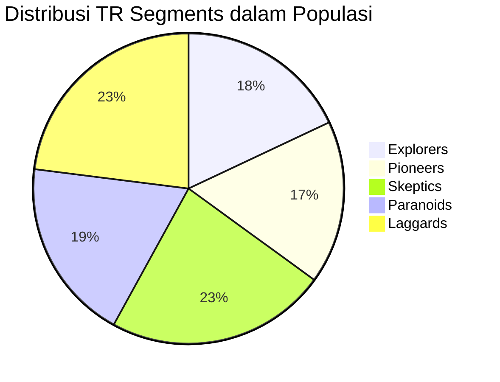
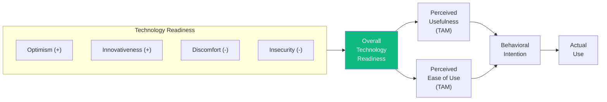

# BAB-09: Technology Readiness Index (TRI)

> *"Kesiapan teknologi adalah kecenderungan mental seseorang untuk mengadopsi dan menggunakan teknologi baru dalam mencapai tujuan di kehidupan rumah dan pekerjaan."*  
> — A. Parasuraman (2000)

---

## 🎯 Tujuan Pembelajaran

Setelah membaca bab ini, pembaca diharapkan mampu:
- Menjelaskan konsep Technology Readiness dan mengapa penting sebagai prediktor adopsi
- Mengidentifikasi empat dimensi TRI (dua pendorong dan dua penghambat)
- Membedakan TRI 1.0 dan TRI 2.0 (Parasuraman & Colby, 2015)
- Menjelaskan segmentasi Technology Readiness Segments (TR Segments)
- Menerapkan TRI dalam penelitian adopsi teknologi konsumen

---

## 📖 Pendahuluan

Model-model seperti TAM dan UTAUT mengukur **apa yang seseorang rasakan** tentang teknologi *tertentu* setelah berinteraksi dengannya. Namun ada pertanyaan yang lebih mendasar:

> **"Sebelum seseorang mencoba teknologi apapun, seberapa siap ia secara mental untuk mengadopsi hal-hal baru yang berbasis teknologi?"**

Pertanyaan inilah yang dijawab oleh **Technology Readiness Index (TRI)** — sebuah skala psikometri yang dikembangkan oleh **A. Parasuraman** (2000), seorang pakar marketing di University of Miami.

TRI tidak mengukur persepsi tentang teknologi *spesifik*, melainkan mengukur **kecenderungan mental seseorang secara umum** — semacam "kepribadian teknologi" yang menentukan seberapa mudah seseorang menerima inovasi berbasis teknologi.

---

## 9.1 Latar Belakang: Mengapa TRI Diperlukan?

### Keterbatasan Model Berbasis Persepsi

| Model | Fokus Pengukuran | Keterbatasan |
|---|---|---|
| TAM | Persepsi tentang sistem spesifik | Tidak mengukur predisposisi umum terhadap teknologi |
| UTAUT | Ekspektasi dari sistem spesifik | Perlu ada pengalaman terlebih dahulu |
| DOI | Karakteristik inovasi | Tidak mengukur kesiapan individu |
| **TRI** | **Predisposisi mental umum** | Dapat diukur sebelum paparan teknologi spesifik |

### Nilai Strategis TRI
- **Segmentasi pasar**: Identifikasi segmen pengguna berdasarkan kesiapan teknologi
- **Personalisasi onboarding**: Sesuaikan strategi introduksi produk dengan profil kesiapan
- **Prediksi adoption rate**: Populasi dengan TRI tinggi → adopsi lebih cepat

---

## 9.2 Empat Dimensi TRI 1.0 (Parasuraman, 2000)

TRI terdiri dari **4 dimensi** — 2 bersifat **positif (pendorong adopsi)** dan 2 bersifat **negatif (penghambat adopsi)**:

```mermaid
quadrantChart
    title Dimensi TRI: Pendorong vs Penghambat
    x-axis "Kognitif" --> "Afektif/Emosional"
    y-axis "Menghambat Adopsi" --> "Mendorong Adopsi"
    quadrant-1 Mendorong (Afektif)
    quadrant-2 Mendorong (Kognitif)
    quadrant-3 Menghambat (Kognitif)
    quadrant-4 Menghambat (Afektif)
    Optimism: [0.3, 0.8]
    Innovativeness: [0.7, 0.75]
    Discomfort: [0.3, 0.25]
    Insecurity: [0.7, 0.2]
```

---

### 9.2.1 Optimism (Optimisme) ✅ Pendorong

**Definisi:** Pandangan positif terhadap teknologi dan keyakinan bahwa teknologi memberikan lebih banyak kontrol, fleksibilitas, dan efisiensi dalam kehidupan.

**Contoh Item Kuesioner (TRI 1.0):**
- "Teknologi baru membuat saya lebih produktif"
- "Teknologi memberi saya lebih banyak kebebasan bergerak"
- "Teknologi baru menjadikan kehidupan lebih mudah"
- "Saya nyaman menggunakan teknologi baru"

**Implikasi Praktis:**
> Pengguna dengan optimisme tinggi cenderung lebih cepat mengadopsi inovasi baru dan lebih positif merespons promosi produk teknologi.

---

### 9.2.2 Innovativeness (Inovatif) ✅ Pendorong

**Definisi:** Kecenderungan untuk menjadi pelopor teknologi dan pemikir pembaharuan (*thought leader*).

**Contoh Item Kuesioner:**
- "Orang-orang datang kepada saya untuk meminta saran tentang teknologi baru"
- "Biasanya saya adalah salah satu orang pertama di lingkungan saya yang mencoba teknologi baru"
- "Saya senang bereksperimen dengan cara baru menggunakan teknologi"

**Hubungan dengan DOI:**
> Dimensi ini berkorespondensi dengan kategori "Innovators" dan "Early Adopters" dalam teori Diffusion of Innovations Rogers.

---

### 9.2.3 Discomfort (Ketidaknyamanan) ❌ Penghambat

**Definisi:** Persepsi hilangnya kontrol dan rasa overwhelmed akibat teknologi.

**Contoh Item Kuesioner:**
- "Saya merasa tidak nyaman ketika menggunakan mesin ATM dan berpikir seseorang di belakang saya melihat"
- "Instruksi teknis yang menyertai produk baru biasanya lebih membingungkan daripada membantu"
- "Jika saya membeli produk berteknologi tinggi, saya lebih suka model basic daripada yang memiliki banyak fitur"
- "Saya tidak merasa percaya diri ketika membeli produk teknologi"

**Implikasi Praktis:**
> Pengguna dengan discomfort tinggi membutuhkan onboarding yang lebih sederhana, bantuan manusia, dan antarmuka yang sangat ramah pengguna.

---

### 9.2.4 Insecurity (Keamanan/Ketidakamanan) ❌ Penghambat

**Definisi:** Ketidakpercayaan terhadap teknologi dan kekhawatiran tentang konsekuensi negatif penggunaannya.

**Contoh Item Kuesioner:**
- "Saya tidak merasa aman melakukan transaksi bisnis online"
- "Saya khawatir bahwa informasi yang saya kirim melalui internet akan dilihat oleh orang lain"
- "Teknologi selalu tampak memiliki masalah yang tidak dapat diatasi oleh mereka yang menggunakannya"

**Implikasi Praktis:**
> Pengguna dengan insecurity tinggi membutuhkan jaminan keamanan yang kuat, sertifikasi keamanan, dan bukti perlindungan data yang nyata.

---

## 9.3 Perbandingan TRI 1.0 vs TRI 2.0

Parasuraman & Colby (2015) memperbarui TRI dengan melakukan refinement pada item-item yang sudah berusia 15 tahun:

| Aspek | TRI 1.0 (2000) | TRI 2.0 (2015) |
|---|---|---|
| **Jumlah Item** | 36 item | 16 item |
| **Dimensi** | 4 (sama) | 4 (sama) |
| **Keseimbangan** | Tidak seimbang | 4 item per dimensi |
| **Relevansi** | Konteks 2000 | Diperbarui untuk era smartphone |
| **Validasi** | AS | Multi-negara |

### Item TRI 2.0 (4 item per dimensi)

**Optimism:**
1. Teknologi membuat saya lebih efisien
2. Teknologi memberi saya lebih banyak kebebasan bergerak
3. Teknologi membuat saya lebih produktif
4. Teknologi memberikan lebih banyak kontrol atas kehidupan sehari-hari

**Innovativeness:**
1. Orang datang kepada saya untuk saran teknologi
2. Saya termasuk yang pertama mencoba teknologi baru
3. Saya suka bereksperimen dengan teknologi baru
4. Saya suka mencari tahu cara kerja peralatan baru

**Discomfort:**
1. Saya tidak yakin apakah saya menggunakan produk teknologi dengan benar
2. Saya butuh bantuan orang lain untuk menggunakan teknologi baru
3. Instruksi produk teknologi seringkali terlalu teknis
4. Mudah bagi saya untuk "keluar jalur" saat menggunakan komputer baru

**Insecurity:**
1. Transaksi internet tidak aman
2. Saya khawatir data pribadi online saya disalahgunakan
3. Teknologi membuat saya lebih rentan terhadap penipuan
4. Kegagalan teknologi sering membuat masalah

---

## 9.4 Technology Readiness Segments

Parasuraman & Colby (2015) mengidentifikasi **5 segmen konsumen** berdasarkan profil TRI mereka:



| Segmen | Ciri Utama | Optimism | Innovativeness | Discomfort | Insecurity |
|---|---|---|---|---|---|
| **Explorers** | Pendukung teknologi antusias | Sangat Tinggi | Sangat Tinggi | Rendah | Rendah |
| **Pioneers** | Kepercayaan diri tapi kritis | Tinggi | Tinggi | Rendah | Tinggi |
| **Skeptics** | Pasif, tidak yakin teknologi layak | Rendah | Rendah | Rendah | Rendah |
| **Paranoids** | Membutuhkan teknologi tapi takut | Tinggi | Rendah | Tinggi | Tinggi |
| **Laggards** | Menolak, tidak termotivasi | Rendah | Rendah | Tinggi | Tinggi |

---

## 9.5 TRI dalam Model Adopsi Teknologi

TRI dapat diintegrasikan dengan model adopsi lain sebagai **anteseden** atau **moderating variable**:



---

## 9.6 TRI di Konteks Indonesia

Penerapan TRI di Indonesia memerlukan pertimbangan khusus:

### Faktor yang Mempengaruhi Profil TRI di Indonesia

| Faktor | Dampak pada TRI |
|---|---|
| **Literasi Digital** | Rendahnya literasi → Discomfort dan Insecurity lebih tinggi |
| **Infrastruktur** | Keterbatasan akses → menurunkan Optimism di luar kota |
| **Budaya Kolektif** | Norma sosial kuat → Innovativeness lebih dipengaruhi orang sekitar |
| **Kepercayaan Digital** | Riwayat penipuan online → meningkatkan Insecurity |
| **Generasi** | Gen Z: TRI lebih tinggi; Generasi X/Baby Boomer: Discomfort lebih tinggi |

### Penelitian TRI di Indonesia
Beberapa penelitian di Indonesia menemukan:
- **Insecurity** menjadi penghambat terbesar adopsi fintech dan e-commerce
- **Optimism** bervariasi secara signifikan antara Jawa dan luar Jawa
- **Innovativeness** berkorelasi kuat dengan tingkat pendidikan

---

## 9.7 Kelebihan dan Keterbatasan TRI

### ✅ Kelebihan
- Dapat diukur **sebelum paparan** pada teknologi spesifik
- Berguna untuk **segmentasi pasar** dan strategi pemasaran
- Mempertimbangkan **dimensi negatif** (bukan hanya faktor positif)
- **TRI 2.0** lebih ringkas dan relevan untuk era modern
- Telah divalidasi di banyak negara dan konteks

### ❌ Keterbatasan
- Mengukur kesiapan **umum**, bukan untuk teknologi spesifik
- Skor TRI tinggi tidak otomatis berarti seseorang akan mengadopsi teknologi tertentu
- **Bias budaya** — dikembangkan di AS, perlu validasi lintas budaya
- Tidak mempertimbangkan **faktor situasional** (kebutuhan mendesak, tekanan atasan)

---

## 💡 Contoh Penerapan

**Judul Penelitian:**  
*"Pengaruh Technology Readiness terhadap Perceived Ease of Use dan Niat Penggunaan Layanan Perbankan Digital pada Generasi Baby Boomer"*

**Model Penelitian:**
- Optimism + Innovativeness → TR Score (+)
- Discomfort + Insecurity → TR Score (-)
- TR Score → PEOU → PU → BI
- Moderating: Pendidikan, Penghasilan

---

## 🔗 Keterkaitan dengan Bab Lain

- ⬅️ Bab sebelumnya: [BAB-08 — TTF](../BAB-08_Task_Technology_Fit/README.md)
- ➡️ Bab selanjutnya: [BAB-10 — TOE Framework](../BAB-10_TOE_Framework/README.md)
- 🔗 Segmentasi adopter DOI: [BAB-05](../BAB-05_Diffusion_of_Innovations/README.md)
- 🔗 Gender & demografi: [BAB-21](../BAB-21_Gender_dan_Demografi/README.md)
- 🔗 Generasi digital: [BAB-22](../BAB-22_Generasi_Digital_Native_vs_Immigrant/README.md)

---

## ✅ Soal Latihan

1. **Konseptual:** Jelaskan perbedaan antara mengukur **Technology Readiness** (TRI) dengan mengukur **Perceived Usefulness** (TAM)! Kapan masing-masing lebih tepat digunakan?

2. **Analitis:** Seorang pensiunan berusia 65 tahun ingin belajar menggunakan aplikasi BPJS Mobile. Berdasarkan model TRI, dimensi mana yang paling mungkin menjadi hambatan terbesar baginya? Bagaimana solusinya?

3. **Aplikasi:** Sebuah bank digital ingin meluncurkan produk baru dan perlu memahami profil kesiapan teknologi nasabahnya. Rancang **strategi akuisisi pengguna yang berbeda** untuk segmen "Explorers", "Paranoids", dan "Laggards"!

4. **Kritis:** TRI dikembangkan di Amerika Serikat pada tahun 2000. Identifikasi **dua dimensi TRI** yang menurut Anda paling perlu dimodifikasi atau diperluas untuk mencerminkan konteks masyarakat Indonesia dengan tepat!

---

## 📚 Referensi Bab Ini

- Parasuraman, A. (2000). Technology Readiness Index (TRI): A multiple-item scale to measure readiness to embrace new technologies. *Journal of Service Research*, *2*(4), 307–320. https://doi.org/10.1177/109467050024001
- Parasuraman, A., & Colby, C. L. (2015). An updated and streamlined technology readiness index: TRI 2.0. *Journal of Service Research*, *18*(1), 59–74. https://doi.org/10.1177/1094670514539730
- Lin, C. H., Shih, H. Y., & Sher, P. J. (2007). Integrating technology readiness into technology acceptance: The TRAM model. *Psychology & Marketing*, *24*(7), 641–657.
- Walczuch, R., Lemmink, J., & Streukens, S. (2007). The effect of service employees' technology readiness on technology acceptance. *Information & Management*, *44*(2), 206–215.

---

← [BAB-08: TTF](../BAB-08_Task_Technology_Fit/README.md) | [README Utama](../README.md) | [BAB-10: TOE →](../BAB-10_TOE_Framework/README.md)
