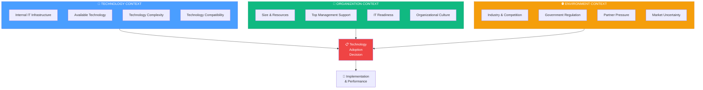
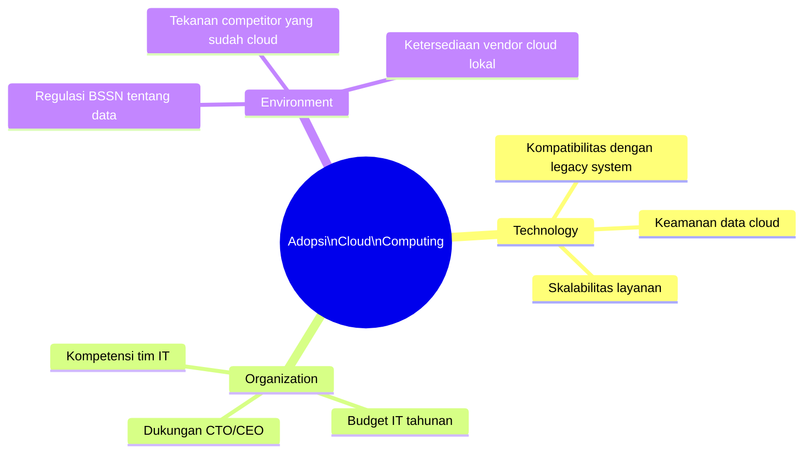
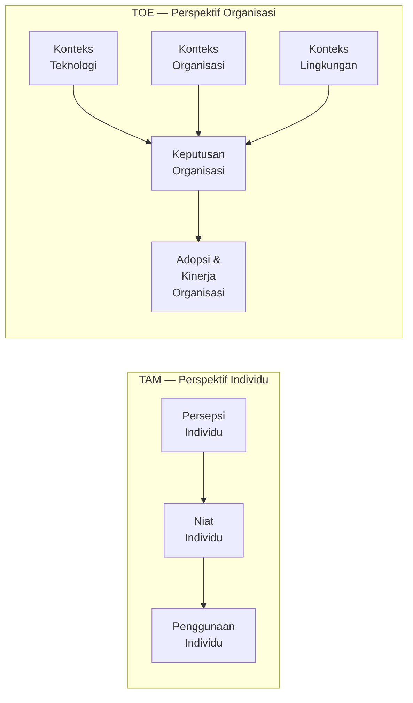
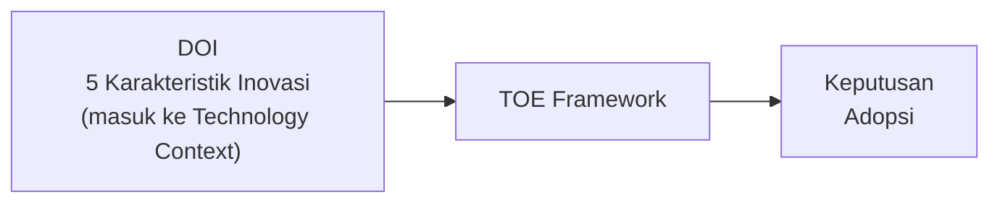
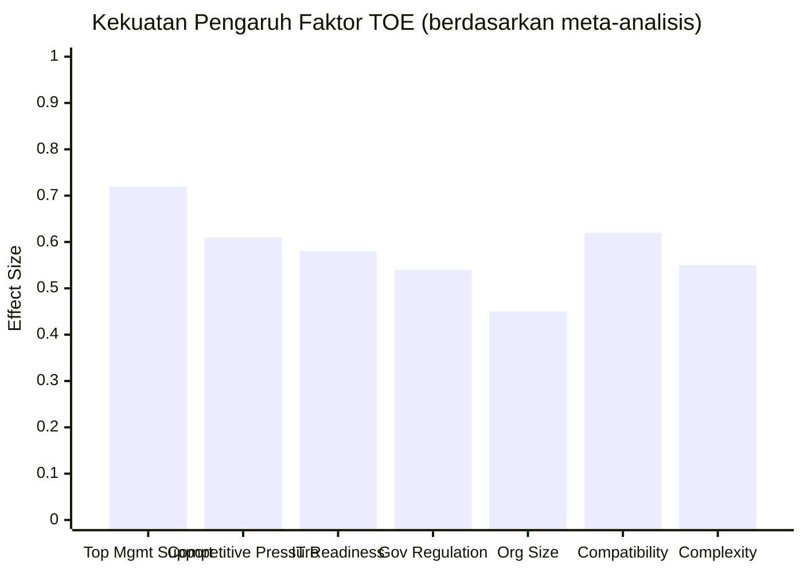

# BAB-10: TOE Framework (Technology-Organization-Environment)

> *"Adopsi teknologi oleh organisasi tidak bisa dipahami hanya dari perspektif individu — ia dibentuk oleh konteks teknologi, organisasi, dan lingkungan eksternal secara simultan."*  
> — Tornatzky & Fleischer (1990)

---

## 🎯 Tujuan Pembelajaran

Setelah membaca bab ini, pembaca diharapkan mampu:
- Menjelaskan TOE Framework dan mengapa ia dikembangkan untuk konteks organisasi
- Mengidentifikasi tiga konteks TOE beserta faktor-faktor di dalamnya
- Membedakan adopsi teknologi di level individu vs. level organisasi
- Menggambarkan model TOE dalam diagram
- Menerapkan TOE untuk menganalisis adopsi teknologi dalam konteks bisnis dan pemerintahan

---

## 📖 Pendahuluan

Seluruh bab sebelumnya membahas adopsi dari perspektif **individu** — bagaimana sikap, persepsi, dan niat seseorang mempengaruhi keputusannya menggunakan teknologi.

Namun dalam dunia nyata, banyak keputusan adopsi teknologi yang **bukan dibuat oleh individu**, melainkan oleh **organisasi** — perusahaan, pemerintahan, rumah sakit, sekolah. Keputusan mengadopsi sistem ERP, cloud computing, atau big data analytics adalah keputusan organisasional, bukan individual.

**Tornatzky & Fleischer (1990)** mengembangkan **TOE Framework** sebagai kerangka untuk memahami bagaimana tiga konteks — teknologi, organisasi, dan lingkungan — secara simultan mempengaruhi keputusan adopsi teknologi di level organisasi.

---

## 10.1 Latar Belakang TOE Framework

### Dari Penelitian Inovasi Industri

TOE Framework berakar dari penelitian Tornatzky & Fleischer tentang **proses inovasi teknologi di industri manufaktur Amerika** pada dekade 1980-an. Mereka mengamati bahwa keputusan adopsi inovasi teknologi di perusahaan tidak bisa dijelaskan hanya dengan faktor internal — faktor eksternal (pasar, regulasi, kompetitor) juga sangat menentukan.

### Publikasi Utama
- Tornatzky, L. G., & Fleischer, M. (1990). *The Processes of Technological Innovation*. Lexington Books.

### Perkembangan TOE
TOE banyak digunakan dalam penelitian adopsi teknologi organisasional, terutama untuk:
- Adopsi **e-commerce** (Zhu et al., 2003, 2006)
- Adopsi **cloud computing**
- Adopsi **big data dan AI**
- Adopsi **e-government**
- Adopsi **ERP (Enterprise Resource Planning)**

---

## 10.2 Tiga Konteks TOE

---

### 10.2.1 Technology Context (Konteks Teknologi)

**Definisi:** Karakteristik teknologi yang tersedia — baik yang sudah dimiliki organisasi maupun yang tersedia di pasar.

#### Faktor-faktor dalam Technology Context:

| Faktor | Definisi | Contoh |
|---|---|---|
| **Internal IT Infrastructure** | Infrastruktur TI yang sudah ada | Server, jaringan, sistem yang berjalan |
| **Available Technology** | Teknologi yang tersedia di luar yang bisa diadopsi | SaaS, cloud platforms |
| **Relative Advantage** | Keunggulan teknologi baru vs. yang digunakan saat ini | Efisiensi, biaya, fitur baru |
| **Compatibility** | Kesesuaian dengan sistem dan proses yang ada | API compatibility, format data |
| **Complexity** | Kerumitan teknologi yang akan diadopsi | Kebutuhan training, kurva pembelajaran |
| **Security & Privacy** | Keamanan dan privasi yang ditawarkan teknologi | Enkripsi, compliance |

---

### 10.2.2 Organization Context (Konteks Organisasi)

**Definisi:** Karakteristik internal organisasi yang mempengaruhi kemampuan dan kemauan untuk mengadopsi teknologi baru.

#### Faktor-faktor dalam Organization Context:

| Faktor | Definisi | Dampak pada Adopsi |
|---|---|---|
| **Organization Size** | Ukuran perusahaan (jumlah karyawan, aset) | Perusahaan besar: lebih banyak sumber daya, tapi lebih birokratis |
| **Top Management Support** | Dukungan pimpinan terhadap adopsi | Faktor paling kritis! Tanpa ini, adopsi sering gagal |
| **IT Readiness** | Kesiapan infrastruktur dan SDM TI | Basis untuk mengintegrasikan teknologi baru |
| **Financial Resources** | Ketersediaan anggaran | Modal untuk investasi teknologi |
| **Human Capital** | Kompetensi dan keahlian karyawan | Kemampuan menggunakan dan merawat teknologi |
| **Organizational Culture** | Budaya inovasi vs. resistensi | Organisasi inovatif lebih cepat mengadopsi |
| **Process Readiness** | Kesiapan proses bisnis untuk berubah | Proses yang sudah digital-friendly lebih mudah bertransformasi |

---

### 10.2.3 Environment Context (Konteks Lingkungan)

**Definisi:** Faktor-faktor eksternal di luar organisasi yang mempengaruhi keputusan adopsi.

#### Faktor-faktor dalam Environment Context:

| Faktor | Definisi | Contoh Konkret |
|---|---|---|
| **Industry Characteristics** | Sifat industri tempat organisasi beroperasi | Fintech: sangat tech-driven; Pertanian tradisional: lebih lambat |
| **Competitive Pressure** | Tekanan dari pesaing | "Kompetitor sudah pakai ERP, kita harus ikut" |
| **Government Regulation** | Regulasi yang mendorong/menghambat adopsi | Kominfo mewajibkan sistem keamanan tertentu |
| **Trading Partner Pressure** | Tekanan dari mitra bisnis/rantai pasok | "Supplier kami minta data via EDI/API" |
| **Market Uncertainty** | Ketidakpastian pasar | Ketidakpastian demand → menunda investasi teknologi |
| **External Support** | Ketersediaan vendor, konsultan, ekosistem | Banyaknya cloud provider lokal yang tersedia |

---

## 10.3 TOE untuk Berbagai Teknologi

### Adopsi Cloud Computing

### Adopsi E-Government

| Konteks | Faktor Kritis | Hambatan Umum |
|---|---|---|
| **Technology** | Integrasi sistem pusat-daerah | Legacy system yang tidak kompatibel |
| **Organization** | Komitmen kepala dinas/walikota | Birokrasi yang lambat berubah |
| **Environment** | Regulasi Kominfo, tekanan masyarakat | Perbedaan kapasitas antar daerah |

---

## 10.4 TOE vs. TAM: Perbedaan Perspektif

| Aspek | TAM | TOE |
|---|---|---|
| **Unit Analisis** | Individu | Organisasi |
| **Pengambil Keputusan** | Pengguna akhir | Manajemen puncak |
| **Fokus** | Penerimaan sistem | Adopsi & implementasi |
| **Konstruk Utama** | PU, PEOU | 3 konteks, banyak faktor |
| **Konteks** | Penggunaan sistem TI | Keputusan investasi teknologi |
| **Metode Penelitian** | Survei, eksperimen | Survei organisasi, studi kasus |

---

## 10.5 Kombinasi TOE dengan Teori Lain

Peneliti sering mengombinasikan TOE dengan teori lain untuk memperkaya penjelasan:

### TOE + DOI (Rogers)

Karakteristik DOI (Relative Advantage, Compatibility, Complexity, Trialability, Observability) sering diposisikan sebagai faktor dalam Technology Context.

### TOE + Institutional Theory

Institutional Theory menambahkan tekanan koersif, normatif, dan mimetik sebagai bagian dari Environment Context — menjelaskan mengapa organisasi mengadopsi teknologi bukan karena keunggulan teknis, melainkan karena **tekanan isomorfis** dari lingkungan.

---

## 10.6 Faktor Kritis Keberhasilan Adopsi (TOE Lens)

Penelitian menunjukkan faktor paling berpengaruh dalam adopsi teknologi organisasional:

**Top Management Support** secara konsisten menjadi prediktor terkuat adopsi teknologi di level organisasi.

---

## 10.7 Kelebihan dan Keterbatasan TOE

### ✅ Kelebihan
- **Holistik**: Mempertimbangkan faktor internal DAN eksternal sekaligus
- **Relevan untuk kebijakan**: Memberikan insight bagi pembuat kebijakan tentang intervensi yang tepat
- **Fleksibel**: Faktor dalam setiap konteks dapat disesuaikan dengan teknologi dan industri spesifik
- **Telah divalidasi** dalam ratusan penelitian adopsi teknologi organisasional

### ❌ Keterbatasan
- **Tidak spesifik**: Faktor dalam tiap konteks tidak standard — berbeda antar peneliti
- **Kurang memperhatikan individu**: Pengguna akhir tidak dipertimbangkan secara eksplisit
- **Sulit diukur**: Beberapa faktor (budaya, political will) sulit dikuantifikasi
- **Statik**: Tidak mempertimbangkan perubahan dari waktu ke waktu

---

## 💡 Contoh Penerapan

**Judul Penelitian:**  
*"Faktor-faktor yang Mempengaruhi Adopsi Sistem Informasi Manajemen Daerah (SIMDA) menggunakan TOE Framework pada Pemerintah Kabupaten di Indonesia"*

**Variabel Penelitian:**

| Konteks | Variabel | Operasionalisasi |
|---|---|---|
| **Technology** | Compatibility | Kesesuaian SIMDA dengan sistem yang ada |
| **Technology** | Complexity | Tingkat kerumitan SIMDA |
| **Organization** | Top Management Support | Dukungan kepala daerah dan Sekda |
| **Organization** | IT Readiness | Kesiapan infrastruktur dan SDM TI |
| **Environment** | Government Regulation | Dorongan peraturan Kemendagri |
| **Environment** | Competitive Pressure | Tekanan benchmark dari daerah lain |

**Variabel Dependen:** Adopsi SIMDA (Ya/Tidak atau tingkat implementasi)

---

## 🔗 Keterkaitan dengan Bab Lain

- ⬅️ Bab sebelumnya: [BAB-09 — TRI](../BAB-09_Technology_Readiness_Index/README.md)
- ➡️ Bab selanjutnya: [BAB-11 — IS Success Model](../BAB-11_IS_Success_Model/README.md)
- 🔗 Adopsi organisasi vs. individu: [BAB-20](../BAB-20_Adopsi_Individu_vs_Organisasi/README.md)
- 🔗 Adopsi e-government: [BAB-25](../BAB-25_Adopsi_per_Sektor/README.md)
- 🔗 Change management: [BAB-27](../BAB-27_Change_Management_dan_Adopsi/README.md)

---

## ✅ Soal Latihan

1. **Konseptual:** Jelaskan mengapa TOE Framework dikembangkan secara terpisah dari TAM! Apa yang fundamental berbeda antara adopsi teknologi di level organisasi dengan level individu?

2. **Analitis:** Sebuah rumah sakit daerah ingin mengadopsi sistem rekam medis elektronik (RME). Identifikasi **dua faktor dari masing-masing konteks TOE** yang paling relevan dan jelaskan pengaruhnya!

3. **Aplikasi:** Rancang model penelitian TOE untuk meneliti adopsi **e-commerce** oleh UMKM di Indonesia. Tentukan variabel spesifik untuk setiap konteks dan rancang minimal 2 hipotesis!

4. **Kritis:** TOE tidak secara eksplisit mempertimbangkan **pengguna akhir** (karyawan yang harus menggunakan teknologi setelah diadopsi). Bagaimana Anda akan mengintegrasikan perspektif pengguna akhir ke dalam model TOE? Berikan contoh konkret!

---

## 📚 Referensi Bab Ini

- Tornatzky, L. G., & Fleischer, M. (1990). *The processes of technological innovation*. Lexington Books.
- Baker, J. (2012). The technology–organization–environment framework. Dalam Y. K. Dwivedi et al. (Eds.), *Information Systems Theory* (hal. 231–245). Springer.
- Zhu, K., Kraemer, K. L., & Xu, S. (2003). Electronic business adoption by European firms: A cross-country assessment of the facilitators and inhibitors. *European Journal of Information Systems*, *12*(4), 251–268.
- Oliveira, T., & Martins, M. F. (2011). Literature review of information technology adoption models at firm level. *The Electronic Journal of Information Systems Evaluation*, *14*(1), 110–121.
- Gangwar, H., Date, H., & Raoot, A. D. (2014). Review on IT adoption: Insights from recent technologies. *Journal of Enterprise Information Management*, *27*(4), 488–502.

---

← [BAB-09: TRI](../BAB-09_Technology_Readiness_Index/README.md) | [README Utama](../README.md) | [BAB-11: IS Success Model →](../BAB-11_IS_Success_Model/README.md)
