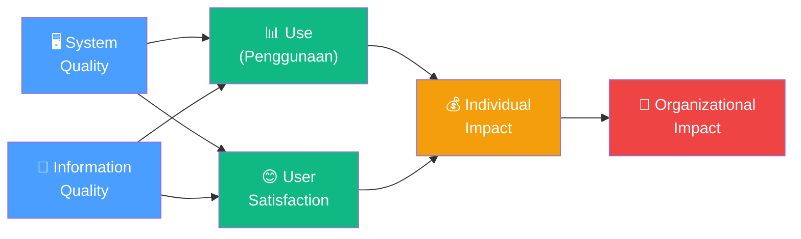
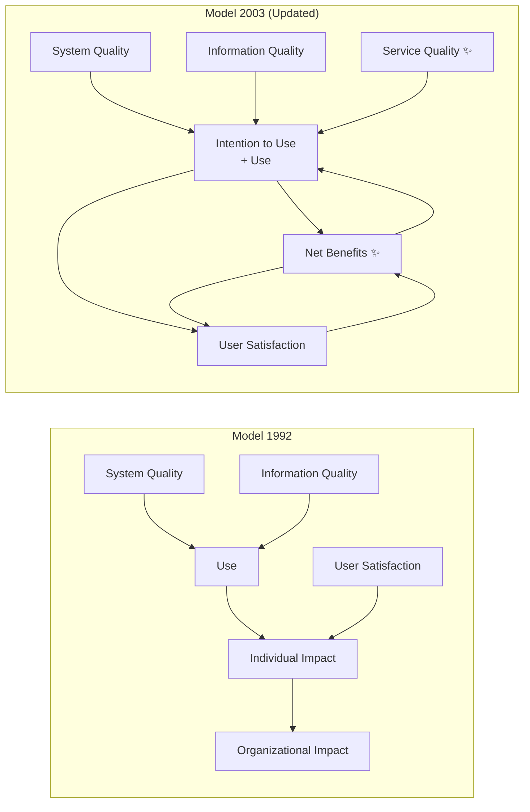
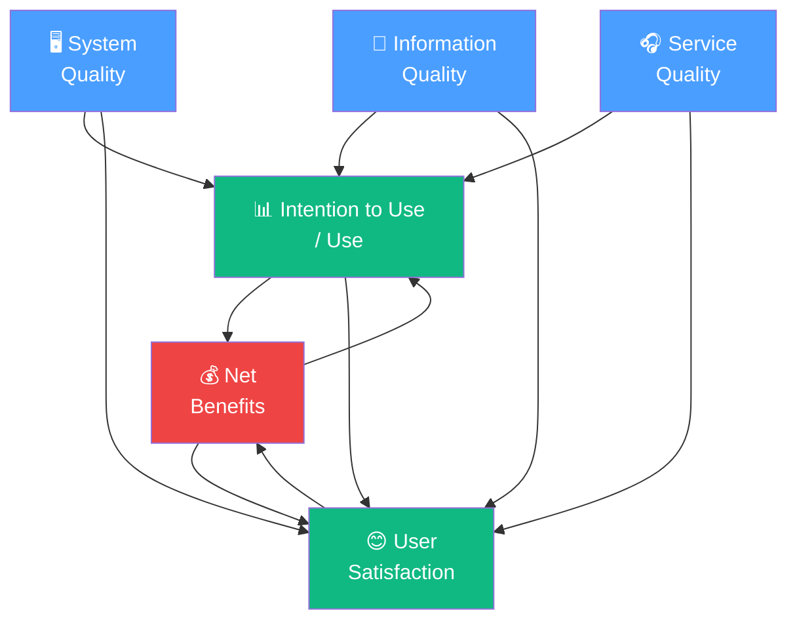

# BAB-11: IS Success Model (DeLone & McLean)

> *"Keberhasilan sistem informasi bukan hanya soal apakah sistem itu digunakan — tetapi apakah penggunaannya menghasilkan manfaat nyata."*  
> — DeLone & McLean (1992, 2003)

---

## 🎯 Tujuan Pembelajaran

Setelah membaca bab ini, pembaca diharapkan mampu:
- Menjelaskan tujuan dan latar belakang pengembangan IS Success Model
- Mengidentifikasi dimensi-dimensi dalam D&M IS Success Model versi 1992
- Menjelaskan perubahan dan penyempurnaan dalam D&M IS Success Model 2003
- Menggambarkan model D&M dalam diagram alur kausal
- Menerapkan IS Success Model untuk mengevaluasi keberhasilan sistem informasi

---

## 📖 Pendahuluan

Setelah adopsi teknologi berhasil — sistem telah diimplementasikan dan pengguna telah menerimanya — pertanyaan berikutnya muncul:

> **"Apakah sistem informasi ini benar-benar berhasil? Bagaimana kita mengukur keberhasilannya?"**

Inilah pertanyaan yang dijawab oleh **IS Success Model** dari **William DeLone** dan **Ephraim McLean** (1992). Model ini menjadi kerangka evaluasi sistem informasi yang paling komprehensif dan paling banyak dikutip dalam literatur sistem informasi.

Penting untuk dicatat: IS Success Model **bukan model adopsi**, melainkan **model evaluasi keberhasilan** setelah sistem digunakan. Namun ia sangat relevan dalam penelitian adopsi karena:
1. Mengukur *use* (penggunaan) sebagai konstruk sentral
2. Menghubungkan kualitas sistem dengan kepuasan dan manfaat
3. Digunakan untuk mengevaluasi **apakah adopsi menghasilkan nilai nyata**

---

## 11.1 Latar Belakang: Masalah Pengukuran Keberhasilan IS

### Fragmentasi Ukuran Keberhasilan

Sebelum D&M (1992), peneliti menggunakan ukuran keberhasilan IS yang sangat beragam:
- Ada yang mengukur **kepuasan pengguna**
- Ada yang mengukur **kualitas informasi**
- Ada yang mengukur **penggunaan sistem**
- Ada yang mengukur **dampak ekonomi**
- Tidak ada konsensus → penelitian tidak bisa dibandingkan

DeLone & McLean melakukan **review terhadap 180 artikel** IS success dan mengidentifikasi pola pengukuran, lalu mengintegrasikannya menjadi satu model taksonomi.

---

## 11.2 D&M IS Success Model 1992

### Enam Dimensi Keberhasilan

---

### 11.2.1 System Quality (Kualitas Sistem)

**Definisi:** Karakteristik pemrosesan sistem informasi itu sendiri — kualitas teknis sistem.

**Dimensi Pengukuran:**
| Sub-dimensi | Contoh Pertanyaan Evaluasi |
|---|---|
| **Reliability** | Apakah sistem jarang mengalami downtime atau error? |
| **Response Time** | Apakah sistem merespons dengan cepat? |
| **Ease of Use** | Apakah sistem mudah digunakan? |
| **Flexibility** | Apakah sistem mudah dimodifikasi sesuai kebutuhan? |
| **Accessibility** | Apakah sistem mudah diakses kapan dan di mana saja? |

---

### 11.2.2 Information Quality (Kualitas Informasi)

**Definisi:** Kualitas output yang dihasilkan sistem informasi — kualitas konten/informasinya.

**Dimensi Pengukuran:**
| Sub-dimensi | Contoh Pertanyaan Evaluasi |
|---|---|
| **Accuracy** | Apakah informasi yang dihasilkan akurat dan bebas error? |
| **Completeness** | Apakah informasi lengkap dan tidak ada yang hilang? |
| **Relevance** | Apakah informasi relevan dengan kebutuhan pengguna? |
| **Timeliness** | Apakah informasi tersedia tepat waktu? |
| **Understandability** | Apakah informasi mudah dipahami? |

---

### 11.2.3 Use (Penggunaan)

**Definisi:** Bagaimana dan seberapa sering pengguna memanfaatkan sistem.

**Dimensi Pengukuran:**
- Frekuensi penggunaan
- Intensitas penggunaan
- Kedalaman penggunaan (menggunakan semua fitur vs. sebagian)
- Niat untuk terus menggunakan

> 💡 "Use" dalam D&M adalah **perilaku aktual**, berbeda dengan "Behavioral Intention" dalam TAM.

---

### 11.2.4 User Satisfaction (Kepuasan Pengguna)

**Definisi:** Respon atau evaluasi afektif pengguna terhadap pengalaman menggunakan sistem secara keseluruhan.

**Hubungan dengan Use:**
- Use yang berhasil → meningkatkan User Satisfaction (kepuasan)
- User Satisfaction yang tinggi → meningkatkan Use selanjutnya
- Ini adalah hubungan **resiprokal** (saling mempengaruhi)

---

### 11.2.5 Individual Impact (Dampak Individual)

**Definisi:** Pengaruh penggunaan sistem terhadap perilaku, kinerja, dan pengambilan keputusan individu.

**Contoh Dampak:**
- Pengambilan keputusan menjadi lebih baik
- Produktivitas individual meningkat
- Kompetensi individu berkembang
- Kualitas pekerjaan meningkat

---

### 11.2.6 Organizational Impact (Dampak Organisasional)

**Definisi:** Pengaruh penggunaan sistem terhadap kinerja keseluruhan organisasi.

**Contoh Dampak:**
- Peningkatan profitabilitas/efisiensi biaya
- Peningkatan kualitas layanan kepada pelanggan
- Keunggulan kompetitif
- Transformasi proses bisnis

---

## 11.3 D&M IS Success Model 2003 (Updated)

Setelah 10 tahun, DeLone & McLean (2003) memperbarui model mereka berdasarkan feedback dari ratusan peneliti:

### Perubahan Utama dari 1992 ke 2003

| Perubahan | Penjelasan |
|---|---|
| **+ Service Quality** | Dimensi baru: kualitas dukungan/layanan dari tim IS (bukan hanya sistem dan informasinya) |
| **Intention to Use** | Ditambahkan di samping "Use" untuk mengakui bahwa penggunaan bisa bersifat wajib |
| **Net Benefits** | Menggabungkan Individual Impact + Organizational Impact menjadi satu konstruk yang lebih luas |
| **Feedback loops** | Menambahkan anak panah balik: Net Benefits → Intention/Use dan Net Benefits → Satisfaction |

---

### 11.3.1 Service Quality (Kualitas Layanan) — Dimensi Baru

**Definisi:** Kualitas dukungan yang diberikan oleh tim IS kepada pengguna akhir.

Terinspirasi dari **SERVQUAL** (Parasuraman, Zeithaml & Berry), dimensi Service Quality mencakup:

| Dimensi | Definisi |
|---|---|
| **Reliability** | Ketepatan dan konsistensi layanan bantuan |
| **Responsiveness** | Kecepatan merespons permintaan bantuan |
| **Assurance** | Kompetensi dan kepercayaan yang diberikan tim IS |
| **Empathy** | Perhatian personal kepada kebutuhan pengguna |
| **Tangibles** | Fasilitas fisik dan peralatan pendukung |

---

### 11.3.2 Net Benefits (Manfaat Bersih) — Konstruk Baru

**Definisi:** Sejauh mana sistem IS memberikan kontribusi positif kepada semua stakeholder — individu, organisasi, industri, masyarakat.

Net Benefits menggantikan Individual Impact dan Organizational Impact dengan pendekatan yang lebih inklusif dan kontekstual.

**Stakeholder Net Benefits:**
| Level | Contoh Net Benefits |
|---|---|
| **Individual** | Produktivitas meningkat, keputusan lebih baik |
| **Organizational** | Efisiensi biaya, ROI positif |
| **Industry** | Standar industri meningkat |
| **Society** | Aksesibilitas layanan publik meningkat |

---

## 11.4 Model D&M 2003 Lengkap dengan Feedback

---

## 11.5 Pengukuran IS Success Model

### Item Kuesioner (Contoh)

| Konstruk | Contoh Item |
|---|---|
| **System Quality** | "Sistem ini dapat diandalkan dan jarang mengalami gangguan" |
| **Information Quality** | "Informasi yang dihasilkan sistem ini akurat dan up-to-date" |
| **Service Quality** | "Tim IT responsif dalam menanggapi masalah yang saya laporkan" |
| **Use** | "Saya menggunakan sistem ini secara rutin dalam pekerjaan sehari-hari" |
| **User Satisfaction** | "Secara keseluruhan, saya puas dengan sistem ini" |
| **Net Benefits** | "Penggunaan sistem ini meningkatkan efisiensi kerja saya secara signifikan" |

---

## 11.6 IS Success Model vs. TAM: Perspektif yang Berbeda

| Aspek | IS Success Model | TAM |
|---|---|---|
| **Tujuan** | Mengukur KEBERHASILAN sistem | Memprediksi PENERIMAAN sistem |
| **Waktu** | Pasca implementasi | Pra atau awal implementasi |
| **Fokus** | Output dan dampak | Niat dan penggunaan |
| **Unit Analisis** | Sistem IS secara keseluruhan | Individu pengguna |
| **Variabel Dependen** | Net Benefits | Actual Use |

---

## 11.7 Kelebihan dan Keterbatasan

### ✅ Kelebihan
- **Komprehensif**: Mempertimbangkan kualitas dari tiga sudut (sistem, informasi, layanan)
- **Feedback loops**: Menangkap dinamika antara use, satisfaction, dan benefits
- **Telah divalidasi** dalam ratusan penelitian berbagai jenis sistem IS
- **Praktis**: Langsung dapat digunakan untuk audit dan evaluasi sistem

### ❌ Keterbatasan
- Model **tidak menjelaskan mengapa** pengguna mengadopsi — hanya **apa yang terjadi setelah** adopsi
- "Use" tidak selalu mencerminkan keberhasilan — penggunaan yang "terpaksa" tidak sama dengan penggunaan yang menghasilkan manfaat
- Kurang mempertimbangkan **konteks organisasional** yang mempengaruhi net benefits
- **Net Benefits** masih sulit dioperasionalisasikan secara konsisten

---

## 💡 Contoh Penerapan

**Judul Penelitian:**  
*"Evaluasi Keberhasilan Sistem Informasi Akademik (SIAKAD) Menggunakan D&M IS Success Model 2003"*

**Model Penelitian:**
- System Quality → Use + User Satisfaction
- Information Quality → Use + User Satisfaction
- Service Quality → Use + User Satisfaction
- Use ↔ User Satisfaction
- Use + User Satisfaction → Net Benefits

---

## 🔗 Keterkaitan dengan Bab Lain

- ⬅️ Bab sebelumnya: [BAB-10 — TOE Framework](../BAB-10_TOE_Framework/README.md)
- ➡️ Bab selanjutnya: [BAB-12 — Teori Pendukung Lainnya](../BAB-12_Teori_Pendukung_Lainnya/README.md)
- 🔗 Pasca-adopsi dan kontinuansi: [BAB-26](../BAB-26_Pasca_Adopsi_dan_Kontinuansi/README.md)
- 🔗 Perbandingan antar teori: [BAB-13](../BAB-13_Perbandingan_Antar_Teori/README.md)

---

## ✅ Soal Latihan

1. **Konseptual:** Mengapa DeLone & McLean menambahkan **Service Quality** pada model 2003 yang tidak ada di model 1992? Konteks perubahan apa yang memicu penambahan ini?

2. **Analitis:** Sebuah perusahaan melaporkan bahwa sistem ERP-nya "digunakan" oleh 95% karyawan, namun produktivitas tidak meningkat. Menggunakan IS Success Model, analisis apa yang mungkin terjadi! Dimensi mana yang mungkin bermasalah?

3. **Aplikasi:** Rancang instrumen evaluasi menggunakan D&M IS Success Model 2003 untuk mengevaluasi keberhasilan **aplikasi layanan publik online** (contoh: sistem perizinan online). Buat minimal 2 item untuk setiap dimensi!

4. **Kritis:** IS Success Model mengasumsikan bahwa "Use" yang lebih tinggi = lebih baik. Namun apakah ini selalu benar? Berikan contoh situasi di mana **penggunaan tinggi tetapi net benefits negatif** bisa terjadi!

---

## 📚 Referensi Bab Ini

- DeLone, W. H., & McLean, E. R. (1992). Information systems success: The quest for the dependent variable. *Information Systems Research*, *3*(1), 60–95. https://doi.org/10.1287/isre.3.1.60
- DeLone, W. H., & McLean, E. R. (2003). The DeLone and McLean model of information systems success: A ten-year update. *Journal of Management Information Systems*, *19*(4), 9–30. https://doi.org/10.1080/07421222.2003.11045748
- Petter, S., DeLone, W., & McLean, E. (2008). Measuring information systems success: Models, dimensions, measures, and interrelationships. *European Journal of Information Systems*, *17*(3), 236–263. https://doi.org/10.1057/ejis.2008.15
- Urbach, N., & Müller, B. (2012). The updated DeLone and McLean model of information systems success. Dalam Y. K. Dwivedi et al. (Eds.), *Information Systems Theory* (hal. 1–18). Springer.

---

← [BAB-10: TOE](../BAB-10_TOE_Framework/README.md) | [README Utama](../README.md) | [BAB-12: Teori Pendukung →](../BAB-12_Teori_Pendukung_Lainnya/README.md)
