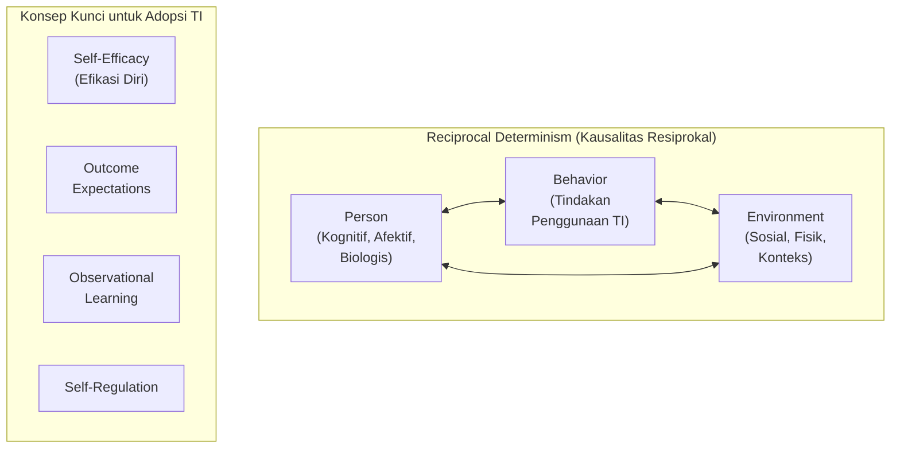
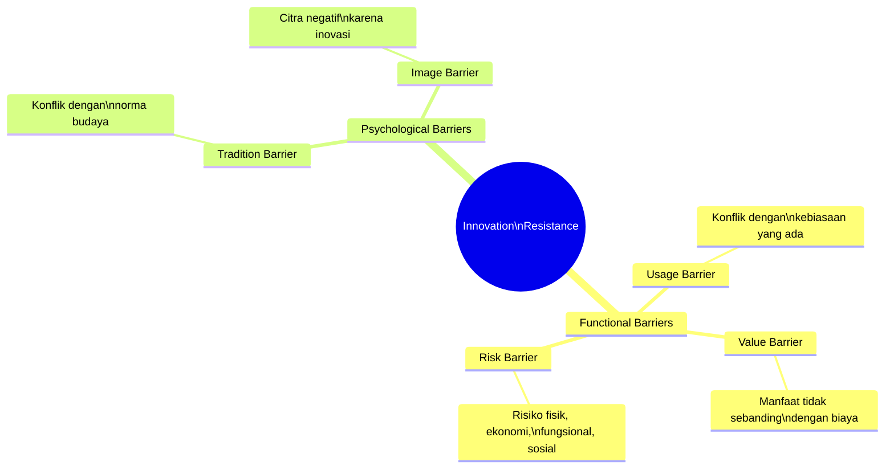
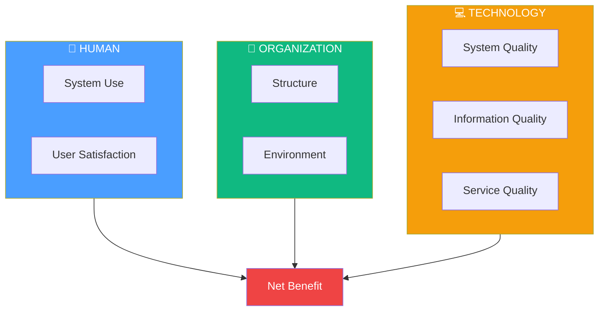
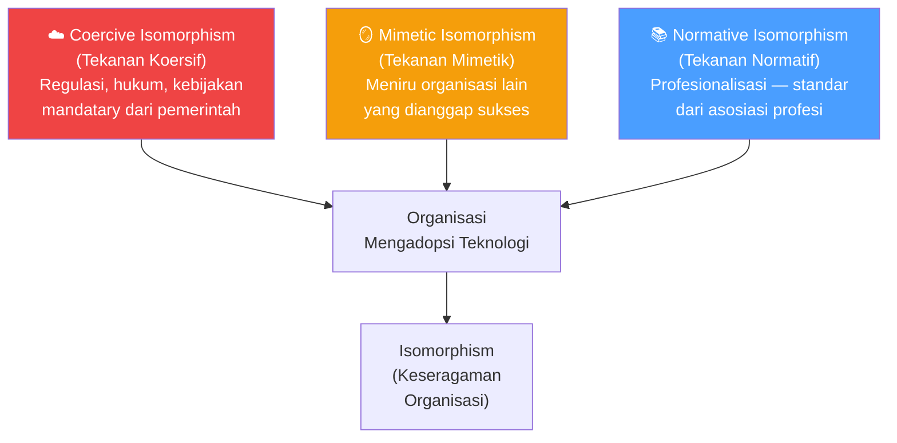
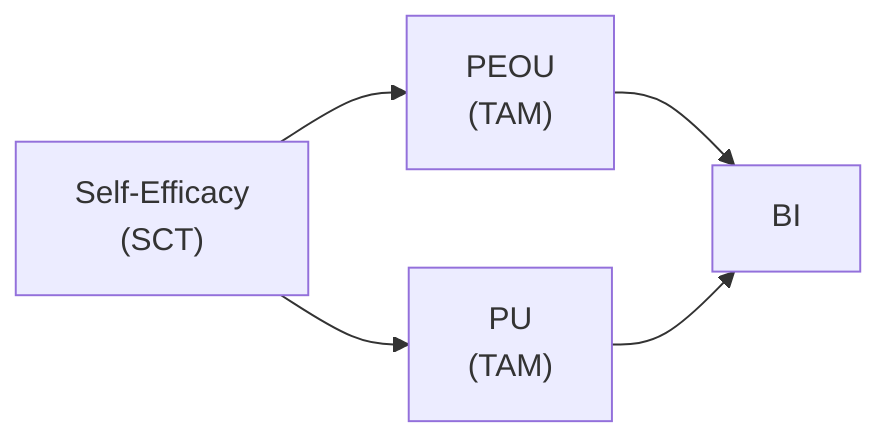
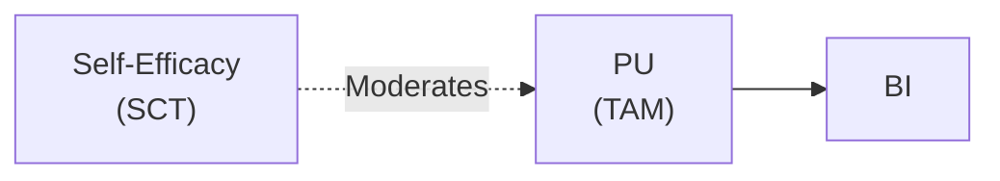
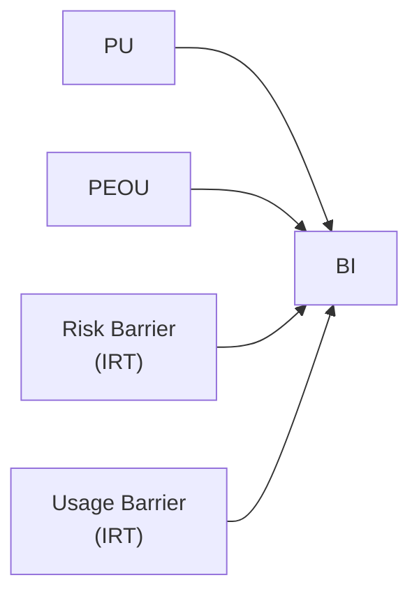

# BAB-12: Teori Pendukung Lainnya

> *"Tidak ada satu teori yang cukup untuk menjelaskan kompleksitas perilaku manusia dalam mengadopsi teknologi. Memahami berbagai perspektif adalah kunci penelitian yang kaya."*

---

## 🎯 Tujuan Pembelajaran

Setelah membaca bab ini, pembaca diharapkan mampu:
- Mengenal dan menjelaskan teori-teori pendukung yang sering diintegrasikan dengan model adopsi utama
- Memahami kontribusi unik setiap teori dalam menjelaskan fenomena adopsi
- Menentukan situasi di mana teori pendukung lebih relevan dari teori utama
- Mengintegrasikan teori pendukung ke dalam kerangka penelitian adopsi

---

## 📖 Pendahuluan

Bab-bab sebelumnya membahas teori-teori "besar" dalam adopsi teknologi: TRA, TPB, TAM, UTAUT, DOI, TTF, TRI, TOE, dan IS Success Model. Namun ekosistem teori adopsi jauh lebih kaya dari itu.

Banyak peneliti mengintegrasikan **teori pendukung** dari disiplin ilmu lain — psikologi, sosiologi, ilmu kesehatan, dan manajemen — untuk memperkaya model penelitian mereka. Bab ini memperkenalkan empat teori pendukung yang paling sering digunakan dalam penelitian adopsi teknologi.

---

## 12.1 Social Cognitive Theory (SCT) — Bandura

### Latar Belakang

**Albert Bandura** mengembangkan Social Cognitive Theory pada tahun 1977 (diperbarui 1986), yang menekankan bahwa **perilaku manusia dipengaruhi oleh interaksi antara individu, perilaku, dan lingkungan** — bukan hanya oleh stimulus dan respons seperti dalam behaviorisme klasik.

### Konsep Inti SCT dalam Konteks Adopsi Teknologi

---

### 12.1.1 Self-Efficacy (Efikasi Diri)

**Definisi:** Keyakinan seseorang tentang kemampuannya untuk berhasil melakukan suatu perilaku atau tugas tertentu.

Dalam konteks teknologi, **Computer Self-Efficacy** adalah kepercayaan bahwa seseorang mampu menggunakan komputer/sistem untuk menyelesaikan tugas tertentu.

**Sumber Self-Efficacy (Bandura, 1986):**
1. **Mastery Experience** → Pengalaman sukses menggunakan teknologi sebelumnya
2. **Vicarious Experience** → Melihat orang serupa berhasil menggunakan teknologi
3. **Social Persuasion** → Dorongan dari orang lain ("Kamu pasti bisa!")
4. **Physiological State** → Kondisi fisik dan emosional saat menghadapi teknologi

**Hubungan dengan Model Lain:**
- Self-Efficacy ≈ Perceived Behavioral Control (TPB)
- Computer Self-Efficacy → menjadi anteseden PEOU dalam TAM3
- Self-Efficacy menjadi komponen Facilitating Conditions (UTAUT)

---

### 12.1.2 Outcome Expectations (Ekspektasi Hasil)

**Definisi:** Keyakinan tentang konsekuensi yang akan dihasilkan dari melakukan suatu perilaku.

| Jenis Outcome | Definisi | Contoh |
|---|---|---|
| **Physical Outcomes** | Konsekuensi fisik dari penggunaan | "Menggunakan aplikasi ini menghemat waktu saya" |
| **Social Outcomes** | Konsekuensi sosial/reputasi | "Teman-teman akan kagum jika saya pakai teknologi ini" |
| **Self-Evaluative Outcomes** | Kepuasan diri | "Saya merasa bangga bisa menguasai sistem ini" |

**Hubungan dengan TAM:**
Outcome Expectations ≈ Perceived Usefulness

---

### 12.1.3 Observational Learning (Pembelajaran Observasional)

**Definisi:** Pembelajaran melalui mengamati perilaku orang lain dan konsekuensinya.

Dalam konteks adopsi teknologi:
- Melihat kolega sukses menggunakan sistem baru → meningkatkan self-efficacy
- Melihat influencer menggunakan gadget → mendorong niat membeli
- Demo produk langsung → lebih efektif daripada brosur

**Implikasi Praktis:**
> Program adopsi teknologi yang menyertakan **role model** (pengguna sukses yang ditampilkan) terbukti lebih efektif daripada yang hanya memberikan pelatihan teknis.

---

### 12.1.4 SCT dalam Penelitian Adopsi

SCT diintegrasikan dalam UTAUT (Venkatesh et al., 2003) terutama untuk menjelaskan:
- Anteseden **Performance Expectancy** (dari Outcome Expectations)
- Moderating effects dari **pengalaman** (Experience)

**Contoh penelitian SCT untuk adopsi TI:**
- "Pengaruh Computer Self-Efficacy terhadap Penerimaan Sistem Manajemen Pembelajaran (LMS)"

---

## 12.2 Innovation Resistance Theory (IRT) — Ram & Sheth

### Latar Belakang

Kebanyakan teori adopsi fokus pada **mengapa orang MENERIMA** teknologi. Namun realita menunjukkan banyak teknologi yang baik pun **ditolak**. **Sheth (1981)** dan kemudian **Ram & Sheth (1989)** mengembangkan Innovation Resistance Theory untuk menjelaskan mengapa konsumen **menolak** inovasi.

### Lima Jenis Barrier dalam IRT

---

### 12.2.1 Usage Barrier (Hambatan Penggunaan)
**Definisi:** Ketidakcocokan inovasi dengan alur kerja, rutinitas, atau kebiasaan yang sudah ada.

**Contoh:** Petani yang terbiasa mencatat manual merasa sistem digital "mempersulit" pekerjaan — padahal secara objektif lebih efisien. Kebiasaan yang sudah otomatis lebih "nyaman" secara kognitif.

---

### 12.2.2 Value Barrier (Hambatan Nilai)
**Definisi:** Inovasi tidak memberikan nilai (manfaat) yang cukup untuk mengimbangi biaya yang dikeluarkan (uang, waktu, usaha).

**Contoh:** Biaya smartphone yang mahal tidak sebanding dengan manfaat yang dirasakan oleh warga desa yang sudah bisa berkomunikasi dengan telepon jaringan tetap.

---

### 12.2.3 Risk Barrier (Hambatan Risiko)
**Definisi:** Kekhawatiran tentang konsekuensi negatif dari mengadopsi inovasi.

| Jenis Risiko | Contoh |
|---|---|
| **Functional Risk** | "Bagaimana jika sistemnya error saat transaksi penting?" |
| **Economic Risk** | "Bagaimana jika saya rugi karena pakai fintech?" |
| **Social Risk** | "Bagaimana jika orang lain menilai saya aneh?" |
| **Psychological Risk** | "Bagaimana jika saya tidak bisa menguasainya?" |
| **Physical Risk** | "Apakah radiasi HP berbahaya?" |
| **Privacy Risk** | "Apakah data pribadi saya aman?" |

---

### 12.2.4 Tradition Barrier (Hambatan Tradisi)
**Definisi:** Inovasi dianggap tidak sesuai dengan nilai-nilai budaya, norma sosial, atau tradisi yang ada.

**Contoh:** Di beberapa komunitas tradisional, transaksi digital dianggap kurang "personal" dibandingkan transaksi tatap muka yang memiliki dimensi sosial dan kepercayaan.

---

### 12.2.5 Image Barrier (Hambatan Citra)
**Definisi:** Inovasi dikaitkan dengan citra sosial yang negatif atau stigma yang tidak diinginkan.

**Contoh:** Di awal kemunculannya, pengguna kartu kredit di Indonesia kadang diasosiasikan dengan "orang yang tidak bisa mengatur keuangan". Stigma ini menjadi image barrier.

---

### IRT dalam Penelitian
**Kapan IRT lebih tepat dari TAM?**
- Ketika produk mengalami **resistensi yang signifikan** meski manfaatnya jelas
- Ketika peneliti ingin memahami **alasan penolakan** (bukan hanya faktor penerimaan)
- Untuk merancang **strategi penetrasi pasar** yang mengatasi hambatan spesifik

---

## 12.3 HOT-fit Model — Yusof et al.

### Latar Belakang

Dikembangkan oleh **Yusof et al. (2008)**, HOT-fit (Human-Organization-Technology-fit) adalah model evaluasi sistem IS yang dirancang khusus untuk konteks **layanan kesehatan (healthcare)**.

### Tiga Dimensi HOT-fit

### Dimensi Human
- **System Use**: Bagaimana sistem digunakan
- **User Satisfaction**: Kepuasan pengguna (dokter, perawat, pasien)

### Dimensi Organization
- **Structure**: Budaya organisasi, dukungan manajemen, ukuran, sumber daya
- **Environment**: Lingkungan eksternal (regulasi, kompetitor)

### Dimensi Technology (dari D&M IS Success Model)
- System Quality
- Information Quality
- Service Quality

### Keunikan HOT-fit untuk Healthcare
| Konteks | Keunikan |
|---|---|
| **Privasi data medis** | Regulasi ketat (HIPAA, UU Kesehatan) → dimensi security sangat kritis |
| **Keselamatan pasien** | Kualitas informasi berdampak langsung pada nyawa |
| **Multi-user** | Sistem harus fit untuk dokter, perawat, admin, dan pasien sekaligus |
| **Integrasi sistem** | EMR, PACS, lab, apotek perlu terintegrasi dengan baik |

---

## 12.4 Institutional Theory (Teori Institusional)

### Latar Belakang

**Institutional Theory** (DiMaggio & Powell, 1983) menjelaskan mengapa organisasi mengadopsi praktik atau teknologi bukan karena keunggulan teknisnya, melainkan karena **tekanan dari lingkungan institusional** untuk tampak sah (*legitimate*) di mata stakeholder.

### Tiga Jenis Tekanan Isomorfis

### Implikasi untuk Adopsi Teknologi

| Tekanan | Contoh dalam Adopsi Teknologi |
|---|---|
| **Coercive** | Pemerintah mewajibkan e-faktur → semua perusahaan mengadopsi |
| **Mimetic** | Startup ikut-ikutan mengadopsi Slack karena perusahaan tech besar pakai |
| **Normative** | Asosiasi rumah sakit merekomendasikan standar EMR tertentu |

### Institutional Theory di TOE Framework
Faktor "Government Regulation" dan "Competitive Pressure" dalam Environment Context (TOE) dapat diinterpretasikan melalui lensa Institutional Theory sebagai tekanan koersif dan mimetik.

---

## 12.5 Ringkasan Teori Pendukung

| Teori | Asal Disiplin | Kontribusi Utama | Cocok untuk |
|---|---|---|---|
| **SCT** (Bandura) | Psikologi | Self-Efficacy sebagai prediktor adopsi | Konteks di mana kemampuan individu bervariasi signifikan |
| **IRT** (Ram & Sheth) | Marketing | Menjelaskan resistensi dan hambatan adopsi | Produk yang menghadapi penolakan signifikan |
| **HOT-fit** (Yusof et al.) | Health Informatics | Evaluasi IS di konteks healthcare | Adopsi dan evaluasi sistem kesehatan |
| **Institutional Theory** | Sosiologi Organisasi | Adopsi karena tekanan institusional | Adopsi teknologi di level industri/sektor |

---

## 12.6 Cara Mengintegrasikan Teori Pendukung

### Sebagai Anteseden

### Sebagai Moderator

### Sebagai Variabel Independen Tambahan

---

## 🔗 Keterkaitan dengan Bab Lain

- ⬅️ Bab sebelumnya: [BAB-11 — IS Success Model](../BAB-11_IS_Success_Model/README.md)
- ➡️ Bab selanjutnya: [BAB-13 — Perbandingan Antar Teori](../BAB-13_Perbandingan_Antar_Teori/README.md)
- 🔗 Hambatan adopsi lebih detail: [BAB-16](../BAB-16_Hambatan_Adopsi/README.md)
- 🔗 Trust dalam adopsi: [BAB-17](../BAB-17_Trust_Kepercayaan_dalam_Adopsi/README.md)
- 🔗 Adopsi e-health: [BAB-25](../BAB-25_Adopsi_per_Sektor/README.md)

---

## ✅ Soal Latihan

1. **Konseptual:** Jelaskan perbedaan antara **Innovation Resistance Theory (IRT)** dan **Technology Acceptance Model (TAM)** dalam memandang pengguna! Mengapa kedua perspektif ini perlu dipelajari bersama?

2. **Analitis:** Seorang petani di Sulawesi Selatan menolak menggunakan aplikasi penjualan hasil tani online meskipun gratis. Gunakan **IRT** untuk mengidentifikasi kemungkinan barrier yang dialaminya! Barrier mana yang paling dominan menurut Anda?

3. **Aplikasi:** Sebuah rumah sakit daerah ingin mengimplementasikan sistem rekam medis elektronik (RME). Bagaimana Anda akan menggunakan **HOT-fit Model** untuk mengevaluasi kesiapan adopsi? Identifikasi faktor kritis dari setiap dimensi (Human, Organization, Technology)!

4. **Kritis:** **Institutional Theory** menyatakan organisasi kadang mengadopsi teknologi bukan karena manfaatnya, melainkan karena tekanan institusional. Berikan satu contoh nyata di Indonesia di mana fenomena ini terjadi, dan diskusikan implikasinya terhadap keberhasilan adopsi!

---

## 📚 Referensi Bab Ini

- Bandura, A. (1986). *Social foundations of thought and action: A social cognitive theory*. Prentice-Hall.
- Compeau, D. R., & Higgins, C. A. (1995). Computer self-efficacy: Development of a measure and initial test. *MIS Quarterly*, *19*(2), 189–211. https://doi.org/10.2307/249688
- DiMaggio, P. J., & Powell, W. W. (1983). The iron cage revisited: Institutional isomorphism and collective rationality in organizational fields. *American Sociological Review*, *48*(2), 147–160.
- Ram, S., & Sheth, J. N. (1989). Consumer resistance to innovations: The marketing problem and its solutions. *Journal of Consumer Marketing*, *6*(2), 5–14. https://doi.org/10.1108/EUM0000000002542
- Yusof, M. M., Kuljis, J., Papazafeiropoulou, A., & Stergioulas, L. K. (2008). An evaluation framework for Health Information Systems: Human, organisation and technology-fit factors (HOT-fit). *International Journal of Medical Informatics*, *77*(6), 386–398. https://doi.org/10.1016/j.ijmedinf.2007.08.011

---

← [BAB-11: IS Success](../BAB-11_IS_Success_Model/README.md) | [README Utama](../README.md) | [BAB-13: Perbandingan →](../BAB-13_Perbandingan_Antar_Teori/README.md)
