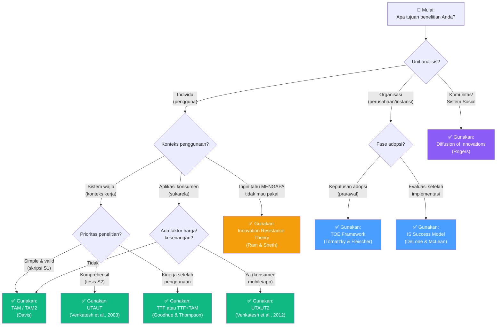
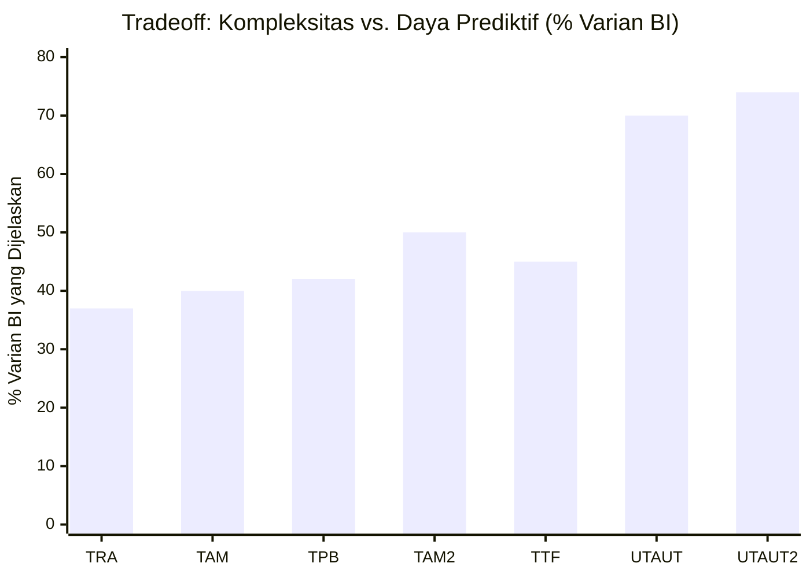
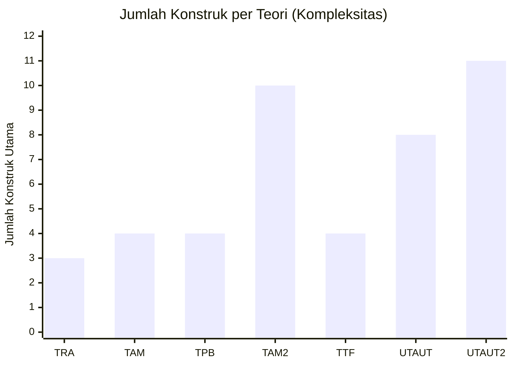
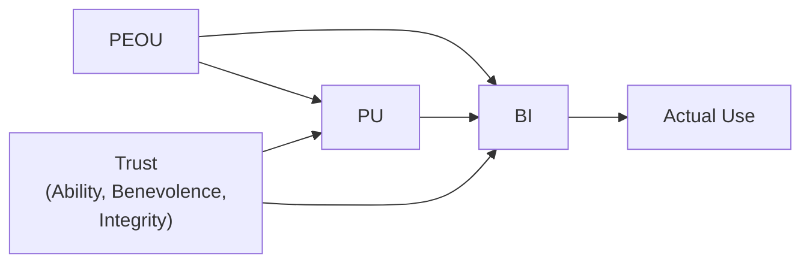

# BAB-13: Perbandingan Antar Teori Adopsi Teknologi

> *"Mengetahui satu teori tidak cukup. Memahami mengapa setiap teori ada — dan kapan masing-masing paling tepat digunakan — itulah tanda peneliti yang matang."*

---

## 🎯 Tujuan Pembelajaran

Setelah membaca bab ini, pembaca diharapkan mampu:
- Membandingkan teori-teori adopsi utama berdasarkan dimensi kritis yang relevan
- Menggunakan decision framework untuk memilih teori yang tepat sesuai konteks penelitian
- Mengidentifikasi kombinasi teori yang umum digunakan dalam penelitian adopsi
- Mengevaluasi kelebihan dan kelemahan komparatif setiap teori
- Menjelaskan kepada pembimbing/penguji mengapa teori yang dipilih tepat untuk penelitian mereka

---

## 📖 Pendahuluan

Setelah mempelajari belasan teori adopsi teknologi, muncul pertanyaan paling praktis:

> **"Teori mana yang harus saya gunakan untuk penelitian saya?"**

Tidak ada jawaban tunggal yang universal. Setiap teori lahir dari konteks yang berbeda, menjawab pertanyaan yang berbeda, dan memiliki kekuatan serta keterbatasan masing-masing. Bab ini menyediakan alat bantu praktis untuk membuat keputusan tersebut dengan berbasis argumen akademik yang kuat.

---

## 13.1 Tabel Perbandingan Komprehensif

### Perbandingan Berdasarkan Dimensi Utama

| Teori | Tahun | Tokoh | Unit Analisis | Fokus Utama | Konstruk Inti | Varian BI/Use | Konteks Terbaik |
|---|---|---|---|---|---|---|---|
| **TRA** | 1975 | Fishbein & Ajzen | Individu | Sikap & norma sosial | Attitude, SN, BI | ~30-40% | Perilaku sukarela umum |
| **TPB** | 1991 | Ajzen | Individu | + Kontrol perilaku | +PBC | ~35-45% | Saat kemampuan bervariasi |
| **DOI** | 1962 | Rogers | Komunitas/Sistem | Difusi sosial | 5 karakteristik, kategori adopter | Deskriptif | Penyebaran inovasi di masyarakat |
| **TAM** | 1989 | Davis | Individu | Penerimaan sistem TI | PU, PEOU | ~40% | Penelitian IS umum, skripsi |
| **TAM2** | 2000 | Venkatesh & Davis | Individu | +Anteseden PU | +Sosial & Kognitif | ~50% | Konteks organisasional |
| **TTF** | 1995 | Goodhue & Thompson | Individu/Tugas | Kesesuaian tugas-teknologi | TTF, Task/Tech Characteristics | ~45% | Evaluasi kinerja karyawan |
| **TRI** | 2000 | Parasuraman | Individu | Kesiapan mental umum | Optimism, Innovativeness, Discomfort, Insecurity | Prediktor | Segmentasi pasar, pra-adopsi |
| **UTAUT** | 2003 | Venkatesh et al. | Individu | Unifikasi 8 teori | PE, EE, SI, FC | ~70% | Konteks organisasi, mandatory use |
| **UTAUT2** | 2012 | Venkatesh et al. | Individu | +Konteks konsumen | +HM, PV, Habit | ~74% | Konteks konsumen, voluntary use |
| **TOE** | 1990 | Tornatzky & Fleischer | Organisasi | Adopsi organisasional | Technology, Organization, Environment | Kualitatif/kategori | Adopsi di level perusahaan |
| **IS Success** | 1992/2003 | DeLone & McLean | Sistem | Keberhasilan pasca-adopsi | SQ, IQ, SVQ, Use, Satisfaction, Net Benefits | Evaluatif | Evaluasi sistem setelah diimplementasi |
| **IRT** | 1989 | Ram & Sheth | Individu | Resistensi inovasi | 5 Barriers | Negatif | Mengapa teknologi ditolak |
| **SCT** | 1986 | Bandura | Individu | Self-efficacy & pembelajaran | Self-efficacy, OE | ~30% | Saat skill/kemampuan kritis |

---

## 13.2 Decision Tree: Memilih Teori yang Tepat

---

## 13.3 Perbandingan Konstruk Setara Antar Teori

Teori-teori adopsi sering menggunakan nama berbeda untuk konsep yang serupa. Tabel ini memetakan konstruk-konstruk yang setara:

### Konstruk "Kegunaan/Manfaat"

| Teori | Nama Konstruk | Definisi Operasional |
|---|---|---|
| **TAM** | Perceived Usefulness (PU) | Sistem meningkatkan kinerja pekerjaan |
| **UTAUT** | Performance Expectancy (PE) | Sistem membantu mencapai keuntungan kinerja |
| **DOI** | Relative Advantage | Inovasi lebih baik dari yang digantikan |
| **TPB** | Attitude (sebagian) | Evaluasi positif terhadap konsekuensi |
| **SCT** | Outcome Expectations | Keyakinan tentang hasil dari perilaku |

### Konstruk "Kemudahan Penggunaan"

| Teori | Nama Konstruk | Definisi Operasional |
|---|---|---|
| **TAM** | Perceived Ease of Use (PEOU) | Tidak membutuhkan banyak usaha |
| **UTAUT** | Effort Expectancy (EE) | Tingkat kemudahan penggunaan sistem |
| **DOI** | Complexity (kebalikan) | Tingkat kerumitan inovasi (negatif) |
| **TPB** | Perceived Behavioral Control | Persepsi kemampuan melakukan perilaku |
| **TTF** | Ease of Use/Training | Kemudahan belajar dan menggunakan |

### Konstruk "Pengaruh Sosial"

| Teori | Nama Konstruk | Definisi Operasional |
|---|---|---|
| **TRA** | Subjective Norm | Tekanan dari orang penting |
| **TPB** | Subjective Norm | Tekanan dari orang penting |
| **TAM2** | Subjective Norm | Persepsi ekspektasi orang penting |
| **UTAUT** | Social Influence (SI) | Persepsi bahwa orang penting mendukung |
| **DOI** | Observability | Hasil terlihat oleh orang lain |

---

## 13.4 Evolusi Kompleksitas vs. Daya Prediktif

**Insight:** Ada tradeoff antara **parsimoni** (sederhana) dan **daya prediktif** (kuat).  
Penelitian skripsi S1 → TAM (sederhana, valid)  
Penelitian tesis S2 → UTAUT/UTAUT2 (komprehensif, kuat)

---

## 13.5 Perbandingan Konteks Terbaik

### Berdasarkan Jenis Teknologi yang Diteliti

| Jenis Teknologi | Teori Rekomendasi | Alasan |
|---|---|---|
| Sistem ERP/SAP | UTAUT, TTF+TAM | Konteks mandatory, kesesuaian tugas penting |
| Mobile banking/fintech | UTAUT2, TAM+Trust | Konteks konsumen, kepercayaan kritis |
| E-learning/LMS | UTAUT2, TAM | Konteks konsumen pendidikan |
| E-government | TAM+Trust, TOE | Kepercayaan pemerintah, faktor organisasi |
| Telemedicine | HOT-fit, TAM+Trust | Konteks healthcare, privasi kritis |
| Smart farming/IoT | DOI, TAM+IRT | Inovasi baru, banyak resistensi |
| Cloud computing (org) | TOE, UTAUT | Keputusan organisasional |
| Media sosial | UTAUT2 | Hedonic motivation, habit dominan |
| AI/Chatbot | TAM+Trust | Kepercayaan pada AI kritis |

---

### Berdasarkan Tingkat Pendidikan Responden

| Responden | Rekomendasi | Pertimbangan |
|---|---|---|
| Pelajar/Mahasiswa | TAM, UTAUT2 | Literasi tinggi, berbasis konsumen |
| Karyawan (wajib) | UTAUT | Konteks mandatory, organisasional |
| UMKM | TOE, TAM+IRT | Keputusan adopsi, banyak resistensi |
| Petani | DOI, IRT | Difusi inovasi, hambatan budaya |
| Lansia | TRI+TAM | Kesiapan teknologi rendah, PEOU kritis |
| Tenaga Kesehatan | HOT-fit, TAM | Konteks healthcare |
| ASN/Pegawai Negeri | UTAUT, TAM | Mandatory use, konteks pemerintahan |

---

## 13.6 Kombinasi Teori yang Populer

Peneliti sering menggabungkan dua teori untuk penelitian yang lebih kaya:

### Kombinasi 1: TAM + Trust
**Digunakan untuk:** E-commerce, fintech, e-government  
**Logika:** TAM menjelaskan utility & usability, Trust menjelaskan keamanan & kepercayaan

---

### Kombinasi 2: UTAUT2 + Habit
**Digunakan untuk:** Aplikasi mobile yang sudah mature  
**Logika:** UTAUT2 menjelaskan niat awal, Habit menjelaskan penggunaan otomatis jangka panjang

---

### Kombinasi 3: TAM + TTF
**Digunakan untuk:** Sistem kerja profesional (ERP, HRIS, CRM)  
**Logika:** TAM untuk niat, TTF untuk kesesuaian tugas dan kinerja aktual

---

### Kombinasi 4: TOE + IS Success Model
**Digunakan untuk:** Evaluasi implementasi sistem di organisasi  
**Logika:** TOE menjelaskan keputusan adopsi, IS Success mengukur hasilnya

---

### Kombinasi 5: TAM + IRT
**Digunakan untuk:** Teknologi yang menghadapi resistensi signifikan  
**Logika:** TAM mengukur niat positif, IRT mengukur hambatan negatif secara simultan

---

## 13.7 Panduan Menulis Justifikasi Pemilihan Teori

Dalam proposal atau bab II skripsi/tesis, justifikasi pemilihan teori harus mencakup:

### Template Justifikasi (Contoh untuk TAM)

> *"Penelitian ini menggunakan Technology Acceptance Model (TAM) yang dikembangkan oleh Davis (1989) sebagai landasan teori. Pemilihan TAM didasarkan pada beberapa pertimbangan: (1) TAM dirancang secara spesifik untuk menjelaskan penerimaan sistem informasi oleh pengguna individual, yang sesuai dengan konteks penelitian ini; (2) TAM telah divalidasi dalam ribuan penelitian di berbagai konteks dan budaya (King & He, 2006), sehingga terbukti reliabel; (3) TAM memiliki parsimoni yang tinggi dengan hanya dua konstruk inti (PU dan PEOU), sehingga dapat dioperasionalisasikan dengan jelas dalam kuesioner; dan (4) beberapa penelitian adopsi [teknologi spesifik] di konteks serupa juga menggunakan TAM, sehingga memudahkan perbandingan temuan."*

### Template Justifikasi (Contoh untuk UTAUT2)

> *"Penelitian ini mengadopsi UTAUT2 (Venkatesh, Thong & Xu, 2012) karena beberapa alasan: (1) Responden dalam penelitian ini adalah konsumen umum yang menggunakan teknologi secara sukarela, sehingga UTAUT2 yang dirancang untuk konteks konsumen lebih tepat dibandingkan UTAUT versi asli yang berfokus pada konteks organisasional; (2) UTAUT2 menambahkan konstruk Hedonic Motivation dan Price Value yang relevan mengingat [teknologi yang diteliti] memiliki aspek kesenangan dan pertimbangan harga yang signifikan; (3) UTAUT2 memiliki daya prediktif tertinggi (~74% varian BI) di antara semua model adopsi yang ada."*

---

## 13.8 Pertanyaan Kritis dari Penguji & Jawabannya

### "Mengapa tidak menggunakan UTAUT saja yang lebih komprehensif?"

**Jawaban (jika menggunakan TAM):**
> "UTAUT memang lebih komprehensif, namun kompleksitasnya membutuhkan sampel yang sangat besar untuk menguji semua moderating variables secara memadai. Dengan keterbatasan sampel penelitian ini (n=X), TAM lebih tepat karena parsimoninya memungkinkan validitas yang lebih baik. Selain itu, penelitian sebelumnya menunjukkan bahwa TAM mampu menjelaskan 40% varian yang sudah cukup untuk menjawab tujuan penelitian ini."

### "Apakah TAM masih relevan di era 2024?"

**Jawaban:**
> "TAM tetap relevan karena dua konstruk intinya — persepsi kegunaan dan kemudahan — masih merupakan determinan fundamental dari penerimaan teknologi di era apapun. Yang berubah adalah anteseden dan konteksnya, bukan esensi TAM itu sendiri. Venkatesh & Bala (2008) dalam TAM3 memperbarui anteseden TAM untuk relevan dengan konteks modern."

---

## 🔗 Keterkaitan dengan Bab Lain

- ⬅️ Bab sebelumnya: [BAB-12 — Teori Pendukung Lainnya](../BAB-12_Teori_Pendukung_Lainnya/README.md)
- ➡️ Bab selanjutnya: [BAB-14 — Kritik dan Limitasi](../BAB-14_Kritik_dan_Limitasi/README.md)
- 🔗 Template kuesioner: [BAB-32](../BAB-32_Template_Kuesioner/README.md)
- 🔗 Metodologi penelitian: [BAB-28](../BAB-28_Metodologi_Penelitian/README.md)

---

## ✅ Soal Latihan

1. **Analitis:** Anda akan meneliti adopsi **BPJSTKU (aplikasi ketenagakerjaan)** oleh pekerja informal di kota besar. Gunakan decision tree di atas dan pilih **satu teori utama** beserta satu teori pendukung! Jelaskan dengan argumen akademik yang kuat!

2. **Komparatif:** Bandingkan **UTAUT vs. TAM** dalam hal: (a) jumlah konstruk, (b) daya prediktif, (c) konteks terbaik, dan (d) kemudahan implementasi dalam penelitian skripsi. Teori mana yang Anda pilih untuk skripsi S1 dan mengapa?

3. **Sintesis:** Rancang sebuah **model penelitian gabungan** yang mengintegrasikan TAM dan IRT dalam satu model. Gambarkan diagram model dan jelaskan logika penggabungannya!

4. **Kritis:** Apakah mungkin menggunakan **lebih dari dua teori** dalam satu penelitian skripsi/tesis? Apa keuntungan dan risikonya? Kapan penggabungan multi-teori dibenarkan secara akademik?

---

## 📚 Referensi Bab Ini

- King, W. R., & He, J. (2006). A meta-analysis of the technology acceptance model. *Information & Management*, *43*(6), 740–755.
- Legris, P., Ingham, J., & Collerette, P. (2003). Why do people use information technology? A critical review of the technology acceptance model. *Information & Management*, *40*(3), 191–204.
- Scherer, R., Siddiq, F., & Tondeur, J. (2019). The technology acceptance model (TAM): A meta-analytic structural equation modeling approach to explaining teachers' adoption of digital technology in education. *Computers & Education*, *128*, 13–35.
- Venkatesh, V., Morris, M. G., Davis, G. B., & Davis, F. D. (2003). User acceptance of information technology: Toward a unified view. *MIS Quarterly*, *27*(3), 425–478.
- Williams, M. D., Rana, N. P., & Dwivedi, Y. K. (2015). The unified theory of acceptance and use of technology (UTAUT): A literature review. *Journal of Enterprise Information Management*, *28*(3), 443–488.

---

← [BAB-12: Teori Pendukung](../BAB-12_Teori_Pendukung_Lainnya/README.md) | [README Utama](../README.md) | [BAB-14: Kritik & Limitasi →](../BAB-14_Kritik_dan_Limitasi/README.md)
