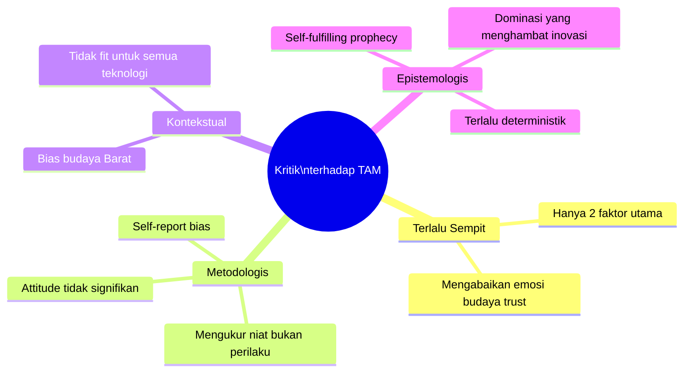
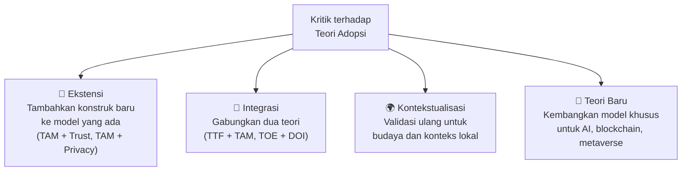

# BAB-14: Kritik dan Limitasi Teori Adopsi Teknologi

> *"Sebuah teori yang tidak bisa dikritik adalah dogma, bukan ilmu pengetahuan."*  
> — Karl Popper

---

## 🎯 Tujuan Pembelajaran

Setelah membaca bab ini, pembaca diharapkan mampu:
- Mengidentifikasi kritik akademik utama terhadap setiap teori adopsi teknologi
- Membedakan kritik yang bersifat fundamental dengan kritik yang bersifat kontekstual
- Menjelaskan debat akademik yang masih berlangsung dalam penelitian adopsi teknologi
- Mengevaluasi relevansi teori-teori lama di era teknologi modern
- Merumuskan limitasi penelitian berdasarkan kelemahan teori yang digunakan

---

## 📖 Pendahuluan

Setiap teori ilmiah — tidak terkecuali teori adopsi teknologi — memiliki keterbatasan. Memahami kritik terhadap suatu teori bukan berarti menolaknya, melainkan menggunakannya dengan lebih bijaksana: tahu batasnya, tahu di mana ia kuat, dan tahu di mana diperlukan teori lain.

Bagi peneliti, memahami kritik terhadap teori yang digunakan adalah keharusan akademik. Dalam seminar atau ujian tesis, pertanyaan seperti *"Apa keterbatasan TAM dalam konteks penelitian Anda?"* adalah standar — dan jawaban yang lemah menunjukkan pemahaman yang dangkal.

---

## 14.1 Kritik terhadap Technology Acceptance Model (TAM)

TAM adalah model paling populer, sekaligus paling banyak dikritik karena dominasinya yang luar biasa.

### 14.1.1 Kritik Fundamental

#### Kritik #1: Terlalu Deterministik dan Sempit
**Sumber:** Bagozzi (2007); Chuttur (2009)

TAM hanya mengukur **dua faktor** (PU dan PEOU) sambil mengabaikan ratusan faktor lain yang secara nyata mempengaruhi adopsi: emosi, kesenangan, norma budaya, trust, harga, kebiasaan, dll.

> *"TAM has become the dominant paradigm to the extent that researchers have stopped asking whether it is the right model."* — Bagozzi (2007)

**Implikasi:** Penelitian TAM yang terus direplikasi tanpa modifikasi hanya menghasilkan temuan yang "predictably unsurprising" — ya, PU dan PEOU berpengaruh, kita sudah tahu itu. Pertanyaannya: apa lagi?

---

#### Kritik #2: Variabel Attitude Tidak Berguna
**Sumber:** Davis et al. (1989) sendiri

Davis mengakui bahwa dalam data empiris, variabel **Attitude Toward Using** sering tidak signifikan sebagai mediator antara PU/PEOU dan BI — atau bahkan ketika signifikan, mediasi penuhnya jarang terjadi. Lalu mengapa ia ada dalam model?

Banyak penelitian kemudian menghilangkan Attitude dari model TAM tanpa mengurangi kekuatan prediktif secara signifikan.

---

#### Kritik #3: Mengukur Niat, Bukan Perilaku Aktual
**Sumber:** Straub et al. (1995); Szajna (1996)

TAM memprediksi **Behavioral Intention** yang kemudian diasumsikan akan menghasilkan **Actual Use**. Namun:
- **Intention-behavior gap** adalah fenomena nyata
- Seseorang bisa berniat menggunakan teknologi tetapi tidak melakukannya karena faktor lain (tidak ada akses, situasi berubah, dll.)
- Mengukur "actual use" dengan self-report juga bermasalah (bias recall)

---

#### Kritik #4: Kurang Mempertimbangkan Konteks Sosial dan Budaya
**Sumber:** McCoy et al. (2007); Straub et al. (1997)

TAM dikembangkan di Amerika Serikat dengan responden mahasiswa MBA yang berpendidikan tinggi. Ketika diterapkan di:
- Budaya kolektif (Asia, Afrika) → peran Subjective Norm jauh lebih besar
- Masyarakat dengan literasi digital rendah → PEOU bukan lagi faktor yang bisa dianggap sepele
- Konteks yang berbeda → validitas konstruk dan item kuesioner perlu divalidasi ulang

---

#### Kritik #5: Self-Fulfilling Prophecy
**Sumber:** Benbasat & Barki (2007)

Karena TAM begitu dominan, peneliti selalu menemukan bahwa PU dan PEOU signifikan — bukan karena mereka memang selalu signifikan, melainkan karena: (1) penelitian yang tidak mendukung TAM lebih sulit dipublikasikan (*publication bias*), dan (2) item kuesioner TAM sudah terlalu "diarahkan" untuk menghasilkan hasil yang mendukung teori.

---

### 14.1.2 Ringkasan Kritik TAM

---

## 14.2 Kritik terhadap UTAUT

### 14.2.1 Kritik #1: Overfitting dan Tidak Parsimoni
**Sumber:** Williams et al. (2015); Bagozzi (2007)

UTAUT memiliki **4 konstruk utama + 4 moderating variable** = 8 variabel yang perlu diuji interaksinya. Untuk menguji semua interaksi ini secara valid:
- Dibutuhkan sampel sangat besar (>500 per sel moderasi)
- Sebagian besar penelitian UTAUT **tidak menguji semua moderating variable** — melainkan hanya mengklaim menggunakan UTAUT padahal hanya menguji konstruk utamanya saja

> Ironi: UTAUT sering digunakan "separuh-separuh" — mengambil 4 konstruk utama tanpa moderating variable — yang sebenarnya tidak berbeda jauh dari TAM2.

---

### 14.2.2 Kritik #2: Dikembangkan dari Konteks yang Sangat Spesifik
**Sumber:** Venkatesh et al. (2003) sendiri

UTAUT divalidasi menggunakan data dari **4 perusahaan di AS** dengan teknologi yang sama. Apakah ia benar-benar "unified theory" yang berlaku universal? Validasi lintas budaya dan lintas industri masih terbatas.

---

### 14.2.3 Kritik #3: Voluntariness sebagai Moderator Bermasalah
Dalam banyak konteks dunia nyata, batas antara "penggunaan sukarela" dan "penggunaan wajib" tidak jelas. Karyawan mungkin secara teknis tidak "diwajibkan" menggunakan sistem baru, tetapi tekanan sosial dan karir membuat itu de facto wajib.

---

## 14.3 Kritik terhadap Diffusion of Innovations (DOI)

### 14.3.1 Kritik #1: Bias Pro-Inovasi
**Sumber:** Rogers (2003) sendiri mengakui ini

DOI secara implisit mengasumsikan bahwa **adopsi adalah sesuatu yang positif** dan resistensi adalah sesuatu yang perlu diatasi. Namun tidak semua inovasi bermanfaat — ada inovasi yang pantas ditolak (rokok elektronik, junk food delivery, dll.).

### 14.3.2 Kritik #2: Bersifat Deskriptif, Bukan Prediktif
DOI menggambarkan **bagaimana** difusi terjadi, tetapi kurang kuat dalam **memprediksi** apakah suatu inovasi akan sukses atau gagal sebelum diluncurkan.

### 14.3.3 Kritik #3: Individual Blame
DOI cenderung "menyalahkan" Laggards sebagai orang-orang yang "ketinggalan", padahal penolakan mereka mungkin rasional mengingat konteks ekonomi, budaya, atau akses yang mereka hadapi.

---

## 14.4 Kritik terhadap TPB/TRA

### Kritik Utama: Intention-Behavior Gap
Bahkan dengan tambahan PBC, TPB masih menghadapi masalah fundamental: **niat tidak selalu berujung pada perilaku**. Meta-analisis Sheeran (2002) menemukan bahwa perubahan niat hanya menjelaskan ~28% perubahan perilaku — artinya masih ada ~72% yang tidak dijelaskan.

Faktor yang menyebabkan gap:
- **Forgetting** — niat terlupakan
- **Opportunity** — tidak ada kesempatan yang tepat
- **Competing intentions** — niat lain lebih diprioritaskan
- **Self-regulation failure** — gagal mengendalikan diri

---

## 14.5 Debat Akademik yang Masih Berlangsung

### Debat #1: Apakah TAM Masih Relevan di Era AI?

**Sisi Pro (masih relevan):**
- PU dan PEOU tetap merupakan faktor fundamental yang tidak berubah
- Ratusan penelitian telah memvalidasi TAM di berbagai konteks modern
- TAM dapat diperkaya dengan konstruk baru tanpa harus membuangnya

**Sisi Kontra (perlu digantikan):**
- AI memiliki dimensi unik: **explainability** (bisakah pengguna memahami bagaimana AI membuat keputusan?), **trustworthiness**, dan **autonomy** yang tidak tertangkap TAM
- Interaksi pengguna dengan AI bersifat berbeda fundamental dari interaksi dengan sistem IS tradisional

---

### Debat #2: Self-Report vs. Behavioral Data

Hampir semua penelitian adopsi menggunakan **kuesioner self-report** — pengguna melaporkan sendiri PU, PEOU, dan niat mereka. Masalahnya:
- **Social desirability bias**: orang cenderung melaporkan sesuai harapan sosial
- **Recall bias**: laporan tentang penggunaan masa lalu tidak akurat
- **Intention-behavior gap**: niat ≠ perilaku

Solusi yang berkembang: mengintegrasikan **behavioral data** (log sistem, clickstream, durasi penggunaan) dengan data kuesioner.

---

### Debat #3: Cross-Cultural Validity

Apakah teori yang dikembangkan di Barat valid secara universal?

| Dimensi Budaya (Hofstede) | Implikasi untuk Adopsi |
|---|---|
| **Power Distance Tinggi** (Indonesia) | Norma atasan lebih dominan dari TAM yang mengasumsikan keputusan individual |
| **Kolektivisme Tinggi** | Social Influence jauh lebih kuat dari yang TAM prediksikan |
| **Uncertainty Avoidance Tinggi** | Risk dan trust lebih kritis — perlu ditambahkan ke model |
| **Long-term Orientation Tinggi** | Habit dan keberlanjutan lebih penting dari adopsi awal |

---

### Debat #4: Kualitas Penelitian Replikasi

Ribuan penelitian mengklaim menggunakan TAM, namun:
- Banyak yang menggunakan **item kuesioner yang dimodifikasi tanpa validasi ulang**
- Konteks teknologi yang diteliti sangat beragam — apakah item yang sama valid untuk semua?
- **Publication bias**: studi dengan hasil mendukung TAM lebih mudah dipublikasikan

---

## 14.6 Implikasi untuk Peneliti

### Cara Menulis Limitasi Penelitian yang Baik

Limitasi penelitian adopsi teknologi umumnya mencakup:

| Jenis Limitasi | Contoh Kalimat |
|---|---|
| **Limitasi Teoritis** | "TAM yang digunakan dalam penelitian ini tidak mempertimbangkan faktor kepercayaan (*trust*) dan pengaruh budaya yang relevan dalam konteks Indonesia..." |
| **Limitasi Metodologis** | "Data dikumpulkan menggunakan kuesioner self-report yang rentan terhadap *common method bias* dan *social desirability bias*..." |
| **Limitasi Sampel** | "Sampel penelitian ini dibatasi pada [kelompok tertentu] sehingga generalisasi hasil ke kelompok yang lebih luas perlu dilakukan dengan hati-hati..." |
| **Limitasi Temporal** | "Penelitian ini bersifat *cross-sectional* sehingga tidak dapat menangkap perubahan sikap dan niat pengguna dari waktu ke waktu..." |

---

## 14.7 Arah Masa Depan: Merespons Kritik

Para peneliti merespons kritik ini dengan beberapa pendekatan:

---

## 🔗 Keterkaitan dengan Bab Lain

- ⬅️ Bab sebelumnya: [BAB-13 — Perbandingan Antar Teori](../BAB-13_Perbandingan_Antar_Teori/README.md)
- ➡️ Bab selanjutnya: [BAB-15 — Faktor-faktor Adopsi](../BAB-15_Faktor_Faktor_Adopsi/README.md)
- 🔗 Tren dan masa depan: [BAB-34](../BAB-34_Tren_dan_Masa_Depan/README.md)
- 🔗 Budaya & adopsi: [BAB-23](../BAB-23_Budaya_dan_Adopsi_Teknologi/README.md)

---

## ✅ Soal Latihan

1. **Analitis:** Benbasat & Barki (2007) menyebut fenomena "TAM becoming a self-fulfilling prophecy". Jelaskan dengan bahasa sederhana apa yang dimaksud, dan berikan argumen untuk atau menentang pernyataan ini!

2. **Kritis:** Pilih **satu teori** yang telah Anda pelajari (TAM, UTAUT, DOI, dll.) dan identifikasi **tiga kritik terkuat** yang ditujukan padanya. Kemudian argumentasikan bagaimana Anda akan merespons kritik tersebut dalam desain penelitian Anda!

3. **Sintesis:** "Intention-behavior gap" adalah masalah yang dihadapi hampir semua teori adopsi. Identifikasi **tiga faktor** yang paling sering menyebabkan gap ini dalam konteks adopsi teknologi di Indonesia! Bagaimana peneliti dapat mengukur atau memitigasi gap ini?

4. **Prospektif:** Jika Anda diminta mengembangkan teori adopsi teknologi yang baru untuk era AI Generatif (ChatGPT, Gemini), faktor apa yang **wajib ada** yang tidak diakomodasi oleh TAM atau UTAUT2? Jelaskan alasannya!

---

## 📚 Referensi Bab Ini

- Bagozzi, R. P. (2007). The legacy of the technology acceptance model and a proposal for a paradigm shift. *Journal of the Association for Information Systems*, *8*(4), 244–254.
- Benbasat, I., & Barki, H. (2007). Quo vadis TAM? *Journal of the Association for Information Systems*, *8*(4), 211–218.
- Chuttur, M. Y. (2009). Overview of the technology acceptance model: Origins, developments and future directions. *Sprouts: Working Papers on Information Systems*, *9*(37).
- Legris, P., Ingham, J., & Collerette, P. (2003). Why do people use information technology? A critical review of the technology acceptance model. *Information & Management*, *40*(3), 191–204.
- Rogers, E. M. (2003). *Diffusion of innovations* (5th ed.). Free Press. (Bab 5: Kritik terhadap DOI)
- Sheeran, P. (2002). Intention-behavior relations: A conceptual and empirical review. *European Review of Social Psychology*, *12*(1), 1–36.

---

← [BAB-13: Perbandingan](../BAB-13_Perbandingan_Antar_Teori/README.md) | [README Utama](../README.md) | [BAB-15: Faktor Adopsi →](../BAB-15_Faktor_Faktor_Adopsi/README.md)
