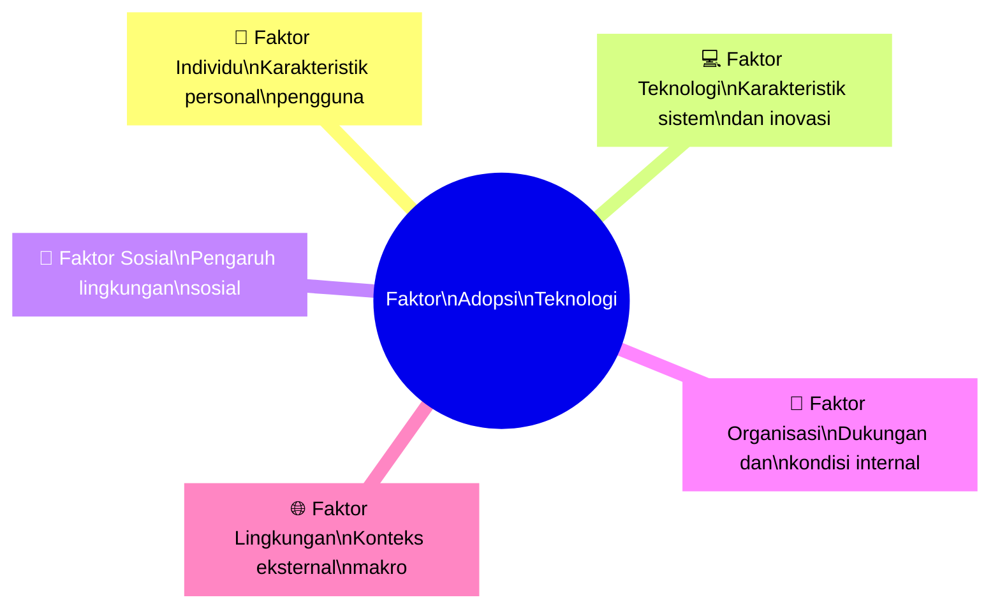
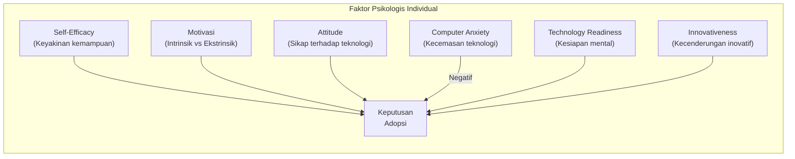
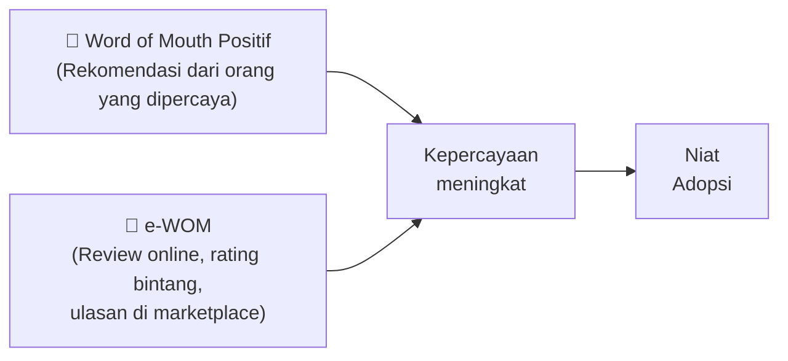
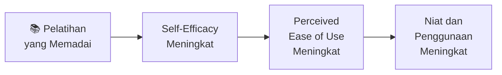
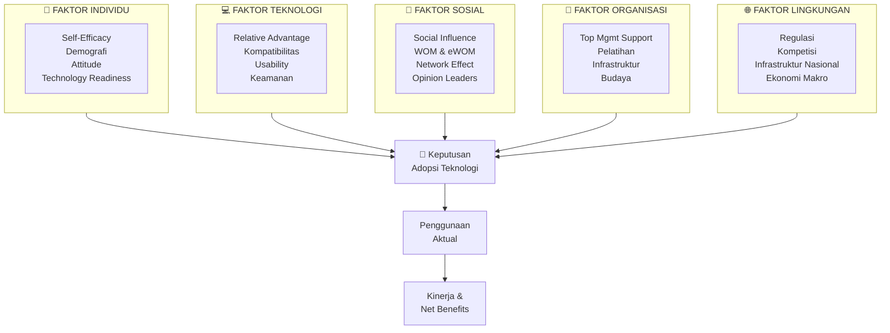

# BAB-15: Faktor-faktor yang Mempengaruhi Adopsi Teknologi

> *"Adopsi teknologi bukan terjadi dalam ruang hampa — ia dibentuk oleh individu, teknologi, lingkungan sosial, dan konteks organisasional secara simultan."*

---

## 🎯 Tujuan Pembelajaran

Setelah membaca bab ini, pembaca diharapkan mampu:
- Mengklasifikasikan faktor-faktor adopsi ke dalam lima kelompok utama
- Menjelaskan bagaimana setiap kelompok faktor mempengaruhi keputusan adopsi
- Mengidentifikasi interaksi antar faktor yang menciptakan kompleksitas adopsi
- Menerapkan kerangka multi-faktor dalam analisis fenomena adopsi nyata
- Merancang model penelitian yang mempertimbangkan berbagai kelompok faktor

---

## 📖 Pendahuluan

Mengapa satu orang langsung menggunakan aplikasi baru yang ia unduh, sementara orang lain mendiamkannya berbulan-bulan? Mengapa satu perusahaan cepat mengadopsi cloud computing sementara pesaingnya masih enggan?

Jawabannya: **adopsi teknologi adalah fenomena multidimensi**. Tidak ada satu faktor tunggal yang menentukan adopsi. Ia adalah hasil interaksi kompleks antara karakteristik individu, kualitas teknologi, pengaruh sosial, kondisi organisasi, dan konteks lingkungan.

Bab ini memetakan faktor-faktor tersebut secara sistematis — memberikan panduan komprehensif bagi peneliti maupun praktisi.

---

## 15.1 Kerangka Lima Kelompok Faktor Adopsi

---

## 15.2 Faktor Individu (Personal)

Faktor individu adalah karakteristik intrinsik pengguna yang mempengaruhi keputusan adopsi sebelum, selama, dan sesudah paparan teknologi.

### 15.2.1 Karakteristik Demografis

| Faktor | Pengaruh | Bukti Empiris |
|---|---|---|
| **Usia** | Pengguna lebih tua cenderung lebih lambat mengadopsi | UTAUT: Age memoderasi EE dan FC |
| **Gender** | Perbedaan dalam motivasi dan kecemasan teknologi | UTAUT: Gender memoderasi PE dan EE |
| **Pendidikan** | Pendidikan lebih tinggi → TRI lebih tinggi, adopsi lebih cepat | Korelasi positif konsisten |
| **Penghasilan** | Penghasilan lebih tinggi → mampu membeli & mengakses teknologi | Kritis di negara berkembang |
| **Pengalaman TI** | Pengalaman sebelumnya menurunkan kecemasan (anxiety) | UTAUT: Experience sebagai moderator |

---

### 15.2.2 Karakteristik Psikologis

**Self-Efficacy** adalah prediktor individu terkuat — penelitian konsisten menunjukkan bahwa kepercayaan pada kemampuan diri sendiri sangat menentukan apakah seseorang bahkan mau mencoba teknologi baru.

**Computer Anxiety** adalah faktor negatif yang signifikan, terutama pada populasi lansia, individu dengan pendidikan rendah, dan kelompok yang jarang berinteraksi dengan teknologi.

---

### 15.2.3 Kebiasaan dan Pengalaman

| Faktor | Definisi | Dampak |
|---|---|---|
| **Prior Experience** | Pengalaman dengan teknologi serupa | Mempermudah kurva belajar, meningkatkan self-efficacy |
| **Habit** | Penggunaan yang sudah menjadi otomatis | Habit kuat → loyalitas pada teknologi lama (switching barrier) |
| **Need for Cognition** | Kesenangan dalam berpikir dan menganalisis | Pengguna dengan NFC tinggi lebih teliti mengevaluasi teknologi baru |

---

## 15.3 Faktor Teknologi

Karakteristik teknologi itu sendiri sangat menentukan apakah ia akan diterima atau ditolak.

### 15.3.1 Lima Karakteristik Inovasi Rogers

*(Dibahas lengkap di [BAB-05](../BAB-05_Diffusion_of_Innovations/README.md))*

| Karakteristik | Arah | Kekuatan |
|---|---|---|
| Relative Advantage | ➕ Positif | ⭐⭐⭐⭐⭐ |
| Compatibility | ➕ Positif | ⭐⭐⭐⭐ |
| Complexity | ➖ Negatif | ⭐⭐⭐⭐ |
| Trialability | ➕ Positif | ⭐⭐⭐ |
| Observability | ➕ Positif | ⭐⭐⭐ |

---

### 15.3.2 Kualitas Sistem dan Informasi

Mengacu pada **D&M IS Success Model** ([BAB-11](../BAB-11_IS_Success_Model/README.md)):

| Kualitas | Faktor Spesifik |
|---|---|
| **System Quality** | Reliability, kecepatan, aksesibilitas, user-friendliness |
| **Information Quality** | Akurasi, kelengkapan, relevansi, ketepatan waktu |
| **Service Quality** | Responsivitas dukungan teknis, kompetensi tim IT |

---

### 15.3.3 Desain dan Usability

**Usability** (kegunaan) adalah dimensi kritis yang mempengaruhi PEOU dalam TAM:
- **Learnability**: Seberapa mudah dipelajari oleh pengguna baru?
- **Efficiency**: Seberapa cepat pengguna yang terlatih bisa menyelesaikan tugas?
- **Error rate**: Seberapa sering pengguna melakukan kesalahan?
- **Satisfaction**: Seberapa menyenangkan digunakan?

---

### 15.3.4 Keamanan dan Privasi

Semakin banyak bukti empiris menunjukkan bahwa **security** dan **privacy features** dari teknologi secara langsung mempengaruhi adopsi — terutama untuk fintech, e-health, dan e-government.

---

## 15.4 Faktor Sosial

Manusia adalah makhluk sosial — keputusan adopsi sangat dipengaruhi oleh orang-orang di sekitar kita.

### 15.4.1 Subjective Norm dan Social Influence

Mengacu pada TRA/TPB dan UTAUT:
- **Orang tua/keluarga**: Berpengaruh kuat terutama pada anak-anak dan remaja
- **Teman sebaya**: Pengaruh melalui word-of-mouth dan demonstrasi langsung
- **Rekan kerja**: Pengaruh normatif dalam konteks organisasional
- **Atasan/pemimpin**: Pengaruh koersif dan normatif yang sangat kuat

### 15.4.2 Word of Mouth (WOM) dan eWOM

**WOM tradisional vs. eWOM (electronic WOM):**

Penelitian menunjukkan bahwa **rekomendasi dari teman** (WOM) memiliki pengaruh 3-5x lebih kuat dari iklan terhadap keputusan adopsi teknologi baru.

### 15.4.3 Opinion Leaders dan Influencer

Dalam era media sosial, **influencer** telah menjadi agen difusi modern:
- Tech reviewer (YouTube, Instagram) → mempercepat adopsi gadget baru
- KOL (Key Opinion Leader) di industri kesehatan → mendorong adopsi aplikasi kesehatan
- Komunitas online → peer pressure dan normalisasi penggunaan

### 15.4.4 Efek Jaringan (Network Effect)

**Network effect** terjadi ketika nilai suatu teknologi meningkat seiring bertambahnya pengguna:

| Tipe | Contoh | Implikasi |
|---|---|---|
| **Direct** | WhatsApp lebih berguna karena semua orang pakai | "Tipping point" menuju adopsi massal |
| **Indirect** | App store yang banyak pengguna → lebih banyak developer | Platform competition |
| **Two-sided** | Gojek: lebih banyak driver → lebih berguna bagi penumpang | Chicken-and-egg problem |

---

## 15.5 Faktor Organisasi

Dalam konteks adopsi di tempat kerja, faktor organisasional sangat menentukan.

### 15.5.1 Dukungan Manajemen Puncak

Secara konsisten menjadi **prediktor terkuat** adopsi teknologi di level organisasi (TOE Framework):

**Bentuk dukungan manajemen:**
- Alokasi anggaran yang memadai
- Kebijakan yang mendorong penggunaan
- Partisipasi aktif dalam program adopsi
- Komunikasi visi digital kepada seluruh karyawan

> Tanpa dukungan manajemen puncak, adopsi teknologi di organisasi — meskipun teknologinya bagus — hampir selalu gagal.

### 15.5.2 Infrastruktur dan Sumber Daya IT

**Facilitating Conditions** dalam UTAUT:
- Ketersediaan hardware dan software yang diperlukan
- Koneksi internet yang memadai
- Tim IT yang kompeten dan responsif
- Budget untuk pelatihan dan maintenance

### 15.5.3 Pelatihan dan Pengembangan

Pelatihan yang baik langsung meningkatkan self-efficacy dan PEOU — ini adalah intervensi paling cost-effective untuk mendorong adopsi.

### 15.5.4 Budaya Organisasi

| Tipe Budaya | Ciri | Dampak pada Adopsi |
|---|---|---|
| **Innovative** | Mendorong eksperimen, toleran terhadap kegagalan | Adopsi cepat |
| **Bureaucratic** | Banyak persetujuan diperlukan, hierarkis | Adopsi lambat |
| **Collaborative** | Berbagi pengetahuan, saling mendukung | Adopsi melalui peer learning |
| **Risk-Averse** | Menghindari perubahan | Resistensi tinggi |

---

## 15.6 Faktor Lingkungan (Eksternal)

### 15.6.1 Regulasi dan Kebijakan Pemerintah

Faktor eksternal paling kuat yang dapat **mendorong atau menghambat** adopsi teknologi:

| Intervensi Regulasi | Contoh di Indonesia | Dampak |
|---|---|---|
| **Mandatori (wajib)** | Kewajiban e-faktur DJP | Adopsi dipaksa → 100% compliant |
| **Insentif** | Subsidi UMKM Go Digital | Menurunkan hambatan biaya |
| **Regulasi keamanan** | POJK fintech | Meningkatkan kepercayaan konsumen |
| **Regulasi privasi** | UU PDP (2022) | Standar keamanan data naik |

### 15.6.2 Tekanan Kompetitif

"Semua kompetitor sudah pakai — kita harus ikut atau tertinggal":
- **Mimetik isomorphism** (Institutional Theory): meniru kompetitor yang sukses
- **First mover advantage**: insentif untuk adopsi lebih awal
- **Customer expectation**: pelanggan mulai mengharapkan layanan digital

### 15.6.3 Infrastruktur Digital Nasional

Faktor kritis khususnya di negara berkembang:
- **Penetrasi internet**: 78.19% penduduk Indonesia (APJII, 2024)
- **Coverage 4G/5G**: Tidak merata, terutama daerah 3T
- **Ketersediaan listrik**: Masih menjadi kendala di sebagian daerah
- **Affordability**: Harga smartphone dan data masih berat bagi sebagian masyarakat

---

## 15.7 Model Integrasi: Lima Faktor dalam Satu Kerangka

---

## 15.8 Faktor Dominan Berdasarkan Konteks

| Konteks | Faktor Paling Dominan | Teori yang Relevan |
|---|---|---|
| **Karyawan & sistem wajib** | Faktor Organisasi (management support) | UTAUT, TOE |
| **Konsumen muda (Gen Z)** | Faktor Sosial (peer influence, WOM) | UTAUT2, DOI |
| **Lansia** | Faktor Individu (self-efficacy, anxiety) | TRI, TPB |
| **UMKM** | Faktor Lingkungan (biaya, regulasi) + Organisasi | TOE |
| **Petani pedesaan** | Faktor Sosial (opinion leaders lokal) + Teknologi (compatibility) | DOI, IRT |
| **Tenaga kesehatan** | Faktor Teknologi (kualitas info) + Organisasi | HOT-fit |

---

## 🔗 Keterkaitan dengan Bab Lain

- ⬅️ Bab sebelumnya: [BAB-14 — Kritik dan Limitasi](../BAB-14_Kritik_dan_Limitasi/README.md)
- ➡️ Bab selanjutnya: [BAB-16 — Hambatan Adopsi](../BAB-16_Hambatan_Adopsi/README.md)
- 🔗 Hambatan spesifik: [BAB-16](../BAB-16_Hambatan_Adopsi/README.md)
- 🔗 Trust sebagai faktor: [BAB-17](../BAB-17_Trust_Kepercayaan_dalam_Adopsi/README.md)
- 🔗 Konteks Indonesia: [BAB-24](../BAB-24_Konteks_Indonesia/README.md)

---

## ✅ Soal Latihan

1. **Konseptual:** Klasifikasikan lima kelompok faktor adopsi beserta dua contoh konkret untuk masing-masing! Kelompok faktor mana yang menurut Anda paling sering diabaikan dalam penelitian adopsi teknologi?

2. **Analitis:** Seorang wirausaha muda ingin mengadopsi sistem akuntansi berbasis cloud untuk UMKM-nya. Identifikasi **dua faktor pendorong dan dua faktor penghambat** dari setiap kelompok (individu, teknologi, sosial, organisasi, lingkungan) yang relevan!

3. **Aplikasi:** Pemerintah ingin meningkatkan adopsi **layanan pengaduan online** di kalangan masyarakat berusia 50+. Berdasarkan kerangka lima faktor, rancang **strategi intervensi** yang menargetkan faktor-faktor paling kritis!

4. **Kritis:** Network effect mempercepat adopsi secara dramatis (contoh: WhatsApp). Namun network effect juga menciptakan **lock-in** yang bisa merugikan pengguna (monopoli platform). Diskusikan sisi gelap network effect dalam konteks adopsi teknologi!

---

## 📚 Referensi Bab Ini

- Agarwal, R., & Prasad, J. (1998). A conceptual and operational definition of personal innovativeness in the domain of information technology. *Information Systems Research*, *9*(2), 204–215.
- Compeau, D. R., & Higgins, C. A. (1995). Computer self-efficacy: Development of a measure and initial test. *MIS Quarterly*, *19*(2), 189–211.
- Moore, G. C., & Benbasat, I. (1991). Development of an instrument to measure the perceptions of adopting an information technology innovation. *Information Systems Research*, *2*(3), 192–222.
- Rogers, E. M. (2003). *Diffusion of innovations* (5th ed.). Free Press.
- Venkatesh, V., Morris, M. G., Davis, G. B., & Davis, F. D. (2003). User acceptance of information technology: Toward a unified view. *MIS Quarterly*, *27*(3), 425–478.

---

← [BAB-14: Kritik](../BAB-14_Kritik_dan_Limitasi/README.md) | [README Utama](../README.md) | [BAB-16: Hambatan →](../BAB-16_Hambatan_Adopsi/README.md)
