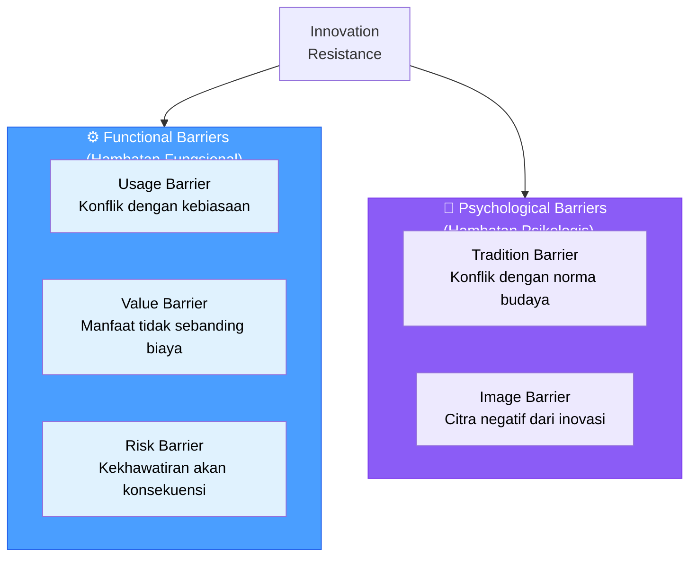
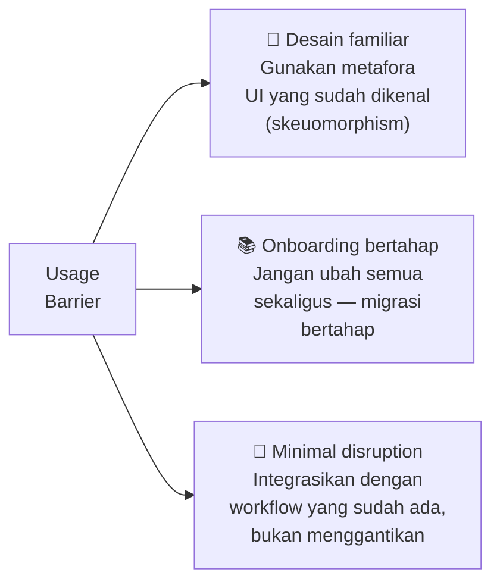
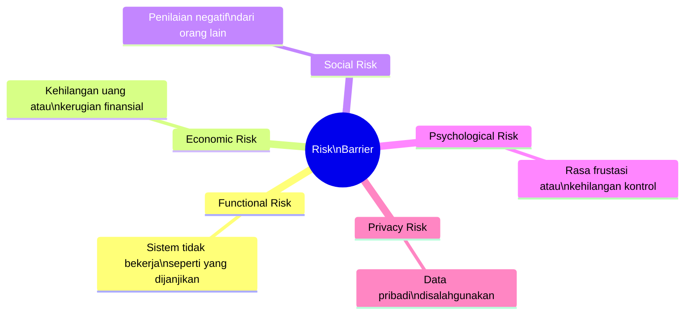
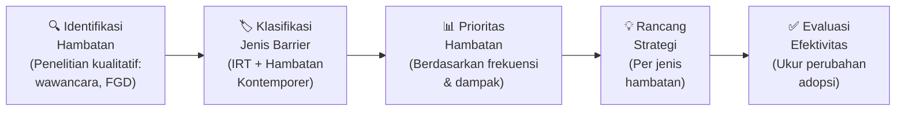

# BAB-16: Hambatan Adopsi Teknologi

> *"Memahami mengapa orang menolak teknologi sama pentingnya — bahkan lebih pentingnya — dari memahami mengapa mereka menerimanya."*  
> — Ram & Sheth (1989)

---

## 🎯 Tujuan Pembelajaran

Setelah membaca bab ini, pembaca diharapkan mampu:
- Mengklasifikasikan hambatan adopsi berdasarkan Innovation Resistance Theory (IRT)
- Menjelaskan mekanisme psikologis di balik setiap jenis hambatan
- Mengidentifikasi hambatan adopsi dalam kasus nyata
- Merancang strategi yang tepat untuk mengatasi hambatan spesifik
- Mengintegrasikan analisis hambatan dalam desain produk dan kebijakan

---

## 📖 Pendahuluan

Mengapa jutaan orang Indonesia masih tidak menggunakan mobile banking padahal infrastrukturnya sudah tersedia? Mengapa petani menolak aplikasi pertanian yang bisa meningkatkan hasil panen mereka? Mengapa lansia enggan menggunakan telemedicine meskipun lebih praktis?

Hambatan adopsi — resistensi terhadap teknologi — adalah fenomena yang sama nyata dan pentingnya dengan faktor-faktor yang mendorong adopsi. Namun selama bertahun-tahun, penelitian adopsi teknologi terlalu fokus pada "mengapa orang mau" dan mengabaikan "mengapa orang tidak mau".

Bab ini mengisi kesenjangan tersebut dengan pembahasan mendalam tentang berbagai hambatan adopsi teknologi.

---

## 16.1 Innovation Resistance Theory (IRT)

Ram & Sheth (1989) mengklasifikasikan hambatan adopsi ke dalam **dua kategori besar** dengan **lima jenis barrier**:

---

## 16.2 Usage Barrier (Hambatan Penggunaan)

**Definisi:** Ketidakcocokan (*incompatibility*) inovasi dengan alur kerja, rutinitas, kebiasaan, atau cara yang sudah biasa dilakukan pengguna.

### Mekanisme Psikologis

Otak manusia secara alami **menyukai rutinitas** (cognitive miser). Ketika teknologi baru mengharuskan perubahan cara kerja yang sudah otomatis, otak merasakan beban kognitif (*cognitive load*) yang tidak menyenangkan.

### Contoh Usage Barrier

| Teknologi | Usage Barrier yang Dialami |
|---|---|
| Sistem ERP baru | Workflow berbeda dari sistem lama yang sudah 10 tahun digunakan |
| E-presensi digital | Berbeda dari absen tanda tangan manual yang sudah jadi kebiasaan |
| Kasir digital di warung | Pedagang sudah terbiasa hitung manual + catat di buku |
| Aplikasi pertanian | Petani terbiasa bertanya ke tetangga, bukan ke aplikasi |

### Strategi Mengatasi Usage Barrier

---

## 16.3 Value Barrier (Hambatan Nilai)

**Definisi:** Inovasi tidak memberikan nilai (*relative advantage*) yang cukup signifikan untuk mengimbangi biaya adopsi — baik biaya uang, waktu, usaha, maupun psikologis.

### Persamaan Value

$$\text{Value} = \frac{\text{Perceived Benefits}}{\text{Perceived Costs}}$$

**Value barrier terjadi ketika:** $\frac{\text{Benefits}}{\text{Costs}} < 1$ (atau dipersepsikan demikian)

### Komponen Biaya yang Sering Diabaikan

| Jenis Biaya | Deskripsi | Contoh |
|---|---|---|
| **Monetary Cost** | Harga perangkat, langganan, data internet | Harga iPhone + biaya data |
| **Learning Cost** | Waktu dan usaha belajar menggunakan | Belajar software baru memakan waktu |
| **Switching Cost** | Biaya pindah dari sistem lama | Transfer data, habituasi ulang |
| **Opportunity Cost** | Kehilangan manfaat dari solusi sebelumnya | Kehilangan familiar UX dari app lama |
| **Psychological Cost** | Stres, frustrasi, kecemasan | Rasa takut salah menekan tombol |

### Strategi Mengatasi Value Barrier

- **Perjelas manfaat konkret**: Tunjukkan ROI (Return on Investment) yang dapat diukur
- **Demonstrasi langsung**: Biarkan calon adopter mencoba dan merasakan sendiri
- **Freemium model**: Kurangi biaya awal dengan versi gratis
- **Testimonial nyata**: Bukti dari pengguna yang sudah merasakan manfaat

---

## 16.4 Risk Barrier (Hambatan Risiko)

**Definisi:** Kekhawatiran tentang berbagai jenis konsekuensi negatif yang mungkin terjadi akibat mengadopsi inovasi.

### Lima Jenis Risiko yang Dipersepsikan

### Risk Barrier dalam Konteks Indonesia

| Risiko | Contoh Spesifik Indonesia | Seberapa Valid? |
|---|---|---|
| **Functional** | "Aplikasi sering error saat transfer" | Sangat valid — banyak kasus nyata |
| **Economic** | "Saldo hilang karena penipuan digital" | Sangat valid — penipuan online marak |
| **Social** | "Dianggap gaptek kalau tidak bisa pakai" | Berlaku dua arah |
| **Psychological** | "Takut salah tekan tombol dan tidak bisa dibatalkan" | Sangat umum pada lansia |
| **Privacy** | "Data NIK/KTP saya bisa disalahgunakan" | Kekhawatiran yang semakin meningkat |

### Strategi Mengatasi Risk Barrier

| Jenis Risiko | Strategi Efektif |
|---|---|
| **Functional** | Garansi uang kembali, free trial, SLA yang jelas |
| **Economic** | Asuransi digital, jaminan keamanan transaksi |
| **Social** | Normalisasi melalui community building |
| **Psychological** | Undo/konfirmasi sebelum action, live support |
| **Privacy** | Sertifikasi keamanan, transparansi pengelolaan data, UU PDP |

---

## 16.5 Tradition Barrier (Hambatan Tradisi)

**Definisi:** Inovasi dianggap tidak konsisten dengan nilai-nilai budaya, norma sosial, atau cara hidup yang sudah lama menjadi bagian dari identitas komunitas.

### Mekanisme Tradition Barrier

Tradition barrier bukan sekadar "tidak mau berubah" — ia adalah **pertahanan identitas**. Ketika suatu inovasi dianggap mengancam cara hidup yang bermakna, resistensi bukan irasional — ia adalah respons protektif yang logis dari perspektif individu.

### Contoh Tradition Barrier

**Contoh 1: Pembayaran Digital di Pasar Tradisional**
> Transaksi di pasar tradisional bukan hanya soal uang — ia adalah ritual sosial: tawar-menawar, uang kasak, kembalian yang pas, dan kepercayaan personal. QRIS menghilangkan ritual ini dan dianggap "terlalu formal" dan "mengurangi kehangatan".

**Contoh 2: Telemedicine untuk Komunitas Adat**
> Beberapa komunitas adat memandang konsultasi kesehatan sebagai momen spiritual yang perlu dilakukan dengan tatap muka, didampingi ritual tertentu. Telemedicine yang menggantikan kunjungan fisik dipersepsikan sebagai penghinaan terhadap tradisi penyembuhan.

**Contoh 3: Rekam Medis Elektronik di Puskesmas Terpencil**
> Tenaga medis yang sudah 20 tahun mencatat di buku besar menganggap rekam medis elektronik "mengubah cara kerja yang sudah terbukti" — meskipun objektif lebih efisien.

### Strategi Mengatasi Tradition Barrier

- **Pendekatan kultural**: Libatkan pemimpin komunitas/tokoh adat dalam proses adopsi
- **Preserve cultural elements**: Desain teknologi yang tetap mempertahankan unsur tradisi yang bermakna
- **Gradual change**: Perubahan inkremental lebih bisa diterima dari perubahan radikal
- **Cultural translation**: Framing inovasi dalam narasi yang kompatibel dengan nilai lokal

---

## 16.6 Image Barrier (Hambatan Citra)

**Definisi:** Persepsi negatif tentang citra atau reputasi sosial yang dikaitkan dengan penggunaan suatu inovasi — baik citra inovasi itu sendiri maupun citra penggunanya.

### Dua Arah Image Barrier

**Citra Negatif karena Menggunakan:**
> "Orang yang pakai pinjol (pinjaman online) dianggap tidak mampu mengelola keuangan"
> "Pengguna medsos dianggap tidak produktif oleh atasan"

**Citra Negatif karena TIDAK Menggunakan:**
> "Orang yang tidak punya smartphone dianggap ketinggalan zaman"  
> Ini yang mendorong adopsi karena tekanan sosial!

### Image Barrier vs. Social Influence

Image Barrier dan Social Influence (UTAUT) adalah dua sisi dari koin yang sama:
- **Social Influence positif** → orang mengadopsi agar diterima/dihormati
- **Image Barrier** → orang menolak karena takut diasosiasikan dengan citra negatif

---

## 16.7 Hambatan Tambahan (Kontemporer)

Selain lima barrier IRT, penelitian kontemporer mengidentifikasi beberapa hambatan tambahan yang semakin relevan:

### 16.7.1 Digital Literacy Barrier
Kemampuan membaca, menulis, dan memahami konten digital yang masih terbatas pada sebagian populasi.

**Data Indonesia (APJII, 2024):** Indeks literasi digital Indonesia berada di skor 3,65 dari 5,0 — masih di kategori "sedang" dengan disparitas besar antara urban dan rural.

### 16.7.2 Accessibility Barrier
Hambatan bagi pengguna dengan disabilitas fisik, kognitif, atau sensorik untuk menggunakan teknologi yang tidak dirancang inklusif.

**Prinsip WCAG** (Web Content Accessibility Guidelines) penting untuk:
- Tunanetra → screen reader compatibility
- Tunarungu → subtitle dan visual alerts
- Pengguna dengan motor disability → large touch targets, keyboard navigation

### 16.7.3 Affordability Barrier
Hambatan ekonomi: harga perangkat, biaya data internet, biaya langganan layanan.

**Data:** Harga smartphone entry-level di Indonesia (~Rp 1-2 juta) masih setara 1-2 bulan UMR di beberapa daerah.

### 16.7.4 Infrastructure Barrier
Ketidaktersediaan infrastruktur pendukung: listrik, internet, sinyal seluler.

**Realitas Indonesia 2024:** Masih ada ~12.000 desa yang belum terjangkau sinyal 4G.

---

## 16.8 Framework Analisis Hambatan: Dari Identifikasi ke Solusi

### Matriks Hambatan vs. Strategi

| Hambatan | Strategi Produk | Strategi Komunikasi | Strategi Kebijakan |
|---|---|---|---|
| **Usage** | Desain familiar, migrasi bertahap | Tutorial & onboarding | Wajibkan dengan periode transisi |
| **Value** | Tambah fitur bernilai, kurangi biaya | Demonstrasi ROI konkret | Subsidi adopsi |
| **Risk** | Fitur keamanan, garansi | Edukasi risiko & mitigasi | Regulasi perlindungan konsumen |
| **Tradition** | Desain kultur-aware | Keterlibatan komunitas | Adaptasi kebijakan lokal |
| **Image** | Rebranding, celebrity endorsement | Normalisasi penggunaan | Role model program |
| **Digital Literacy** | UI ultra-simpel | Pelatihan komunitas | Program literasi digital |
| **Affordability** | Versi ringan/low-spec | Program cicilan | Subsidi perangkat |
| **Infrastructure** | Offline-first design | — | Pembangunan infrastruktur |

---

## 🔗 Keterkaitan dengan Bab Lain

- ⬅️ Bab sebelumnya: [BAB-15 — Faktor-faktor Adopsi](../BAB-15_Faktor_Faktor_Adopsi/README.md)
- ➡️ Bab selanjutnya: [BAB-17 — Trust & Kepercayaan](../BAB-17_Trust_Kepercayaan_dalam_Adopsi/README.md)
- 🔗 IRT lebih detail: [BAB-12](../BAB-12_Teori_Pendukung_Lainnya/README.md)
- 🔗 Digital Divide: [BAB-19](../BAB-19_Digital_Divide/README.md)
- 🔗 Studi kasus hambatan nyata: [BAB-33](../BAB-33_Studi_Kasus/README.md)

---

## ✅ Soal Latihan

1. **Konseptual:** Jelaskan perbedaan antara **Functional Barriers** dan **Psychological Barriers** dalam IRT! Mengapa kedua kategori ini perlu strategi penanganan yang berbeda?

2. **Analitis:** Pemerintah meluncurkan aplikasi "Lapor Desa" untuk pelaporan pembangunan desa secara digital. Namun 80% perangkat desa tidak menggunakannya. Identifikasi **hambatan yang paling mungkin** dari setiap kategori IRT, dan usulan strategi untuk masing-masing!

3. **Aplikasi:** Pilih satu produk teknologi yang saat ini mengalami resistensi dari kelompok tertentu di Indonesia. Analisis **tiga hambatan dominan** yang dihadapi dan rancang **kampanye adopsi** yang menargetkan hambatan tersebut!

4. **Kritis:** Image Barrier bisa bekerja dua arah — mencegah adopsi (citra negatif dari menggunakan) atau mendorong adopsi (citra negatif dari TIDAK menggunakan). Berikan satu contoh untuk masing-masing arah, dan analisis bagaimana fenomena ini berubah seiring waktu dan penyebaran teknologi!

---

## 📚 Referensi Bab Ini

- Dhir, A., Kaur, P., Chen, S., & Pallesen, S. (2019). Antecedents and consequences of social media fatigue. *International Journal of Information Management*, *48*, 193–202.
- Laukkanen, T. (2016). Consumer adoption versus rejection decisions in seemingly similar service innovations: The case of the Internet and mobile banking. *Journal of Business Research*, *69*(7), 2432–2439.
- Laukkanen, T., & Kiviniemi, V. (2010). The role of information in mobile banking resistance. *International Journal of Bank Marketing*, *28*(5), 372–388.
- Ram, S., & Sheth, J. N. (1989). Consumer resistance to innovations: The marketing problem and its solutions. *Journal of Consumer Marketing*, *6*(2), 5–14.
- Talukder, M. (2012). Factors affecting the adoption of technological innovation by individual employees: An Australian study. *Procedia - Social and Behavioral Sciences*, *40*, 52–57.

---

← [BAB-15: Faktor Adopsi](../BAB-15_Faktor_Faktor_Adopsi/README.md) | [README Utama](../README.md) | [BAB-17: Trust →](../BAB-17_Trust_Kepercayaan_dalam_Adopsi/README.md)
