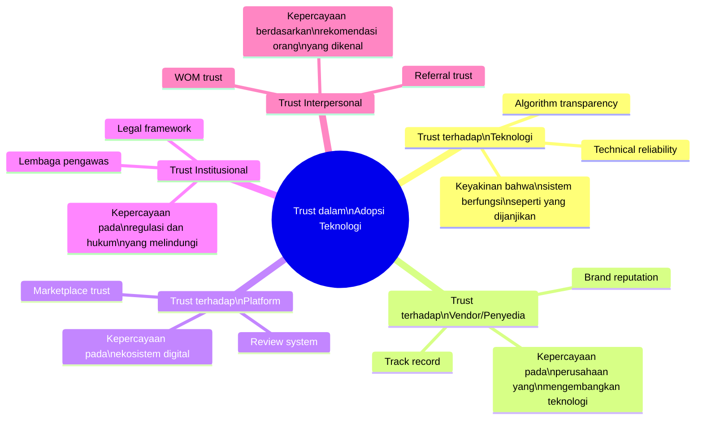
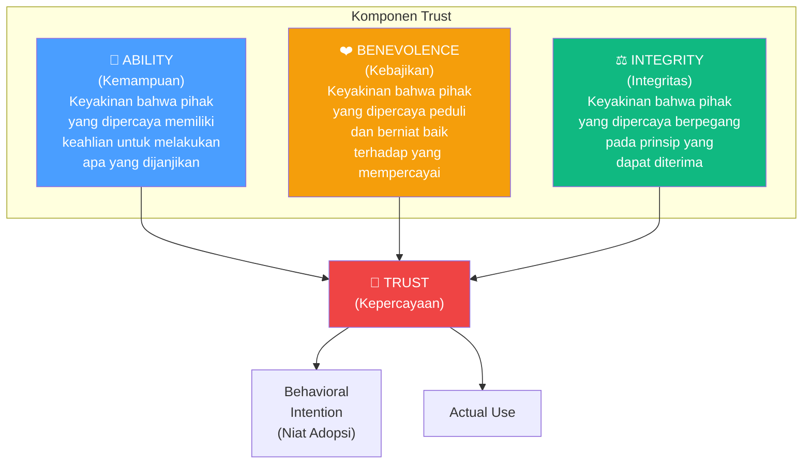
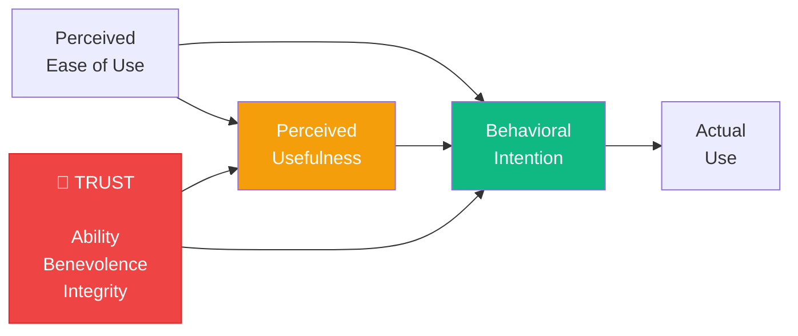
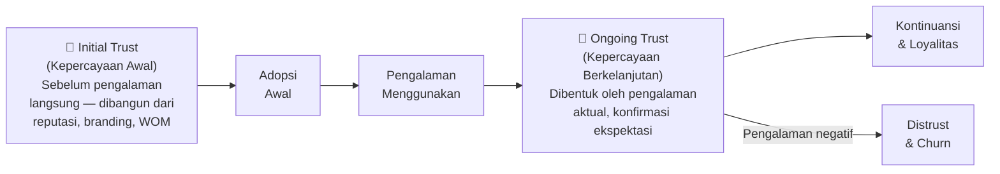
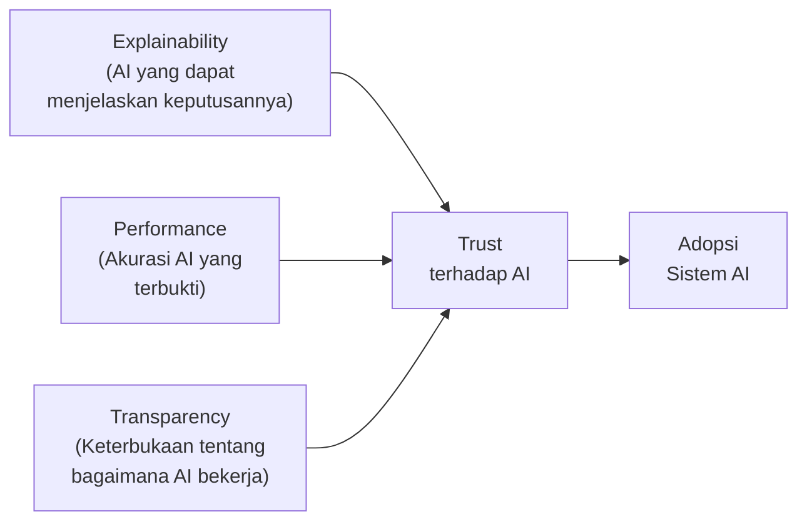

# BAB-17: Trust / Kepercayaan dalam Adopsi Teknologi

> *"Kepercayaan adalah fondasi dari setiap transaksi digital. Tanpanya, tidak ada adopsi yang bertahan lama."*  
> — McKnight & Chervany (2001)

---

## 🎯 Tujuan Pembelajaran

Setelah membaca bab ini, pembaca diharapkan mampu:
- Mendefinisikan trust dan membedakan berbagai jenis kepercayaan dalam konteks digital
- Mengidentifikasi tiga komponen trust (ability, benevolence, integrity)
- Menjelaskan bagaimana trust mempengaruhi adopsi teknologi
- Mengintegrasikan trust ke dalam model adopsi seperti TAM
- Merancang strategi membangun kepercayaan untuk berbagai konteks teknologi

---

## 📖 Pendahuluan

Bayangkan Anda diminta mentransfer uang Rp 5 juta ke seseorang yang baru Anda kenal melalui aplikasi yang baru Anda instal. Apakah Anda akan melakukannya?

Hampir pasti tidak. Bukan karena teknologinya buruk, bukan karena Anda tidak tahu caranya — tetapi karena Anda **belum mempercayai** teknologi dan pihak di baliknya.

**Trust (kepercayaan)** adalah salah satu prediktor adopsi teknologi yang paling kuat, terutama untuk:
- Transaksi keuangan digital (fintech, e-commerce)
- Layanan kesehatan digital (telemedicine, rekam medis elektronik)
- Layanan pemerintah digital (e-government)
- Platform berbagi data pribadi (media sosial, aplikasi AI)

---

## 17.1 Definisi dan Konseptualisasi Trust

### Definisi Trust dalam Konteks IS

> **"Trust is a psychological state comprising the intention to accept vulnerability based on positive expectations of the intentions or behavior of another."**  
> — Rousseau et al. (1998)

**Tiga elemen kunci:**
1. **Kerentanan (vulnerability)**: Pihak yang mempercayai menerima risiko
2. **Ekspektasi positif**: Keyakinan bahwa pihak yang dipercaya akan berperilaku baik
3. **Kesediaan untuk bergantung**: Perilaku nyata yang mencerminkan kepercayaan

---

### 17.1.1 Jenis-jenis Trust dalam Adopsi Teknologi

---

## 17.2 Tiga Komponen Trust (McKnight et al., 2002)

McKnight, Choudhury & Kacmar (2002) mengidentifikasi **tiga komponen** yang membentuk trust:

---

### 17.2.1 Ability (Kemampuan)

**Definisi:** Keyakinan bahwa pihak yang dipercaya memiliki kompetensi, keterampilan, dan kemampuan untuk melakukan apa yang diharapkan.

**Dalam konteks teknologi:**
- **Vendor ability**: "GoPay memiliki tim teknis yang kompeten untuk menjaga keamanan sistem"
- **System ability**: "Sistem ini mampu memproses transaksi saya dengan akurat"
- **Algorithm ability**: "AI ini mampu mendiagnosa dengan akurasi tinggi"

**Indikator Ability yang dapat diamati:**
- Sertifikasi keamanan (ISO 27001, PCI-DSS)
- Track record zero-downtime
- Portofolio dan pengalaman vendor

---

### 17.2.2 Benevolence (Kebajikan)

**Definisi:** Keyakinan bahwa pihak yang dipercaya memiliki orientasi yang positif terhadap kepentingan pihak yang mempercayai — tidak hanya mengejar keuntungan sepihak.

**Dalam konteks teknologi:**
- "GoPay tidak akan menggunakan data transaksi saya untuk tujuan yang merugikan saya"
- "Tokopedia mendesain platformnya untuk melindungi pembeli, bukan hanya penjual"
- "Platform ini akan jujur tentang masalah keamanan yang terjadi"

**Ancaman terhadap Benevolence:**
- Dark patterns dalam desain UI (manipulasi pengguna)
- Penjualan data pribadi ke pihak ketiga
- Syarat dan ketentuan yang merugikan yang disembunyikan

---

### 17.2.3 Integrity (Integritas)

**Definisi:** Keyakinan bahwa pihak yang dipercaya memegang teguh nilai-nilai yang dianggap dapat diterima — kejujuran, tidak korup, tidak menipu.

**Dalam konteks teknologi:**
- Transparansi tentang cara data pengguna digunakan
- Kejujuran tentang risiko keamanan yang ada
- Kepatuhan terhadap regulasi dan hukum yang berlaku

---

## 17.3 Model Integratif: Trust + TAM

Penelitian menunjukkan bahwa Trust adalah konstruk yang **komplementer** dengan TAM dalam menjelaskan adopsi teknologi berbasis layanan.

### Mengapa Trust Perlu Ditambahkan ke TAM?

TAM menjelaskan: "Apakah sistem ini berguna dan mudah digunakan?"  
Trust menambahkan: "Apakah saya aman mempercayakan data dan uang saya pada sistem ini?"

Keduanya diperlukan. Sistem yang berguna dan mudah digunakan tetapi tidak dipercaya (contoh: terkenal sering terkena pelanggaran data) tidak akan diadopsi secara massal.

---

## 17.4 Initial Trust vs. Ongoing Trust

### Initial Trust (Kepercayaan Awal)
Sangat kritis untuk pengguna baru yang belum punya pengalaman langsung. Sumber:
- **Reputation**: Nama baik merek/vendor
- **Structural Assurance**: Sertifikasi, regulasi, lembaga penjamin
- **Disposition to Trust**: Kecenderungan alami individu untuk mempercayai

### Ongoing Trust (Kepercayaan Berkelanjutan)
Dibangun atau dihancurkan oleh pengalaman aktual:
- **Konfirmasi ekspektasi** → memperkuat trust
- **Pelanggaran kepercayaan** (data breach, penipuan) → menghancurkan trust
- **Pemulihan kepercayaan** setelah insiden adalah proses panjang dan mahal

---

## 17.5 Trust dalam Berbagai Konteks Teknologi

### 17.5.1 Trust dalam E-Commerce

**Faktor trust kritis:**
- Sistem review dan rating yang kredibel
- Kebijakan pengembalian yang jelas
- Metode pembayaran yang aman (escrow)
- Sertifikasi SSL/HTTPS

**Studi kasus:** Tokopedia Garansi dan Shopee Garansi sebagai mekanisme trust yang meningkatkan adopsi transaksi online.

---

### 17.5.2 Trust dalam Fintech

| Jenis Fintech | Trust Concern Utama | Strategi Mitigasi |
|---|---|---|
| **Mobile Banking** | Keamanan PIN & OTP, risiko phishing | 2FA, enkripsi end-to-end, edukasi pengguna |
| **Dompet Digital** | Keamanan saldo, risiko hack | Limit transaksi, notifikasi real-time |
| **P2P Lending** | Penipuan platform, gagal bayar | Regulasi OJK, perlindungan rekening escrow |
| **Crypto Exchange** | Volatilitas, exit scam | Regulasi Bappebti, cold storage |

---

### 17.5.3 Trust dalam E-Government

E-government menghadapi tantangan trust yang unik: masyarakat perlu mempercayai **pemerintah sebagai pengelola data** — sebuah kepercayaan yang sering rendah di negara berkembang karena persepsi korupsi.

**Faktor trust dalam e-government:**
- **Institutional trust**: Kepercayaan pada integritas pemerintah secara umum
- **System trust**: Kepercayaan pada keamanan teknis sistem
- **Process trust**: Kepercayaan bahwa proses akan adil dan transparan

---

### 17.5.4 Trust dalam AI dan Sistem Otonom

Trust terhadap AI memiliki dimensi yang unik: **explainability** (kemampuan sistem AI untuk menjelaskan keputusannya).

---

## 17.6 Faktor yang Mempengaruhi Trust

### Membangun Trust

| Strategi | Mekanisme | Contoh |
|---|---|---|
| **Reputation Building** | Konsistensi layanan berkualitas tinggi dari waktu ke waktu | Tokopedia yang tidak pernah "kabur" dengan uang pembeli |
| **Certification & Awards** | Sinyal kredibilitas dari pihak ketiga | Sertifikat ISO, penghargaan BSSN |
| **Transparency** | Keterbukaan tentang cara kerja dan kebijakan | Privacy policy yang jelas dan mudah dibaca |
| **Social Proof** | Review dan rating dari pengguna nyata | Rating bintang, jumlah pengguna aktif |
| **Insurance & Guarantee** | Jaminan proteksi jika terjadi masalah | Tokopedia Garansi, OVO Protect |
| **Familiarity** | Pengalaman berulang yang positif | Habit loop → semakin sering digunakan, semakin dipercaya |

### Menghancurkan Trust

| Kejadian | Dampak | Pemulihan |
|---|---|---|
| **Data Breach** | Trust langsung turun drastis | Panjang dan mahal |
| **Penipuan di Platform** | Image trust rusak | Perlu mekanisme kompensasi |
| **Downtimes Berulang** | Ability trust melemah | Transparansi dan SLA improvement |
| **Dark Patterns UI** | Integrity trust rusak | Redesign + apologi publik |
| **Pemalsuan Review** | Platform trust hancur | Sistem verifikasi lebih ketat |

---

## 17.7 Pengukuran Trust dalam Penelitian

### Item Kuesioner Trust (McKnight et al., 2002 — diadaptasi)

**Ability:**
- "[Platform] memiliki kemampuan teknis yang baik untuk mengelola transaksi saya"
- "Saya percaya [platform] memiliki keahlian untuk menjaga keamanan akun saya"

**Benevolence:**
- "[Platform] memprioritaskan kepentingan pengguna, bukan hanya keuntungan sendiri"
- "Saya percaya [platform] tidak akan menggunakan data saya untuk merugikan saya"

**Integrity:**
- "[Platform] jujur dalam komunikasinya kepada pengguna"
- "[Platform] mematuhi peraturan dan undang-undang yang berlaku"

---

## 🔗 Keterkaitan dengan Bab Lain

- ⬅️ Bab sebelumnya: [BAB-16 — Hambatan Adopsi](../BAB-16_Hambatan_Adopsi/README.md)
- ➡️ Bab selanjutnya: [BAB-18 — Privasi dan Keamanan](../BAB-18_Privasi_dan_Keamanan/README.md)
- 🔗 Risk barrier (hambatan risiko): [BAB-16](../BAB-16_Hambatan_Adopsi/README.md)
- 🔗 Privasi & keamanan: [BAB-18](../BAB-18_Privasi_dan_Keamanan/README.md)
- 🔗 Adopsi e-government: [BAB-25](../BAB-25_Adopsi_per_Sektor/README.md)

---

## ✅ Soal Latihan

1. **Konseptual:** Jelaskan perbedaan antara **Ability**, **Benevolence**, dan **Integrity** sebagai komponen trust! Berikan contoh konkret untuk masing-masing dalam konteks aplikasi dompet digital!

2. **Analitis:** GoPay mengalami insiden keamanan di mana beberapa akun diretas. Analisis dampak insiden ini terhadap ketiga komponen trust (Ability, Benevolence, Integrity) dan usulan langkah pemulihan yang tepat untuk masing-masing!

3. **Aplikasi:** Rancang model penelitian yang mengintegrasikan **TAM + Trust** untuk meneliti adopsi **e-government** oleh masyarakat di Indonesia. Tentukan hipotesis dan jelaskan mengapa trust perlu ditambahkan ke TAM dalam konteks ini!

4. **Kritis:** Trust terhadap AI menjadi isu yang semakin penting. Apakah konsep **Explainability** (kemampuan AI menjelaskan keputusannya) cukup untuk membangun trust? Faktor lain apa yang perlu dipertimbangkan, terutama dalam konteks AI di layanan publik Indonesia?

---

## 📚 Referensi Bab Ini

- Gefen, D., Karahanna, E., & Straub, D. W. (2003). Trust and TAM in online shopping: An integrated model. *MIS Quarterly*, *27*(1), 51–90. https://doi.org/10.2307/30036519
- McKnight, D. H., Choudhury, V., & Kacmar, C. (2002). Developing and validating trust measures for e-commerce: An integrative typology. *Information Systems Research*, *13*(3), 334–359. https://doi.org/10.1287/isre.13.3.334.81
- Mayer, R. C., Davis, J. H., & Schoorman, F. D. (1995). An integrative model of organizational trust. *Academy of Management Review*, *20*(3), 709–734. https://doi.org/10.2307/258792
- Rousseau, D. M., Sitkin, S. B., Burt, R. S., & Camerer, C. (1998). Not so different after all: A cross-discipline view of trust. *Academy of Management Review*, *23*(3), 393–404.

---

← [BAB-16: Hambatan](../BAB-16_Hambatan_Adopsi/README.md) | [README Utama](../README.md) | [BAB-18: Privasi & Keamanan →](../BAB-18_Privasi_dan_Keamanan/README.md)
