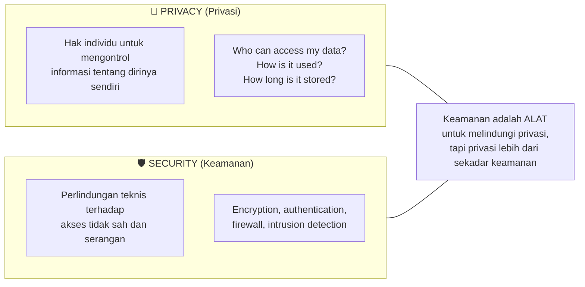
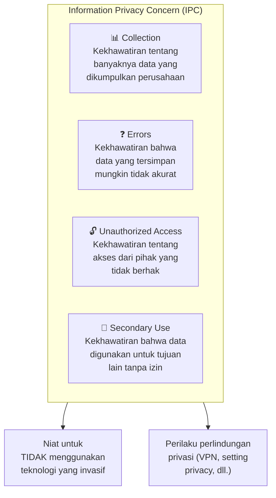
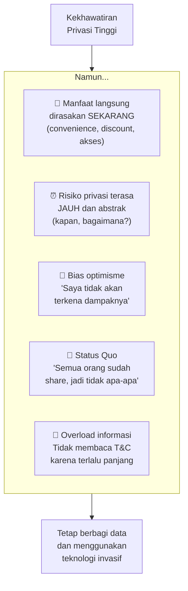
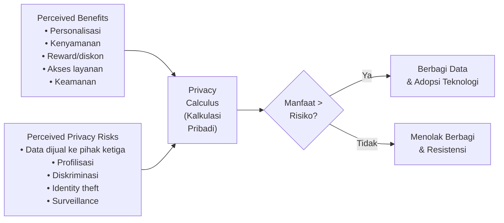
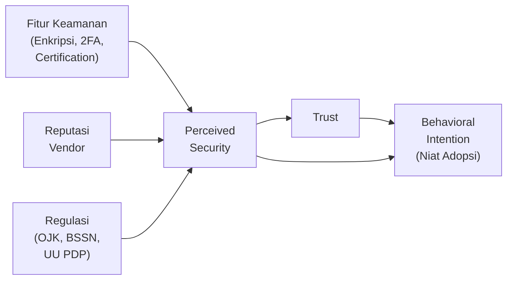

# BAB-18: Privasi dan Keamanan dalam Adopsi Teknologi

> *"Paradoks privasi: orang-orang sangat khawatir tentang privasi mereka, namun terus membagikan data pribadi mereka secara sukarela."*  
> — Acquisti & Grossklags (2005)

---

## 🎯 Tujuan Pembelajaran

Setelah membaca bab ini, pembaca diharapkan mampu:
- Mendefinisikan privacy concern dan security concern dalam konteks adopsi teknologi
- Menjelaskan "privacy paradox" dan implikasinya bagi penelitian
- Mengidentifikasi regulasi privasi yang relevan di Indonesia
- Menjelaskan bagaimana privasi dan keamanan mempengaruhi keputusan adopsi
- Merancang strategi komunikasi privasi yang efektif untuk mendorong adopsi

---

## 📖 Pendahuluan

Di era digital, setiap kali kita menggunakan teknologi, kita meninggalkan jejak data:
- Lokasi GPS saat membuka Gojek
- Riwayat pembelian di Tokopedia
- Data biometrik (wajah, sidik jari) untuk Face ID
- Riwayat pencarian di Google
- Data kesehatan dari aplikasi fitness tracker

Pertanyaannya: **Apakah kekhawatiran tentang privasi dan keamanan data menghambat adopsi teknologi?**

Jawaban singkatnya: **Ya, tapi lebih kompleks dari yang kita kira.** Ada paradoks menarik di sini — orang yang paling sering mengungkapkan kekhawatiran privasi seringkali adalah pengguna paling aktif platform yang mengumpulkan data mereka.

---

## 18.1 Konseptualisasi Privasi dan Keamanan

### 18.1.1 Privacy vs. Security: Perbedaan Konseptual

Dua istilah ini sering dipertukarkan padahal berbeda:

| Aspek | Privacy | Security |
|---|---|---|
| **Fokus** | Kontrol atas informasi pribadi | Perlindungan dari akses tidak sah |
| **Pelaku ancaman** | Penyedia layanan sendiri (legal tapi tidak etis) | Pihak ketiga jahat (hacker, fraud) |
| **Pengukuran** | Privacy concern, privacy calculus | Security perception, perceived risk |
| **Solusi** | Regulasi, consent, data minimization | Enkripsi, autentikasi, monitoring |

---

### 18.1.2 Information Privacy Theory

**Smith, Milberg & Burke (1996)** mengembangkan Information Privacy Concern (IPC) dengan empat dimensi:

---

## 18.2 Privacy Paradox

### Fenomena

**Privacy Paradox** adalah inkonsistensi yang mengejutkan antara **sikap** dan **perilaku** terkait privasi:

> **Sikap:** "Saya sangat khawatir tentang privasi data saya"  
> **Perilaku:** *[terus menggunakan Facebook, berbagi lokasi di Instagram, login dengan Google]*

**Data empiris menunjukkan:** Orang yang menyatakan kekhawatiran privasi paling tinggi seringkali adalah pengguna paling aktif dari platform yang mengumpulkan data paling banyak.

---

### Penjelasan Privacy Paradox

### Implikasi bagi Peneliti

Privacy Paradox berarti:
1. **Kuesioner** tentang privacy concern mungkin melebih-lebihkan kekhawatiran aktual
2. **Perilaku aktual** lebih informatif dari pernyataan sikap
3. **Konteks spesifik** sangat menentukan — orang lebih waspada untuk data kesehatan vs. data preferensi belanja

---

## 18.3 Privacy Calculus

**Privacy Calculus** adalah kerangka pengambilan keputusan pengguna terkait privasi:

$$\text{Keputusan Berbagi Data} = f\left(\frac{\text{Perceived Benefits}}{\text{Perceived Privacy Risks}}\right)$$

**Implikasi Praktis:**
- Meningkatkan perceived benefits (value proposition yang jelas) → meningkatkan adopsi
- Mengurangi perceived risks (jaminan keamanan, transparansi) → meningkatkan adopsi
- Keduanya harus dikelola secara aktif

---

## 18.4 Regulasi Privasi yang Mempengaruhi Adopsi

### 18.4.1 General Data Protection Regulation (GDPR) — Uni Eropa

GDPR (2018) adalah regulasi perlindungan data paling komprehensif di dunia, yang berdampak global karena berlaku untuk **setiap entitas yang mengolah data warga EU**:

| Prinsip GDPR | Implikasi untuk Teknologi |
|---|---|
| **Lawfulness, Fairness, Transparency** | Harus ada dasar hukum untuk memproses data |
| **Purpose Limitation** | Data hanya boleh digunakan sesuai tujuan yang dinyatakan |
| **Data Minimization** | Hanya kumpulkan data yang benar-benar diperlukan |
| **Accuracy** | Data harus akurat dan diperbarui |
| **Storage Limitation** | Tidak boleh menyimpan data lebih lama dari yang diperlukan |
| **Right to be Forgotten** | Pengguna bisa meminta data dihapus |
| **Data Portability** | Pengguna bisa memindahkan data ke platform lain |

---

### 18.4.2 Undang-Undang Perlindungan Data Pribadi (UU PDP) Indonesia

**UU No. 27 Tahun 2022** tentang Perlindungan Data Pribadi adalah tonggak penting bagi ekosistem digital Indonesia:

| Aspek | Ketentuan UU PDP |
|---|---|
| **Definisi Data Pribadi** | Umum (nama, alamat) dan Spesifik (kesehatan, biometrik, rekam medis) |
| **Hak Subjek Data** | Mengakses, memperbaiki, menghapus, dan membawa data |
| **Kewajiban Pengendali** | Transparansi, keamanan, notifikasi kebocoran |
| **Sanksi** | Pidana (6 tahun penjara) dan denda (Rp 6 miliar) |
| **Transfer Data Lintas Negara** | Hanya ke negara dengan perlindungan setara |

**Dampak UU PDP terhadap Adopsi:**
- Meningkatkan kepercayaan pengguna terhadap layanan digital Indonesia
- Mendorong platform asing mematuhi standar privasi lokal
- Dapat meningkatkan adoption rate terutama untuk layanan keuangan dan kesehatan

---

## 18.5 Perceived Security dan Adopsi Teknologi

### Model Security-Trust-Adoption

### Fitur Keamanan yang Meningkatkan Perceived Security

| Fitur | Fungsi | Pengaruh pada Adopsi |
|---|---|---|
| **HTTPS/SSL** | Enkripsi komunikasi | Dasar kepercayaan minimum |
| **Two-Factor Authentication** | Verifikasi berlapis | Meningkatkan keamanan signifikan |
| **Biometric Authentication** | Face ID, fingerprint | Convenience + security |
| **OTP via SMS/Authenticator** | Konfirmasi transaksi | Standar industri fintech |
| **Encryption at Rest** | Data tersimpan terenkripsi | Penting untuk data sensitif |
| **Security Certifications** | ISO 27001, PCI-DSS | Sinyal kredibilitas ke pengguna |
| **Bug Bounty Program** | Insentif untuk temukan celah | Menunjukkan komitmen keamanan |

---

## 18.6 Privacy-Enhancing Technologies (PETs)

Teknologi yang dirancang untuk **meningkatkan privasi** sekaligus memungkinkan fungsi layanan:

| Teknologi | Cara Kerja | Contoh Penerapan |
|---|---|---|
| **VPN** | Enkripsi lalu lintas jaringan | Melindungi data browsing |
| **Differential Privacy** | Menambahkan "noise" statistik ke data | Apple, Google Analytics |
| **Federated Learning** | AI dilatih tanpa data meninggalkan perangkat | Google Keyboard, Apple Siri |
| **Zero-Knowledge Proof** | Verifikasi tanpa mengungkap data | Blockchain identity |
| **End-to-End Encryption** | Hanya pengirim & penerima bisa membaca | WhatsApp, Signal |

---

## 18.7 Strategi Komunikasi Privasi yang Efektif

### 18.7.1 Transparency Nudges
Tampilkan informasi privasi dengan cara yang mudah dipahami — bukan 50 halaman legalese.

**Contoh baik:** Privacy nutrition label (Apple App Store) yang menunjukkan data apa yang dikumpulkan dalam format visual yang jelas.

**Contoh buruk:** "By continuing, you agree to our Terms of Service and Privacy Policy" — tidak ada yang membaca ini.

### 18.7.2 Privacy by Design

Prinsip: **Privasi dibangun ke dalam sistem sejak awal**, bukan ditambahkan belakangan.

| Prinsip Privacy by Design | Implikasi Desain |
|---|---|
| **Proactive, not reactive** | Identifikasi risiko privasi sebelum ada masalah |
| **Privacy as default** | Setting privasi paling ketat sebagai default |
| **Full functionality** | Privasi tidak mengorbankan fitur |
| **End-to-end security** | Proteksi sepanjang siklus hidup data |
| **Visibility and transparency** | Pengguna tahu apa yang terjadi dengan data mereka |

---

## 18.8 Konteks Indonesia: Keunikan Privasi dan Keamanan

### Tantangan Spesifik Indonesia

| Tantangan | Deskripsi |
|---|---|
| **Literasi privasi rendah** | Banyak pengguna tidak memahami risiko berbagi data |
| **Social engineering masif** | Penipuan via WhatsApp, SMS, dan telepon sangat marak |
| **Data breach besar** | Kasus kebocoran data BPJS, Tokopedia, PLN menciptakan kekhawatiran |
| **Kultur berbagi informasi** | "Kekeluargaan digital" → berbagi data dengan mudah |
| **Regulasi baru** | UU PDP baru 2022, ekosistem compliance masih berkembang |

### Peristiwa Besar yang Mempengaruhi Trust di Indonesia

| Tahun | Insiden | Dampak pada Adopsi |
|---|---|---|
| 2020 | Kebocoran data 91 juta akun Tokopedia | Penurunan kepercayaan e-commerce |
| 2021 | Kebocoran data 279 juta data BPJS | Kekhawatiran masif terhadap data pemerintah |
| 2022 | Kebocoran data PLN, IndiHome | Pertanyaan tentang keamanan BUMN digital |
| 2023 | Kasus penipuan deepfake berbasis AI | Kekhawatiran baru tentang AI |

---

## 🔗 Keterkaitan dengan Bab Lain

- ⬅️ Bab sebelumnya: [BAB-17 — Trust](../BAB-17_Trust_Kepercayaan_dalam_Adopsi/README.md)
- ➡️ Bab selanjutnya: [BAB-19 — Digital Divide](../BAB-19_Digital_Divide/README.md)
- 🔗 Hambatan risiko: [BAB-16](../BAB-16_Hambatan_Adopsi/README.md)
- 🔗 Adopsi fintech: [BAB-25](../BAB-25_Adopsi_per_Sektor/README.md)
- 🔗 Konteks Indonesia: [BAB-24](../BAB-24_Konteks_Indonesia/README.md)

---

## ✅ Soal Latihan

1. **Konseptual:** Jelaskan **Privacy Paradox** dengan contoh konkret dari kehidupan digital Anda sendiri! Apa yang menyebabkan inkonsistensi antara sikap dan perilaku privasi ini?

2. **Analitis:** Sebuah aplikasi kesehatan meminta akses ke: lokasi real-time, kontak, kamera, mikrofon, dan riwayat panggilan. Gunakan kerangka **Privacy Calculus** untuk menganalisis apakah pengguna akan memberikan izin atau tidak!

3. **Aplikasi:** Anda adalah product manager sebuah aplikasi telemedicine di Indonesia yang baru diluncurkan. Rancang **strategi privacy communication** yang efektif untuk meningkatkan kepercayaan calon pengguna dan mendorong adopsi!

4. **Kritis:** UU PDP Indonesia (2022) baru saja disahkan. Analisis **dampak positif dan dampak negatif** UU ini terhadap adopsi layanan digital di Indonesia. Apakah regulasi yang lebih ketat selalu meningkatkan kepercayaan dan adopsi?

---

## 📚 Referensi Bab Ini

- Acquisti, A., & Grossklags, J. (2005). Privacy and rationality in individual decision making. *IEEE Security & Privacy*, *3*(1), 26–33.
- Dinev, T., & Hart, P. (2006). An extended privacy calculus model for e-commerce transactions. *Information Systems Research*, *17*(1), 61–80.
- Smith, H. J., Milberg, S. J., & Burke, S. J. (1996). Information privacy: Measuring individuals' concerns about organizational practices. *MIS Quarterly*, *20*(2), 167–196.
- Taddei, S., & Contena, B. (2013). Privacy, trust and control: Which relationships with online self-disclosure? *Computers in Human Behavior*, *29*(3), 821–826.
- Kominfo RI. (2022). *Undang-Undang Nomor 27 Tahun 2022 tentang Perlindungan Data Pribadi*. Kementerian Komunikasi dan Informatika.

---

← [BAB-17: Trust](../BAB-17_Trust_Kepercayaan_dalam_Adopsi/README.md) | [README Utama](../README.md) | [BAB-19: Digital Divide →](../BAB-19_Digital_Divide/README.md)
