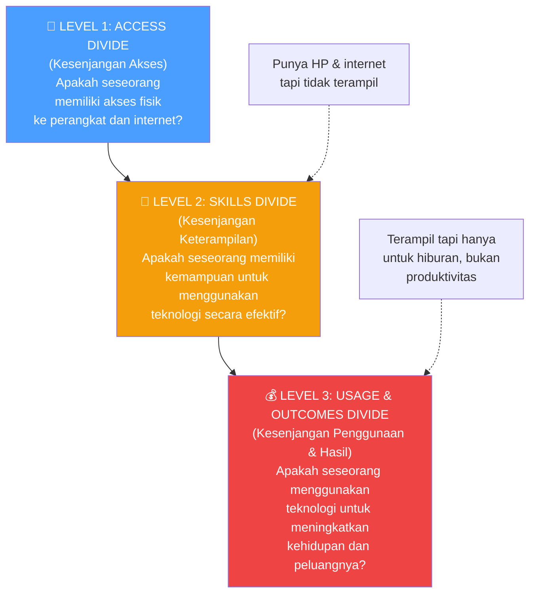
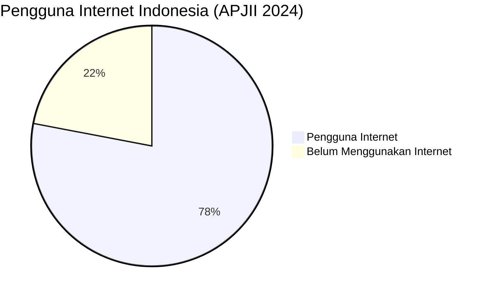
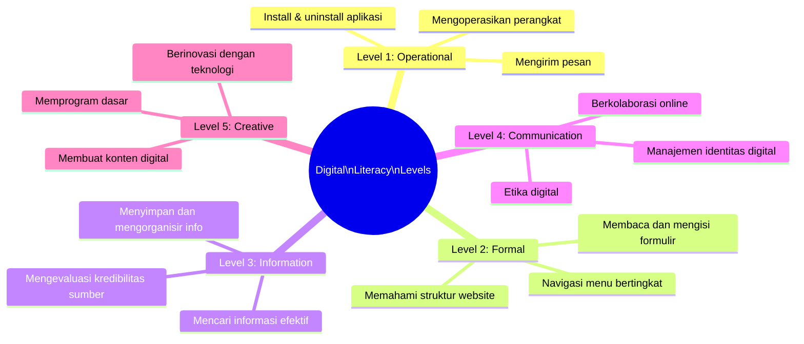
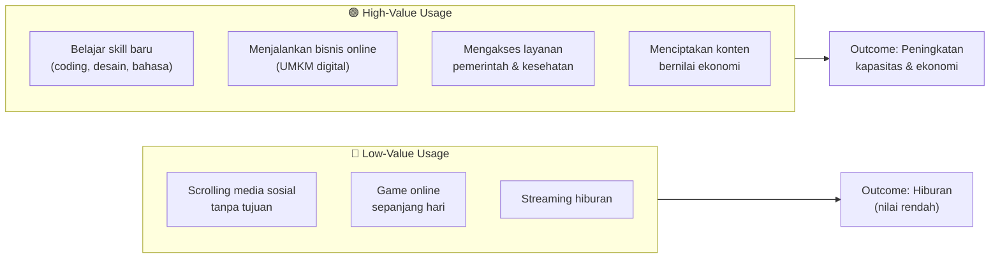
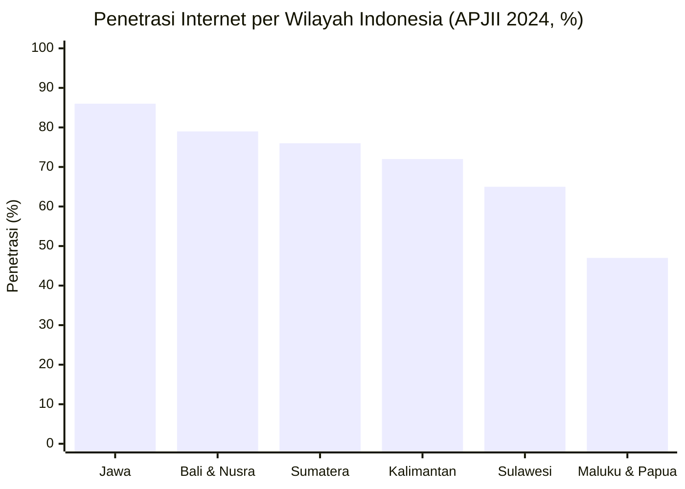
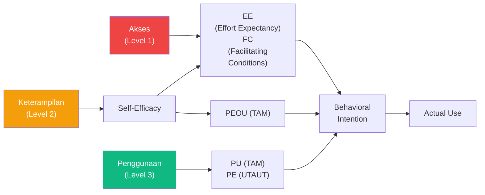

# BAB-19: Digital Divide (Kesenjangan Digital)

> *"Internet telah mengubah dunia — tetapi tidak secara merata. Bagi yang tidak terhubung, internet tidak hanya sekadar ketidaknyamanan; ia adalah pengecualian dari peluang abad ini."*  
> — Kofi Annan

---

## 🎯 Tujuan Pembelajaran

Setelah membaca bab ini, pembaca diharapkan mampu:
- Mendefinisikan digital divide dan membedakan tiga level kesenjangan
- Menjelaskan dimensi-dimensi digital divide (access, skills, usage, outcomes)
- Mengidentifikasi populasi yang paling terdampak oleh digital divide
- Menghubungkan digital divide dengan teori adopsi teknologi
- Menganalisis digital divide dalam konteks Indonesia

---

## 📖 Pendahuluan

Ketika kita membahas adopsi teknologi, ada asumsi implisit yang sering kita buat: bahwa **semua orang memiliki kesempatan yang sama** untuk mengakses dan menggunakan teknologi.

Kenyataannya jauh dari itu.

**Digital divide** — kesenjangan digital — adalah perbedaan sistematis dalam kemampuan untuk mengakses, menggunakan, dan mendapat manfaat dari teknologi informasi dan komunikasi (TIK). Kesenjangan ini bukan hanya soal "punya HP atau tidak" — ia jauh lebih dalam, berlapis, dan memiliki konsekuensi yang sangat nyata pada kehidupan dan peluang seseorang.

---

## 19.1 Definisi dan Evolusi Konsep Digital Divide

### Sejarah Konsep

| Periode | Definisi Dominan | Fokus Utama |
|---|---|---|
| **1990-an** | Divide = punya vs. tidak punya komputer | Kepemilikan perangkat |
| **2000-an** | Divide = punya vs. tidak punya akses internet | Konektivitas |
| **2010-an** | Divide = kualitas penggunaan & keterampilan | Skills & usage quality |
| **2020-an** | Divide = outcomes & manfaat yang diperoleh | Hasil dan dampak nyata |

---

### 19.1.1 Tiga Level Digital Divide (Van Dijk, 2006)

---

## 19.2 Level 1: Access Divide (Kesenjangan Akses)

### Dimensi Akses

| Dimensi | Definisi | Indikator |
|---|---|---|
| **Physical Access** | Kepemilikan perangkat (HP, komputer, tablet) | % rumah tangga dengan HP |
| **Infrastructure Access** | Ketersediaan jaringan internet | Coverage 4G/5G, ketersediaan fiber |
| **Financial Access** | Kemampuan membayar biaya perangkat dan data | Harga HP/data vs. pendapatan |

### Data Access Divide di Indonesia (2024)

**Fakta Kunci:**
- **215 juta** pengguna internet dari 275 juta penduduk (78.19%)
- **12.548 desa** masih dalam blankspot jaringan seluler
- Penetrasi di Jawa: **86%** vs. Papua: **42%**
- **60%** koneksi menggunakan HP saja (tidak punya laptop/komputer)

---

## 19.3 Level 2: Skills Divide (Kesenjangan Keterampilan)

Memiliki akses saja tidak cukup. Keterampilan digital menentukan apakah seseorang dapat memanfaatkan teknologi secara efektif.

### 19.3.1 Lima Level Literasi Digital

### Data Literasi Digital Indonesia (Kominfo, 2023)

**Indeks Literasi Digital Indonesia: 3.54 dari 5.00** (Kategori Sedang)

| Pilar | Skor |
|---|---|
| Kecakapan Digital | 3.52 |
| Etika Digital | 3.68 |
| Keamanan Digital | 3.12 |
| Budaya Digital | 3.84 |

> ⚠️ Dimensi **Keamanan Digital** mendapat skor terendah (3.12) — sangat relevan dengan diskusi privasi di [BAB-18](../BAB-18_Privasi_dan_Keamanan/README.md).

---

## 19.4 Level 3: Usage & Outcomes Divide

Bahkan ketika seseorang memiliki akses dan keterampilan, **tujuan penggunaan** dan **hasil yang diperoleh** bisa sangat berbeda.

### Spectrum Penggunaan: Konsumsi vs. Produksi

**Temuan penting:** Kelompok yang sudah terpinggirkan secara sosial-ekonomi cenderung menggunakan internet lebih banyak untuk hiburan dan lebih sedikit untuk tujuan produktif — bukan karena pilihan, tetapi karena kurangnya dukungan, role model, dan kesempatan.

---

## 19.5 Populasi yang Paling Terdampak

### 19.5.1 Kesenjangan Geografis (Urban-Rural)

### 19.5.2 Kesenjangan Generasi

| Generasi | Profil Digital | Hambatan Dominan |
|---|---|---|
| **Gen Z (1997-2012)** | Digital native, high skills, mobile-first | Kualitas penggunaan (hiburan vs. produktif) |
| **Millennials (1981-1996)** | Adaptif, hybrid digital | Keseimbangan work-life digital |
| **Gen X (1965-1980)** | Adopter lambat, instrumen-focused | Kecemasan teknologi baru |
| **Baby Boomers (1946-1964)** | Banyak yang belum online | Akses, skills, kecemasan |
| **Silent Generation (1928-1945)** | Sebagian besar offline | Akses, kesehatan, relevansi |

### 19.5.3 Kesenjangan Gender

**Data Global (World Bank, 2023):** Rata-rata 21% lebih sedikit perempuan menggunakan internet dibanding laki-laki di negara berkembang.

**Indonesia:** Gap gender dalam penggunaan internet lebih kecil (~6%) namun masih signifikan dalam penggunaan produktif (bisnis online, akses layanan keuangan).

**Faktor penyebab:**
- Norma sosial tentang perempuan dan teknologi
- Kontrol akses perangkat dalam keluarga
- Kurangnya role model perempuan dalam teknologi
- Konten yang tidak relevan atau tidak aman

### 19.5.4 Kesenjangan Ekonomi

| Kelompok Pendapatan | Akses Internet | Smartphone | Keterampilan Digital |
|---|---|---|---|
| **Atas** | ~99% | ~99% | Tinggi |
| **Menengah** | ~85% | ~90% | Sedang-Tinggi |
| **Bawah** | ~55% | ~60% | Rendah |
| **Miskin** | ~25% | ~30% | Sangat Rendah |

---

## 19.6 Digital Divide dan Teori Adopsi Teknologi

Digital Divide memiliki hubungan langsung dengan teori-teori adopsi yang telah dipelajari:

### 19.6.1 Mengapa UTAUT Perlu Moderating Variables

Variabel moderating dalam UTAUT (Gender, Age, Experience) secara eksplisit mengakui bahwa digital divide ada:
- **Gender** memoderasi PE dan EE → perempuan dan laki-laki merespons berbeda
- **Age** memoderasi EE dan FC → pengguna tua perlu lebih banyak dukungan
- **Experience** memoderasi EE dan SI → pengguna baru lebih bergantung pada panduan

### 19.6.2 Digital Divide sebagai Anteseden Adopsi

---

## 19.7 Inisiatif Menjembatani Digital Divide di Indonesia

### Inisiatif Pemerintah

| Program | Sasaran | Mekanisme |
|---|---|---|
| **Palapa Ring** | Memperluas infrastruktur internet ke daerah 3T | Pembangunan jaringan fiber optik nasional |
| **Universal Service Obligation (USO)** | Daerah terpencil yang tidak menguntungkan komersial | Subsidi pemerintah untuk operator |
| **BAKTI Kominfo** | 12.548 desa blankspot | BTS 4G di daerah terpencil |
| **Gerakan Literasi Digital Nasional** | Meningkatkan indeks literasi digital | Pelatihan dan edukasi masif |
| **Digital Talent Scholarship** | Pengembangan SDM digital | Beasiswa keterampilan digital |
| **1000 Startup Digital** | Ekosistem startup | Inkubasi startup di daerah |

### Inisiatif Swasta

| Inisiatif | Pelopor | Dampak |
|---|---|---|
| **Free Basic Internet** | Facebook (Free Basics) | Kontroversial — net neutrality |
| **Zero-rating** | Indosat, Telkomsel | Akses tanpa kuota ke platform tertentu |
| **Affordable Smartphone** | Realme, POCO, Samsung A Series | Menurunkan harga akses hardware |
| **Lite Apps** | Facebook Lite, YouTube Go | Mengurangi kebutuhan bandwidth |

---

## 19.8 Digital Divide dalam Konteks Pandemi COVID-19

Pandemi 2020-2022 menjadi **ujian nyata** digital divide:

| Konteks | Dampak Digital Divide |
|---|---|
| **Pendidikan** | Siswa tanpa HP/internet tidak dapat mengikuti PJJ → dropout |
| **Pekerjaan** | WFH hanya bisa dilakukan oleh pekerja "berkerah putih" dengan akses digital |
| **Kesehatan** | Telemedicine hanya bisa diakses oleh yang punya HP & internet |
| **Bantuan Sosial** | Bansos digital gagal menjangkau yang tidak terdaftar di sistem |

> **Ironi:** Pandemi yang mendorong digitalisasi masif justru memperlebar digital divide di kalangan yang sudah terpinggirkan.

---

## 19.9 Digital Divide dan SDGs

Digital divide terhubung langsung dengan beberapa Sustainable Development Goals (SDGs) 2030:

| SDG | Koneksi dengan Digital Divide |
|---|---|
| **SDG 1**: No Poverty | Akses digital membuka peluang ekonomi |
| **SDG 4**: Quality Education | E-learning mensyaratkan akses & literasi digital |
| **SDG 5**: Gender Equality | Kesetaraan akses digital untuk perempuan |
| **SDG 8**: Decent Work | Ekonomi digital menciptakan lapangan kerja baru |
| **SDG 9**: Innovation & Infrastructure | Infrastruktur digital sebagai fondasi |
| **SDG 10**: Reduced Inequalities | Digital divide adalah salah satu bentuk ketidaksetaraan |
| **SDG 16**: Strong Institutions | E-government mensyaratkan akses masyarakat |
| **SDG 17**: Partnerships | Kolaborasi pemerintah-swasta untuk menjembatani divide |

---

## 🔗 Keterkaitan dengan Bab Lain

- ⬅️ Bab sebelumnya: [BAB-18 — Privasi & Keamanan](../BAB-18_Privasi_dan_Keamanan/README.md)
- ➡️ Bab selanjutnya: [BAB-20 — Adopsi Individu vs Organisasi](../BAB-20_Adopsi_Individu_vs_Organisasi/README.md)
- 🔗 Generasi digital: [BAB-22](../BAB-22_Generasi_Digital_Native_vs_Immigrant/README.md)
- 🔗 Konteks Indonesia: [BAB-24](../BAB-24_Konteks_Indonesia/README.md)
- 🔗 Gender & demografi: [BAB-21](../BAB-21_Gender_dan_Demografi/README.md)

---

## ✅ Soal Latihan

1. **Konseptual:** Jelaskan **tiga level digital divide** dengan contoh konkret untuk setiap level di konteks Indonesia! Mengapa Level 3 (Usage & Outcomes Divide) sering dianggap yang paling sulit diatasi?

2. **Analitis:** Seorang siswa SMA di daerah terpencil NTT memiliki smartphone dengan paket data 1 GB/bulan yang sangat lambat. Analisis posisinya di ketiga level digital divide dan identifikasi hambatan yang ia hadapi untuk mengakses pendidikan digital!

3. **Aplikasi:** Anda ditugaskan merancang **program literasi digital** untuk ibu rumah tangga usia 40-55 tahun di pedesaan Jawa Tengah. Berdasarkan pemahaman Anda tentang digital divide dan teori adopsi, rancang program yang efektif, realistis, dan berkelanjutan!

4. **Kritis:** Ada pandangan bahwa "market forces" (mekanisme pasar) cukup untuk menjembatani digital divide tanpa perlu intervensi pemerintah — karena harga teknologi terus turun dan konektivitas terus meningkat. Setuju atau tidak setuju? Argumentasikan dengan data dan teori!

---

## 📚 Referensi Bab Ini

- APJII. (2024). *Survei penetrasi internet Indonesia 2024*. Asosiasi Penyelenggara Jasa Internet Indonesia.
- Kominfo RI. (2023). *Indeks literasi digital Indonesia 2023*. Kementerian Komunikasi dan Informatika.
- Norris, P. (2001). *Digital divide: Civic engagement, information poverty, and the Internet worldwide*. Cambridge University Press.
- UNDP. (2022). *Digital divide and sustainable development goals: Connecting the unconnected*. United Nations Development Programme.
- Van Dijk, J. A. G. M. (2006). Digital divide research, achievements and shortcomings. *Poetics*, *34*(4–5), 221–235. https://doi.org/10.1016/j.poetic.2006.05.004
- World Bank. (2023). *World development report 2023: Migrants, refugees, and societies*. World Bank.

---

← [BAB-18: Privasi](../BAB-18_Privasi_dan_Keamanan/README.md) | [README Utama](../README.md) | [BAB-20: Adopsi Individu vs Organisasi →](../BAB-20_Adopsi_Individu_vs_Organisasi/README.md)
