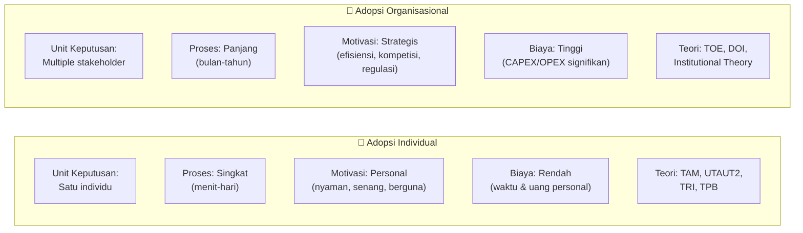
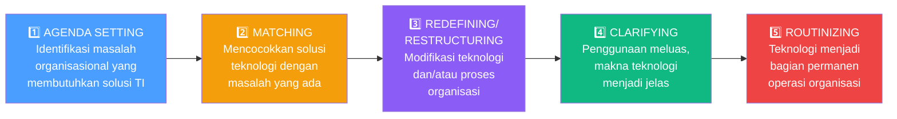
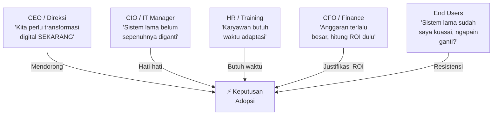
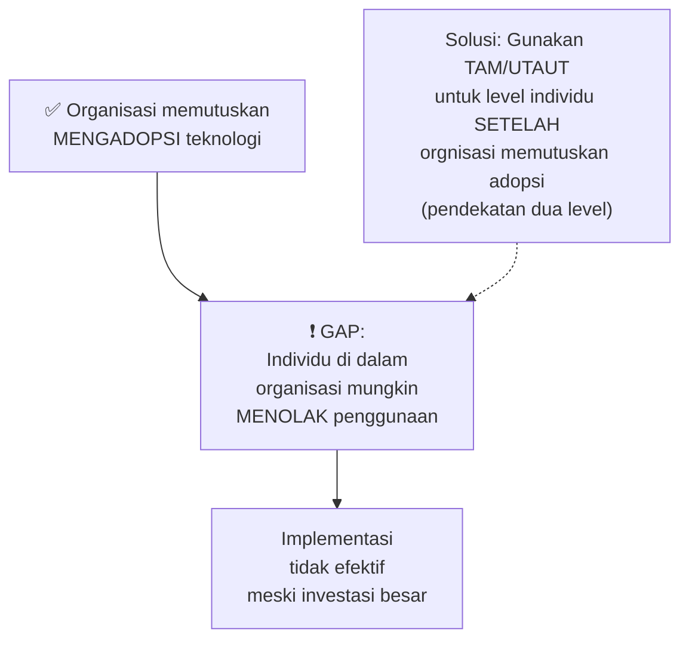
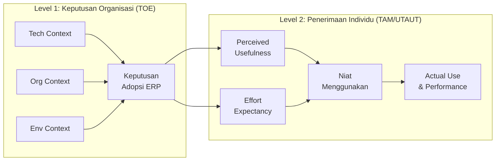

# BAB-20: Adopsi Individu vs. Adopsi Organisasi

> *"Keputusan seseorang untuk menggunakan teknologi sangat berbeda dari keputusan sebuah organisasi untuk mengadopsinya — baik dalam prosesnya, pelakunya, maupun faktor penentunya."*

---

## 🎯 Tujuan Pembelajaran

Setelah membaca bab ini, pembaca diharapkan mampu:
- Membedakan karakteristik adopsi teknologi di level individu versus level organisasi
- Mengidentifikasi tahapan keputusan adopsi di level organisasi
- Menjelaskan siapa saja pemangku kepentingan dalam adopsi organisasional
- Menentukan teori mana yang paling sesuai untuk setiap level analisis
- Merancang strategi adopsi yang berbeda untuk individu dan organisasi

---

## 📖 Pendahuluan

Ketika seorang mahasiswa memutuskan mengunduh aplikasi baru, proses keputusannya berlangsung dalam hitungan detik — lihat ulasan, klik *install*, selesai.

Ketika sebuah universitas memutuskan mengadopsi sistem manajemen pembelajaran (LMS) baru, prosesnya bisa berlangsung **berbulan-bulan hingga bertahun-tahun**: evaluasi vendor, uji coba, pelatihan massal, migrasi data, resistensi staf, sampai akhirnya go-live.

Dua keputusan yang tampak serupa — "menggunakan sistem TI baru" — namun hakikatnya sangat berbeda. Inilah perbedaan fundamental antara **adopsi individual** dan **adopsi organisasional**.

---

## 20.1 Perbandingan Fundamental

---

## 20.2 Tahapan Adopsi Organisasional

Rogers (2003) mengadaptasi model adoption-decision untuk konteks organisasi menjadi **5 tahap**:

---

## 20.3 Stakeholder dalam Adopsi Organisasional

Salah satu kompleksitas utama adopsi organisasional: **banyak pihak dengan kepentingan berbeda** terlibat dalam satu keputusan.

### 20.3.1 Peran Stakeholder (Rogers & Zmud)

| Peran | Siapa | Kepentingan Utama |
|---|---|---|
| **Champion** | Internal advocate yang mendorong adopsi | Memastikan adopsi berhasil |
| **Sponsor** | Manajemen puncak yang menyediakan resources | ROI dan strategic fit |
| **Gatekeeper** | IT department yang mengevaluasi teknologi | Keamanan & kompatibilitas teknis |
| **End User** | Karyawan yang akan menggunakan sehari-hari | Kemudahan & manfaat pekerjaan |
| **Change Manager** | HR/Trainer yang memfasilitasi transisi | Minimasi resistensi |
| **Vendor/Consultant** | Penyedia teknologi eksternal | Keberhasilan implementasi |

### 20.3.2 Konflik Kepentingan Antar Stakeholder

---

## 20.4 Faktor Penentu: Individu vs. Organisasi

### Di Level Individu (TAM/UTAUT)

| Faktor | Contoh |
|---|---|
| Perceived Usefulness | "Sistem ini membantu saya menyelesaikan tugas lebih cepat" |
| Perceived Ease of Use | "Saya bisa belajar sistem ini dalam 1 hari" |
| Social Influence | "Atasan dan rekan saya mendukung penggunaan sistem ini" |
| Self-Efficacy | "Saya yakin mampu mengoperasikan sistem ini" |

### Di Level Organisasi (TOE)

| Konteks TOE | Faktor | Contoh |
|---|---|---|
| **Technology** | Kompatibilitas, keamanan | "Sistem baru kompatibel dengan ERP yang sudah ada" |
| **Organization** | Top management support, anggaran | "Direktur mendukung penuh proyek ini" |
| **Environment** | Regulasi, tekanan kompetitor | "Regulasi OJK mengharuskan adopsi sistem ini" |

---

## 20.5 Paradoks Adopsi Organisasional

Setelah organisasi memutuskan mengadopsi teknologi, muncul tantangan baru: **bagaimana memastikan individu di dalam organisasi juga mau menggunakannya?**

**Implikasi penelitian:** Studi adopsi organisasional yang komprehensif perlu menggunakan **dua kerangka**: TOE untuk keputusan organisasi + TAM/UTAUT untuk penerimaan pengguna akhir.

---

## 20.6 Model Penelitian Dua Level

### Contoh: Adopsi Sistem ERP

---

## 20.7 Resistensi Organisasional

Resistensi dalam adopsi organisasional bekerja berbeda dari resistensi individual:

| Jenis Resistensi | Pelaku | Penyebab | Strategi |
|---|---|---|---|
| **Political** | Middle manager | Kehilangan kekuasaan/kontrol | Libatkan dalam pengambilan keputusan |
| **Individual** | End user | Ketakutan, kenyamanan dengan sistem lama | Pelatihan intensif, change champions |
| **Resource** | Finance/HR | Keterbatasan anggaran & SDM | Phased implementation, ROI justification |
| **Technical** | IT department | Kekhawatiran kompatibilitas | Proof of concept, technical roadmap |
| **Cultural** | Organisasi secara keseluruhan | Budaya anti-perubahan | Leadership modeling |

---

## 🔗 Keterkaitan dengan Bab Lain

- ⬅️ Bab sebelumnya: [BAB-19 — Digital Divide](../BAB-19_Digital_Divide/README.md)
- ➡️ Bab selanjutnya: [BAB-21 — Gender dan Demografi](../BAB-21_Gender_dan_Demografi/README.md)
- 🔗 TOE Framework: [BAB-10](../BAB-10_TOE_Framework/README.md)
- 🔗 Change Management: [BAB-27](../BAB-27_Change_Management_dan_Adopsi/README.md)
- 🔗 IS Success Model (evaluasi pasca-adopsi): [BAB-11](../BAB-11_IS_Success_Model/README.md)

---

## ✅ Soal Latihan

1. **Konseptual:** Jelaskan mengapa proses keputusan adopsi di level organisasi jauh lebih kompleks dari level individu! Identifikasi tiga faktor yang menyebabkan kompleksitas tersebut!

2. **Analitis:** Sebuah rumah sakit swasta di Jakarta memutuskan mengadopsi Rekam Medis Elektronik (RME). Identifikasi **semua stakeholder** yang terlibat beserta kepentingan utama masing-masing. Siapa yang paling mungkin menjadi *champion* dan siapa yang paling mungkin menjadi sumber resistensi?

3. **Aplikasi:** Rancang model penelitian **dua level** untuk meneliti adopsi sistem e-learning di sebuah universitas — level pertama meneliti keputusan institusional (TOE), level kedua meneliti penerimaan dosen (TAM/UTAUT)!

4. **Kritis:** Ada argumen bahwa "jika organisasi mewajibkan penggunaan sistem, maka masalah adopsi selesai". Kritisi pernyataan ini! Berikan bukti empiris bahwa mandatory use tidak menjamin efektivitas penggunaan!

---

## 📚 Referensi Bab Ini

- Kwon, T. H., & Zmud, R. W. (1987). Unifying the fragmented models of information systems implementation. Dalam R. J. Boland & R. Hirschheim (Eds.), *Critical issues in information systems research* (hal. 227–251). Wiley.
- Rogers, E. M. (2003). *Diffusion of innovations* (5th ed.). Free Press. (Bab 10: Innovation in Organizations)
- Swanson, E. B. (1994). Information systems innovation among organizations. *Management Science*, *40*(9), 1069–1088.
- Tornatzky, L. G., & Fleischer, M. (1990). *The processes of technological innovation*. Lexington Books.
- Venkatesh, V., Bala, H., Venkatesh, A., & Bates, J. (2008). The role of information technology in rural America. *Communications of the ACM*, *51*(2), 81–85.

---

← [BAB-19: Digital Divide](../BAB-19_Digital_Divide/README.md) | [README Utama](../README.md) | [BAB-21: Gender & Demografi →](../BAB-21_Gender_dan_Demografi/README.md)
