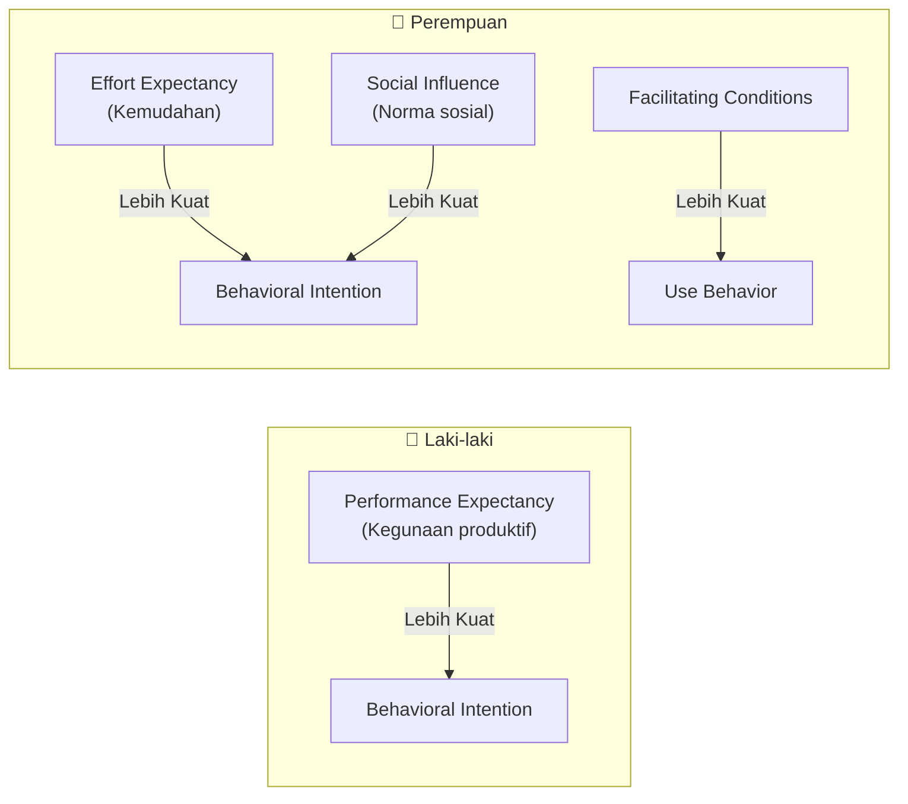
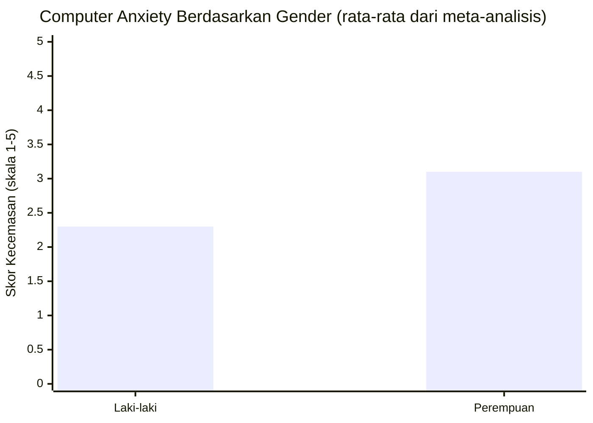
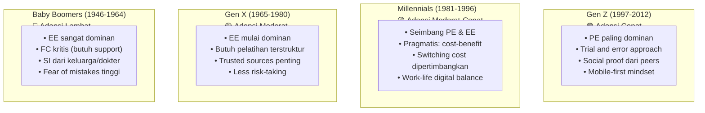
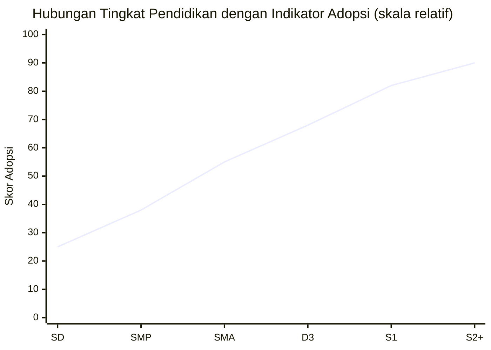
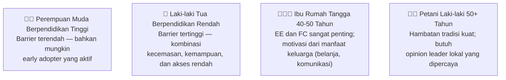

# BAB-21: Gender dan Demografi dalam Adopsi Teknologi

> *"Perbedaan gender dalam adopsi teknologi bukan sekadar statistik — ia mencerminkan perbedaan dalam pengalaman, ekspektasi, dan hambatan yang dialami oleh kelompok yang berbeda."*

---

## 🎯 Tujuan Pembelajaran

Setelah membaca bab ini, pembaca diharapkan mampu:
- Menjelaskan bagaimana gender memoderasi hubungan dalam UTAUT
- Mengidentifikasi pola perbedaan gender dalam adopsi teknologi
- Menjelaskan pengaruh usia, pendidikan, dan penghasilan terhadap adopsi
- Merancang penelitian yang sensitif terhadap faktor demografis
- Menghindari bias demografis dalam desain produk dan kebijakan teknologi

---

## 📖 Pendahuluan

Ketika Venkatesh et al. (2003) mengembangkan UTAUT, mereka menemukan sesuatu yang menarik: **faktor yang sama memiliki kekuatan prediktif yang berbeda tergantung pada siapa yang ditanya**.

Laki-laki lebih responsif terhadap argumen produktivitas. Perempuan lebih mempertimbangkan kemudahan dan norma sosial. Pengguna muda cepat mengadopsi berdasarkan manfaat yang dirasakan. Pengguna tua membutuhkan jaminan bahwa mereka bisa menguasainya.

Demografis bukan sekadar variabel kontrol yang wajib dilaporkan — ia adalah **lensa yang mengubah cara kita memahami adopsi**.

---

## 21.1 Gender sebagai Moderating Variable dalam UTAUT

Venkatesh et al. (2003) menemukan pola moderasi gender yang konsisten:

### Ringkasan Efek Moderasi Gender

| Hubungan | Laki-laki | Perempuan |
|---|---|---|
| PE → BI | ⭐⭐⭐⭐⭐ **Lebih kuat** | ⭐⭐⭐ Lebih lemah |
| EE → BI | ⭐⭐⭐ Lebih lemah | ⭐⭐⭐⭐⭐ **Lebih kuat** |
| SI → BI | ⭐⭐⭐ Lebih lemah | ⭐⭐⭐⭐ **Lebih kuat** |
| FC → Use | ⭐⭐⭐ Lebih lemah | ⭐⭐⭐⭐ **Lebih kuat** |

---

## 21.2 Interpretasi Perbedaan Gender

### Mengapa Laki-laki Lebih Responsif terhadap PE?

**Teori Psikologis:**
- Laki-laki cenderung memiliki **instrumental orientation** — mengevaluasi teknologi berdasarkan utilitas dan kinerja
- Teori **Sex Role Theory** (Eagly, 1987): sosialisasi maskulin menekankan pencapaian dan kompetensi → task performance lebih menonjol

### Mengapa Perempuan Lebih Responsif terhadap EE?

**Teori Psikologis:**
- Perempuan rata-rata memiliki **computer anxiety** lebih tinggi (Chua et al., 1999) → kemudahan penggunaan menjadi lebih kritis
- **Stereotype threat**: Persepsi sosial bahwa perempuan "tidak sepandai laki-laki dalam teknologi" bisa menjadi self-fulfilling prophecy yang meningkatkan kecemasan teknologi

> ⚠️ **Perhatian:** Ini adalah *rata-rata statistik* dari penelitian di konteks tertentu — bukan determinisme biologis. Perbedaan ini bisa berkurang atau hilang dalam konteks yang berbeda, terutama dengan meningkatnya kesetaraan gender dan pendidikan.

---

## 21.3 Gender dan Technology Anxiety

**Sumber Kecemasan Teknologi pada Perempuan:**
1. **Stereotype threat** — internalisasi bahwa "teknologi adalah domain laki-laki"
2. **Kurangnya role model** perempuan dalam karir TI
3. **Pengalaman negatif sebelumnya** dengan teknologi yang tidak ramah pengguna
4. **Lingkungan yang tidak inklusif** dalam komunitas teknologi

**Solusi:**
- Desain teknologi yang **gender-neutral** (bukan pink-washing)
- Representasi perempuan dalam **marketing dan tutorial**
- Komunitas teknologi yang **aman dan inklusif**

---

## 21.4 Usia sebagai Moderating Variable

### Pola Usia dalam UTAUT

| Konstruk | Pengguna Muda | Pengguna Tua |
|---|---|---|
| **PE → BI** | ⭐⭐⭐⭐⭐ Lebih kuat | ⭐⭐⭐ Lebih lemah |
| **EE → BI** | ⭐⭐⭐ Lebih lemah | ⭐⭐⭐⭐⭐ **Jauh lebih kuat** |
| **SI → BI** | ⭐⭐⭐ Lebih lemah | ⭐⭐⭐⭐ Lebih kuat |
| **FC → Use** | ⭐⭐⭐ Lebih lemah | ⭐⭐⭐⭐⭐ **Jauh lebih kuat** |

### Profil Adopsi Berdasarkan Generasi

---

## 21.5 Pendidikan dan Adopsi Teknologi

### Hubungan Pendidikan dengan Komponen TAM/UTAUT

**Mekanisme Pengaruh Pendidikan:**

| Mekanisme | Penjelasan |
|---|---|
| **Cognitive capacity** | Pendidikan meningkatkan kemampuan memahami dan mengoperasikan teknologi kompleks |
| **Income correlation** | Pendidikan lebih tinggi → pendapatan lebih tinggi → mampu membeli teknologi |
| **Self-efficacy** | Pengalaman belajar hal baru meningkatkan kepercayaan diri adopsi |
| **Information exposure** | Pendidikan lebih tinggi → lebih terpapar informasi tentang teknologi baru |

---

## 21.6 Penghasilan dan Adopsi Teknologi

**Affordability** adalah barrier adopsi yang sering diremehkan:

| Kelompok Penghasilan | Tantangan Adopsi |
|---|---|
| **< Rp 2 juta/bulan** | Harga smartphone, kuota internet; memprioritaskan kebutuhan dasar |
| **Rp 2-5 juta/bulan** | Bisa akses, tapi pilihan terbatas; low-spec device |
| **Rp 5-15 juta/bulan** | Akses memadai; fokus pada nilai dan kemudahan |
| **> Rp 15 juta/bulan** | Hampir tanpa barrier finansial; early adopter potential |

**Implikasi Kebijakan:**
- Program subsidi smartphone (seperti BAKTI Kominfo)
- Zero-rating data untuk layanan publik esensial
- Desain teknologi yang optimal di low-end device

---

## 21.7 Interseksionalitas: Gender × Usia × Pendidikan

Faktor demografis tidak bekerja secara independen — mereka **berinteraksi** untuk membentuk profil adopsi yang unik:

---

## 21.8 Implikasi untuk Desain Inklusif

### Universal Design Principles untuk Adopsi yang Inklusif

| Prinsip | Penerapan |
|---|---|
| **Flexible use** | Mendukung berbagai cara penggunaan (suara, teks, gambar) |
| **Simple and intuitive** | Tidak memerlukan background knowledge khusus |
| **Perceptible information** | Informasi disampaikan dalam berbagai format (visual, audio) |
| **Tolerance for error** | Mudah untuk undo/cancel, konfirmasi sebelum aksi kritis |
| **Low physical effort** | Touch target yang besar, tidak perlu gestur kompleks |
| **Size and space** | Font yang cukup besar untuk lansia |

### Checklist Inklusivitas Digital

- [ ] Apakah UI diuji dengan pengguna dari kelompok usia berbeda?
- [ ] Apakah ada opsi untuk ukuran teks yang lebih besar?
- [ ] Apakah kontras warna memenuhi standar aksesibilitas?
- [ ] Apakah instruksi tersedia dalam bahasa yang mudah dipahami?
- [ ] Apakah tersedia dukungan dalam bahasa daerah/lokal?
- [ ] Apakah proses onboarding dirancang untuk pemula absolut?

---

## 🔗 Keterkaitan dengan Bab Lain

- ⬅️ Bab sebelumnya: [BAB-20 — Individu vs Organisasi](../BAB-20_Adopsi_Individu_vs_Organisasi/README.md)
- ➡️ Bab selanjutnya: [BAB-22 — Generasi Digital](../BAB-22_Generasi_Digital_Native_vs_Immigrant/README.md)
- 🔗 Digital Divide: [BAB-19](../BAB-19_Digital_Divide/README.md)
- 🔗 UTAUT moderating variables: [BAB-07](../BAB-07_UTAUT_dan_UTAUT2/README.md)
- 🔗 TRI dan segmentasi: [BAB-09](../BAB-09_Technology_Readiness_Index/README.md)

---

## ✅ Soal Latihan

1. **Konseptual:** Jelaskan mengapa perempuan cenderung memberikan bobot lebih besar pada Effort Expectancy dibandingkan laki-laki dalam UTAUT! Apakah ini perbedaan yang bersifat alami/biologis atau hasil dari faktor sosial-budaya?

2. **Analitis:** Anda meneliti adopsi **aplikasi kesehatan digital** oleh dua kelompok: (a) mahasiswa perempuan usia 20-25 tahun, dan (b) ibu rumah tangga usia 45-55 tahun. Prediksi faktor mana yang paling dominan untuk setiap kelompok berdasarkan teori UTAUT!

3. **Aplikasi:** Sebuah perusahaan fintech ingin meningkatkan adopsi di kalangan **lansia (60+ tahun)**. Berdasarkan pemahaman tentang usia sebagai moderating variable, rancang **5 fitur atau keputusan desain spesifik** yang akan meningkatkan adopsi kelompok ini!

4. **Kritis:** Ada kritik bahwa penelitian adopsi teknologi yang menggunakan gender sebagai variabel kontrol berpotensi **memperkuat stereotip gender** (laki-laki = task-oriented, perempuan = social-oriented). Bagaimana peneliti seharusnya menangani dimensi gender dalam penelitian adopsi teknologi secara etis dan bertanggung jawab?

---

## 📚 Referensi Bab Ini

- Chua, S. L., Chen, D. T., & Wong, A. F. L. (1999). Computer anxiety and its correlates: A meta-analysis. *Computers in Human Behavior*, *15*(5), 609–623.
- Eagly, A. H. (1987). *Sex differences in social behavior: A social-role interpretation*. Lawrence Erlbaum Associates.
- Morris, M. G., & Venkatesh, V. (2000). Age differences in technology adoption decisions: Implications for a changing work force. *Personnel Psychology*, *53*(2), 375–403.
- Venkatesh, V., Morris, M. G., Davis, G. B., & Davis, F. D. (2003). User acceptance of information technology: Toward a unified view. *MIS Quarterly*, *27*(3), 425–478.
- Venkatesh, V., & Morris, M. G. (2000). Why don't men ever stop to ask for directions? Gender, social influence, and their role in technology acceptance and usage behavior. *MIS Quarterly*, *24*(1), 115–139.

---

← [BAB-20: Individu vs Organisasi](../BAB-20_Adopsi_Individu_vs_Organisasi/README.md) | [README Utama](../README.md) | [BAB-22: Generasi Digital →](../BAB-22_Generasi_Digital_Native_vs_Immigrant/README.md)
