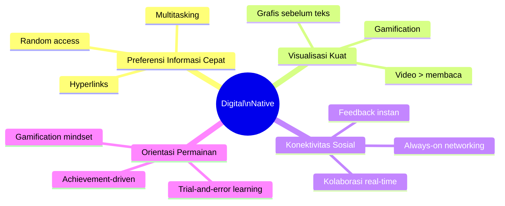
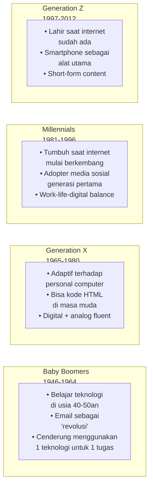
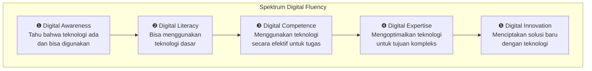
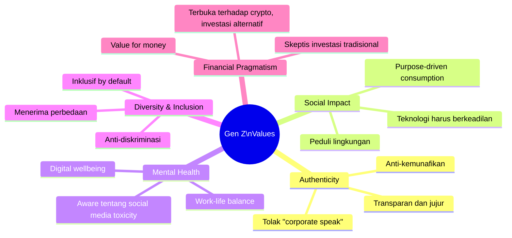

# BAB-22: Generasi Digital: Digital Native vs. Digital Immigrant

> *"Anak-anak digital hari ini berpikir dan memproses informasi secara fundamental berbeda dari pendahulu mereka — dan jika kita ingin mereka terlatih, kita harus berkomunikasi dalam bahasa mereka."*  
> — Marc Prensky (2001)

---

## 🎯 Tujuan Pembelajaran

Setelah membaca bab ini, pembaca diharapkan mampu:
- Mendefinisikan konsep Digital Native dan Digital Immigrant
- Mengidentifikasi karakteristik setiap generasi dalam konteks teknologi
- Mengkritisi konsep "Digital Native" dengan bukti empiris yang ada
- Menganalisis implikasi perbedaan generasi terhadap adopsi teknologi
- Merancang strategi adopsi yang sensitif terhadap karakteristik generasional

---

## 📖 Pendahuluan

**Marc Prensky** (2001) menciptakan dikotomi yang langsung menjadi fenomenal: **Digital Native** vs. **Digital Immigrant**.

Anak-anak yang lahir dalam era digital diibaratkan sebagai "penutur asli" bahasa digital — mereka tumbuh bersama internet, game, dan smartphone. Sementara orang dewasa yang baru belajar teknologi di usia matang adalah "imigran" yang berbicara dengan "aksen asing" — masih merujuk ke dunia analog sebagai referensi.

Konsep ini intuitif dan mudah dipahami. Tapi seberapa valid secara empiris? Dan apa implikasinya bagi penelitian adopsi teknologi?

---

## 22.1 Konsep Digital Native dan Digital Immigrant

### Marc Prensky (2001): Definisi Asli

| Kelompok | Definisi | Ciri Khas |
|---|---|---|
| **Digital Native** | Generasi yang tumbuh dengan teknologi digital — tidak pernah mengenal dunia tanpa internet | Multitasking, akses paralel, game, grafis, hypertext |
| **Digital Immigrant** | Generasi yang mengadopsi teknologi digital di usia dewasa | Masih "beraksen" analog: mencetak email, menelepon untuk konfirmasi email |

### Karakteristik Digital Native (Prensky, 2001)

---

## 22.2 Klasifikasi Generasi dalam Konteks Digital

### Empat Generasi dan Profil Digitalnya

### Profil Digital Lengkap

| Dimensi | Baby Boomers | Gen X | Millennials | Gen Z |
|---|---|---|---|---|
| **Platform Dominan** | Email, TV | Desktop, Email | Facebook, Instagram | TikTok, YouTube, Discord |
| **Konten Foremat** | Teks panjang | Teks medium | Teks + gambar | Video pendek |
| **Perhatian** | 12 detik+ | 8-12 detik | 5-8 detik | ~3-5 detik |
| **Transaksi** | Tunai/kartu | Kartu kredit | Multi-payment | QR/QRIS/crypto |
| **Belajar** | Kelas tradisional | Mixed | Online + offline | Micro-learning |
| **Pekerjaan** | Satu perusahaan | Beberapa | Gig economy aware | Portfolio career |

---

## 22.3 Kritik terhadap Konsep "Digital Native"

Konsep Digital Native telah dikritik secara tajam oleh berbagai peneliti:

### Kritik #1: Asumsi Homogenitas yang Keliru
**Sumber:** Hargittai (2010); Bennett et al. (2008)

Tidak semua anak muda adalah "native" digital — penelitian empiris menunjukkan **variasi yang sangat besar** dalam keterampilan dan penggunaan teknologi di kalangan generasi muda:

- Anak muda dari keluarga berpenghasilan rendah → akses dan keterampilan digital jauh lebih terbatas
- Anak muda di daerah rural → pengalaman digital berbeda drastis dari urban
- **Generasi yang sama, Digital Divide yang nyata**

> *"Menyebut semua anak muda sebagai 'digital native' sama tidak akuratnya dengan mengatakan semua orang tua tidak bisa menggunakan teknologi."* — Bennett et al. (2008)

### Kritik #2: Akses ≠ Keterampilan
**Sumber:** Hargittai & Walejko (2008)

Anak muda mungkin **sering** menggunakan teknologi, tetapi tidak berarti mereka menggunakannya **secara mahir** atau **efektif**:
- Mahir bermain game ≠ mahir mencari informasi akademis
- Sering main medsos ≠ mampu mengevaluasi kredibilitas sumber
- Konsumsi konten digital ≠ kemampuan produksi konten digital

### Kritik #3: Determinisme Generasional
Mengklasifikasikan orang hanya berdasarkan tahun lahir mengabaikan:
- Pengalaman individual
- Sosioeconomic background
- Konteks budaya
- Jalur pembelajaran yang berbeda

---

## 22.4 Model yang Lebih Nuanced: Digital Fluency

Sebagai alternatif dari dikotomi Native/Immigrant, **Digital Fluency** menawarkan konsep yang lebih berlapis:

**Perbedaan kunci:** Digital Fluency bukan tentang **kapan** Anda lahir, melainkan **apa yang bisa Anda lakukan** dengan teknologi — dan ini bisa dikembangkan oleh siapa saja, kapan saja.

---

## 22.5 Generation Z: Karakteristik dan Implikasi Adopsi

Gen Z (1997-2012) adalah generasi yang paling banyak diteliti saat ini dalam konteks adopsi teknologi:

### 22.5.1 Nilai-nilai Inti Gen Z

### 22.5.2 Implikasi bagi Adopsi Teknologi

| Karakteristik Gen Z | Implikasi untuk Produk Teknologi |
|---|---|
| **Short attention span** | Onboarding harus singkat; value harus dirasakan dalam 30 detik pertama |
| **Privacy-conscious** | Lebih kritis terhadap pengelolaan data (paradoks dengan baby boomers) |
| **Authenticity-first** | Marketing bintang yang dibayar tidak efektif; UGC dan peer review lebih kuat |
| **Mobile-only** | Harus optimal di mobile; desktop adalah secondary |
| **Multi-platform** | Satu layanan harus terintegrasi dengan ekosistem digital yang sudah ada |
| **Instant gratification** | Loading > 3 detik = uninstall |

---

## 22.6 Alpha Generation (2013-sekarang): Masa Depan Adopsi

Generasi Alpha — anak-anak yang lahir setelah 2013 — adalah generasi pertama yang **tidak pernah mengenal dunia tanpa AI**:

| Aspek | Generasi Alpha vs. Gen Z |
|---|---|
| **Interface utama** | Voice & gesture (bukan touch-first) |
| **Asisten** | AI yang personal, bukan situs web statis |
| **Belajar** | Adaptive learning AI, bukan satu kurikulum untuk semua |
| **Ekspektasi** | Hyper-personalisasi sejak awal |
| **Interaksi** | Phygital (physical + digital) secara mulus |

---

## 22.7 Implikasi untuk Penelitian

### Kapan Generasi Relevan sebagai Variabel Penelitian?

✅ **Gunakan generasi/usia sebagai variabel** ketika:
- Teknologi yang diteliti memiliki tingkat kebaruan yang berbeda bagi kelompok usia berbeda
- Konteks penggunaan berbeda antar generasi (kerja vs. pendidikan vs. rekreasi)
- Barrier adopsi diduga berbeda secara sistematis berdasarkan usia

❌ **Hati-hati dengan generalisasi** ketika:
- Sampel tidak representatif dari keseluruhan populasi generasi
- Variabel demografis lain (pendidikan, penghasilan) lebih menjelaskan perbedaan
- Menggunakan "generasi" sebagai pengganti variabel individual yang lebih spesifik

---

## 🔗 Keterkaitan dengan Bab Lain

- ⬅️ Bab sebelumnya: [BAB-21 — Gender dan Demografi](../BAB-21_Gender_dan_Demografi/README.md)
- ➡️ Bab selanjutnya: [BAB-23 — Budaya dan Adopsi](../BAB-23_Budaya_dan_Adopsi_Teknologi/README.md)
- 🔗 Digital Divide: [BAB-19](../BAB-19_Digital_Divide/README.md)
- 🔗 UTAUT moderating variables: [BAB-07](../BAB-07_UTAUT_dan_UTAUT2/README.md)
- 🔗 Tren masa depan teknologi: [BAB-34](../BAB-34_Tren_dan_Masa_Depan/README.md)

---

## ✅ Soal Latihan

1. **Konseptual:** Prensky (2001) menyebut orang tua yang belajar teknologi sebagai "digital immigrants yang beraksen". Apa yang dimaksud "aksen" dalam konteks ini? Berikan dua contoh "aksen digital" yang masih sering Anda temui di lingkungan sekitar!

2. **Kritis:** Kritisi konsep "Digital Native" menggunakan argumen dari Bennett et al. (2008) dan Hargittai (2010)! Apakah generasi yang sama memiliki kemampuan digital yang homogen? Berikan data atau bukti yang mendukung kritik Anda!

3. **Analitis:** Bandingkan profil adopsi **mobile banking** antara Millennial (35 tahun) dan Gen Z (20 tahun) dari keluarga dengan tingkat ekonomi yang sama! Faktor mana yang dominan untuk setiap kelompok? Apakah ada perbedaan signifikan yang bisa diprediksi secara teoritis?

4. **Prospektif:** Generasi Alpha (lahir setelah 2013) tumbuh bersama AI sejak bayi. Bagaimana ini akan mempengaruhi konsep "Technology Acceptance" ketika mereka dewasa dan mulai bekerja? Konstruk baru apa yang mungkin diperlukan dalam model adopsi untuk generasi ini?

---

## 📚 Referensi Bab Ini

- Bennett, S., Maton, K., & Kervin, L. (2008). The 'digital natives' debate: A critical review of the evidence. *British Journal of Educational Technology*, *39*(5), 775–786.
- Hargittai, E. (2010). Digital na(t)ives? Variation in internet skills and uses among members of the "net generation". *Sociological Inquiry*, *80*(1), 92–113.
- McCrindle, M., & Wolfinger, E. (2009). *The ABC of XYZ: Understanding the global generations*. UNSW Press.
- Prensky, M. (2001). Digital natives, digital immigrants. *On the Horizon*, *9*(5), 1–6.
- Tapscott, D. (2009). *Grown up digital: How the net generation is changing your world*. McGraw-Hill.

---

← [BAB-21: Gender & Demografi](../BAB-21_Gender_dan_Demografi/README.md) | [README Utama](../README.md) | [BAB-23: Budaya & Adopsi →](../BAB-23_Budaya_dan_Adopsi_Teknologi/README.md)
