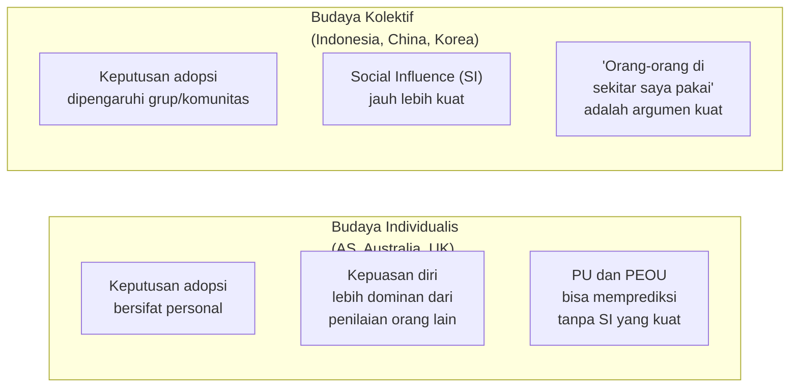
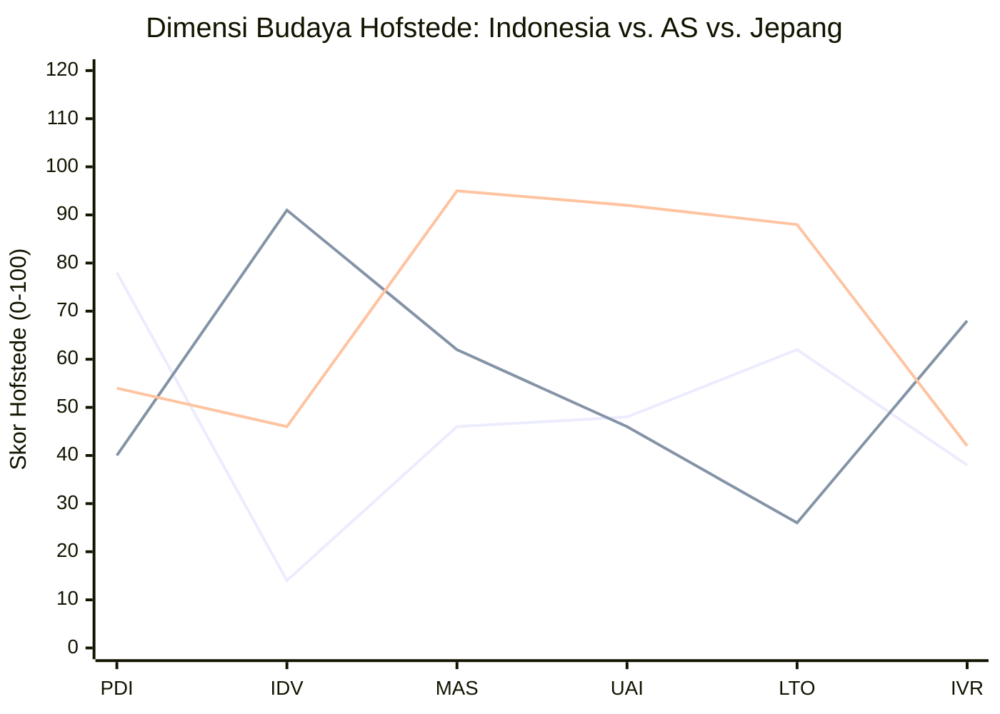
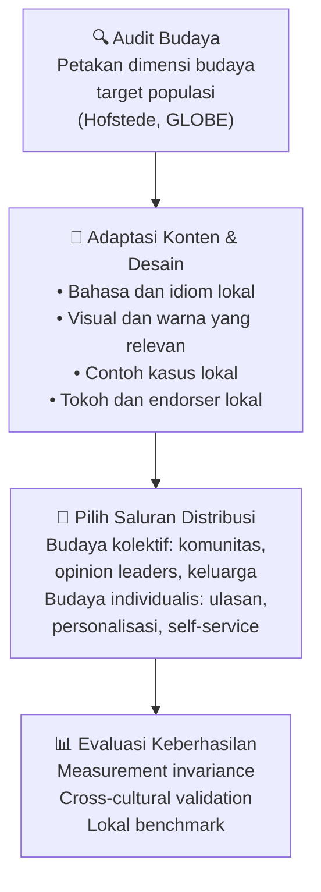

# BAB-23: Budaya dan Adopsi Teknologi

> *"Teknologi tidak bersifat netral secara budaya. Ia lahir dari konteks budaya tertentu dan ketika ditransplantasikan ke konteks yang berbeda, ia berinteraksi dengan nilai dan norma lokal dengan cara yang tidak selalu dapat diprediksi."*

---

## 🎯 Tujuan Pembelajaran

Setelah membaca bab ini, pembaca diharapkan mampu:
- Menjelaskan dimensi budaya Hofstede dan relevansinya terhadap adopsi teknologi
- Mengidentifikasi bagaimana budaya kolektif vs. individualis mempengaruhi Social Influence
- Menjelaskan Cross-Cultural Technology Acceptance Research
- Menghubungkan konteks budaya Indonesia dengan teori adopsi yang ada
- Merancang penelitian adopsi yang sensitif terhadap konteks budaya

---

## 📖 Pendahuluan

TAM dikembangkan di Amerika Serikat, dengan responden mahasiswa MBA dari budaya individualis, berpendidikan tinggi, dan familiar dengan teknologi. UTAUT divalidasi di empat perusahaan Amerika.

Ketika teori-teori ini diterapkan di Indonesia — dengan budaya yang sangat berbeda: kolektivis, menghormati hierarki, dan kaya dengan tradisi lisan — apakah hasilnya tetap valid?

Penelitian lintas budaya dalam adopsi teknologi (*cross-cultural technology acceptance*) menjawab pertanyaan ini. Dan jawabannya: **budaya sangat penting, tapi caranya lebih nuanced dari yang kita bayangkan**.

---

## 23.1 Dimensi Budaya Hofstede dan Adopsi Teknologi

**Geert Hofstede** mengembangkan model budaya nasional yang paling banyak digunakan dalam penelitian manajemen internasional. Enam dimensinya memiliki implikasi langsung terhadap adopsi teknologi:

### 23.1.1 Individualism vs. Collectivism (IDV)

**Implikasi untuk Indonesia (IDV rendah = sangat kolektif):**
- SI/Subjective Norm memiliki pengaruh yang lebih besar dari yang ditemukan dalam studi AS
- Word-of-mouth dan rekomendasi komunitas sangat kuat
- Gotong royong digital: adopsi cenderung terjadi secara komunal

---

### 23.1.2 Power Distance (PDI) — Jarak Kekuasaan

**Definisi:** Sejauh mana anggota masyarakat menerima distribusi kekuasaan yang tidak merata.

**Indonesia memiliki PDI TINGGI** (skor 78 dari 100):

| Implikasi PDI Tinggi | Contoh dalam Adopsi TI |
|---|---|
| Adopsi dari atas ke bawah sangat efektif | Jika direktur mengadopsi → karyawan ikut |
| Rekomendasi atasan sangat menentukan | "Bapak direktur bilang kita harus pakai sistem ini" |
| Resistensi diam-diam (silent resistance) | Karyawan tampak menggunakan tapi sebenarnya tidak efektif |
| Vendor lebih efektif melalui pimpinan | Presentasi ke CEO lebih efektif dari demo ke end user |

**Implikasi untuk peneliti:**
> Dalam konteks PDI tinggi, **Subjective Norm** harus diukur dengan mempertimbangkan hirarki — pengaruh atasan harus dipisahkan dari pengaruh teman sebaya.

---

### 23.1.3 Uncertainty Avoidance (UAI) — Penghindaran Ketidakpastian

**Definisi:** Sejauh mana masyarakat merasa tidak nyaman dengan ambiguitas dan ketidakpastian.

**Indonesia: UAI Sedang-Tinggi (skor 48)**

| UAI Tinggi (misalnya Jepang, Yunani) | UAI Rendah (misalnya Singapura, Denmark) |
|---|---|
| Membutuhkan banyak jaminan sebelum adopsi | Siap mencoba teknologi baru tanpa banyak jaminan |
| Regulasi penting sebagai "penopang" kepercayaan | Inovasi bisa bergerak lebih cepat |
| Risk dan security features sangat kritis | Trust lebih mudah dibangun |

---

### 23.1.4 Long-term vs. Short-term Orientation (LTO)

**Indonesia: Cenderung Short-term (skor 62 — moderate)**

| Dimensi | Implikasi Adopsi |
|---|---|
| **Long-term** (Asia Timur) | Investasi dalam belajar teknologi kompleks karena ada nilai jangka panjang |
| **Short-term** | Ekspektasi manfaat cepat — kalau tidak langsung bermanfaat, ditinggal |

**Implikasi:** Produk teknologi di Indonesia harus memberikan **quick wins** — manfaat yang dirasakan dalam waktu singkat setelah adopsi.

---

### 23.1.5 Masculinity vs. Femininity (MAS)

**Definisi:** Sejauh mana masyarakat menghargai prestasi, heroisme, dan kesuksesan material vs. kerjasama, kesederhanaan, dan kualitas hidup.

**Indonesia: MAS Rendah-Sedang (skor 46)** — cenderung ke nilai kooperatif

**Implikasi Adopsi:**
- Pemasaran teknologi yang menekankan kompetisi dan prestasi individual mungkin kurang efektif
- Teknologi yang memperkuat *silaturahmi* dan komunitas lebih mudah diterima
- **Gotong royong digital** (seperti arisan online, urunan digital) lebih resonan

---

### 23.1.6 Indulgence vs. Restraint (IVR)

**Indonesia: Restraint (skor 38)**

Masyarakat dengan Restraint tinggi cenderung:
- Lebih berhati-hati dalam pengeluaran untuk teknologi hiburan
- Norma sosial lebih ketat dalam mengatur apa yang "boleh" digunakan
- Hedonic motivation (UTAUT2) mungkin lebih lemah daripada di masyarakat Indulgent

---

## 23.2 Skor Hofstede Indonesia vs. Negara Lain

*Merah = Indonesia, Hijau = AS, Biru = Jepang*

---

## 23.3 Cross-Cultural Validation TAM dan UTAUT

### Temuan Lintas Budaya

| Hubungan | Di Budaya Barat | Di Asia Kolektif |
|---|---|---|
| **PU → BI** | Sangat kuat | Kuat, tapi relatif lebih lemah |
| **PEOU → BI** | Sedang-kuat | Sedang |
| **SI → BI** | Sedang | **Jauh lebih kuat** |
| **Trust → BI** | Sedang | **Lebih kuat** |
| **Image → BI** | Lemah | **Lebih kuat** |

### Implikasi Metodologis

**Measurement Invariance** adalah isu penting dalam penelitian lintas budaya:

> Apakah item kuesioner TAM/UTAUT yang divalidasi di AS mengukur konsep yang **sama** ketika diterjemahkan ke Bahasa Indonesia dan digunakan di konteks budaya Indonesia?

Ini perlu diuji dengan **Configural Invariance**, **Metric Invariance**, dan **Scalar Invariance** sebelum membandingkan hasil antar budaya.

---

## 23.4 Faktor Budaya Spesifik Indonesia

### 23.4.1 Nilai Gotong Royong dalam Adopsi Digital

**Gotong royong** — semangat kolaborasi dan saling membantu — memiliki manifestasi digital yang unik:

| Manifestasi | Contoh |
|---|---|
| **Komunitas adopter** | Grup WhatsApp "Tutorial GoPay untuk Teman" |
| **Peer teaching** | Anak mengajari orang tua menggunakan smartphone |
| **Kolektif purchasing** | Patungan berlangganan Netflix/Spotify |
| **Crowd-referral** | "Daftar pakai kode referral ku ya, kita sama-sama dapat bonus" |

### 23.4.2 Peran Keluarga dalam Adopsi

Di Indonesia, keluarga adalah unit adopsi yang penting:
- **Orang tua** sering mengadopsi teknologi karena anak mendorongnya
- **Anak** sering menjadi *change agent* yang mengajarkan orang tua
- **WhatsApp** sebagai teknologi pertama yang banyak diadopsi lansia — terutama karena group keluarga

### 23.4.3 Kepercayaan Komunal vs. Kepercayaan Institusional

Di Indonesia, **kepercayaan berbasis komunitas (community-based trust)** sering lebih kuat dari kepercayaan berbasis institusi:

- "Kata tetangga saya yang pakai Shopee bagus" > "Shopee telah mendapat sertifikasi ISO"
- Rekomendasi dari komunitas lokal > Iklan nasional

### 23.4.4 Faktor Agama dan Teknologi

Indonesia sebagai negara dengan mayoritas penduduk Muslim memiliki pertimbangan unik:

| Aspek | Contoh Implikasi Adopsi |
|---|---|
| **Halal digital** | Pertumbuhan fintech syariah, aplikasi ibadah, konten Islami |
| **Ramadan effect** | Lonjakan penggunaan aplikasi pengajian, doa, dan Al-Quran digital |
| **Komunitas keagamaan** | Majelis taklim sebagai saluran difusi teknologi di kalangan ibu rumah tangga |
| **Fatwa tentang teknologi** | MUI pernah mengeluarkan pandangan tentang game online, cryptocurrency |

---

## 23.5 Strategi Adopsi Berbasis Budaya

### Framework Budaya-Sensitif untuk Desain Adopsi

---

## 23.6 Contoh: Adopsi GoPay di Berbagai Daerah Indonesia

| Daerah | Karakteristik Budaya | Faktor Adopsi Dominan |
|---|---|---|
| **Jakarta/Kota Besar** | Lebih individualis, urban, cepat | PU (efisiensi), convenience |
| **Jawa Tengah/Yogyakarta** | Kolektif kuat, hierarkis | SI dari komunitas, gotong royong |
| **Bali** | Komunal kuat, pariwisata oriented | Compatibility dengan kebiasaan bisnis wisata |
| **Papua** | PDI sangat tinggi, tradisi kuat | Tradition barrier kuat, perlu opinion leader adat |
| **Aceh** | Agama dominan | Perlu kejelasan aspek syariah, komunitas dakwah sebagai saluran |

---

## 🔗 Keterkaitan dengan Bab Lain

- ⬅️ Bab sebelumnya: [BAB-22 — Generasi Digital](../BAB-22_Generasi_Digital_Native_vs_Immigrant/README.md)
- ➡️ Bab selanjutnya: [BAB-24 — Konteks Indonesia](../BAB-24_Konteks_Indonesia/README.md)
- 🔗 Social Influence dan Subjective Norm: [BAB-07 UTAUT](../BAB-07_UTAUT_dan_UTAUT2/README.md)
- 🔗 Tradition barrier: [BAB-16](../BAB-16_Hambatan_Adopsi/README.md)
- 🔗 Konteks Indonesia detail: [BAB-24](../BAB-24_Konteks_Indonesia/README.md)

---

## ✅ Soal Latihan

1. **Konseptual:** Jelaskan bagaimana dimensi **Power Distance (PDI)** yang tinggi di Indonesia mempengaruhi proses adopsi teknologi di tempat kerja! Berikan dua contoh konkret!

2. **Analitis:** TAM dikembangkan dalam budaya individualis (AS). Apa yang perlu dimodifikasi atau ditambahkan jika Anda menggunakan TAM untuk meneliti adopsi teknologi di masyarakat yang sangat kolektif seperti pedesaan Jawa? Jelaskan dengan alasan teoritis!

3. **Aplikasi:** Sebuah perusahaan startup AS ingin meluncurkan aplikasi *task management* di Indonesia. Berdasarkan pemahaman Anda tentang dimensi budaya Hofstede, berikan **3 rekomendasi konkret** dalam desain produk dan strategi pemasaran yang sesuai dengan nilai budaya Indonesia!

4. **Kritis:** Hofstede dikritik karena mengukur budaya **di level nasional** dan mengabaikan heterogenitas internal yang besar. Indonesia adalah negara dengan 1.340+ suku dan budaya yang sangat beragam. Apakah menggunakan "budaya Indonesia" sebagai satu konstruk dalam penelitian valid? Apa alternatifnya?

---

## 📚 Referensi Bab Ini

- Hofstede, G. (2001). *Culture's consequences: Comparing values, behaviors, institutions, and organizations across nations* (2nd ed.). Sage.
- Hofstede, G., Hofstede, G. J., & Minkov, M. (2010). *Cultures and organizations: Software of the mind* (3rd ed.). McGraw-Hill.
- McCoy, S., Galletta, D. F., & King, W. R. (2007). Applying TAM across cultures: The need for caution. *European Journal of Information Systems*, *16*(1), 81–90.
- Straub, D., Keil, M., & Brennan, W. (1997). Testing the technology acceptance model across cultures: A three country study. *Information & Management*, *33*(1), 1–11.
- Yoo, B., & Donthu, N. (2002). The effects of marketing education and individual cultural values on marketing ethics of students. *Journal of Marketing Education*, *24*(2), 92–103.

---

← [BAB-22: Generasi Digital](../BAB-22_Generasi_Digital_Native_vs_Immigrant/README.md) | [README Utama](../README.md) | [BAB-24: Konteks Indonesia →](../BAB-24_Konteks_Indonesia/README.md)
