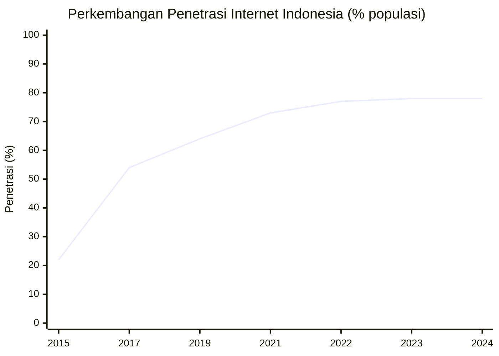
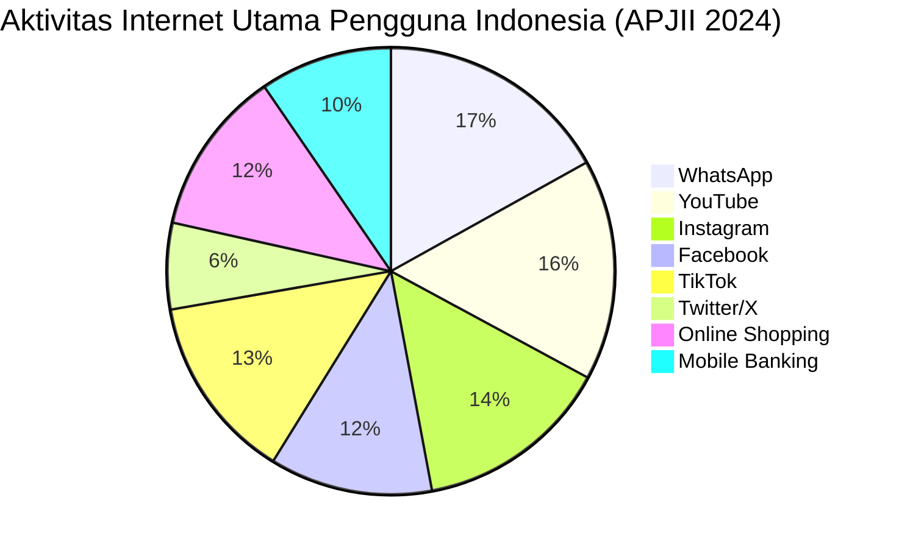
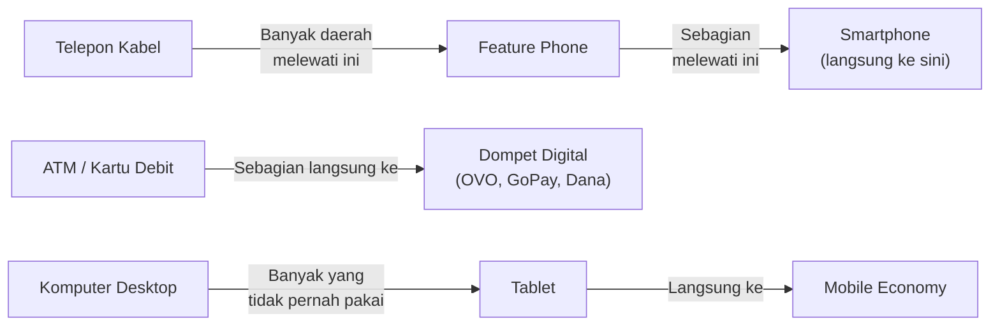
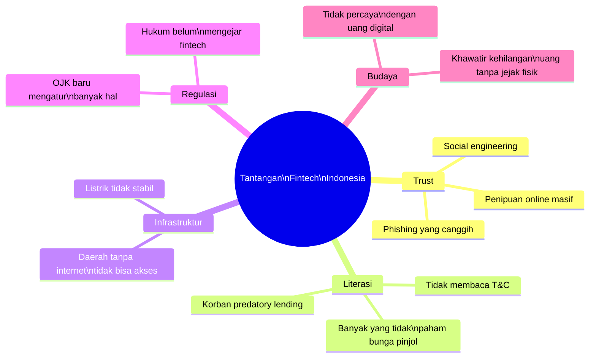
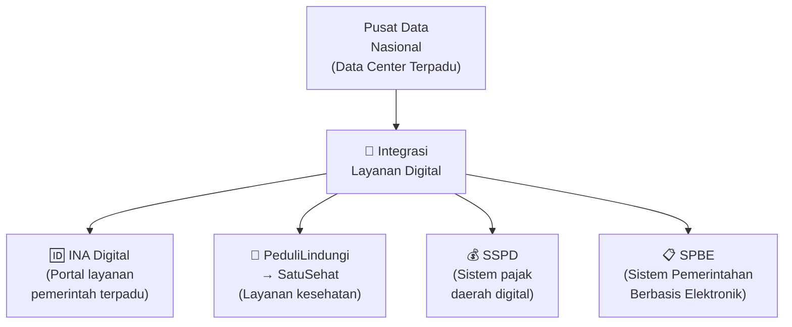
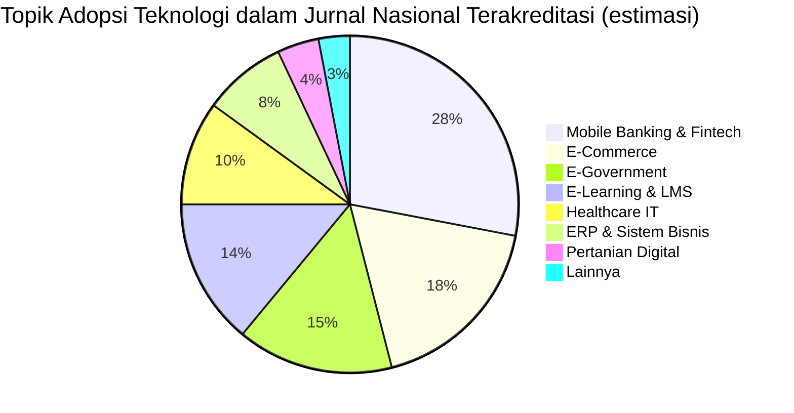

# BAB-24: Adopsi Teknologi di Konteks Indonesia

> *"Indonesia bukan sekadar pasar yang besar — ia adalah laboratorium adopsi teknologi yang unik, dengan keberagaman yang tidak ada duanya di dunia."*

---

## 🎯 Tujuan Pembelajaran

Setelah membaca bab ini, pembaca diharapkan mampu:
- Menggambarkan lanskap digital Indonesia secara komprehensif
- Mengidentifikasi faktor-faktor kontekstual yang membuat Indonesia unik dalam adopsi teknologi
- Menganalisis pola adopsi teknologi spesifik di Indonesia (fintech, e-commerce, e-government)
- Mengevaluasi tantangan dan peluang adopsi teknologi di Indonesia
- Merancang penelitian adopsi yang relevan dan kontekstual untuk Indonesia

---

## 📖 Pendahuluan

Indonesia adalah **laboratorium adopsi teknologi yang luar biasa**:

- 🏝️ Negara kepulauan terbesar dunia (17.000+ pulau)
- 👥 275 juta penduduk (terbesar ke-4 dunia)
- 🌐 215 juta pengguna internet (terbesar ke-4 dunia)
- 📱 Penetrasi smartphone ~75%
- 💰 Ekonomi digital senilai $77 miliar (2022) menuju $130 miliar (2025)
- 🦄 Unicorn startup terbanyak di Asia Tenggara

Namun di sisi lain:
- 📡 12.548 desa masih dalam blankspot internet
- 📚 Indeks literasi digital 3.54/5.0 (kategori sedang)
- 🏛️ Kesenjangan digital urban-rural yang besar
- ⚖️ Regulasi digital yang masih terus berkembang

---

## 24.1 Profil Lanskap Digital Indonesia

### 24.1.1 Infrastruktur Digital

**Fakta Infrastruktur 2024:**
- **Pengguna internet:** 215 juta (APJII, 2024)
- **Coverage 4G:** ~92% wilayah berpenghuni
- **Coverage 5G:** Baru di kota besar (Jakarta, Surabaya, Bali)
- **Backbone fiber:** Palapa Ring menghubungkan seluruh provinsi
- **Rata-rata kecepatan internet:** 26.4 Mbps fixed / 24.5 Mbps mobile

### 24.1.2 Pola Penggunaan

---

## 24.2 Keunikan Konteks Indonesia

### 24.2.1 Mobile-First Economy

Indonesia adalah salah satu negara paling *mobile-first* di dunia:
- **60%** pengguna internet HANYA mengakses via smartphone (tidak punya komputer)
- Aplikasi mobile lebih populer dari web desktop
- App store sebagai gatekeeper adopsi teknologi yang sangat penting

**Implikasi penelitian:** Penelitian adopsi di Indonesia harus mempertimbangkan **Mobile Compatibility** dan **Data Efficiency** sebagai faktor yang relevan — tidak semua pengguna memiliki koneksi cepat dan unlimited.

---

### 24.2.2 Leapfrogging Phenomenon

Indonesia mengalami **leapfrogging** — melompati tahap teknologi tertentu:

**Contoh leapfrogging paling nyata:**
- Ratusan juta orang Indonesia langsung adopsi **mobile banking** tanpa pernah punya rekening konvensional (financial inclusion)
- Pedagang pasar langsung menerima **QRIS** tanpa pernah punya EDC/mesin kartu

---

### 24.2.3 Ekosistem Super-App

Indonesia adalah salah satu ekosistem super-app terkuat di dunia:

| Super-App | Layanan yang Diintegrasikan |
|---|---|
| **Gojek/GoTo** | Transportasi, pengiriman, pembayaran, investasi, hiburan, kesehatan |
| **Grab** | Transportasi, pengiriman, pembayaran, hotel |
| **Tokopedia/TikTok Shop** | E-commerce, pembayaran, finansial |
| **Shopee** | E-commerce, pembayaran, game, streaming |
| **BCA Mobile** | Banking, investasi, pembayaran |

**Implikasi Adopsi:** Di Indonesia, adopsi satu layanan sering membawa adopsi layanan lainnya dalam ekosistem super-app yang sama — **bundled adoption**.

---

## 24.3 Adopsi Fintech di Indonesia

### Perkembangan Fintech Indonesia

**Nilai Transaksi Fintech Indonesia:**
- 2020: USD 1.4 triliun
- 2022: USD 2.1 triliun
- 2025: Proyeksi USD 3.5 triliun

### Faktor Pendorong Adopsi Fintech

| Faktor | Penjelasan | Relevansi Teori |
|---|---|---|
| **Unbanked population** | 51 juta orang dewasa belum punya rekening bank → fintech sebagai jalan masuk | DOI: Relative Advantage |
| **QRIS standardization** | Bank Indonesia mewajibkan standar tunggal QR | Institutional Theory: Coercive |
| **COVID-19 acceleration** | Pandemi memaksa migrasi ke digital payment | DOI: Relative Advantage darurat |
| **Cashback dan insentif** | GoPay, OVO berikan cashback besar di awal | UTAUT2: Price Value |
| **Merchant adoption** | Warung dan UMKM terima QRIS → tersedia di mana-mana | DOI: Observability |

### Tantangan Adopsi Fintech

---

## 24.4 Adopsi E-Commerce di Indonesia

### Ekosistem E-Commerce Indonesia (2024)

| Platform | GMV (estimasi) | Kekuatan |
|---|---|---|
| **TikTok Shop/Tokopedia** | ~$30B | Social commerce, Gen Z dominan |
| **Shopee** | ~$25B | Price-focused, Shopee Pay integration |
| **Tokopedia** | ~$20B | Marketplace lokal, MSME-friendly |
| **Lazada** | ~$5B | Alibaba ecosystem |
| **Blibli** | ~$4B | Enterprise-focused |

### Faktor Sukses E-Commerce di Indonesia

**UTAUT2 Lens:**
- **Hedonic Motivation**: Flash sale, gamification (Shopee Games), live streaming shopping
- **Price Value**: Gratis ongkir, cashback, voucher yang sangat agresif
- **Habit**: Belanja online sudah menjadi kebiasaan pasca-pandemi
- **Social Influence**: Influencer marketing, TikTok social commerce

---

## 24.5 Adopsi E-Government di Indonesia

### Tantangan E-Government yang Unik

| Tantangan | Deskripsi |
|---|---|
| **Fragmentasi sistem** | Setiap kementerian/daerah memiliki sistem sendiri → tidak terintegrasi |
| **Kualitas data** | Data kependudukan yang tidak selalu akurat |
| **Kepercayaan publik** | Persepsi korupsi rendahkan trust terhadap sistem pemerintah |
| **Kesenjangan kapasitas** | Daerah terpencil kekurangan SDM TI |
| **Interoperabilitas** | Sistem pusat dan daerah tidak saling terhubung |

### Inisiatif Kunci E-Government Indonesia

---

## 24.6 Startup Ekosistem dan Adopsi Inovasi

Indonesia memiliki ekosistem startup yang sangat dinamis:

### Unicorn Indonesia

| Startup | Valuasi | Sektor | Faktor Adopsi Kunci |
|---|---|---|---|
| **GoTo (Gojek+Tokopedia)** | $29B | Super-app | Network effect, gotong royong digital |
| **Grab** | $14B | Transportasi+Fintech | Convenience, harga kompetitif |
| **Traveloka** | $3B | Travel tech | Ease of use, all-in-one |
| **OVO** | $3B | Fintech | GoPay competitor, Tokopedia integration |
| **J&T Express** | $2.5B | Logistik | E-commerce enabler |
| **eFishery** | $1.7B | Agri-tech | Solving real pain point petambak |

---

## 24.7 Penelitian Adopsi Teknologi di Indonesia: Pola dan Temuan

### Topik Penelitian Paling Umum di Indonesia

### Temuan Berulang dalam Penelitian di Indonesia

| Temuan | Konsistensi | Catatan |
|---|---|---|
| **PU** selalu berpengaruh positif | ⭐⭐⭐⭐⭐ Sangat konsisten | Universal finding |
| **PEOU** selalu berpengaruh positif | ⭐⭐⭐⭐ Konsisten | Lebih kuat untuk teknologi baru |
| **Trust** sangat krusial | ⭐⭐⭐⭐⭐ Sangat konsisten | Khususnya fintech dan e-government |
| **SI lebih kuat dari AS** | ⭐⭐⭐⭐ Konsisten | Konsisten dengan kolektivisme |
| **Keamanan/privasi** hambatan utama | ⭐⭐⭐⭐ Konsisten | Khususnya fintech dan kesehatan |

---

## 24.8 Agenda Penelitian Adopsi di Indonesia

### Kesenjangan Penelitian yang Masih Terbuka

1. **Rural digital adoption**: Mayoritas penelitian di kota besar — bagaimana adopsi teknologi di desa?
2. **Gig economy workers**: Bagaimana driver Gojek, kurir, dan freelancer digital mengadopsi platform mereka?
3. **UMKM digital adoption**: 64 juta UMKM Indonesia — bagaimana mereka mengadopsi e-commerce dan fintech?
4. **Indigenous communities**: Adopsi teknologi di komunitas adat — banyak pertimbangan yang unik
5. **AI adoption**: ChatGPT, Gemini — bagaimana masyarakat Indonesia mengadopsi AI?
6. **Cross-generational studies**: Penelitian longitudinal yang membandingkan generasi berbeda di Indonesia

---

## 🔗 Keterkaitan dengan Bab Lain

- ⬅️ Bab sebelumnya: [BAB-23 — Budaya dan Adopsi](../BAB-23_Budaya_dan_Adopsi_Teknologi/README.md)
- ➡️ Bab selanjutnya: [BAB-25 — Adopsi per Sektor](../BAB-25_Adopsi_per_Sektor/README.md)
- 🔗 Digital Divide Indonesia: [BAB-19](../BAB-19_Digital_Divide/README.md)
- 🔗 Hambatan adopsi lokal: [BAB-16](../BAB-16_Hambatan_Adopsi/README.md)
- 🔗 Trust di Indonesia: [BAB-17](../BAB-17_Trust_Kepercayaan_dalam_Adopsi/README.md)

---

## ✅ Soal Latihan

1. **Analitis:** Jelaskan fenomena **leapfrogging** dalam adopsi teknologi di Indonesia! Berikan dua contoh konkret dan jelaskan mengapa fenomena ini terjadi menggunakan teori DOI (Rogers)!

2. **Kontekstual:** Indonesia disebut sebagai "mobile-first economy". Apa implikasinya bagi peneliti yang ingin menggunakan TAM untuk meneliti adopsi layanan digital? Konstruk atau item kuesioner mana yang perlu disesuaikan?

3. **Aplikasi:** Pilih satu kota kabupaten/kota di Indonesia dan rancang **strategi adopsi e-government** yang kontekstual untuk masyarakatnya! Pertimbangkan faktor demografis, budaya, infrastruktur, dan kepercayaan yang relevan!

4. **Kritis:** Ekosistem super-app Indonesia (GoTo, Grab, Shopee) menciptakan **bundled adoption** — pengguna mengadopsi puluhan layanan sekaligus karena terintegrasi. Apakah model adopsi teknologi tradisional (TAM, UTAUT) masih tepat untuk mempelajari fenomena ini? Apa modifikasinya?

---

## 📚 Referensi Bab Ini

- APJII. (2024). *Survei penetrasi internet Indonesia 2024*. Asosiasi Penyelenggara Jasa Internet Indonesia.
- Bank Indonesia. (2023). *Laporan tahunan sistem pembayaran dan pengelolaan uang rupiah 2023*. Bank Indonesia.
- Google, Temasek, & Bain & Company. (2023). *e-Conomy SEA 2023: Southeast Asia's digital decade*. Google.
- Kominfo RI. (2023). *Indeks literasi digital Indonesia 2023*. Kementerian Komunikasi dan Informatika.
- OJK. (2023). *Statistik fintech lending 2023*. Otoritas Jasa Keuangan.

---

← [BAB-23: Budaya & Adopsi](../BAB-23_Budaya_dan_Adopsi_Teknologi/README.md) | [README Utama](../README.md) | [BAB-25: Adopsi per Sektor →](../BAB-25_Adopsi_per_Sektor/README.md)
