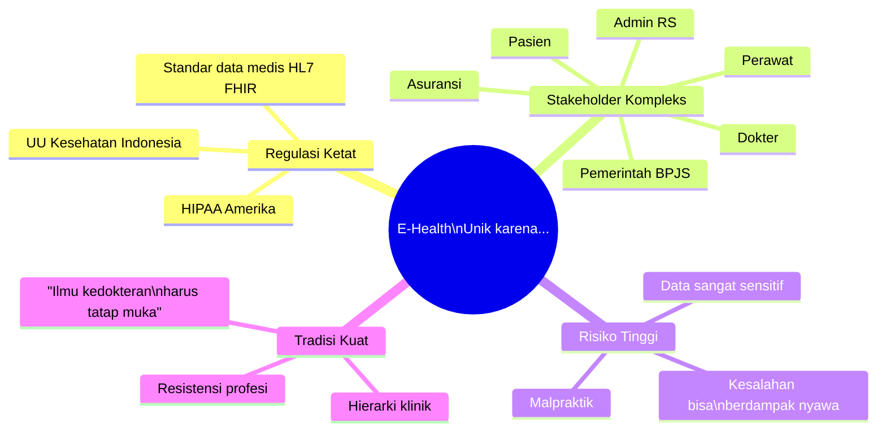
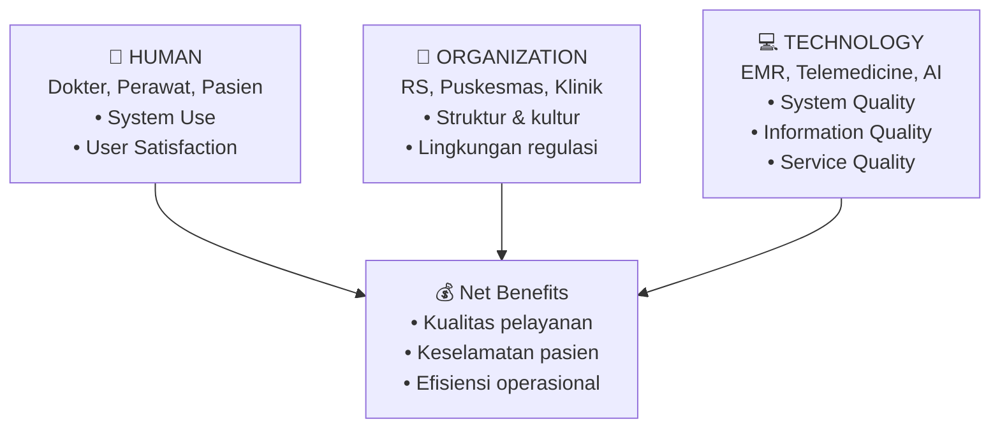
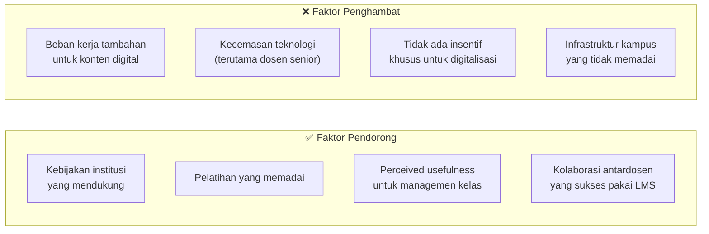
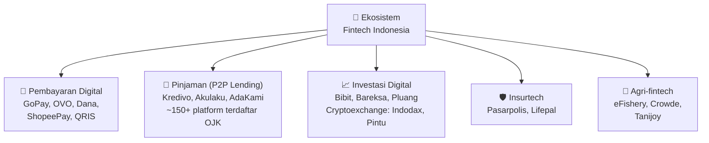
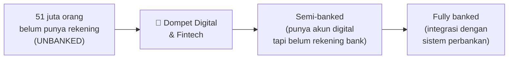
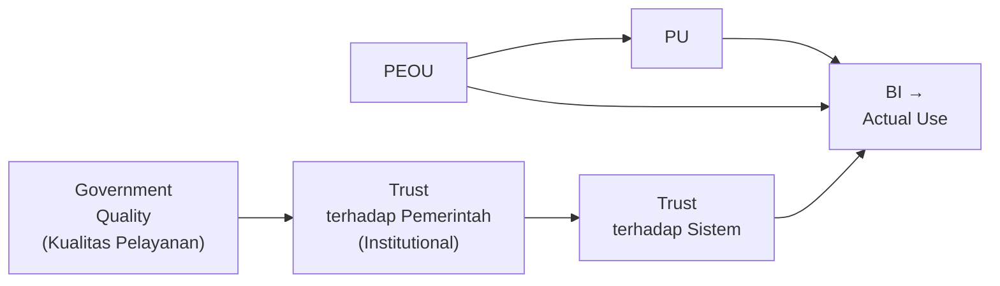
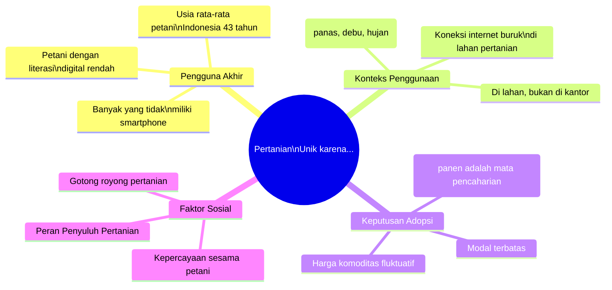
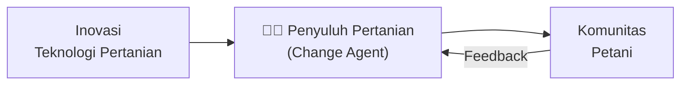

# BAB-25: Adopsi Teknologi per Sektor

> *"Setiap sektor memiliki karakteristik unik yang membentuk cara teknologi diadopsi, ditolak, atau dimodifikasi oleh para pelakunya."*

---

## 🎯 Tujuan Pembelajaran

Setelah membaca bab ini, pembaca diharapkan mampu:
- Mengidentifikasi faktor adopsi yang unik untuk setiap sektor utama
- Menentukan teori adopsi yang paling tepat untuk konteks sektoral tertentu
- Menganalisis tantangan dan peluang adopsi teknologi di masing-masing sektor
- Merancang penelitian adopsi yang sensitif terhadap karakteristik sektor

---

## 📖 Pendahuluan

Seorang dokter yang mengadopsi sistem rekam medis elektronik menghadapi pertimbangan yang sangat berbeda dari seorang pedagang yang mengadopsi QRIS — meskipun keduanya adalah fenomena "adopsi teknologi".

Bab ini menganalisis adopsi teknologi di **lima sektor kritis**: Kesehatan, Pendidikan, Keuangan/Fintech, Pemerintahan (E-Government), dan Pertanian. Setiap sektor memiliki konteks regulasi, dinamika pengguna, dan hambatan adopsi yang unik.

---

## 25.1 Adopsi Teknologi di Sektor Kesehatan (E-Health)

### 25.1.1 Karakteristik Unik Sektor Kesehatan

### 25.1.2 Teknologi yang Sedang Diadopsi di Healthcare

| Teknologi | Status Adopsi di Indonesia | Hambatan Utama |
|---|---|---|
| **EMR (Rekam Medis Elektronik)** | Wajib RS tipe A&B sejak 2013 | Interoperabilitas, biaya, SDM |
| **BPJS Mobile** | Sudah luas (>30 juta pengguna) | UI/UX masih kompleks |
| **SatuSehat** | Rollout nasional | Integrasi RS swasta |
| **Telemedicine** | Boom pandemi, sekarang stabil | Trust diagnosis jarak jauh |
| **AI Diagnostik** | Masih pilot | Trust AI untuk keputusan klinis |
| **IoT Wearables** | Awal adopsi | Harga, awareness |

### 25.1.3 Model Terbaik untuk Penelitian E-Health

**HOT-fit Model** (Yusof et al., 2008) adalah model yang paling sering direkomendasikan untuk konteks healthcare karena mempertimbangkan tiga dimensi simultan:

### 25.1.4 Isu Khusus: Telemedicine di Indonesia

**Faktor yang Mendorong:**
- Pandemi COVID-19 membuktikan viabilitas telemedicine
- Shortage dokter di daerah (rasio dokter:penduduk masih rendah)
- Platform seperti Halodoc, Alodokter tumbuh pesat

**Hambatan yang Masih Ada:**
- Regulasi izin praktik online yang belum jelas
- Resistensi dokter (takut malpraktik, kehilangan pasien)
- Trust pasien terhadap diagnosis tanpa pemeriksaan fisik
- Kualitas koneksi internet di daerah untuk konsultasi video

---

## 25.2 Adopsi Teknologi di Sektor Pendidikan (Ed-Tech)

### 25.2.1 Ekosistem Ed-Tech Indonesia

| Kategori | Platform | Pengguna |
|---|---|---|
| **LMS Kampus** | Moodle, Blackboard, Spada Kemendikbud | Jutaan mahasiswa |
| **Platform MOOC** | Coursera, edX, Ruangguru, Zenius | 5+ juta |
| **Tutoring Online** | Quipper, Brainly, Roboguru | 10+ juta pelajar |
| **Video Learning** | YouTube Edu, TikTok Edu | Puluhan juta |
| **Coding Education** | Dicoding, Binar, Hacktiv8 | Ratusan ribu |
| **AI Tutoring** | Khanmigo, Duolingo AI | Berkembang pesat |

### 25.2.2 Faktor Adopsi E-Learning: Perspektif Mahasiswa

**Model yang sering digunakan:** UTAUT2 + TAM

| Konstruk | Temuan di Konteks Mahasiswa Indonesia |
|---|---|
| **Performance Expectancy** | Kuat: mahasiswa adopsi jika membantu nilai/karir |
| **Effort Expectancy** | Sedang: UI/UX penting tapi tidak dominant |
| **Social Influence** | Kuat: teman sekelas dan dosen sangat mempengaruhi |
| **Hedonic Motivation** | Sedang: gamification meningkatkan engagement |
| **Facilitating Conditions** | Kritis: koneksi internet adalah bottleneck |
| **Habit** | Berkembang: setelah pandemi, e-learning lebih menjadi habit |

### 25.2.3 Faktor Adopsi E-Learning: Perspektif Dosen

Dosen sebagai adopter memiliki pertimbangan yang berbeda dari mahasiswa:

### 25.2.4 Merdeka Belajar dan Transformasi Digital Pendidikan

Program **Merdeka Belajar** Kemendikbudristek mendorong adopsi teknologi melalui:
- **SPADA Indonesia** (platform MOOC nasional)
- **Kampus Merdeka Digital** (kerjasama dengan industri teknologi)
- **Guru Penggerak** (digitalisasi pembelajaran di sekolah)
- **PMM (Platform Merdeka Mengajar)** (pengembangan profesional guru digital)

---

## 25.3 Adopsi Teknologi di Sektor Keuangan (Fintech)

### 25.3.1 Landscape Fintech Indonesia

### 25.3.2 Faktor Adopsi Mobile Banking di Indonesia

**Konstruk kritis yang konsisten ditemukan:**

| Konstruk | Pengaruh | Sumber |
|---|---|---|
| **Perceived Usefulness** | +++++ | Davis (1989) — universal |
| **Trust** | +++++ | Khusus kritis di fintech |
| **Perceived Security** | +++++ | Tingginya penipuan membuat ini krusial |
| **PEOU** | ++++ | Khususnya untuk pengguna baru |
| **Social Influence** | ++++ | Referral dan WOM sangat kuat |
| **Price Value (UTAUT2)** | +++ | Cashback dan gratis biaya |
| **Perceived Risk** | ----- | Hambatan terbesar |

### 25.3.3 Isu Financial Inclusion

**"Unbanked to Banked" melalui Fintech:**

Program BI dan OJK mendorong **Laku Pandai** (Layanan Keuangan tanpa Kantor) menggunakan agen manusia sebagai jembatan adopsi fintech di daerah yang tidak terjangkau jaringan.

---

## 25.4 Adopsi Teknologi di Sektor Pemerintahan (E-Government)

### 25.4.1 Kerangka E-Government Indonesia

**SPBE** (Sistem Pemerintahan Berbasis Elektronik) — Perpres No. 95 Tahun 2018 — adalah blueprint transformasi digital pemerintahan Indonesia.

### 25.4.2 Model Adopsi E-Government

Penelitian e-government perlu model khusus karena:
- Pengguna tidak punya **pilihan** alternatif (monopoli pemerintah)
- **Trust terhadap pemerintah** adalah variabel kunci yang tidak ada di TAM
- **Mandatory vs. voluntary** sifatnya campuran (layanan ada tapi warga tidak wajib pakai)

**Model populer:** TAM + Trust + Government Quality

### 25.4.3 Kasus: INA Digital (Portal Layanan Terintegrasi)

INA Digital adalah upaya Indonesia menyatukan 27.000+ layanan pemerintah ke dalam satu portal. Tantangan adopsinya:

| Tantangan | Penjelasan |
|---|---|
| **Kesadaran masyarakat** | Banyak yang belum tahu portal ini ada |
| **Kepercayaan data** | Apakah data NIK/KTP aman di satu portal? |
| **Interoperabilitas** | 27.000 sistem yang berbeda perlu diintegrasikan |
| **Exclusion digital** | 22% penduduk belum online |
| **Resistance birokrasi** | Instansi yang merasa kehilangan "kekuasaan data" |

---

## 25.5 Adopsi Teknologi di Sektor Pertanian (Agri-Tech)

### 25.5.1 Mengapa Pertanian Adalah Kasus Adopsi yang Unik?

### 25.5.2 Teknologi Pertanian yang Sedang Berkembang

| Teknologi | Tingkat Adopsi | Hambatan Utama | Teori Relevan |
|---|---|---|---|
| **Aplikasi cuaca pertanian** | Rendah | Literasi, koneksi | TRI, IRT |
| **Marketplace hasil tani** | Sedang | Kepercayaan, logistik | TAM+Trust |
| **Sensor IoT lahan** | Sangat Rendah | Harga, teknis | TOE, DOI |
| **Drone spraying** | Rendah | Harga, regulasi | TOE, TTF |
| **Pembiayaan agri (fintech)** | Sedang berkembang | Agunan, kepercayaan | TAM+Trust |
| **eFishery** | Tinggi di segmen | Value proposition kuat | TAM, DOI |

### 25.5.3 Peran Penyuluh Pertanian sebagai Change Agent

Di sektor pertanian Indonesia, **Penyuluh Pertanian** adalah agen difusi inovasi yang paling kritis:

**Tantangan:** Rasio penyuluh pertanian dengan petani di Indonesia masih sangat timpang — satu penyuluh harus melayani rata-rata 2.000+ petani.

---

## 25.6 Matriks Perbandingan Adopsi per Sektor

| Dimensi | Kesehatan | Pendidikan | Fintech | E-Government | Pertanian |
|---|---|---|---|---|---|
| **Kompleksitas regulasi** | ⭐⭐⭐⭐⭐ | ⭐⭐⭐ | ⭐⭐⭐⭐ | ⭐⭐⭐⭐⭐ | ⭐⭐⭐ |
| **Risiko salah adopsi** | ⭐⭐⭐⭐⭐ | ⭐⭐ | ⭐⭐⭐⭐ | ⭐⭐⭐ | ⭐⭐⭐ |
| **Literasi pengguna** | ⭐⭐⭐⭐ | ⭐⭐⭐⭐ | ⭐⭐⭐ | ⭐⭐ | ⭐ |
| **Trust kritis** | ⭐⭐⭐⭐⭐ | ⭐⭐⭐ | ⭐⭐⭐⭐⭐ | ⭐⭐⭐⭐⭐ | ⭐⭐⭐⭐ |
| **Kecepatan adopsi** | ⭐⭐ | ⭐⭐⭐ | ⭐⭐⭐⭐⭐ | ⭐⭐ | ⭐ |
| **Teori paling tepat** | HOT-fit | UTAUT2 | TAM+Trust | TAM+Trust | DOI+IRT |

---

## 🔗 Keterkaitan dengan Bab Lain

- ⬅️ Bab sebelumnya: [BAB-24 — Konteks Indonesia](../BAB-24_Konteks_Indonesia/README.md)
- ➡️ Bab selanjutnya: [BAB-26 — Pasca-Adopsi & Kontinuansi](../BAB-26_Pasca_Adopsi_dan_Kontinuansi/README.md)
- 🔗 HOT-fit untuk kesehatan: [BAB-12](../BAB-12_Teori_Pendukung_Lainnya/README.md)
- 🔗 Trust dalam adopsi: [BAB-17](../BAB-17_Trust_Kepercayaan_dalam_Adopsi/README.md)
- 🔗 DOI untuk pertanian: [BAB-05](../BAB-05_Diffusion_of_Innovations/README.md)

---

## ✅ Soal Latihan

1. **Analitis:** Mengapa penelitian adopsi **telemedicine** memerlukan pendekatan yang berbeda dari penelitian adopsi **mobile banking**? Identifikasi minimal tiga perbedaan fundamental dalam faktor adopsi, hambatan, dan teori yang relevan!

2. **Aplikasi:** Anda adalah peneliti yang ingin meneliti adopsi **Sistem Informasi Manajemen Sekolah (SIMS)** oleh guru SD di kabupaten terpencil. Rancang model penelitian yang komprehensif, pilih teori yang tepat, dan identifikasi konstruk tambahan yang diperlukan selain TAM!

3. **Sektoral:** **eFishery** berhasil menjadi unicorn melalui adopsi teknologi di sektor perikanan. Analisis faktor keberhasilan adopsi eFishery menggunakan kerangka DOI (lima karakteristik inovasi) + TOE Framework!

4. **Kritis:** Di sektor pertanian, petani sering kali dicap sebagai "penolak teknologi" (laggards). Namun dari perspektif IRT (Innovation Resistance Theory), penolakan mereka bisa sangat rasional. Jelaskan dari sudut pandang petani mengapa menolak teknologi baru bisa merupakan keputusan yang logis!

---

## 📚 Referensi Bab Ini

- Boonstra, A., Versluis, A., & Vos, J. F. J. (2014). Implementing electronic health records in hospitals: A systematic literature review. *BMC Health Services Research*, *14*(1), 370.
- Kementerian Pertanian. (2023). *Laporan kinerja sektor pertanian 2023*. Kementan RI.
- Kominfo RI. (2023). *Indeks literasi digital Indonesia 2023*. Kementerian Komunikasi dan Informatika.
- OJK. (2023). *Roadmap pengembangan dan penguatan industri fintech lending 2023–2028*. OJK.
- Teo, T. (2011). Factors influencing teachers' intention to use technology: Model development and test. *Computers & Education*, *57*(4), 2432–2440.
- Yusof, M. M., Kuljis, J., Papazafeiropoulou, A., & Stergioulas, L. K. (2008). An evaluation framework for health information systems. *International Journal of Medical Informatics*, *77*(6), 386–398.

---

← [BAB-24: Konteks Indonesia](../BAB-24_Konteks_Indonesia/README.md) | [README Utama](../README.md) | [BAB-26: Pasca-Adopsi →](../BAB-26_Pasca_Adopsi_dan_Kontinuansi/README.md)
