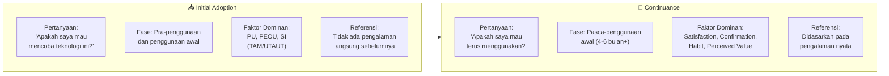
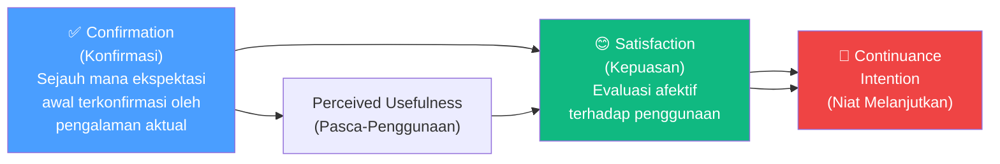
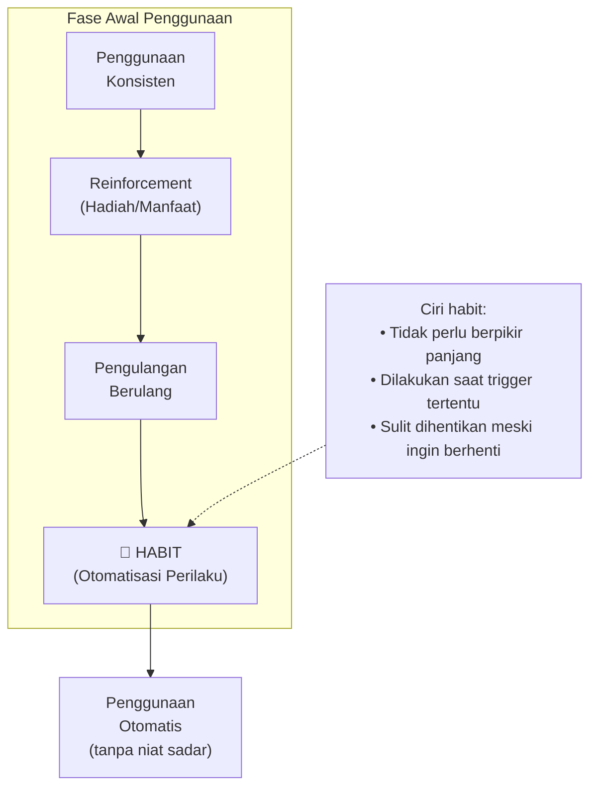
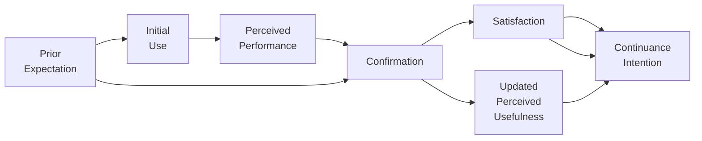
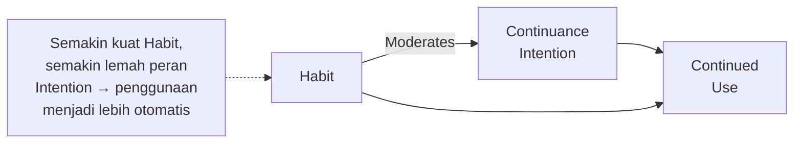
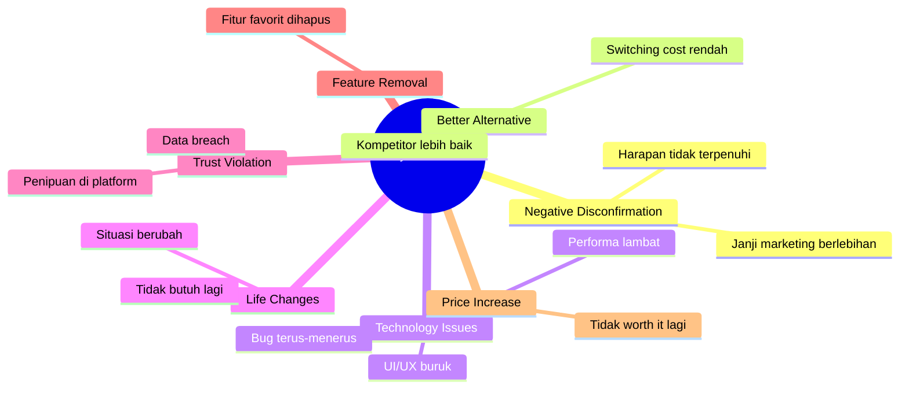

# BAB-26: Pasca-Adopsi dan Kontinuansi Penggunaan

> *"Adopsi awal hanyalah permulaan. Yang lebih penting — dan lebih sulit — adalah bagaimana membuat pengguna terus menggunakan teknologi tersebut dalam jangka panjang."*  
> — Bhattacherjee (2001)

---

## 🎯 Tujuan Pembelajaran

Setelah membaca bab ini, pembaca diharapkan mampu:
- Membedakan antara adopsi awal (initial adoption) dan kontinuansi penggunaan (continuance)
- Menjelaskan Expectation-Confirmation Model (ECM) Bhattacherjee
- Mengidentifikasi faktor-faktor yang menentukan apakah pengguna melanjutkan atau berhenti menggunakan teknologi
- Menjelaskan konsep churn, switching behavior, dan habit formation
- Merancang penelitian pasca-adopsi yang komprehensif

---

## 📖 Pendahuluan

Sebuah aplikasi baru diunduh jutaan kali dalam minggu pertama peluncurannya. Enam bulan kemudian, hanya 10% pengguna yang masih aktif. Sisanya? Uninstall, lupa, atau tidak pernah benar-benar menggunakannya.

Fenomena ini — yang oleh industri disebut sebagai **user churn** — menunjukkan bahwa adopsi awal (*initial adoption*) dan **kontinuansi** (*continuance intention*) adalah dua fenomena yang berbeda dan perlu diteliti secara berbeda.

TAM dan UTAUT dirancang untuk memprediksi **niat awal** menggunakan teknologi. Tetapi setelah seseorang mulai menggunakan — apakah ia akan terus menggunakan? Apa yang membuatnya bertahan? Apa yang membuatnya pergi?

Pertanyaan-pertanyaan inilah yang dijawab oleh penelitian **post-adoption**.

---

## 26.1 Initial Adoption vs. Continuance: Perbedaan Fundamental

**Paradoks Penting:** Faktor yang mendorong **adopsi awal** tidak selalu sama dengan faktor yang mendorong **kontinuansi**. Seseorang bisa mengadopsi karena iklan menarik (Social Influence tinggi), tapi berhenti karena sistemnya ternyata tidak berguna (PU rendah setelah digunakan).

---

## 26.2 Expectation-Confirmation Model (ECM)

**Bhattacherjee (2001)** mengadaptasi **Expectation-Confirmation Theory** dari marketing (Oliver, 1980) ke konteks IS, menciptakan **ECM-IS** (Expectation-Confirmation Model of IS Continuance).

### Model ECM-IS

---

### 26.2.1 Confirmation (Konfirmasi)

**Definisi:** Sejauh mana ekspektasi pengguna sebelum menggunakan sistem terkonfirmasi oleh pengalaman aktual penggunaannya.

**Rumus Konseptual:**
$$\text{Confirmation} = f(\text{Perceived Performance} - \text{Prior Expectations})$$

| Skenario | Kondisi | Hasil |
|---|---|---|
| **Positive Disconfirmation** | Performa > Ekspektasi | Sangat puas → Continuance kuat |
| **Confirmation** | Performa = Ekspektasi | Puas → Continuance sedang |
| **Negative Disconfirmation** | Performa < Ekspektasi | Kecewa → Churn tinggi |

---

### 26.2.2 Post-Adoption Perceived Usefulness (PU)

**Perbedaan dengan PU dalam TAM:**
- **TAM PU**: Didasarkan pada *keyakinan* sebelum penggunaan (belief-based)
- **ECM PU**: Didasarkan pada *pengalaman nyata* setelah penggunaan (experience-based)

PU pasca-adopsi biasanya lebih akurat karena tidak mengandung bias ekspektasi.

---

### 26.2.3 Satisfaction (Kepuasan)

**Definisi:** Respon afektif pengguna terhadap pengalaman menggunakan sistem — apakah ia merasa senang, puas, atau kecewa.

Satisfaction terbentuk dari:
- **Konfirmasi ekspektasi** (aspek kognitif)
- **PU pasca-penggunaan** (aspek utilitarian)
- Namun juga **aspek afektif** yang sulit diukur: kesenangan, kenyamanan, rasa aman

---

## 26.3 Faktor Pasca-Adopsi Lainnya

### 26.3.1 Habit (Kebiasaan)

Habit adalah salah satu prediktor terkuat **kontinuansi jangka panjang** — jauh melebihi niat sadar (*conscious intention*):

**Contoh habit digital:**
- Membuka Instagram setiap pagi tanpa disadari
- Memesan Gojek saat butuh ojek — langsung buka app tanpa mempertimbangkan alternatif
- Login ke email pertama kali setiap membuka laptop

---

### 26.3.2 Switching Cost (Biaya Beralih)

Biaya yang dirasakan jika berpindah dari teknologi yang sudah digunakan ke alternatif lain:

| Jenis Switching Cost | Contoh |
|---|---|
| **Learning cost** | Harus belajar sistem baru dari awal |
| **Data migration cost** | Memindahkan data dari sistem lama |
| **Relationship cost** | Kehilangan jaringan sosial yang sudah dibangun |
| **Financial cost** | Denda kontrak, kehilangan deposit |
| **Psychological cost** | Ketidaknyamanan dengan hal baru |

**Lock-in vs. Loyalty:**
- **Lock-in**: Pengguna tidak pergi karena **biaya beralih tinggi** (terpaksa)
- **Loyalty**: Pengguna tidak pergi karena **puas dan terbiasa** (dengan senang hati)

---

### 26.3.3 User Fatigue dan Burnout

Penggunaan teknologi yang berlebihan bisa menyebabkan **kelelahan digital** yang berujung pada:
- **Social Media Fatigue**: Bosan dengan media sosial → reduce usage
- **Information Overload**: Terlalu banyak notifikasi dan konten → dimatikan
- **Technostress**: Stres akibat teknologi yang tidak bisa dipahami/dikendalikan

---

## 26.4 IS Continuance vs. Post-Acceptance Model

### Oliver's IS Continuance Model (Bhattacherjee, 2001)

### Limayem et al. (2007): Peran Habit

---

## 26.5 Churn Analysis: Mengapa Pengguna Pergi

**Churn** adalah fenomena pengguna berhenti menggunakan suatu teknologi. Memahami churn sama pentingnya dengan memahami adopsi.

### Penyebab Churn

---

## 26.6 Pengukuran Pasca-Adopsi

### Item Kuesioner Continuance Intention (Bhattacherjee, 2001)

**Konfirmasi:**
- "Pengalaman saya menggunakan [sistem] melebihi ekspektasi awal saya"
- "[Sistem] memberikan apa yang saya harapkan sebelumnya"

**Post-Adoption Perceived Usefulness:**
- "Menggunakan [sistem] meningkatkan produktivitas saya (berdasarkan pengalaman nyata)"

**Kepuasan:**
- "Saya puas dengan pengalaman menggunakan [sistem]"
- "Pengalaman menggunakan [sistem] adalah hal yang menyenangkan"

**Continuance Intention:**
- "Saya berencana untuk terus menggunakan [sistem]"
- "Saya berniat untuk terus menggunakan [sistem] secara rutin"

---

## 🔗 Keterkaitan dengan Bab Lain

- ⬅️ Bab sebelumnya: [BAB-25 — Adopsi per Sektor](../BAB-25_Adopsi_per_Sektor/README.md)
- ➡️ Bab selanjutnya: [BAB-27 — Change Management](../BAB-27_Change_Management_dan_Adopsi/README.md)
- 🔗 IS Success Model: [BAB-11](../BAB-11_IS_Success_Model/README.md)
- 🔗 Habit dalam UTAUT2: [BAB-07](../BAB-07_UTAUT_dan_UTAUT2/README.md)
- 🔗 Trust dan loyalitas: [BAB-17](../BAB-17_Trust_Kepercayaan_dalam_Adopsi/README.md)

---

## ✅ Soal Latihan

1. **Konseptual:** Jelaskan perbedaan antara **adopsi awal** dan **kontinuansi** menggunakan kerangka ECM Bhattacherjee! Mengapa faktor yang mendorong keduanya bisa berbeda?

2. **Analitis:** Sebuah aplikasi perpustakaan digital kampus digunakan oleh 80% mahasiswa di bulan pertama, tetapi hanya 15% yang masih aktif setelah 6 bulan. Menggunakan ECM, analisis mengapa terjadi penurunan drastis ini dan faktor apa yang paling mungkin menjadi penyebabnya!

3. **Aplikasi:** Rancang penelitian pasca-adopsi untuk meneliti **kontinuansi penggunaan GoPay** oleh pedagang UMKM! Gunakan ECM sebagai kerangka utama dan tambahkan konstruk habit. Buat minimal 3 hipotesis!

4. **Kritis:** **Lock-in** membuat pengguna bertahan bukan karena puas, tapi karena terpaksa. Diskusikan implikasi etis dari strategi lock-in yang sengaja dirancang oleh perusahaan teknologi! Berikan contoh nyata dari ekosistem digital Indonesia!

---

## 📚 Referensi Bab Ini

- Bhattacherjee, A. (2001). Understanding information systems continuance: An expectation-confirmation model. *MIS Quarterly*, *25*(3), 351–370. https://doi.org/10.2307/3250921
- Limayem, M., Hirt, S. G., & Cheung, C. M. K. (2007). How habit limits the predictive power of intention: The case of information systems continuance. *MIS Quarterly*, *31*(4), 705–737.
- Oliver, R. L. (1980). A cognitive model of the antecedents and consequences of satisfaction decisions. *Journal of Marketing Research*, *17*(4), 460–469.
- Thong, J. Y. L., Hong, S., & Tam, K. Y. (2006). The effects of post-adoption beliefs on the expectation-confirmation model for information technology continuance. *International Journal of Human-Computer Studies*, *64*(9), 799–810.

---

← [BAB-25: Adopsi per Sektor](../BAB-25_Adopsi_per_Sektor/README.md) | [README Utama](../README.md) | [BAB-27: Change Management →](../BAB-27_Change_Management_dan_Adopsi/README.md)
