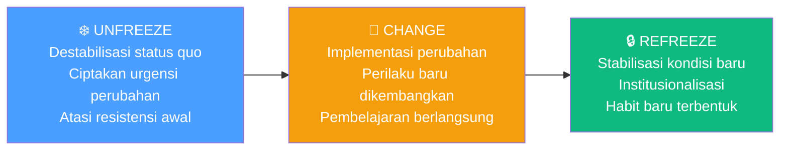
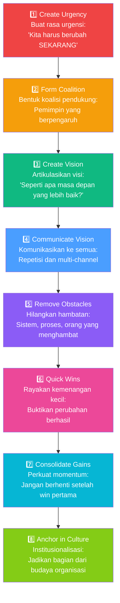
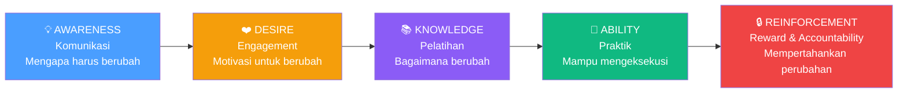
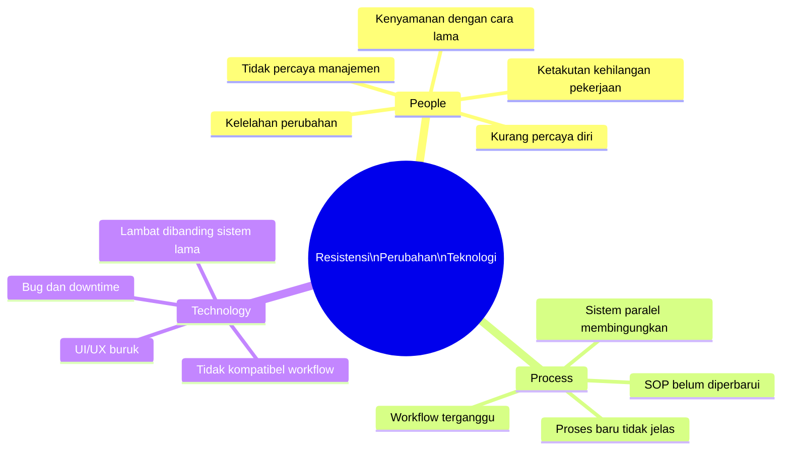
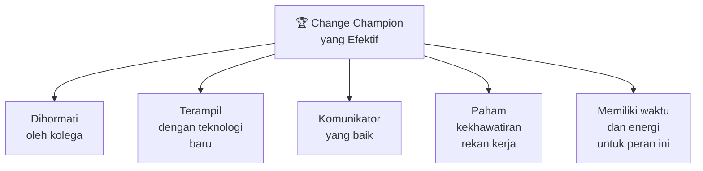
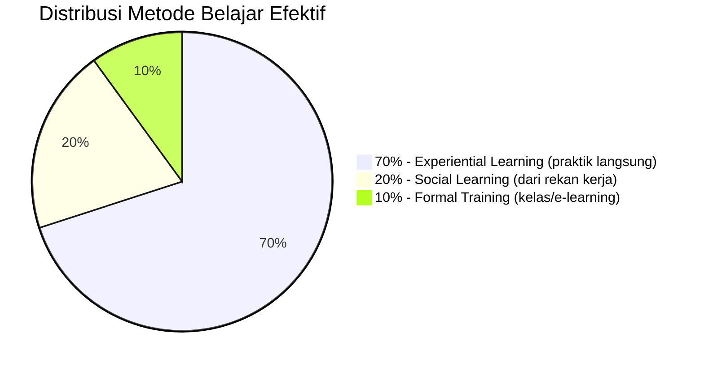

# BAB-27: Change Management dan Adopsi Teknologi

> *"Teknologi terbaik pun akan gagal jika perubahan yang ia bawa tidak dikelola dengan bijak. Manusia bukan mesin — mereka perlu dibimbing, bukan diprogram."*  
> — John Kotter

---

## 🎯 Tujuan Pembelajaran

Setelah membaca bab ini, pembaca diharapkan mampu:
- Menjelaskan hubungan antara change management dan adopsi teknologi
- Mengidentifikasi model change management utama (Kotter, Lewin, ADKAR)
- Menganalisis sumber resistensi perubahan dan strategi mengatasinya
- Merancang program adopsi teknologi berbasis prinsip change management
- Mengevaluasi keberhasilan program adopsi menggunakan metrik yang tepat

---

## 📖 Pendahuluan

Sebuah bank besar mengimplementasikan sistem core banking baru senilai Rp 500 miliar. Secara teknis, sistemnya sempurna. Namun 6 bulan pasca go-live, teller masih menggunakan sistem lama karena "lebih mudah". Proyek dianggap gagal oleh manajemen.

Masalahnya bukan pada teknologinya — masalahnya pada **bagaimana perubahan dikelola**.

Adopsi teknologi tidak bisa dipisahkan dari **change management** — disiplin yang mempelajari bagaimana membantu individu dan organisasi bertransisi dari kondisi saat ini menuju kondisi yang diinginkan. Bab ini menjembatani dua dunia: riset IS dan praktik manajemen perubahan.

---

## 27.1 Tiga Model Change Management Utama

### 27.1.1 Model Lewin: Unfreeze-Change-Refreeze

**Kurt Lewin (1947)** memperkenalkan model perubahan paling sederhana dan fundamental:

**Aplikasi dalam Adopsi Teknologi:**
- **Unfreeze**: Komunikasikan mengapa sistem lama tidak lagi mencukupi. Buat karyawan mau berubah.
- **Change**: Implementasi sistem baru + pelatihan intensif. Support maksimal.
- **Refreeze**: Jadikan sistem baru sebagai standar. Hapus akses ke sistem lama. Buat habit.

---

### 27.1.2 Model Kotter: 8 Langkah

**John Kotter (1996)** mengembangkan model 8 langkah yang lebih detail untuk transformasi besar:

---

### 27.1.3 Model ADKAR (Prosci)

**ADKAR** adalah model individual-level yang fokus pada **apa yang harus dimiliki setiap individu** agar perubahan berhasil:

| Fase | Komponen | Pertanyaan Kunci |
|---|---|---|
| **A** | **Awareness** | Apakah individu tahu MENGAPA perlu berubah? |
| **D** | **Desire** | Apakah individu MAHA berpartisipasi dalam perubahan? |
| **K** | **Knowledge** | Apakah individu TAHU cara berubah? |
| **A** | **Ability** | Apakah individu MAMPU menerapkan perubahan? |
| **R** | **Reinforcement** | Apakah ada mekanisme untuk mempertahankan perubahan? |

**Kegunaan ADKAR:** Mengidentifikasi **di mana tepatnya** individu atau kelompok mengalami hambatan perubahan — bukan hanya "ada resistensi", tapi resistensi di tahap mana?

---

## 27.2 Sumber Resistensi Terhadap Perubahan Teknologi

### People, Process, Technology Framework

### Tingkat Resistensi Individual

**Roger's Adopter Categories** (dari [BAB-05](../BAB-05_Diffusion_of_Innovations/README.md)) berlaku di sini:

| Kategori | Resistensi | Strategi |
|---|---|---|
| **Innovators** (2.5%) | Hampir tidak ada | Libatkan sebagai champion dan beta tester |
| **Early Adopters** (13.5%) | Minimal | Jadikan role model internal |
| **Early Majority** (34%) | Sedang — butuh bukti | Tunjukkan quick wins dari early adopters |
| **Late Majority** (34%) | Tinggi — perlu tekanan sosial | Peer influence + management mandate |
| **Laggards** (16%) | Sangat tinggi | 1-on-1 coaching, waktu adaptasi lebih panjang |

---

## 27.3 Change Champions: Katalisator Adopsi Internal

**Change Champion** (atau *Technology Champion*) adalah individu internal yang secara sukarela menjadi pendukung dan promotor teknologi baru di lingkungan kerjanya.

### Kriteria Change Champion yang Efektif

**Program Change Champion:**
1. Rekrut volunteer dari berbagai departemen
2. Berikan akses dan training lebih awal (*early access*)
3. Beri insentif (recognition, bukan selalu uang)
4. Fasilitasi dengan resources dan jalur eskalasi
5. Evaluasi dan apresiasi kontribusi mereka

---

## 27.4 Komunikasi Perubahan yang Efektif

### Prinsip WIIFM (What's In It For Me?)

Manusia tidak berubah karena disuruh — mereka berubah ketika melihat **manfaat personal** yang nyata.

**Pesan komunikasi yang salah:** "Perusahaan memerlukan efisiensi operasional, maka kita implementasi sistem baru."

**Pesan komunikasi yang benar:** "Dengan sistem baru ini, Anda tidak perlu lagi input data dua kali. Pekerjaan Anda pada bagian ini akan berkurang 40 menit per hari."

### Multi-Channel Communication Strategy

| Saluran | Pesan | Target |
|---|---|---|
| **Town hall meeting** | Visi dan alasan perubahan | Semua karyawan |
| **Email dari CEO/direktur** | Komitmen pimpinan | Semua karyawan |
| **Briefing tim kecil** | Dampak spesifik per departemen | Per tim |
| **Intranet/LMS** | Tutorial dan FAQ | Self-service learners |
| **1-on-1 coaching** | Kekhawatiran individual | Resistors |
| **Quick reference card** | Langkah operasional cepat | End users |

---

## 27.5 Program Pelatihan yang Efektif untuk Adopsi

**70-20-10 Learning Model:**

**Implikasi:** Program pelatihan teknologi yang hanya mengandalkan kelas (formal training) mengabaikan 90% cara orang benar-benar belajar. Perlu ada:
- **Sandbox environment** untuk praktik tanpa takut salah
- **Peer learning groups** atau buddy system
- **Helpdesk yang responsif** untuk support di lapangan
- **Job aids** (cheat sheet, quick guide) untuk referensi cepat

---

## 27.6 Metrik Keberhasilan Adopsi

### KPI Adopsi Teknologi

| Metrik | Cara Mengukur | Target (contoh) |
|---|---|---|
| **Adoption Rate** | % pengguna yang sudah aktif / total target | >80% dalam 3 bulan |
| **Feature Utilization** | % fitur yang digunakan dari total fitur tersedia | >60% |
| **Support Ticket Volume** | Jumlah tiket help desk per periode | Turun 50% setelah 3 bulan |
| **Task Completion Time** | Waktu rata-rata menyelesaikan tugas kritis | Turun dari baseline |
| **User Satisfaction Score** | Rata-rata skor kepuasan pengguna (NPS/CSAT) | >70 (dari 100) |
| **Error Rate** | Frekuensi kesalahan input/penggunaan | Turun 80% dari bulan 1 |
| **Return to Old System** | % yang masih menggunakan sistem lama | 0% setelah cut-off |

---

## 🔗 Keterkaitan dengan Bab Lain

- ⬅️ Bab sebelumnya: [BAB-26 — Pasca-Adopsi](../BAB-26_Pasca_Adopsi_dan_Kontinuansi/README.md)
- ➡️ Bab selanjutnya: [BAB-28 — Metodologi Penelitian](../BAB-28_Metodologi_Penelitian/README.md)
- 🔗 Hambatan adopsi: [BAB-16](../BAB-16_Hambatan_Adopsi/README.md)
- 🔗 DOI adopter categories: [BAB-05](../BAB-05_Diffusion_of_Innovations/README.md)
- 🔗 TOE organisasi: [BAB-10](../BAB-10_TOE_Framework/README.md)

---

## ✅ Soal Latihan

1. **Konseptual:** Bandingkan model Lewin (Unfreeze-Change-Refreeze) dengan model ADKAR dalam konteks implementasi sistem ERP baru di sebuah perusahaan manufaktur! Kapan Anda akan menggunakan masing-masing model, atau dapatkah keduanya diintegrasikan?

2. **Analitis:** Sebuah puskesmas mengimplementasikan rekam medis elektronik. Dokter senior (20+ tahun pengalaman) menunjukkan resistensi tinggi. Gunakan **ADKAR** untuk mendiagnosis di fase mana resistensi itu terjadi dan rancang intervensi yang tepat!

3. **Aplikasi:** Anda adalah Project Manager implementasi sistem baru di sebuah instansi pemerintah. Rancang **program change champion** lengkap: kriteria seleksi, program training khusus, insentif, dan metrik evaluasi!

4. **Kritis:** Model Kotter banyak dikritik karena mengasumsikan proses perubahan yang **linier dan terencana** padahal perubahan nyata lebih chaotic. Berikan argumen kritik dan usulan bagaimana model yang lebih adaptif seharusnya terlihat!

---

## 📚 Referensi Bab Ini

- Hiatt, J. M. (2006). *ADKAR: A model for change in business, government and our community*. Prosci Learning Center.
- Kotter, J. P. (1996). *Leading change*. Harvard Business School Press.
- Lewin, K. (1947). Frontiers in group dynamics: Concept, method and reality in social science. *Human Relations*, *1*(1), 5–41.
- Oreg, S. (2003). Resistance to change: Developing an individual differences measure. *Journal of Applied Psychology*, *88*(4), 680–693.
- Venkatesh, V., & Bala, H. (2008). Technology acceptance model 3 and a research agenda on interventions. *Decision Sciences*, *39*(2), 273–315.

---

← [BAB-26: Pasca-Adopsi](../BAB-26_Pasca_Adopsi_dan_Kontinuansi/README.md) | [README Utama](../README.md) | [BAB-28: Metodologi →](../BAB-28_Metodologi_Penelitian/README.md)
