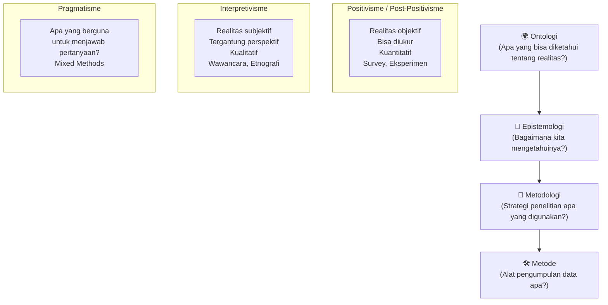
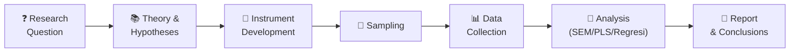
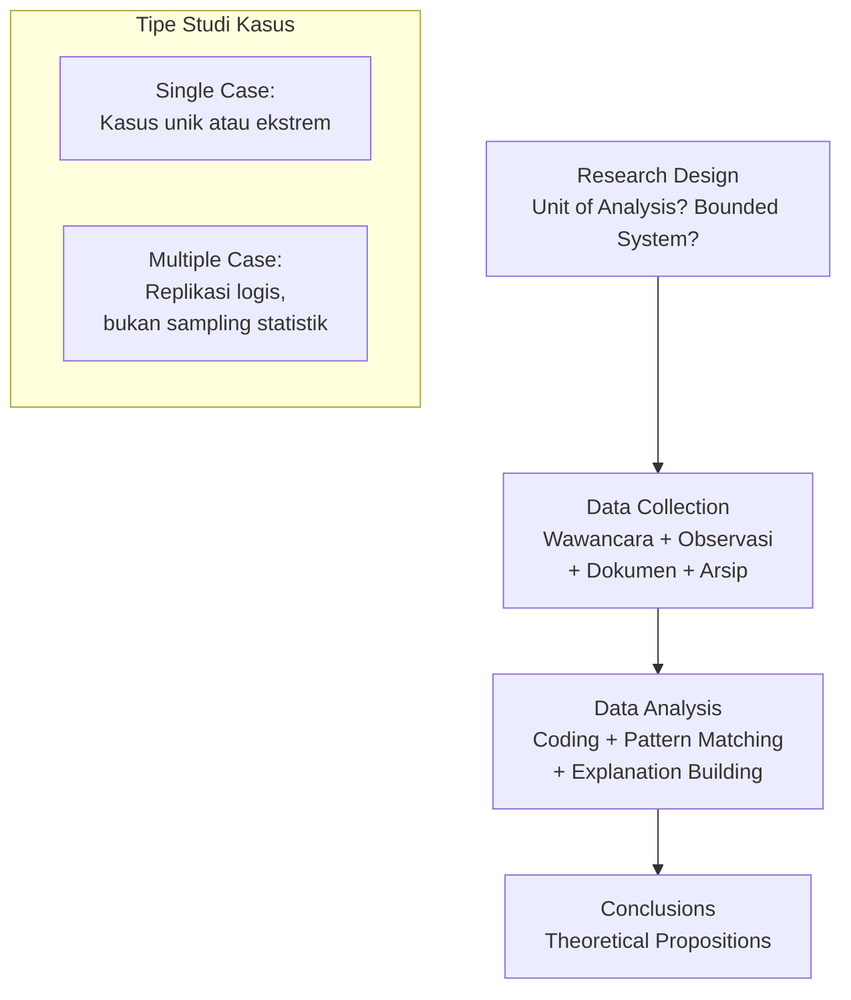
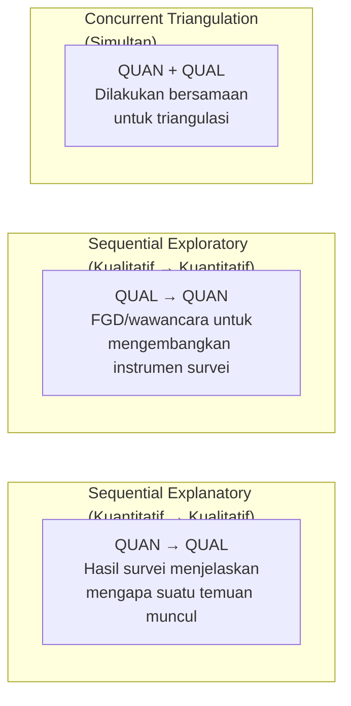

# BAB-28: Metodologi Penelitian Adopsi Teknologi

> *"Metodologi adalah jembatan antara pertanyaan penelitian dan jawaban yang dapat dipercaya. Pilih jembatan yang salah dan Anda mungkin tiba di tempat yang berbeda dari yang Anda tuju."*

---

## 🎯 Tujuan Pembelajaran

Setelah membaca bab ini, pembaca diharapkan mampu:
- Membedakan pendekatan kuantitatif, kualitatif, dan mixed methods dalam penelitian adopsi
- Memilih desain penelitian yang tepat berdasarkan tujuan dan pertanyaan penelitian
- Menjelaskan desain survey, eksperimen, dan studi kasus dalam konteks adopsi
- Memahami isu-isu metodologis kritis: common method bias, sampling, dan generalisasi
- Merancang desain penelitian yang koheren dan rigorous

---

## 📖 Pendahuluan

Penelitian adopsi teknologi didominasi oleh **metode survei kuantitatif** — membagikan kuesioner, mengumpulkan data, menganalisis dengan SEM atau regresi, menarik kesimpulan. Pendekatan ini kuat, efisien, dan mudah direplikasi.

Namun tidak semua pertanyaan penelitian bisa dijawab dengan kuesioner. Kadang kita perlu **mendengar** alasan di balik keputusan (*why*), bukan sekadar mengukur seberapa kuat (*how much*). Bab ini memetakan lanskap metodologi penelitian adopsi teknologi secara komprehensif.

---

## 28.1 Paradigma Penelitian

**Dominasi dalam penelitian adopsi IS:**
- ~75% penelitian menggunakan **positivisme** (kuantitatif)
- ~15% menggunakan **interpretivisme** (kualitatif)
- ~10% menggunakan **mixed methods**

---

## 28.2 Pendekatan Kuantitatif

### 28.2.1 Survey (Survei)

**Desain paling umum** dalam penelitian adopsi teknologi.

**Kekuatan Survey:**
- Sampel besar → generalisasi lebih kuat
- Efisien: banyak data dalam waktu singkat
- Dapat mengukur banyak konstruk sekaligus

**Kelemahan Survey:**
- **Common Method Bias (CMB)**: Semua data dari sumber yang sama pada waktu yang sama
- **Self-report bias**: Responden tidak selalu jujur atau akurat
- **Tidak menjelaskan *mengapa***: Hanya menangkap *apa* dan *seberapa*
- **Cross-sectional**: Snapshot satu waktu, tidak menangkap perubahan

### 28.2.2 Jenis Desain Survey

| Desain | Kapan Digunakan | Kekuatan |
|---|---|---|
| **Cross-sectional** | Snapshot satu waktu, efisien | Cepat dan murah |
| **Longitudinal** | Mengikuti perubahan dari waktu ke waktu | Menangkap kausalitas lebih baik |
| **Panel study** | Kelompok yang sama disurvei berulang kali | Menangkap perubahan individual |
| **Experimental survey** | Vignette/skenario untuk menguji kausalitas | Internal validity lebih tinggi |

---

### 28.2.3 Eksperimen

Eksperimen memberikan **internal validity tertinggi** untuk menguji hubungan kausalitas — namun jarang digunakan dalam penelitian adopsi IS karena sulit dilakukan secara realistis.

| Jenis | Ciri | Contoh Adopsi |
|---|---|---|
| **Lab experiment** | Kontrol penuh, setting artifisial | Uji dampak desain UI terhadap PEOU |
| **Field experiment** | Setting nyata, kontrol parsial | A/B testing fitur baru pada subset pengguna |
| **Quasi-experiment** | Tanpa random assignment | Bandingkan adopsi sebelum/sesudah intervensi |

---

## 28.3 Pendekatan Kualitatif

### 28.3.1 Kapan Menggunakan Metode Kualitatif?

✅ **Gunakan kualitatif** ketika:
- Pertanyaan penelitian bersifat *"bagaimana"* atau *"mengapa"*
- Fenomena masih sangat baru dan teori belum ada
- Konteks sangat spesifik dan lokal
- Perlu memahami pengalaman dan makna dari perspektif partisipan
- Ingin mengeksplorasi hambatan yang belum terdefinisi

### 28.3.2 Metode Kualitatif Utama

| Metode | Deskripsi | Contoh Aplikasi |
|---|---|---|
| **In-depth Interview** | Wawancara mendalam 1-on-1 | Mengapa UMKM menolak go-digital? |
| **Focus Group Discussion (FGD)** | Diskusi kelompok 6-10 orang | Persepsi petani terhadap aplikasi pertanian |
| **Ethnography** | Observasi partisipatif jangka panjang | Bagaimana dokter menggunakan EMR dalam praktik nyata |
| **Case Study** | Studi mendalam satu atau beberapa kasus | Bagaimana satu RSUD berhasil mengadopsi RME? |
| **Grounded Theory** | Membangun teori dari data | Menemukan teori baru dari pengalaman adopter |
| **Content Analysis** | Analisis teks/dokumen | Analisis ulasan pengguna tentang aplikasi |

---

### 28.3.3 Case Study (Studi Kasus) dalam Penelitian Adopsi

**Robert Yin (1994)** mengembangkan kerangka studi kasus yang paling banyak digunakan:

---

## 28.4 Mixed Methods Research

**Mixed methods** menggabungkan kekuatan kuantitatif dan kualitatif:

### Desain Mixed Methods Utama

**Kapan mixed methods ideal dalam penelitian adopsi?**
- Ingin validasi temuan survei dengan narasi pengalaman nyata
- Instrumen belum tersedia → eksplorasi kualitatif dulu untuk item kuesioner
- Ingin memahami mengapa konstruk tertentu tidak signifikan dalam survei

---

## 28.5 Isu Metodologis Kritis

### 28.5.1 Common Method Bias (CMB)

**Masalah terbesar** dalam penelitian survei adopsi teknologi: semua data (prediktor DAN outcome) dikumpulkan dari **sumber yang sama** (responden yang sama), **metode yang sama** (kuesioner), pada **waktu yang sama**.

Ini menciptakan korelasi artifisial yang menggembungkan ukuran efek secara signifikan.

**Deteksi CMB:**

| Metode | Cara | Batas |
|---|---|---|
| **Harman's Single Factor Test** | CFA dengan satu faktor — apakah satu faktor menjelaskan sebagian besar varian? | Jika ya (>50%), CMB mungkin ada |
| **Marker Variable Technique** | Sertakan variabel tidak terkait teori; korelasi residual menunjukkan CMB | Nilai residual kecil = CMB rendah |
| **CFA Unmeasured Latent Factor** | Tambahkan faktor umum ke model CFA | Tetap signifikan? Mungkin CMB |

**Mitigasi CMB:**
- **Temporal separation**: Kumpulkan variabel independen dan dependen pada waktu berbeda
- **Multiple respondents**: Variabel dependen dari sumber berbeda (misal: data sistem untuk Actual Use)
- **Procedural remedies**: Jamin anonimitas, pisahkan bagian kuesioner

---

### 28.5.2 Sampling

**Jenis Sampling dalam Penelitian Adopsi:**

| Jenis | Cocok Untuk | Catatan |
|---|---|---|
| **Purposive** | Kualitatif, informan kunci | Tidak representatif |
| **Convenience** | Survei mahasiswa, online | Paling umum, paling banyak dikritik |
| **Snowball** | Populasi tersembunyi | Bias jaringan sosial |
| **Stratified Random** | Generalisasi populasi | Paling rigorous untuk kuantitatif |
| **Quota** | Pastikan representasi kelompok | Lebih praktis dari stratified |

**Ukuran Sampel:**

| Metode Analisis | Aturan Praktis |
|---|---|
| **Regresi** | n ≥ 10× jumlah prediktor |
| **CB-SEM** | n ≥ 200 (idealnya 400+) |
| **PLS-SEM** | n ≥ 10× jumlah indikator konstruk terkompleks (lebih toleran) |
| **Kualitatif** | Sampai **saturasi data** (biasanya 15-30 wawancara) |

---

### 28.5.3 Validitas dan Reliabilitas

| Aspek | Definisi | Ukuran |
|---|---|---|
| **Construct Validity** | Instrumen mengukur apa yang ingin diukur | AVE > 0.5, Factor Loading > 0.7 |
| **Convergent Validity** | Item mengukur konstruk yang sama berkorelasi tinggi | AVE > 0.5, CR > 0.7 |
| **Discriminant Validity** | Konstruk berbeda memang berbeda | HTMT < 0.85 (atau Fornell-Larcker) |
| **Reliability** | Konsistensi pengukuran | Cronbach's α > 0.7, CR > 0.7 |
| **External Validity** | Temuan dapat digeneralisasi | Bergantung pada sampling |

---

## 28.6 Desain Penelitian End-to-End

### Contoh Desain Penelitian TAM untuk Fintech

| Komponen | Keputusan | Justifikasi |
|---|---|---|
| **Paradigma** | Positivisme | Menguji hubungan teori yang sudah ada |
| **Pendekatan** | Kuantitatif | Mengukur magnitude pengaruh konstruk |
| **Desain** | Cross-sectional survey | Efisiensi waktu dan biaya |
| **Populasi** | Pengguna aktif GoPay di Jabodetabek | Sesuai konteks dan aksesibilitas |
| **Sampling** | Purposive + snowball | Sulit mendapat daftar pengguna |
| **Ukuran Sampel** | n = 200 (PLS-SEM) | Toleran ukuran sampel lebih kecil |
| **Instrumen** | Kuesioner online (Google Form) | Efisien dan mudah distribusi |
| **Analisis** | SmartPLS 4 (PLS-SEM) | Sesuai untuk model reflektif |
| **Mitigasi CMB** | Prosedural (anonimitas) + Harman test | Standar minimum |

---

## 🔗 Keterkaitan dengan Bab Lain

- ⬅️ Bab sebelumnya: [BAB-27 — Change Management](../BAB-27_Change_Management_dan_Adopsi/README.md)
- ➡️ Bab selanjutnya: [BAB-29 — Instrumen & Skala](../BAB-29_Instrumen_dan_Skala_Pengukuran/README.md)
- 🔗 Analisis SEM/PLS: [BAB-30](../BAB-30_Analisis_Data_SEM_PLS/README.md)
- 🔗 Etika penelitian: [BAB-31](../BAB-31_Etika_Penelitian/README.md)
- 🔗 Template kuesioner: [BAB-32](../BAB-32_Template_Kuesioner/README.md)

---

## ✅ Soal Latihan

1. **Konseptual:** Jelaskan mengapa **Common Method Bias** menjadi ancaman serius dalam penelitian survei adopsi teknologi! Bagaimana cara mendeteksi dan memitigasinya?

2. **Perancangan:** Anda ingin meneliti **mengapa** beberapa UMKM berhasil mengadopsi e-commerce sementara yang lain gagal. Pendekatan penelitian apa yang paling tepat? Rancang desain penelitian lengkapnya!

3. **Kritis:** Penelitian adopsi teknologi di Indonesia mayoritas menggunakan **convenience sampling dari mahasiswa** sebagai responden. Apa masalahnya? Kapan temuan dari sampel mahasiswa bisa — dan tidak bisa — digeneralisasikan?

4. **Analitis:** Bandingkan **cross-sectional survey** vs. **longitudinal study** dalam konteks meneliti adopsi teknologi! Kapan masing-masing lebih tepat, dan apa trade-off yang perlu dipertimbangkan?

---

## 📚 Referensi Bab Ini

- Creswell, J. W., & Creswell, J. D. (2018). *Research design: Qualitative, quantitative, and mixed methods approaches* (5th ed.). Sage.
- Harman, H. H. (1976). *Modern factor analysis* (3rd ed.). University of Chicago Press.
- Podsakoff, P. M., MacKenzie, S. B., Lee, J. Y., & Podsakoff, N. P. (2003). Common method biases in behavioral research. *Journal of Applied Psychology*, *88*(5), 879–903.
- Yin, R. K. (2018). *Case study research and applications: Design and methods* (6th ed.). Sage.

---

← [BAB-27: Change Management](../BAB-27_Change_Management_dan_Adopsi/README.md) | [README Utama](../README.md) | [BAB-29: Instrumen →](../BAB-29_Instrumen_dan_Skala_Pengukuran/README.md)
