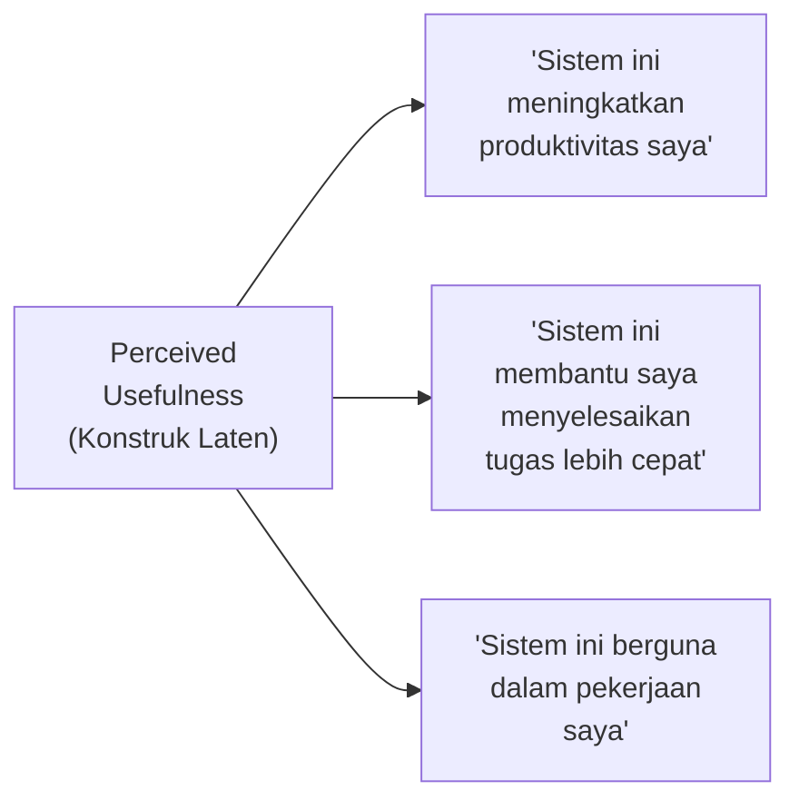
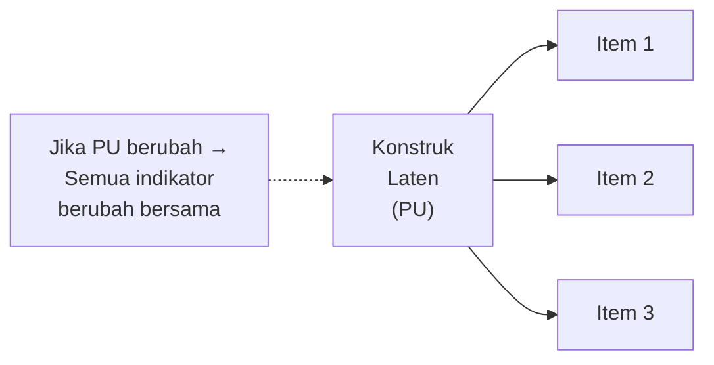
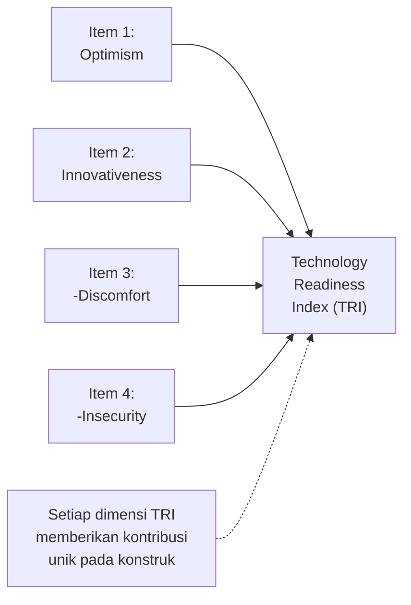
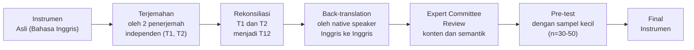
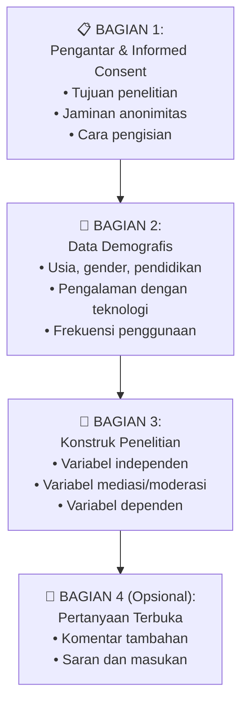

# BAB-29: Instrumen dan Skala Pengukuran

> *"Mengukur konstruk yang tidak kasat mata — seperti kepercayaan, persepsi kegunaan, atau kecemasan teknologi — adalah seni sekaligus ilmu. Instrumen yang buruk akan menghasilkan data yang tidak bermakna, tidak peduli seberapa canggih analisisnya."*

---

## 🎯 Tujuan Pembelajaran

Setelah membaca bab ini, pembaca diharapkan mampu:
- Membedakan konstruk reflektif dan formatif serta implikasinya terhadap pengukuran
- Mengembangkan atau mengadaptasi instrumen pengukuran yang valid dan reliabel
- Menerapkan skala Likert dengan benar dalam penelitian adopsi
- Mengidentifikasi dan menghindari kesalahan umum dalam desain kuesioner
- Melakukan pre-testing dan pilot study instrumen secara sistematis

---

## 📖 Pendahuluan

Kita tidak bisa secara langsung "melihat" Perceived Usefulness, Trust, atau Self-Efficacy. Kita hanya bisa **mengukur manifestasinya** melalui respon responden terhadap pernyataan-pernyataan yang kita rancang.

Kualitas pengukuran menentukan kualitas seluruh penelitian. Instrumen yang buruk menghasilkan data yang tidak valid — dan analisis statistik yang canggih sekalipun tidak bisa memperbaiki data yang rusak sejak awal.

---

## 29.1 Konstruk Laten dan Indikator

Dalam penelitian adopsi teknologi, hampir semua variabel adalah **konstruk laten** — konsep abstrak yang tidak bisa diukur langsung, hanya bisa diinferensi dari **indikator** (item kuesioner).

---

## 29.2 Reflektif vs. Formatif: Perbedaan Fundamental

### Konstruk Reflektif

**Definisi:** Indikator adalah *refleksi* dari konstruk. Konstruk yang ada *menyebabkan* variasi dalam indikator.

**Ciri reflektif:**
- Indikator saling berkorelasi tinggi
- Indikator bisa dipertukarkan (interchaneable)
- Menghapus satu item tidak mengubah makna konstruk
- Contoh: PU, PEOU, Trust, Self-efficacy

---

### Konstruk Formatif

**Definisi:** Indikator *membentuk* konstruk. Indikator-indikator yang ada *menyebabkan* konstruk.

**Ciri formatif:**
- Indikator TIDAK harus berkorelasi tinggi
- Indikator TIDAK bisa dipertukarkan
- Menghapus satu item mengubah makna konstruk
- Contoh: TRI (4 dimensi berbeda), TTF (task + tech characteristics)

### Konsekuensi Perbedaan untuk Analisis

| Aspek | Reflektif | Formatif |
|---|---|---|
| **Internal Consistency** | Wajib (Cronbach's α, CR) | Tidak relevan |
| **Convergent Validity** | AVE > 0.5 | Tidak berlaku |
| **Collinearity** | Tidak menjadi isu | Wajib diperiksa (VIF) |
| **Arah panah SEM** | Dari laten ke indikator | Dari indikator ke laten |

---

## 29.3 Skala Pengukuran

### 29.3.1 Skala Likert

Skala Likert adalah standar utama pengukuran konstruk laten dalam penelitian adopsi teknologi.

**Versi yang Paling Umum:**

| Skala | Rentang | Rekomendasi |
|---|---|---|
| **5-point** | STS - TS - N - S - SS | Paling umum, mudah dipahami responden |
| **7-point** | STS - TS - ATS - N - AS - S - SS | Lebih sensitif, disarankan untuk penelitian S2/S3 |
| **10-point** | 1-10 | Untuk VAS (Visual Analog Scale) |

### Format Skala 5-Point (Standar Indonesia)

| Kode | Label | Nilai |
|---|---|---|
| STS | Sangat Tidak Setuju | 1 |
| TS | Tidak Setuju | 2 |
| N | Netral / Ragu-Ragu | 3 |
| S | Setuju | 4 |
| SS | Sangat Setuju | 5 |

### 29.3.2 Haruskah Ada Titik Tengah (Netral)?

**Pro Titik Tengah:**
- Menghormati ambivalensi responden yang genuinly netral
- Mengurangi forced response

**Kontra Titik Tengah:**
- Responden yang malas cenderung memilih tengah (*middle response tendency*)
- Terutama bermasalah dengan responden Indonesia yang cenderung menghindari ekspresi sikap ekstrem

**Rekomendasi:** Untuk populasi umum Indonesia, gunakan **skala 5-point dengan netral** tetapi awasi middle response tendency dalam analisis.

---

## 29.4 Sumber Instrumen Tervalidasi

**Prinsip utama:** Gunakan instrumen yang sudah divalidasi dalam penelitian sebelumnya, bukan membuat sendiri dari awal!

### Instrumen Teori Adopsi yang Sudah Tervalidasi

| Teori | Item Asli | Sumber |
|---|---|---|
| **TAM** | 6 item PU + 6 item PEOU | Davis (1989) |
| **TAM — versi pendek** | 4 item PU + 4 item PEOU | Davis et al. (1992) |
| **UTAUT** | 4 item PE + 4 item EE + 3 item SI + 4 item FC | Venkatesh et al. (2003) |
| **UTAUT2** | UTAUT + 4 item HM + 3 item PV + 4 item Habit | Venkatesh et al. (2012) |
| **Trust (3 komponen)** | 3 item Ability + 3 item Benevolence + 3 item Integrity | McKnight et al. (2002) |
| **Innovation Resistance** | 5 dimensi × 3 item | Ram & Sheth (1989) |
| **TRI 2.0** | 4 dimensi × 4 item | Parasuraman & Colby (2015) |
| **ECM (Continuance)** | 3+3+3 item (Conf., PU, Sat.) | Bhattacherjee (2001) |
| **Privacy Concern** | 4 dimensi × 4 item | Smith et al. (1996) |

---

## 29.5 Adaptasi dan Terjemahan Instrumen

### Prosedur Adaptasi Lintas Budaya (WHO, 2002)

**Hal yang perlu diperhatikan saat terjemahan:**
- **Ekuivalensi semantik**: Makna yang sama, bukan sekadar terjemahan kata per kata
- **Ekuivalensi idiomatis**: Idiom dalam satu bahasa mungkin tidak ada padanannya
- **Ekuivalensi konseptual**: Apakah konsep relevan dalam budaya target?

**Contoh masalah terjemahan:**
> "Using this system makes me look good to my peers" 
> → "Menggunakan sistem ini membuat saya terlihat bagus di mata rekan-rekan saya"

Kalimat ini mengandung nuansa *image concern* yang mungkin terasa awkward dalam Bahasa Indonesia — perlu adaptasi idiomatis.

---

## 29.6 Desain Kuesioner yang Efektif

### 29.6.1 Struktur Kuesioner yang Baik

### 29.6.2 Kesalahan Umum dalam Desain Item

| Kesalahan | Contoh Buruk | Versi Baik |
|---|---|---|
| **Double-barreled** | "Sistem ini berguna DAN mudah digunakan" | Pisah menjadi 2 item |
| **Leading question** | "Setujukah Anda bahwa sistem ini sangat berguna?" | "Sistem ini berguna untuk pekerjaan saya" |
| **Kata negatif** | "Sistem ini TIDAK membuat saya frustrasi" | Hindari negasi; jika terpaksa, beri catatan |
| **Ambigu** | "Saya sering menggunakan sistem ini" | "Saya menggunakan sistem ini minimal 3x seminggu" |
| **Asumsi** | "Sejak menggunakan sistem, produktivitas saya meningkat" | Bisa jadi responden belum menggunakan |
| **Jargon teknis** | "Sistem ini memiliki UX yang intuitif" | "Sistem ini mudah dipahami sejak pertama digunakan" |

---

## 29.7 Pre-Testing dan Pilot Study

### Pre-Testing (n=5-10)

**Tujuan:** Mengidentifikasi masalah dalam phrasing, pemahaman, dan format — bukan menguji validitas statistik.

**Cara:** Minta 5-10 orang dari populasi target mengisi kuesioner sambil "think aloud" — katakan apa yang ada di pikiran mereka saat membaca setiap item.

### Pilot Study (n=30-50)

**Tujuan:** Menguji reliabilitas dan validitas konstruk secara statistik sebelum pengumpulan data utama.

**Analisis Pilot:**
1. Cronbach's Alpha → harus > 0.7
2. Item-Total Correlation → harus > 0.3 (jika rendah, item perlu direvisi/dihapus)
3. Factor Analysis (EFA) → apakah item loading ke faktor yang benar?

---

## 🔗 Keterkaitan dengan Bab Lain

- ⬅️ Bab sebelumnya: [BAB-28 — Metodologi](../BAB-28_Metodologi_Penelitian/README.md)
- ➡️ Bab selanjutnya: [BAB-30 — SEM & PLS-SEM](../BAB-30_Analisis_Data_SEM_PLS/README.md)
- 🔗 Template kuesioner siap pakai: [BAB-32](../BAB-32_Template_Kuesioner/README.md)
- 🔗 Etika pengambilan data: [BAB-31](../BAB-31_Etika_Penelitian/README.md)

---

## ✅ Soal Latihan

1. **Konseptual:** Jelaskan perbedaan antara **konstruk reflektif** dan **konstruk formatif**! Berikan satu contoh masing-masing dari teori adopsi yang sudah Anda pelajari dan jelaskan mengapa ia dikategorikan demikian!

2. **Aplikasi:** Anda mengadaptasi instrumen TAM dari Davis (1989) untuk meneliti adopsi **aplikasi e-learning** di Indonesia. Jelaskan prosedur adaptasi dan terjemahan yang harus dilakukan! Apa saja yang perlu dimodifikasi dari instrumen aslinya?

3. **Kritis:** Seorang peneliti menggunakan skala Likert 5-point dan mendapatkan bahwa 60% responden memilih angka 4 atau 5 untuk semua item. Apa yang mungkin terjadi? Identifikasi minimal **tiga bias pengukuran** yang mungkin muncul dan jelaskan cara mengatasinya!

4. **Desain:** Rancang instrumen kuesioner untuk meneliti adopsi **QRIS** oleh pedagang pasar tradisional! Tentukan konstruk yang akan diukur, pilih atau adaptasi item dari sumber tervalidasi, dan rancang format kuesioner yang sesuai dengan karakteristik responden tersebut!

---

## 📚 Referensi Bab Ini

- Davis, F. D. (1989). Perceived usefulness, perceived ease of use, and user acceptance of information technology. *MIS Quarterly*, *13*(3), 319–340.
- DeVellis, R. F. (2017). *Scale development: Theory and applications* (4th ed.). Sage.
- Hair, J. F., Risher, J. J., Sarstedt, M., & Ringle, C. M. (2019). When to use and how to report results of PLS-SEM. *European Business Review*, *31*(1), 2–24.
- McKnight, D. H., Choudhury, V., & Kacmar, C. (2002). Developing and validating trust measures for e-commerce. *Information Systems Research*, *13*(3), 334–359.
- Venkatesh, V., Thong, J. Y. L., & Xu, X. (2012). Consumer acceptance and use of information technology. *MIS Quarterly*, *36*(1), 157–178.

---

← [BAB-28: Metodologi](../BAB-28_Metodologi_Penelitian/README.md) | [README Utama](../README.md) | [BAB-30: SEM & PLS →](../BAB-30_Analisis_Data_SEM_PLS/README.md)
