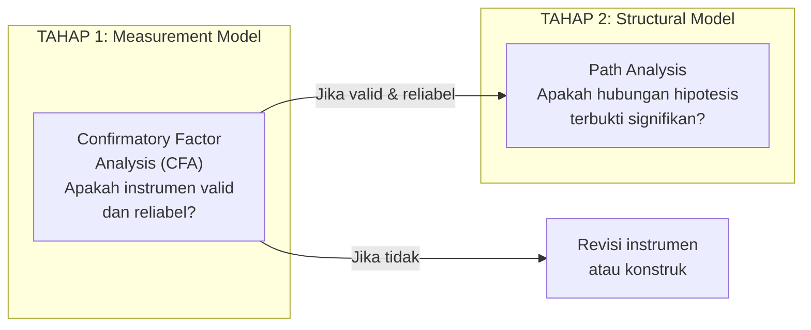
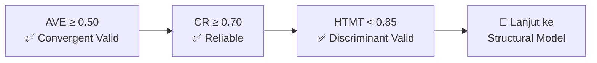
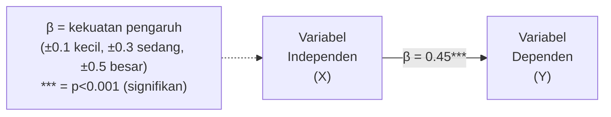
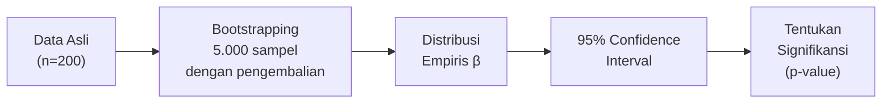
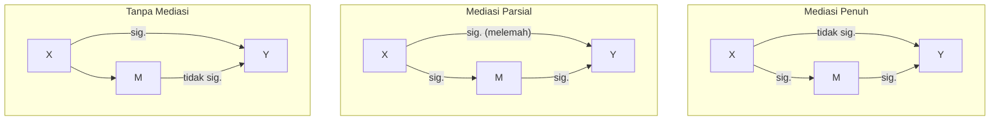
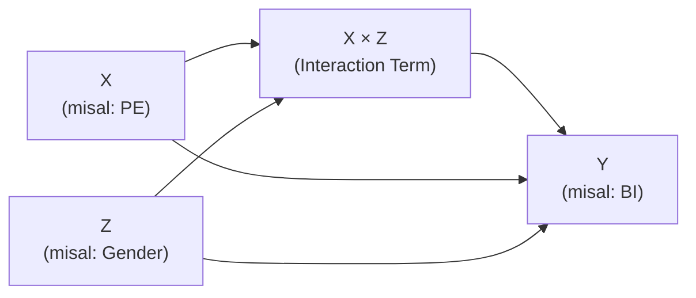

# BAB-30: Analisis Data: SEM dan PLS-SEM

> *"SEM bukan sekedar regresi yang lebih canggih — ia adalah cara untuk menguji teori secara menyeluruh, termasuk variabel yang tidak dapat diobservasi langsung."*

---

## 🎯 Tujuan Pembelajaran

Setelah membaca bab ini, pembaca diharapkan mampu:
- Menjelaskan prinsip dasar Structural Equation Modeling (SEM)
- Membedakan CB-SEM dan PLS-SEM serta memilih yang tepat
- Menginterpretasikan hasil analisis measurement model (CFA)
- Menginterpretasikan hasil analisis structural model
- Menggunakan software SmartPLS atau AMOS untuk analisis adopsi teknologi

---

## 📖 Pendahuluan

Penelitian adopsi teknologi hampir selalu menggunakan **SEM (Structural Equation Modeling)** — keluarga metode statistik yang memungkinkan pengujian simultan dari:
1. **Measurement model** (apakah instrumen kita mengukur konstruk dengan baik?)
2. **Structural model** (apakah hubungan antar konstruk sesuai hipotesis?)

SEM mengatasi keterbatasan regresi biasa dalam menangani **konstruk laten** (yang diukur secara tidak langsung) dan **variabel mediasi** yang kompleks.

---

## 30.1 Dua Pendekatan SEM

### Perbandingan CB-SEM vs PLS-SEM

| Dimensi | CB-SEM (Covariance-Based) | PLS-SEM (Partial Least Squares) |
|---|---|---|
| **Software** | AMOS, LISREL, Mplus | SmartPLS, WarpPLS |
| **Tujuan utama** | Konfirmasi teori yang sudah ada | Prediksi & eksplorasi |
| **Ukuran sampel** | Besar (≥200, idealnya 400+) | Lebih toleran (≥100) |
| **Distribusi data** | Asumsi normalitas | Non-parametrik, bebas distribusi |
| **Konstruk** | Dominan reflektif | Reflektif DAN formatif |
| **Estimasi** | Maximum Likelihood | Iterative least squares |
| **Fit indices** | CFI, RMSEA, χ² diperlukan | Tidak ada global fit yang standard |
| **Cocok untuk** | Penelitian konfirmatori mature | Penelitian eksploratori, baru |

**Rekomendasi untuk Penelitian Adopsi:**
- **CB-SEM (AMOS)**: Penelitian menggunakan teori yang sangat matang (TAM, UTAUT) dengan sampel besar
- **PLS-SEM (SmartPLS)**: Penelitian dengan model kompleks, sampel sedang, atau ada konstruk formatif

---

## 30.2 Dua Tahap Analisis SEM

---

## 30.3 Evaluasi Measurement Model

### Kriteria Validitas dan Reliabilitas

#### 1. Reliability (Reliabilitas)

| Ukuran | Threshold | Interpretasi |
|---|---|---|
| **Cronbach's Alpha (α)** | ≥ 0.70 | Minimum acceptable |
| **Composite Reliability (CR)** | ≥ 0.70 | Lebih disarankan dari α |
| **rho_A** | ≥ 0.70 | Lebih akurat untuk PLS |

#### 2. Convergent Validity

| Ukuran | Threshold | Interpretasi |
|---|---|---|
| **Average Variance Extracted (AVE)** | ≥ 0.50 | Konstruk menjelaskan >50% varian indikatornya |
| **Outer Loadings** | ≥ 0.70 | Item berkorelasi kuat dengan konstruknya |

#### 3. Discriminant Validity

**Metode 1: Fornell-Larcker Criterion (klasik)**
> √AVE setiap konstruk harus lebih besar dari korelasi antar konstruk

**Metode 2: HTMT (Heterotrait-Monotrait Ratio) — lebih direkomendasikan**
> HTMT < 0.85 (batas konservatif) atau < 0.90 (batas liberal)

---

## 30.4 Evaluasi Structural Model (PLS-SEM)

### Langkah Evaluasi Structural Model

**1. Multicollinearity Assessment (VIF)**
> VIF < 5.0 (ideal < 3.3) untuk semua prediktor dalam setiap persamaan struktural

**2. Path Coefficients (β)**

**3. Coefficient of Determination (R²)**

| R² Value | Interpretasi (IS Research) |
|---|---|
| ≥ 0.75 | Substansial |
| ≥ 0.50 | Moderate |
| ≥ 0.25 | Lemah |
| < 0.25 | Sangat lemah |

**4. Effect Size (f²)**

| f² Value | Interpretasi |
|---|---|
| ≥ 0.35 | Besar |
| ≥ 0.15 | Sedang |
| ≥ 0.02 | Kecil |

**5. Predictive Relevance (Q²)**
> Q² > 0 = model memiliki predictive relevance (dari blindfolding)

---

## 30.5 Pengujian Hipotesis dengan Bootstrapping

PLS-SEM tidak menggunakan distribusi parametrik untuk signifikansi — melainkan **bootstrapping** (resampling 5.000 kali):

**Kriteria signifikansi:**
- p < 0.05 = Signifikan (bintang satu: *)
- p < 0.01 = Sangat signifikan (**)
- p < 0.001 = Sangat sangat signifikan (***)

---

## 30.6 Analisis Mediasi

**Mediasi** sangat umum dalam penelitian adopsi (contoh: PEOU → PU → BI dalam TAM).

### Tipe Mediasi

**Cara menguji mediasi dengan PLS:**
1. Hitung **indirect effect** = β(X→M) × β(M→Y)
2. Gunakan bootstrapping untuk CI dari indirect effect
3. Jika CI tidak melewati nol → mediasi signifikan

---

## 30.7 Analisis Moderasi

**Moderasi** diuji ketika hubungan antara X dan Y bergantung pada variabel ketiga (Z).

Dalam UTAUT, **Gender**, **Age**, dan **Experience** adalah moderator.

### Pengujian Moderasi di PLS-SEM

**Jika β(X×Z→Y) signifikan** → efek moderasi terbukti

---

## 30.8 Tabel Pelaporan Hasil SEM

### Template Tabel Measurement Model

| Konstruk | Item | Loading | CR | AVE |
|---|---|---|---|---|
| **PU** | PU1 | 0.82 | 0.89 | 0.67 |
| | PU2 | 0.79 | | |
| | PU3 | 0.85 | | |
| **PEOU** | PEOU1 | 0.76 | 0.86 | 0.61 |
| ... | ... | ... | ... | ... |

### Template Tabel HTMT

| | PU | PEOU | Trust | BI |
|---|---|---|---|---|
| **PU** | — | | | |
| **PEOU** | 0.64 | — | | |
| **Trust** | 0.58 | 0.49 | — | |
| **BI** | 0.72 | 0.61 | 0.63 | — |

*Semua nilai HTMT < 0.85 ✅*

### Template Tabel Structural Model

| Hipotesis | Path | β | t-value | p-value | Keputusan |
|---|---|---|---|---|---|
| H1 | PU → BI | 0.412 | 6.34 | <0.001 | **Diterima** |
| H2 | PEOU → BI | 0.198 | 3.12 | 0.002 | **Diterima** |
| H3 | Trust → BI | 0.283 | 4.56 | <0.001 | **Diterima** |

---

## 🔗 Keterkaitan dengan Bab Lain

- ⬅️ Bab sebelumnya: [BAB-29 — Instrumen & Skala](../BAB-29_Instrumen_dan_Skala_Pengukuran/README.md)
- ➡️ Bab selanjutnya: [BAB-31 — Etika Penelitian](../BAB-31_Etika_Penelitian/README.md)
- 🔗 Metodologi penelitian: [BAB-28](../BAB-28_Metodologi_Penelitian/README.md)
- 🔗 Template kuesioner: [BAB-32](../BAB-32_Template_Kuesioner/README.md)

---

## ✅ Soal Latihan

1. **Konseptual:** Jelaskan mengapa peneliti adopsi teknologi lebih sering menggunakan **PLS-SEM** daripada **CB-SEM**! Apakah ada situasi di mana CB-SEM lebih direkomendasikan?

2. **Interpretasi:** Berikut hasil measurement model: CR=0.83, AVE=0.48, HTMT=0.72. Nilai mana yang bermasalah? Apa artinya dan bagaimana solusinya?

3. **Aplikasi:** Hasil penelitian Anda menunjukkan: β(PEOU→BI)=0.15, t=1.42, p=0.156. Apakah hipotesis diterima? Apa implikasinya bagi temuan penelitian Anda?

4. **Analitis:** Model penelitian Anda menunjukkan bahwa **PU memediasi** hubungan PEOU → BI, tetapi indirect effect-nya kecil (β=0.08) meskipun signifikan. Bagaimana Anda menginterpretasikan temuan ini dalam konteks diskusi dan implikasi penelitian?

---

## 📚 Referensi Bab Ini

- Hair, J. F., Henseler, J., Dijkstra, T. K., & Sarstedt, M. (2014). Common beliefs and reality about partial least squares. *Organizational Research Methods*, *17*(2), 182–209.
- Hair, J. F., Risher, J. J., Sarstedt, M., & Ringle, C. M. (2019). When to use and how to report results of PLS-SEM. *European Business Review*, *31*(1), 2–24.
- Henseler, J., Ringle, C. M., & Sarstedt, M. (2015). A new criterion for assessing discriminant validity in variance-based structural equation modeling. *Journal of the Academy of Marketing Science*, *43*(1), 115–135.
- Preacher, K. J., & Hayes, A. F. (2008). Asymptotic and resampling strategies for assessing and comparing indirect effects in multiple mediator models. *Behavior Research Methods*, *40*(3), 879–891.

---

← [BAB-29: Instrumen](../BAB-29_Instrumen_dan_Skala_Pengukuran/README.md) | [README Utama](../README.md) | [BAB-31: Etika →](../BAB-31_Etika_Penelitian/README.md)
