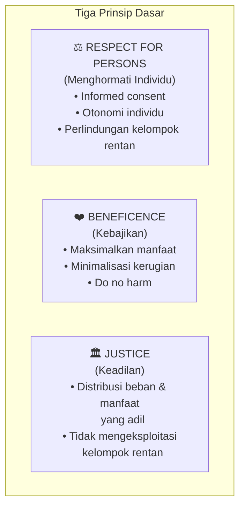
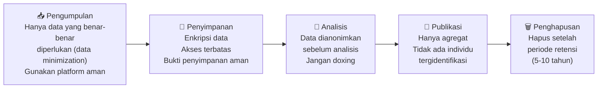

# BAB-31: Etika Penelitian dalam Studi Adopsi Teknologi

> *"Peneliti yang baik tidak hanya menghasilkan pengetahuan yang valid — ia juga melindungi martabat, privasi, dan kesejahteraan setiap orang yang berkontribusi pada penelitiannya."*

---

## 🎯 Tujuan Pembelajaran

Setelah membaca bab ini, pembaca diharapkan mampu:
- Menjelaskan prinsip etika penelitian yang berlaku untuk studi adopsi teknologi
- Merancang informed consent yang memadai
- Mengidentifikasi dan memitigasi risiko etika dalam penelitian
- Memahami prosedur Institutional Review Board (IRB) / komite etika
- Menerapkan praktik pengumpulan dan penyimpanan data yang etis

---

## 📖 Pendahuluan

Penelitian adopsi teknologi melibatkan manusia sebagai subjek — dan setiap kali kita mengumpulkan data dari manusia, kita memiliki kewajiban etis terhadap mereka.

Prinsip ini bukan hanya tentang mematuhi aturan institusi. Ia adalah tentang **menghormati orang-orang yang mempercayakan informasi mereka kepada kita** — informasi tentang perilaku, sikap, bahkan kekhawatiran pribadi mereka terhadap teknologi.

---

## 31.1 Prinsip Etika Dasar Penelitian dengan Manusia

Berdasarkan **Belmont Report (1979)** — fondasi etika penelitian modern:

---

## 31.2 Informed Consent (Persetujuan Berdasar Informasi)

Informed consent adalah **hak fundamental** setiap partisipan penelitian. Ini bukan sekadar formulir yang harus ditandatangani — ia adalah komunikasi nyata tentang apa yang akan terjadi.

### Komponen Informed Consent yang Lengkap

| Komponen | Apa yang Harus Disampaikan |
|---|---|
| **Identitas peneliti** | Nama, institusi, kontak |
| **Tujuan penelitian** | Apa yang diteliti dan mengapa |
| **Prosedur** | Apa yang diminta dari partisipan (isi kuesioner, wawancara, dll.) |
| **Durasi** | Berapa lama waktu yang dibutuhkan |
| **Risiko** | Risiko yang mungkin timbul (meskipun minimal) |
| **Manfaat** | Manfaat potensial bagi partisipan dan masyarakat |
| **Kerahasiaan** | Bagaimana data dijaga kerahasiaannya |
| **Voluntariness** | Partisipasi bersifat sukarela, bisa ditarik kapan saja |
| **Kontak** | Kemana mengadu jika ada kekhawatiran |

### Template Informed Consent untuk Kuesioner Online

> **LEMBAR INFORMASI PENELITIAN**
> 
> Saya [Nama Peneliti], mahasiswa [Program Studi] [Universitas], mengundang Anda berpartisipasi dalam penelitian tentang **[Topik Penelitian]**.
> 
> **Tujuan:** Penelitian ini bertujuan untuk [tujuan spesifik].
> 
> **Yang diminta dari Anda:** Mengisi kuesioner yang memerlukan waktu sekitar **10-15 menit**.
> 
> **Kerahasiaan:** Semua data yang Anda berikan bersifat **anonim** dan **rahasia**. Data hanya digunakan untuk keperluan penelitian akademis.
> 
> **Sukarela:** Partisipasi Anda sepenuhnya **bersifat sukarela**. Anda bisa menghentikan partisipasi kapan saja tanpa konsekuensi apapun.
> 
> **Pertanyaan:** Jika ada pertanyaan, hubungi [email@institusi.ac.id]
> 
> *Dengan mengklik "Lanjutkan", Anda menyatakan telah membaca informasi di atas dan menyetujui partisipasi Anda dalam penelitian ini.*

---

## 31.3 Anonimitas vs. Kerahasiaan

Dua konsep yang sering dicampur, padahal berbeda:

| Konsep | Definisi | Implikasi |
|---|---|---|
| **Anonymity (Anonimitas)** | Peneliti **tidak tahu** siapa responden — tidak ada data identitas | Tidak bisa menghubungi ulang responden |
| **Confidentiality (Kerahasiaan)** | Peneliti tahu siapa responden, tapi **tidak mengungkapkan** identitasnya | Bisa follow-up, tapi wajib lindungi identitas |

**Untuk survei adopsi teknologi:** Anonimitas adalah standar yang direkomendasikan — tidak mengumpulkan nama, NIK, atau informasi yang bisa mengidentifikasi individu.

**Pengecualian:** Studi longitudinal yang perlu menghubungkan data dari dua periode berbeda memerlukan beberapa bentuk identifikasi — gunakan **kode peserta** yang hanya peneliti yang tahu pemetaannya.

---

## 31.4 Kelompok Rentan dalam Penelitian Adopsi

Beberapa kelompok memerlukan perhatian etika ekstra:

| Kelompok | Isu Etika Khusus | Mitigasi |
|---|---|---|
| **Anak-anak (<18 tahun)** | Belum bisa memberi informed consent sendiri | Perlu consent dari orang tua/wali |
| **Lansia** | Mungkin tidak sepenuhnya memahami kuesioner digital | Versi cetak + pendampingan |
| **Pasien / Narapidana** | Posisi power yang timpang → sulit menolak | Extra safeguards, tinjau manfaat vs risiko |
| **Pekerja dalam organisasi** | Takut dampak negatif jika menolak (atasan terlibat) | Kejelasan bahwa atasan tidak melihat data |
| **Komunitas adat** | Data mungkin mengungkap informasi komunal yang sensitif | Konsultasi dengan pemimpin komunitas |

---

## 31.5 Etika Data: Pengumpulan, Penyimpanan, dan Penghapusan

### Data Lifecycle Etika

### Prinsip Data Minimization

Jangan kumpulkan data yang tidak Anda butuhkan:

| Data | Perlu? | Justifikasi |
|---|---|---|
| Usia | ✅ Ya | Untuk analisis demografis dan moderasi |
| Nama lengkap | ❌ Tidak | Tidak diperlukan untuk analisis |
| NIK/KTP | ❌ Tidak | Sangat sensitif, tidak diperlukan |
| Email | ⚠️ Hanya jika perlu follow-up | Hapus setelah penelitian selesai |
| Lokasi tepat (GPS) | ❌ Tidak (untuk survei biasa) | Kota/provinsi cukup |

---

## 31.6 Institutional Review Board (IRB) / Komite Etika

**IRB** (atau di Indonesia sering disebut Komite Etik) adalah badan yang bertugas meninjau dan menyetujui penelitian yang melibatkan manusia sebelum data dikumpulkan.

### Kapan Perlu Persetujuan Komite Etik?

| Jenis Penelitian | Perlu Komite Etik? |
|---|---|
| Survei anonim tentang teknologi umum (S1) | Umumnya tidak wajib (di banyak institusi) |
| Survei dengan data sensitif (kesehatan, keuangan) | ✅ Wajib |
| Penelitian melibatkan anak-anak | ✅ Wajib |
| Penelitian di komunitas atau organisasi | ✅ Direkomendasikan |
| Eksperimen yang bisa mempengaruhi peserta | ✅ Wajib |
| Penelitian S2/S3 yang akan dipublikasikan internasional | ✅ Sangat direkomendasikan |

---

## 31.7 Plagiarisme dan Integritas Akademik

### Etika Publikasi dan Penulisan Laporan

| Praktik Tidak Etis | Definisi | Konsekuensi |
|---|---|---|
| **Plagiarisme** | Mengklaim karya orang lain sebagai milik sendiri | Retraksi, sanksi akademik |
| **Fabrikasi data** | Membuat data yang tidak ada | Pelanggaran serius, karir hancur |
| **Falsifikasi data** | Memanipulasi data yang ada | Sama dengan fabrikasi |
| **HARKing** | Hypothesizing After Results Known (hipotesis dibuat setelah melihat data) | Merusak integritas ilmiah |
| **p-hacking** | Mencoba berbagai analisis sampai p<0.05 | Inflasi false positives |
| **Selective reporting** | Hanya melaporkan hasil yang mendukung hipotesis | Publication bias |

### Pencegahan Plagiarisme dalam Penelitian Adopsi

- Selalu cite sumber instrumen yang digunakan
- Kutip data/statistik dengan sumber yang tepat
- Gunakan parafrase bermakna, bukan sekadar mengganti kata
- Gunakan tools seperti Turnitin atau iThenticate

---

## 31.8 Etika dalam Era Big Data dan AI Research

### Isu Etika Baru

Penelitian adopsi yang menggunakan **data perilaku aktual** (log sistem, clickstream, social media scraping) menghadapi tantangan etika baru:

| Isu | Pertanyaan Etis |
|---|---|
| **Informed consent untuk data trace** | Apakah pengguna tahu data log mereka digunakan untuk penelitian? |
| **Aggregasi data** | Kombinasi data yang tampak tidak sensitif bisa membentuk profil yang sangat sensitif |
| **Social media data** | Apakah tweet yang "publik" bisa digunakan bebas untuk penelitian tanpa consent? |
| **AI training data** | Apakah penggunaan data historis untuk melatih model memerlukan consent baru? |

---

## 🔗 Keterkaitan dengan Bab Lain

- ⬅️ Bab sebelumnya: [BAB-30 — SEM & PLS](../BAB-30_Analisis_Data_SEM_PLS/README.md)
- ➡️ Bab selanjutnya: [BAB-32 — Template Kuesioner](../BAB-32_Template_Kuesioner/README.md)
- 🔗 Privasi dalam adopsi: [BAB-18](../BAB-18_Privasi_dan_Keamanan/README.md)
- 🔗 Metodologi penelitian: [BAB-28](../BAB-28_Metodologi_Penelitian/README.md)

---

## ✅ Soal Latihan

1. **Konseptual:** Jelaskan perbedaan antara **anonimitas** dan **kerahasiaan** dalam penelitian! Dalam konteks survei adopsi e-commerce, mana yang lebih tepat digunakan, dan mengapa?

2. **Aplikasi:** Rancang **Lembar Informed Consent** untuk penelitian Anda tentang adopsi telemedicine oleh pasien lansia di Puskesmas. Pastikan menggunakan bahasa yang mudah dipahami oleh populasi tersebut!

3. **Kritis:** **HARKing** (*Hypothesizing After Results Known*) adalah praktik yang sering terjadi secara tidak sadar — peneliti melihat data terlebih dahulu, baru kemudian merumuskan hipotesis yang "kebetulan" terbukti. Mengapa ini bermasalah secara ilmiah? Bagaimana cara mencegahnya melalui desain penelitian yang lebih baik?

4. **Kontemporer:** Seorang peneliti ingin menganalisis **perilaku penggunaan GoPay** menggunakan data dari API publik. Data ini tersedia, tetapi pengguna tidak secara eksplisit menyetujui penggunaannya untuk penelitian. Dari perspektif etika penelitian, apa yang seharusnya dilakukan?

---

## 📚 Referensi Bab Ini

- American Psychological Association. (2020). *Publication manual of the American Psychological Association* (7th ed.). APA.
- Israel, M., & Hay, I. (2006). *Research ethics for social scientists: Between ethical conduct and regulatory compliance*. Sage.
- National Commission for the Protection of Human Subjects. (1979). *The Belmont report*. U.S. Department of Health, Education, and Welfare.
- Resnik, D. B. (2015). *What is ethics in research & why is it important?* National Institute of Environmental Health Sciences.

---

← [BAB-30: SEM & PLS](../BAB-30_Analisis_Data_SEM_PLS/README.md) | [README Utama](../README.md) | [BAB-32: Template Kuesioner →](../BAB-32_Template_Kuesioner/README.md)
