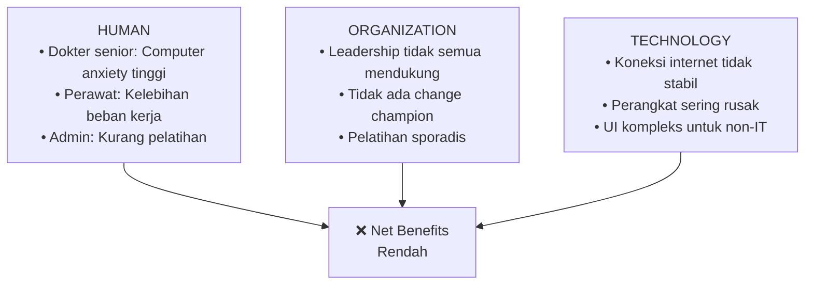
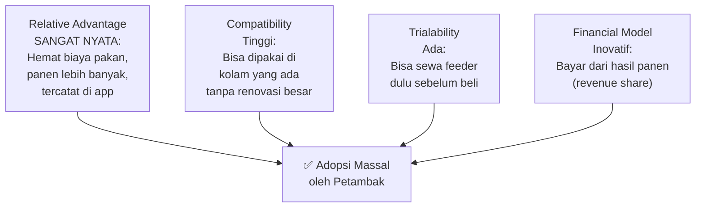
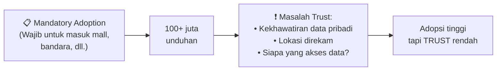

# BAB-33: Studi Kasus Adopsi Teknologi di Indonesia

> *"Teori memberikan peta — studi kasus memberikan perjalanan nyata. Keduanya diperlukan untuk benar-benar memahami medan."*

---

## 🎯 Tujuan Pembelajaran

Setelah membaca bab ini, pembaca diharapkan mampu:
- Menganalisis kasus nyata adopsi teknologi menggunakan kerangka teori yang dipelajari
- Mengidentifikasi faktor keberhasilan dan kegagalan adopsi dari kasus nyata
- Mengekstrak pelajaran yang dapat ditransfer ke konteks lain
- Menghubungkan teori dengan praktik adopsi teknologi di Indonesia

---

## 📖 Pendahuluan

Bab ini menyajikan **empat studi kasus adopsi teknologi** yang nyata di Indonesia — masing-masing dipilih karena mewakili fenomena yang berbeda: adopsi yang luar biasa sukses, adopsi yang penuh tantangan, adopsi yang gagal, dan adopsi yang memerlukan pendekatan non-konvensional.

Setiap kasus dianalisis menggunakan lensa teori yang telah dipelajari sepanjang kurikulum ini.

---

## 33.1 Studi Kasus 1: QRIS — Standardisasi Pembayaran Digital Indonesia

### Latar Belakang

**QRIS (Quick Response Code Indonesian Standard)** diluncurkan oleh Bank Indonesia pada 17 Agustus 2019 sebagai standar tunggal QR code pembayaran di Indonesia. Sebelumnya, setiap platform (GoPay, OVO, Dana, dll.) memiliki QR code sendiri yang tidak saling kompatibel.

**Data Pencapaian:**
- 2019: ~3 juta merchant
- 2021: ~10 juta merchant
- 2022: ~22 juta merchant
- 2024: ~50 juta merchant (termasuk pedagang kaki lima)

### Analisis Teoritis

#### DOI (Diffusion of Innovations)

| Karakteristik | QRIS | Penilaian |
|---|---|---|
| **Relative Advantage** | Satu QR untuk semua platform | ⭐⭐⭐⭐⭐ Sangat tinggi |
| **Compatibility** | Compatible dengan semua HP ber-kamera | ⭐⭐⭐⭐ Tinggi |
| **Complexity** | Scan dan bayar — sangat sederhana | ⭐⭐⭐⭐⭐ Sangat rendah |
| **Trialability** | Bisa dicoba gratis | ⭐⭐⭐⭐ Tinggi |
| **Observability** | Terlihat di banyak toko | ⭐⭐⭐⭐⭐ Sangat tinggi |

#### Institutional Theory

Keberhasilan QRIS sangat didorong oleh **faktor institusional**:
- **Coercive isomorphism**: Bank Indonesia mewajibkan QRIS untuk merchant
- **Normative isomorphism**: Asosiasi perbankan mendukung standar ini
- **Mimetic isomorphism**: Merchant meniru kompetitor yang sudah pakai QRIS

### Pelajaran yang Dapat Dipetik

1. **Standardisasi menghilangkan hambatan network effect** — sebelum QRIS, pengguna GoPay tidak bisa bayar di merchant OVO-only
2. **Regulasi mandatori dari otoritas terpercaya (BI)** sangat efektif untuk mendorong adopsi merchant
3. **Simplicity radikal**: Satu scan untuk semua — tidak ada learning curve
4. **Insentif yang tepat**: Gratis untuk UMKM di tahun pertama

---

## 33.2 Studi Kasus 2: Rekam Medis Elektronik (RME) di Puskesmas

### Latar Belakang

Sejak 2019, Kementerian Kesehatan mewajibkan implementasi **Rekam Medis Elektronik (RME)** di seluruh fasilitas kesehatan Indonesia. Namun implementasinya menghadapi tantangan besar terutama di Puskesmas level kabupaten/kota.

**Fakta:**
- 2022: Hanya ~40% Puskesmas yang memiliki RME aktif
- Banyak Puskesmas yang memiliki perangkat RME tetapi tidak menggunakannya secara efektif
- Tenaga kesehatan di daerah terpencil mengeluh tentang koneksi internet dan perangkat usang

### Analisis Teoritis

#### TOE Framework

| Konteks | Temuan | Dampak |
|---|---|---|
| **Technology** | Sistem RME yang berbeda-beda antar daerah; interoperabilitas rendah | Hambatan tinggi |
| **Organization** | Kekurangan SDM IT; kepemimpinan puskesmas yang tidak semua pro-digital | Hambatan sedang-tinggi |
| **Environment** | Regulasi ada, tapi enforcement lemah; infrastruktur daerah 3T sangat terbatas | Hambatan sangat tinggi |

#### HOT-fit Model

### Analisis Kegagalan

**Mengapa implementasi RME berjalan lambat?**

1. **Technology gap yang besar**: Dokter beralih dari pensil ke touchscreen — tanpa tahap transisi yang cukup
2. **Tidak ada change champion**: Tidak ada figur internal yang mengadvokasi dan mendampingi adopsi
3. **Infrastruktur tidak memadai**: Sistem berbasis cloud tidak bisa berjalan dengan internet yang sering mati
4. **Insentif tidak ada**: Dokter yang menggunakan RME dengan baik tidak mendapat reward khusus

### Pelajaran yang Dapat Dipetik

1. **Mandatori tanpa enabler** = kegagalan terjamin
2. **Infrastructure first**: Jangan deploy sistem cloud di area tanpa internet yang stabil
3. **Change management harus paralel** dengan implementasi teknologi
4. **Piloting di unit percontohan** sebelum rollout nasional lebih efektif

---

## 33.3 Studi Kasus 3: eFishery — Adopsi Agritech oleh Petambak

### Latar Belakang

**eFishery** (didirikan 2013) adalah perusahaan teknologi pertanian (agritech) pertama di dunia yang fokus pada budidaya ikan dan udang. Mereka mengembangkan **feeder pintar berbasis IoT** yang secara otomatis memberi makan ikan sesuai jadwal dan kondisi air.

**Pencapaian:**
- 2024: Melayani 170.000+ petambak di 30+ provinsi
- Valuasi: ~$1.7 miliar (unicorn)
- Dampak: Penghematan pakan 15-20%, peningkatan hasil panen 25-30%

### Analisis Teoritis

#### Mengapa eFishery Berhasil di Mana Agritech Lain Gagal?

**Inovasi kritis eFishery:** Mereka memahami bahwa petambak tidak punya uang di depan. Dengan model **sewa + bayar dari hasil**, hambatan finansial dihilangkan sepenuhnya.

#### IRT (Innovation Resistance Theory)

| Barrier | Respons eFishery |
|---|---|
| **Usage Barrier** | Aplikasi sangat sederhana, data visual, tidak perlu baca manual |
| **Value Barrier** | ROI terbukti nyata: hemat pakan = uang kembali dalam 3-6 bulan |
| **Risk Barrier** | Garansi pengembalian unit jika tidak cocok |
| **Tradition Barrier** | Tidak menggantikan tradisi; hanya otomatisasi yang sudah ada |
| **Image Barrier** | Petambak sukses sebagai brand ambassador di komunitas lokal |

### Pelajaran yang Dapat Dipetik

1. **Selesaikan masalah nyata** — bukan teknologi untuk teknologi
2. **Model bisnis yang menghilangkan barrier finansial** sama pentingnya dengan teknologi itu sendiri
3. **Community-based adoption**: Petambak sukses mengajak tetangganya
4. **Keep it simple**: Feeder yang bisa dioperasikan dengan 3 tombol

---

## 33.4 Studi Kasus 4: PeduliLindungi → SatuSehat — Adopsi Masif Aplikasi Pemerintah

### Latar Belakang

**PeduliLindungi** diluncurkan April 2020 sebagai aplikasi tracing COVID-19. Pada puncaknya (2021-2022), aplikasi ini **diwajibkan** untuk masuk ke mal, bandara, restoran, dan fasilitas publik — menciptakan adopsi masif yang belum pernah ada sebelumnya untuk aplikasi pemerintah Indonesia.

- Unduhan: 100+ juta dalam waktu singkat
- MAU (Monthly Active Users) puncak: ~80 juta
- Transformasi: Menjadi **SatuSehat** (2023) sebagai platform kesehatan nasional

### Analisis Teoritis

#### Paradoks Adopsi Koersif

**Temuan menarik:** Adopsi yang dipaksakan tidak selalu membangun trust. Banyak pengguna menginstal PeduliLindungi bukan karena percaya, tetapi karena **tidak punya pilihan**. Ini berbeda fundamental dari adopsi sukarela.

#### Pelajaran dari Transisi ke SatuSehat

| Fase | Tantangan | Pendekatan |
|---|---|---|
| **PeduliLindungi** | Trust rendah, persepsi surveillance | Tidak sempat dikelola — darurat |
| **SatuSehat** | Mewarisi stigma negatif | Rebranding, fokus pada manfaat positif |
| **Sekarang** | Integrasi RS swasta | Incentivize, bukan koersif |

---

## 33.5 Matriks Perbandingan Kasus

| Dimensi | QRIS | RME Puskesmas | eFishery | SatuSehat |
|---|---|---|---|---|
| **Status** | ✅ Sukses | ⚠️ Parsial | ✅ Sukses | 🔄 Berkembang |
| **Pendorong utama** | Regulasi + value | Regulasi | Value nyata | Regulasi (pandemi) |
| **Hambatan utama** | Minimal | Infrastruktur + human | Finansial + tradisi | Trust |
| **Teori paling relevan** | DOI + Institutional | HOT-fit + TOE | DOI + IRT | TAM + Trust |
| **Faktor kunci sukses** | Standardisasi | Butuh change management | Model bisnis inovatif | Manfaat nyata jangka panjang |

---

## 🔗 Keterkaitan dengan Bab Lain

- ⬅️ Bab sebelumnya: [BAB-32 — Template Kuesioner](../BAB-32_Template_Kuesioner/README.md)
- ➡️ Bab selanjutnya: [BAB-34 — Tren dan Masa Depan](../BAB-34_Tren_dan_Masa_Depan/README.md)
- 🔗 TOE Framework: [BAB-10](../BAB-10_TOE_Framework/README.md)
- 🔗 HOT-fit: [BAB-12](../BAB-12_Teori_Pendukung_Lainnya/README.md)
- 🔗 Hambatan adopsi: [BAB-16](../BAB-16_Hambatan_Adopsi/README.md)

---

## ✅ Soal Latihan

1. **Analitis:** Dari empat studi kasus di atas, identifikasi **satu faktor yang konsisten** hadir dalam kasus yang sukses dan **satu faktor yang konsisten** hadir dalam kasus yang mengalami hambatan!

2. **Aplikasi:** Pilih satu teknologi yang saat ini sedang diadopsi di Indonesia (contoh: INA Digital, digital rupiah, AI di pendidikan) dan lakukan analisis awal menggunakan **dua teori adopsi** yang Anda pilih!

3. **Komparatif:** Bandingkan adopsi **QRIS** (sangat sukses) dengan **RME di Puskesmas** (berjalan lambat) menggunakan kerangka TOE! Apa perbedaan konteks yang menjelaskan perbedaan outcome adopsinya?

4. **Kritis:** eFishery berhasil di mana banyak agritech lain gagal. Apakah keberhasilan ini **dapat direplikasi** untuk teknologi pertanian lain? Identifikasi faktor mana yang spesifik untuk konteks budidaya ikan dan mana yang bisa di-transfer ke konteks lain!

---

## 📚 Referensi Bab Ini

- Bank Indonesia. (2023). *Laporan tahunan sistem pembayaran dan pengelolaan uang rupiah 2023*. Bank Indonesia.
- eFishery. (2024). *eFishery impact report 2024*. eFishery.
- Kemenkes RI. (2023). *Progres implementasi rekam medis elektronik di fasilitas kesehatan 2023*. Kementerian Kesehatan RI.
- Kominfo RI. (2022). *Laporan akhir program PeduliLindungi 2022*. Kementerian Komunikasi dan Informatika.

---

← [BAB-32: Template Kuesioner](../BAB-32_Template_Kuesioner/README.md) | [README Utama](../README.md) | [BAB-34: Tren & Masa Depan →](../BAB-34_Tren_dan_Masa_Depan/README.md)
