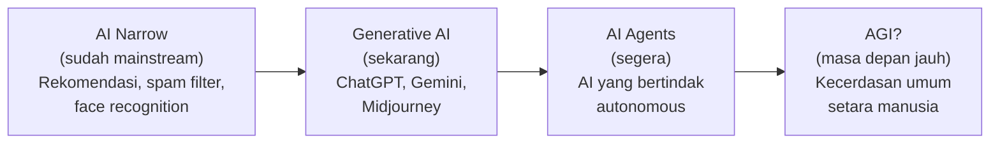
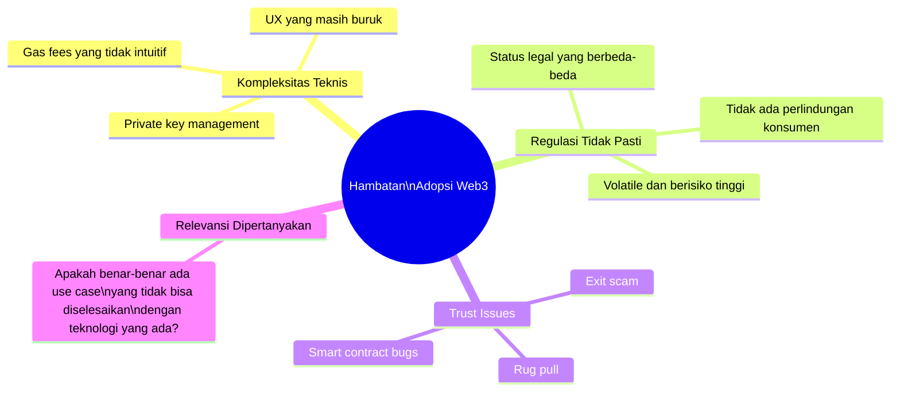

# BAB-34: Tren dan Masa Depan Adopsi Teknologi

> *"Mempelajari sejarah adopsi teknologi mengajarkan kita pola. Memahami pola itu memungkinkan kita untuk mengantisipasi masa depan — meskipun tidak pernah sempurna."*

---

## 🎯 Tujuan Pembelajaran

Setelah membaca bab ini, pembaca diharapkan mampu:
- Mengidentifikasi tren teknologi yang akan membentuk penelitian adopsi di masa depan
- Menjelaskan tantangan teoritis yang muncul dari teknologi baru (AI, metaverse, Web3)
- Mengantisipasi konstruk baru yang mungkin diperlukan dalam model adopsi masa depan
- Menghubungkan agenda penelitian masa depan dengan konteks Indonesia

---

## 📖 Pendahuluan

Teori adopsi teknologi yang dominan — TAM, UTAUT, DOI — dikembangkan pada era PC dan internet generasi pertama. Mereka dirancang untuk menjawab pertanyaan seperti: "Apakah karyawan mau menggunakan sistem akuntansi baru?"

Kini kita menghadapi teknologi yang secara fundamental berbeda:
- **AI yang membuat keputusan sendiri** — siapa yang "menggunakannya"?
- **Metaverse** — apakah "adopsi" masih konsep yang tepat?
- **IoT dan ambient computing** — teknologi yang tidak perlu "digunakan" secara sadar
- **Brain-computer interfaces** — batas antara manusia dan teknologi menjur

Pertanyaannya: **Apakah teori adopsi yang ada masih relevan? Apa yang perlu diperbarui atau diciptakan?**

---

## 34.1 Tren Teknologi yang Akan Membentuk Adopsi Masa Depan

### 34.1.1 Artificial Intelligence (AI) dan Generative AI

**Tahap Adopsi AI saat ini:**

**Tantangan Adopsi AI yang Unik:**

| Dimensi | Teknologi Tradisional | AI / Generative AI |
|---|---|---|
| **Kontrol** | Pengguna mengontrol penuh | AI membuat keputusan → "human-in-the-loop" jadi isu |
| **Prediktabilitas** | Output deterministik | Output probabilistik, kadang "halusinasi" |
| **Explainability** | Bisa dijelaskan | Black box → XAI (Explainable AI) menjadi kritis |
| **Accountability** | Jelas siapa yang bertanggung jawab | AI output → siapa yang bertanggung jawab? |
| **Trust** | Trust pada sistem yang konsisten | Trust pada sistem yang tidak 100% konsisten |

**Konstruk Baru yang Diperlukan untuk Penelitian Adopsi AI:**

| Konstruk | Definisi |
|---|---|
| **Algorithm Aversion/Appreciation** | Kecenderungan menolak atau menerima rekomendasi algoritma |
| **Perceived AI Competence** | Persepsi kemampuan AI untuk tugas tertentu |
| **AI Anxiety** | Kecemasan tentang dampak AI pada pekerjaan/kehidupan |
| **Anthropomorphism** | Kecenderungan memperlakukan AI seolah-olah manusia |
| **Explainability Trust** | Kepercayaan yang dibangun dari kemampuan AI menjelaskan keputusannya |

---

### 34.1.2 Internet of Things (IoT) dan Ambient Computing

**Tantangan Konseptual:**

IoT menciptakan situasi di mana teknologi digunakan **tanpa tindakan adopsi yang sadar**:
- Smartphone yang otomatis merekam data kesehatan
- Smart home yang belajar kebiasaan tanpa diprogram
- CCTV dengan AI yang menganalisis perilaku publik

**Pertanyaan Teoritis:**
> Apakah "adopsi" masih konsep yang tepat ketika teknologi menjadi ambient dan tidak terlihat?

Model adopsi tradisional berasumsi ada **agen yang secara sadar memutuskan** menggunakan teknologi. Dengan ambient computing, keputusan adopsi mungkin terjadi satu kali (beli perangkat), tetapi "penggunaan" berlangsung terus tanpa kesadaran.

---

### 34.1.3 Web3, Blockchain, dan Aset Digital

**Tantangan Adopsi Web3:**

**Penelitian adopsi crypto di Indonesia:**
- Indonesia adalah salah satu pasar kripto terbesar di Asia Tenggara
- TAM + Trust + Perceived Risk adalah kerangka yang paling sering digunakan
- **Speculative motivation** (UTAUT2: Hedonic Motivation yang dimotivasi spekulasi) adalah faktor unik

---

### 34.1.4 Extended Reality (VR/AR/Metaverse)

**Status Adopsi XR 2024:**
- VR masih niche: headset mahal, motion sickness, konten terbatas
- AR mulai masuk mainstream via smartphone (filter Instagram, Google Lens)
- "Metaverse" hype 2021-2022 sudah mereda, adoption rate tetap rendah

**Faktor yang Menghambat Adopsi VR/Metaverse:**
- **Physical discomfort** (mual, pusing) — usage barrier baru yang tidak ada dalam teori
- **Social isolation paradox** — teknologi yang seharusnya menghubungkan tapi mengisolasi secara fisik
- **Identity dan avatar** — pertanyaan tentang representasi diri di dunia virtual

---

### 34.1.5 Green Technology dan Sustainable Tech

Semakin banyak konsumen yang mempertimbangkan **dampak lingkungan** saat memilih teknologi:

**Konstruk baru: Green Perceived Value**
> "Apakah teknologi ini sejalan dengan nilai-nilai lingkungan saya?"

Penelitian menunjukkan bahwa untuk segmen tertentu (terutama Millennials dan Gen Z), **green credentials** suatu teknologi mempengaruhi adopsinya.

---

## 34.2 Arah Perkembangan Teori Adopsi

### 34.2.1 Dari Niat ke Penggunaan Aktual

**Gap terbesar** dalam penelitian adopsi: hampir semua model memprediksi **niat** (*intention*), bukan **perilaku aktual** (*actual use*).

**Mengapa gap ini penting?** Intention-behavior gap adalah nyata (rata-rata korelasi ~0.45 dalam meta-analisis). Penelitian masa depan perlu lebih banyak menggunakan **behavioral data** (log sistem, data transaksi, sensor) untuk mengukur actual use.

---

### 34.2.2 Longitudinal Research

Hampir semua penelitian adopsi bersifat **cross-sectional** (satu titik waktu). Penelitian longitudinal yang mengikuti perubahan adopsi dari waktu ke waktu masih sangat langka.

**Agenda Longitudinal:**
- Bagaimana faktor adopsi berubah dari initial adoption → continuance → habit?
- Apakah pengaruh SI melemah setelah teknologi menjadi kebiasaan?
- Kapan tepatnya "niat" berubah menjadi "habit" yang otomatis?

---

### 34.2.3 Neuroscience dan Cognitive Science dalam Adopsi

**NeuroIS** (Neurological Information Systems) menggunakan fMRI, EEG, dan eye-tracking untuk mengukur respons kognitif dan emosional terhadap teknologi — melampaui self-report kuesioner.

**Potensi:** Mengukur trust, kecemasan, dan usability secara objektif tanpa bias self-report.

---

## 34.3 Agenda Penelitian Masa Depan untuk Indonesia

### Kesenjangan Penelitian yang Paling Mendesak

| Topik | Prioritas | Alasan |
|---|---|---|
| **Adopsi AI oleh UMKM Indonesia** | 🔴 Sangat Tinggi | 64 juta UMKM; AI tools semakin mudah diakses |
| **Digital financial inclusion** petani/nelayan | 🔴 Sangat Tinggi | Jutaan unbanked yang bisa dijangkau fintech |
| **Adopsi e-government pasca-INA Digital** | 🔴 Tinggi | Program besar yang butuh evaluasi |
| **Adopsi AI di pendidikan tinggi** | 🟡 Tinggi | ChatGPT sudah digunakan luas, riset tertinggal |
| **Longitudinal study** perubahan adopsi fintech | 🟡 Tinggi | Semua studi masih cross-sectional |
| **Metaverse adoption** di kalangan pemuda | 🟢 Sedang | Masih early stage |
| **Brain-computer interface** | 🟢 Jangka Panjang | Masih sangat awal |

---

## 34.4 Prediksi: Adopsi Teknologi di Indonesia 2030

| Domain | Prediksi 2030 | Faktor Kunci |
|---|---|---|
| **Pembayaran digital** | >95% transaksi non-tunai | QRIS + infrastruktur + kebiasaan |
| **E-health** | Telemedicine menjadi norma | Regulasi + infrastruktur + kepercayaan |
| **AI dalam pekerjaan** | 60%+ pekerjaan menggunakan AI tools | Reskilling + biaya AI terus turun |
| **E-government** | Single digital ID + satu portal layanan | Investasi infrastruktur + political will |
| **Ed-tech** | AI tutoring personalisasi menjadi umum | Akses + affordability |
| **Pertanian digital** | 50%+ petani menggunakan minimal satu app | eFishery effect + model bisnis tepat |

---

## 🔗 Keterkaitan dengan Bab Lain

- ⬅️ Bab sebelumnya: [BAB-33 — Studi Kasus](../BAB-33_Studi_Kasus/README.md)
- ➡️ Bab selanjutnya: [BAB-35 — Referensi Lanjutan](../BAB-35_Referensi_dan_Bacaan_Lanjutan/README.md)
- 🔗 Kritik teori saat ini: [BAB-14](../BAB-14_Kritik_dan_Limitasi/README.md)
- 🔗 Privasi dan AI: [BAB-18](../BAB-18_Privasi_dan_Keamanan/README.md)
- 🔗 Konteks Indonesia: [BAB-24](../BAB-24_Konteks_Indonesia/README.md)

---

## ✅ Soal Latihan

1. **Prospektif:** Identifikasi **tiga konstruk baru** yang menurut Anda harus ditambahkan ke model adopsi teknologi untuk memprediksi adopsi **AI Generatif** (seperti ChatGPT) secara akurat! Justifikasikan mengapa konstruk tersebut diperlukan!

2. **Teoritis:** Apakah konsep "adopsi teknologi" masih relevan dalam era **ambient computing** (IoT yang tidak terlihat)? Jika tidak, konsep apa yang harus menggantikannya?

3. **Agenda Penelitian:** Rancang **proposal penelitian mini** untuk salah satu kesenjangan penelitian yang disebutkan di bagian 34.3! Tentukan judul, tujuan, metode, dan kontribusi potensialnya!

4. **Kritis:** "The best technology is invisible" — teknologi terbaik adalah yang tidak terasa seperti teknologi, tapi sudah menyatu dengan kehidupan. Jika ini benar, bagaimana implikasinya bagi teori adopsi teknologi yang selama ini fokus pada **kesadaran** dan **keputusan sadar** pengguna?

---

## 📚 Referensi Bab Ini

- Dwivedi, Y. K., et al. (2023). "So what if ChatGPT wrote it?" Multidisciplinary perspectives on opportunities, challenges, and implications of generative conversational AI for research, practice, and policy. *International Journal of Information Management*, *71*, 102642.
- Riedl, R. (2022). On the stress potential of videoconferencing: Definition and root causes of Zoom fatigue. *Electronic Markets*, *32*(1), 153–177.
- Taddeo, M., & Floridi, L. (2018). How AI can be a force for good. *Science*, *361*(6404), 751–752.
- Venkatesh, V. (2022). Adoption and use of AI tools: A research agenda grounded in UTAUT. *Annals of Operations Research*, *308*(1), 641–652.

---

← [BAB-33: Studi Kasus](../BAB-33_Studi_Kasus/README.md) | [README Utama](../README.md) | [BAB-35: Referensi →](../BAB-35_Referensi_dan_Bacaan_Lanjutan/README.md)
