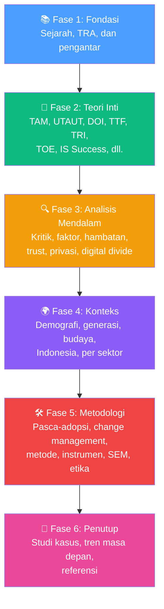

# BAB-35: Referensi dan Bacaan Lanjutan

> *"Setiap buku yang telah Anda baca membuka pintu ke ribuan buku lainnya. Bab ini adalah peta untuk menjelajahi lebih jauh dunia teori adopsi teknologi."*

---

## 🎯 Tujuan Pembelajaran

Setelah membaca bab ini, pembaca diharapkan mampu:
- Mengidentifikasi karya-karya fondasi (*seminal works*) dalam bidang adopsi teknologi
- Menemukan jurnal, database, dan sumber referensi terpercaya
- Mengembangkan strategi pencarian literatur yang efektif
- Mengelola referensi dengan alat bantu yang tepat
- Membangun kebiasaan membaca akademik yang berkelanjutan

---

## 35.1 Karya-Karya Fondasi (Seminal Works)

Ini adalah karya-karya yang **wajib dibaca** oleh setiap peneliti di bidang adopsi teknologi — kutipannya mencapai puluhan hingga ratusan ribu kali.

### 35.1.1 Karya Paling Berpengaruh (Ranked by Citations)

| Peringkat | Karya | Kutipan (estimasi Google Scholar, 2024) | Teori |
|---|---|---|---|
| 1 | Davis (1989) — TAM | ~55,000 | TAM |
| 2 | Venkatesh et al. (2003) — UTAUT | ~32,000 | UTAUT |
| 3 | Rogers (1962/2003) — DOI | ~130,000 (semua edisi) | DOI |
| 4 | Ajzen (1991) — TPB | ~100,000+ | TPB |
| 5 | Fishbein & Ajzen (1975) — TRA | ~40,000+ | TRA |
| 6 | Bhattacherjee (2001) — ECM | ~10,000 | Kontinuansi |
| 7 | Venkatesh & Bala (2008) — TAM3 | ~8,000 | TAM3 |
| 8 | Venkatesh et al. (2012) — UTAUT2 | ~12,000 | UTAUT2 |
| 9 | DeLone & McLean (2003) — IS Success | ~20,000 | IS Success |
| 10 | Goodhue & Thompson (1995) — TTF | ~8,000 | TTF |

---

## 35.2 Daftar Referensi Komprehensif Per Bab

### Teori Pondasi (BAB 3-12)

**TRA dan TPB:**
- Ajzen, I. (1991). The theory of planned behavior. *Organizational Behavior and Human Decision Processes*, *50*(2), 179–211.
- Fishbein, M., & Ajzen, I. (1975). *Belief, attitude, intention, and behavior: An introduction to theory and research*. Addison-Wesley.
- Sheeran, P. (2002). Intention-behavior relations: A conceptual and empirical review. *European Review of Social Psychology*, *12*(1), 1–36.

**TAM:**
- Davis, F. D. (1989). Perceived usefulness, perceived ease of use, and user acceptance of information technology. *MIS Quarterly*, *13*(3), 319–340. https://doi.org/10.2307/249008
- Davis, F. D., Bagozzi, R. P., & Warshaw, P. R. (1989). User acceptance of computer technology: A comparison of two theoretical models. *Management Science*, *35*(8), 982–1003.
- Venkatesh, V., & Davis, F. D. (2000). A theoretical extension of the technology acceptance model: Four longitudinal field studies. *Management Science*, *46*(2), 186–204.
- Venkatesh, V., & Bala, H. (2008). Technology acceptance model 3 and a research agenda on interventions. *Decision Sciences*, *39*(2), 273–315.
- King, W. R., & He, J. (2006). A meta-analysis of the technology acceptance model. *Information & Management*, *43*(6), 740–755.

**DOI:**
- Rogers, E. M. (2003). *Diffusion of innovations* (5th ed.). Free Press.
- Moore, G. C., & Benbasat, I. (1991). Development of an instrument to measure the perceptions of adopting an information technology innovation. *Information Systems Research*, *2*(3), 192–222.

**UTAUT & UTAUT2:**
- Venkatesh, V., Morris, M. G., Davis, G. B., & Davis, F. D. (2003). User acceptance of information technology: Toward a unified view. *MIS Quarterly*, *27*(3), 425–478.
- Venkatesh, V., Thong, J. Y. L., & Xu, X. (2012). Consumer acceptance and use of information technology: Extending the unified theory of acceptance and use of technology. *MIS Quarterly*, *36*(1), 157–178.
- Williams, M. D., Rana, N. P., & Dwivedi, Y. K. (2015). The unified theory of acceptance and use of technology (UTAUT): A literature review. *Journal of Enterprise Information Management*, *28*(3), 443–488.

**TTF:**
- Goodhue, D. L., & Thompson, R. L. (1995). Task-technology fit and individual performance. *MIS Quarterly*, *19*(2), 213–236.
- Dishaw, M. T., & Strong, D. M. (1999). Extending the technology acceptance model with task-technology fit constructs. *Information & Management*, *36*(1), 9–21.

**TRI:**
- Parasuraman, A. (2000). Technology readiness index (TRI): A multiple-item scale to measure readiness to embrace new technologies. *Journal of Service Research*, *2*(4), 307–320.
- Parasuraman, A., & Colby, C. L. (2015). An updated and streamlined technology readiness index: TRI 2.0. *Journal of Service Research*, *18*(1), 59–74.

**TOE Framework:**
- Tornatzky, L. G., & Fleischer, M. (1990). *The processes of technological innovation*. Lexington Books.
- Baker, J. (2012). The technology–organization–environment framework. Dalam Y. K. Dwivedi et al. (Eds.), *Information Systems Theory* (hal. 231–245). Springer.

**IS Success Model:**
- DeLone, W. H., & McLean, E. R. (1992). Information systems success: The quest for the dependent variable. *Information Systems Research*, *3*(1), 60–95.
- DeLone, W. H., & McLean, E. R. (2003). The DeLone and McLean model of information systems success: A ten-year update. *Journal of Management Information Systems*, *19*(4), 9–30.

**Teori Pendukung:**
- Bandura, A. (1986). *Social foundations of thought and action: A social cognitive theory*. Prentice-Hall.
- Ram, S., & Sheth, J. N. (1989). Consumer resistance to innovations: The marketing problem and its solutions. *Journal of Consumer Marketing*, *6*(2), 5–14.
- Yusof, M. M., Kuljis, J., Papazafeiropoulou, A., & Stergioulas, L. K. (2008). An evaluation framework for health information systems: Human, organisation and technology-fit factors (HOT-fit). *International Journal of Medical Informatics*, *77*(6), 386–398.

---

### Analisis Kritis dan Kontekstual (BAB 13-19)

**Kritik TAM:**
- Bagozzi, R. P. (2007). The legacy of the technology acceptance model and a proposal for a paradigm shift. *Journal of the Association for Information Systems*, *8*(4), 244–254.
- Benbasat, I., & Barki, H. (2007). Quo vadis TAM? *Journal of the Association for Information Systems*, *8*(4), 211–218.
- Legris, P., Ingham, J., & Collerette, P. (2003). Why do people use information technology? A critical review of the technology acceptance model. *Information & Management*, *40*(3), 191–204.

**Trust:**
- Gefen, D., Karahanna, E., & Straub, D. W. (2003). Trust and TAM in online shopping: An integrated model. *MIS Quarterly*, *27*(1), 51–90.
- Mayer, R. C., Davis, J. H., & Schoorman, F. D. (1995). An integrative model of organizational trust. *Academy of Management Review*, *20*(3), 709–734.
- McKnight, D. H., Choudhury, V., & Kacmar, C. (2002). Developing and validating trust measures for e-commerce. *Information Systems Research*, *13*(3), 334–359.

**Privasi:**
- Acquisti, A., & Grossklags, J. (2005). Privacy and rationality in individual decision making. *IEEE Security & Privacy*, *3*(1), 26–33.
- Dinev, T., & Hart, P. (2006). An extended privacy calculus model for e-commerce transactions. *Information Systems Research*, *17*(1), 61–80.
- Smith, H. J., Milberg, S. J., & Burke, S. J. (1996). Information privacy: Measuring individuals' concerns about organizational practices. *MIS Quarterly*, *20*(2), 167–196.

**Digital Divide:**
- Van Dijk, J. A. G. M. (2006). Digital divide research, achievements and shortcomings. *Poetics*, *34*(4–5), 221–235.
- APJII. (2024). *Survei penetrasi internet Indonesia 2024*. Asosiasi Penyelenggara Jasa Internet Indonesia.

---

### Metodologi dan Praktis (BAB 28-32)

**Metode Penelitian:**
- Creswell, J. W., & Creswell, J. D. (2018). *Research design: Qualitative, quantitative, and mixed methods approaches* (5th ed.). Sage.
- Yin, R. K. (2018). *Case study research and applications* (6th ed.). Sage.

**SEM dan PLS-SEM:**
- Hair, J. F., Risher, J. J., Sarstedt, M., & Ringle, C. M. (2019). When to use and how to report results of PLS-SEM. *European Business Review*, *31*(1), 2–24.
- Henseler, J., Ringle, C. M., & Sarstedt, M. (2015). A new criterion for assessing discriminant validity in variance-based structural equation modeling. *Journal of the Academy of Marketing Science*, *43*(1), 115–135.

**Common Method Bias:**
- Podsakoff, P. M., MacKenzie, S. B., Lee, J. Y., & Podsakoff, N. P. (2003). Common method biases in behavioral research. *Journal of Applied Psychology*, *88*(5), 879–903.

**Skala dan Instrumen:**
- DeVellis, R. F. (2017). *Scale development: Theory and applications* (4th ed.). Sage.

---

## 35.3 Jurnal Ilmiah Terpenting

### Jurnal Internasional Tier 1 (A*/A)

| Jurnal | Publisher | Impact Factor | Fokus |
|---|---|---|---|
| **MIS Quarterly (MISQ)** | Minnesota | ~10 | IS & Adopsi |
| **Information Systems Research** | INFORMS | ~8 | IS Research |
| **Journal of MIS** | Taylor & Francis | ~6 | MIS Komprehensif |
| **Communications of ACM** | ACM | ~7 | CS + IS |
| **Decision Support Systems** | Elsevier | ~7 | DSS + Adopsi |
| **Information & Management** | Elsevier | ~8 | IS Management |
| **Computers in Human Behavior** | Elsevier | ~9 | HCI + Adopsi |
| **IJIM (Int'l J of Info Management)** | Elsevier | ~13 | IS Management |

### Jurnal Nasional Terakreditasi (Indonesia)

| Jurnal | Akreditasi | Publisher |
|---|---|---|
| **JNTETI** (Jurnal Nasional Teknik Elektro dan TI) | SINTA 2 | UGM |
| **JIKO** (Jurnal Informatika dan Komputer) | SINTA 3 | Berbagai |
| **Jurnal Ilmu Komputer dan Informasi** | SINTA 2 | UI |
| **Register** | SINTA 2 | USM |
| **Jurnal Teknologi Informasi** | SINTA 3 | Berbagai |

---

## 35.4 Database Pencarian Literatur

| Database | URL | Kekuatan | Akses |
|---|---|---|---|
| **Google Scholar** | scholar.google.com | Cakupan luas, gratis | Gratis |
| **Scopus** | scopus.com | Metadata bibliometrik, akurat | Berbayar (perpustakaan) |
| **Web of Science** | webofscience.com | Impact Factor, citation analysis | Berbayar |
| **IEEE Xplore** | ieeexplore.ieee.org | Fokus teknis, CS, IS | Sebagian gratis |
| **ACM Digital Library** | dl.acm.org | CS dan HCI | Sebagian gratis |
| **ScienceDirect** | sciencedirect.com | Elsevier journals | Berbayar |
| **ResearchGate** | researchgate.net | Preprint dan full-text | Gratis (request) |
| **SINTA** | sinta.kemdikbud.go.id | Jurnal Indonesia | Gratis |

---

## 35.5 Alat Manajemen Referensi

| Alat | Fitur Unggulan | Rekomendasi |
|---|---|---|
| **Mendeley** | Gratis, PDF annotator, Word plugin | Terbaik untuk mahasiswa Indonesia |
| **Zotero** | Open source, browser extension | Untuk pengguna advanced |
| **EndNote** | Paling powerful, integrasi jurnal | Untuk peneliti senior |
| **Paperpile** | Integrasi Google Docs | Untuk pengguna Google Workspace |

### Tips Mencari Literatur yang Efektif

**Strategi Snowballing:**
1. Mulai dari artikel terbaru yang relevan
2. Cek daftar referensinya (backward snowballing)
3. Cek siapa yang mengutip artikel tersebut (forward snowballing)
4. Ulangi hingga tidak ada referensi baru

**Boolean Search di Google Scholar:**
```
"technology acceptance" AND "Indonesia" AND mobile banking
"UTAUT" OR "TAM" AND fintech NOT cryptocurrency
author:Venkatesh "user acceptance"
```

---

## 35.6 Komunitas Penelitian dan Konferensi

### Konferensi Internasional Utama

| Konferensi | Fokus | Jadwal |
|---|---|---|
| **ICIS** (International Conference on IS) | IS Research Komprehensif | Desember |
| **ECIS** (European Conference on IS) | IS Research Eropa | Juni |
| **AMCIS** (Americas Conference on IS) | IS Research Amerika | Agustus |
| **PACIS** (Pacific Asia Conference on IS) | IS Research Asia-Pasifik | Juli |
| **HICSS** (Hawaii Int'l Conference on System Sciences) | Broad IS | Januari |

### Konferensi Nasional Indonesia

| Konferensi | Penyelenggara |
|---|---|
| **KNSI** (Konferensi Nasional Sistem Informasi) | APTISI |
| **SENTIKA** | Berbagai institusi |
| **SESINDO** | ITS + APTIKOM |
| **KNIF** (Konferensi Nasional Informatika) | Berbagai |

---

## 35.7 Buku Teks Rekomendasi

### Buku Teks Utama

| Buku | Penulis | Edisi | Fokus |
|---|---|---|---|
| *Diffusion of Innovations* | Rogers, E. M. | 5th ed. (2003) | DOI komprehensif |
| *Research Design* | Creswell & Creswell | 5th ed. (2018) | Metodologi |
| *Scale Development* | DeVellis | 4th ed. (2017) | Instrumen |
| *A Primer on Partial Least Squares* | Hair et al. | 3rd ed. (2022) | PLS-SEM |
| *Using Multivariate Statistics* | Tabachnick & Fidell | 7th ed. (2019) | Statistik multivariate |
| *Case Study Research* | Yin, R. K. | 6th ed. (2018) | Studi Kasus |

### Buku Bacaan Populer (Non-Akademis)

| Buku | Penulis | Relevansi |
|---|---|---|
| *Crossing the Chasm* | Moore, G. A. | Difusi inovasi ke mainstream |
| *Hooked* | Eyal, N. | Habit formation dalam produk digital |
| *The Lean Startup* | Ries, E. | Adopsi produk baru |
| *Thinking, Fast and Slow* | Kahneman, D. | Psikologi pengambilan keputusan |

---

## 35.8 Penutup Kurikulum

### Perjalanan Pembelajaran yang Telah Ditempuh



### Pesan Penutup

Bidang adopsi teknologi adalah bidang yang **hidup dan terus berkembang**. Setiap hari, teknologi baru lahir, pola adopsi berubah, dan pertanyaan baru muncul. Teori-teori yang Anda pelajari dalam kurikulum ini adalah **alat berpikir** — bukan dogma yang kaku.

Gunakan teori ini untuk:
- **Memahami** mengapa manusia berinteraksi dengan teknologi seperti yang mereka lakukan
- **Memprediksi** pola adopsi yang lebih baik
- **Merancang** teknologi dan kebijakan yang mendorong adopsi yang lebih inklusif dan bertanggung jawab
- **Meneliti** fenomena adopsi dengan rigor akademik yang tinggi

Dan yang terpenting: **jangan berhenti penasaran**.

---

## 🔗 Navigasi Akhir

- ⬅️ Bab sebelumnya: [BAB-34 — Tren dan Masa Depan](../BAB-34_Tren_dan_Masa_Depan/README.md)
- 🏠 [README Utama — Kembali ke Daftar Isi](../README.md)
- 📖 [Glosarium](../GLOSARIUM.md)
- 🤝 [Panduan Kontribusi](../CONTRIBUTING.md)

---

*Kurikulum Teori Adopsi Teknologi ini adalah sumber terbuka yang dikembangkan dengan semangat gotong royong intelektual. Semoga bermanfaat bagi seluruh peneliti, mahasiswa, dan praktisi teknologi Indonesia.*

**Selamat belajar! 🚀**
