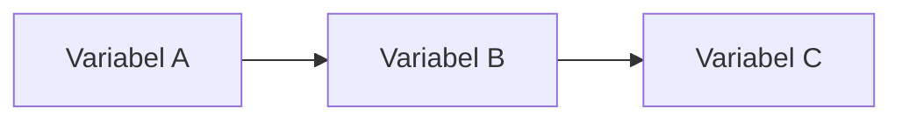

# 🤝 Panduan Berkontribusi

Terima kasih telah mempertimbangkan untuk berkontribusi pada repositori **Teori Adopsi Teknologi**!  
Kontribusi Anda sangat berarti untuk menjaga materi ini tetap relevan, akurat, dan bermanfaat bagi komunitas.

---

## 📋 Jenis Kontribusi yang Diterima

| Jenis | Contoh |
|---|---|
| ✍️ **Perbaikan Konten** | Koreksi fakta, typo, tata bahasa |
| 📝 **Penambahan Materi** | Studi kasus baru, referensi terkini |
| 🔍 **Review Akademik** | Verifikasi keakuratan referensi |
| 🌐 **Update Relevansi** | Perkembangan teori terbaru, data statistik terbaru |
| 💡 **Ide & Saran** | Usul topik baru, saran struktural |
| 🐛 **Laporan Kesalahan** | Informasi yang salah atau menyesatkan |

---

## 🚀 Cara Berkontribusi

### 1. Fork Repositori
```bash
# Klik tombol "Fork" di pojok kanan atas halaman repositori
# Kemudian clone fork Anda
git clone https://github.com/USERNAME/teori-adopsi-teknologi.git
cd teori-adopsi-teknologi
```

### 2. Buat Branch Baru
```bash
# Beri nama branch yang deskriptif
git checkout -b perbaikan/typo-bab-06
# atau
git checkout -b tambahan/studi-kasus-ehealth
# atau
git checkout -b update/referensi-utaut2-2024
```

### 3. Lakukan Perubahan
Ikuti [standar penulisan](#-standar-penulisan) di bawah ini.

### 4. Commit Perubahan
```bash
git add .
git commit -m "fix: perbaiki typo di BAB-06 TAM"
# atau
git commit -m "feat: tambah studi kasus adopsi BPJS Mobile"
# atau
git commit -m "docs: update referensi terbaru UTAUT2"
```

### 5. Push dan Buat Pull Request
```bash
git push origin nama-branch-anda
# Buka GitHub dan klik "Compare & pull request"
```

---

## 📐 Standar Penulisan

### Template Bab Baru
Setiap file `README.md` dalam folder bab harus mengikuti struktur berikut:

```markdown
# BAB-XX: [Judul Bab]

> *[Kutipan inspiratif atau definisi singkat terkait topik — opsional]*

---

## 🎯 Tujuan Pembelajaran

Setelah membaca bab ini, pembaca diharapkan mampu:
- [poin 1]
- [poin 2]
- [poin 3]

---

## 📖 Pendahuluan

[Teks pengantar 2-3 paragraf yang menjelaskan konteks dan mengapa topik ini penting]

---

## [Bagian Utama 1]

[Konten]

---

## [Bagian Utama 2]

[Konten]

---

## 📊 Diagram / Visualisasi

[Gunakan Mermaid diagram untuk visualisasi model]



---

## 💡 Contoh Penerapan

[Contoh nyata penerapan teori/konsep]

---

## 🔗 Keterkaitan dengan Bab Lain

- ⬅️ Bab sebelumnya: [Judul](../BAB-XX_Judul/README.md)
- ➡️ Bab selanjutnya: [Judul](../BAB-XX_Judul/README.md)
- 🔗 Bab terkait: [Judul](../BAB-XX_Judul/README.md)

---

## ✅ Soal Latihan

1. [Pertanyaan konseptual]
2. [Pertanyaan analitis]
3. [Studi kasus mini]

---

## 📚 Referensi Bab Ini

- Nama, A. B. (Tahun). *Judul karya*. Penerbit/Jurnal.
- Nama, C. D. (Tahun). Judul artikel. *Nama Jurnal*, *Vol*(No), hal–hal. https://doi.org/xxx
```

---

### Aturan Penulisan

#### ✅ Lakukan
- Gunakan **Bahasa Indonesia** yang baik dan mudah dipahami
- Gunakan format **APA 7th Edition** untuk semua referensi
- Sertakan **diagram Mermaid** untuk visualisasi model teori
- Tambahkan minimal **3 soal latihan** di setiap bab
- Gunakan **tabel** untuk membandingkan konsep
- Cantumkan **tahun terbit** untuk semua teori yang disebutkan
- Sertakan **nama peneliti asli** yang mengembangkan teori

#### ❌ Jangan
- Jangan menggunakan sumber yang tidak terverifikasi
- Jangan menerjemahkan istilah teknis secara kaku tanpa penjelasan
- Jangan menghapus konten yang sudah ada tanpa diskusi terlebih dahulu
- Jangan menggunakan format heading yang tidak konsisten
- Jangan mengosongkan bagian wajib dalam template

---

## 📝 Konvensi Penamaan

### Folder
```
BAB-XX_Nama_Judul_Tanpa_Spasi/
```
Contoh: `BAB-06_Technology_Acceptance_Model/`

### File
Setiap bab hanya memiliki satu file utama:
```
README.md
```

### Branch
```
perbaikan/deskripsi-singkat    # untuk perbaikan
tambahan/deskripsi-singkat     # untuk penambahan konten
update/deskripsi-singkat       # untuk pembaruan
```

### Commit Message
Gunakan format [Conventional Commits](https://www.conventionalcommits.org/):
```
fix:   perbaikan kesalahan konten atau typo
feat:  penambahan konten baru
docs:  pembaruan dokumentasi
style: perbaikan format tanpa perubahan konten
```

---

## 📋 Checklist Sebelum Pull Request

Pastikan semua item berikut sudah terpenuhi sebelum mengajukan PR:

- [ ] Konten menggunakan Bahasa Indonesia yang baik
- [ ] Semua referensi menggunakan format APA 7th Edition
- [ ] Diagram menggunakan sintaks Mermaid yang valid
- [ ] Template bab sudah diikuti (jika menambah bab baru)
- [ ] Minimal 3 soal latihan tersedia (jika menambah bab baru)
- [ ] Link navigasi antar bab sudah benar
- [ ] Tidak ada typo atau kesalahan tata bahasa
- [ ] Informasi yang ditambahkan dapat diverifikasi dari sumber akademik

---

## 🐛 Melaporkan Kesalahan

Jika menemukan informasi yang salah, menyesatkan, atau perlu diperbarui:

1. Buka tab **Issues** di repositori
2. Klik **New Issue**
3. Pilih template yang sesuai
4. Jelaskan:
   - Lokasi kesalahan (bab dan bagian mana)
   - Apa yang salah
   - Apa seharusnya yang benar (beserta sumber jika ada)

---

## 💬 Diskusi & Pertanyaan

Untuk diskusi umum, saran, atau pertanyaan:
- Gunakan tab **Discussions** di repositori
- Atau buat **Issue** dengan label `question`

---

## 🏅 Penghargaan Kontributor

Semua kontributor akan tercantum dalam bagian **Contributors** di README utama. Kontribusi sekecil apapun sangat diapresiasi!

---

## 📄 Lisensi Kontribusi

Dengan berkontribusi ke repositori ini, Anda menyetujui bahwa kontribusi Anda akan dilisensikan di bawah **Creative Commons Attribution 4.0 International (CC BY 4.0)** yang sama dengan repositori ini.

---

← Kembali ke [README Utama](README.md)
